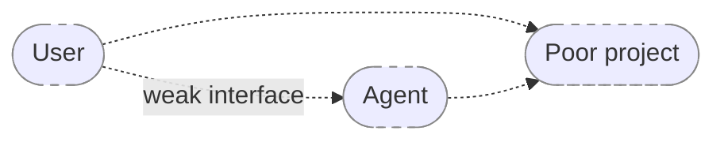
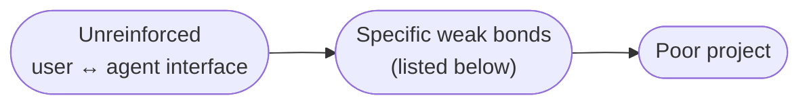
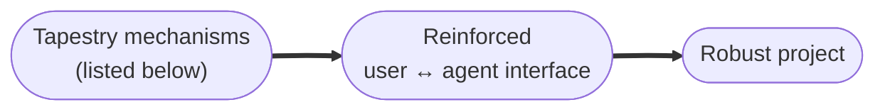
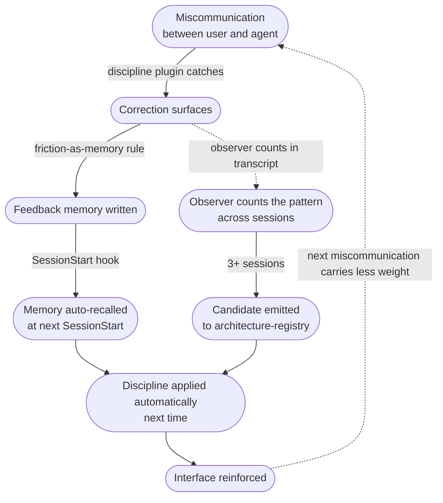
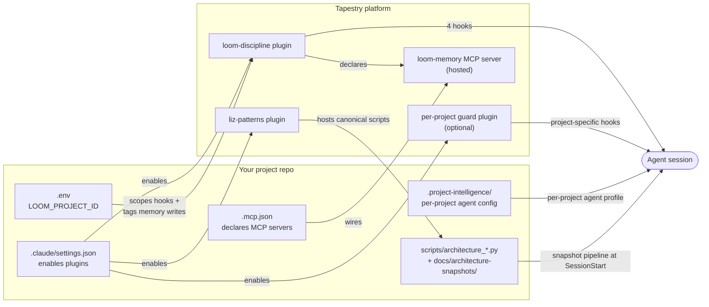

## The real shape of the problem

A project is what gets built when a user and an agent work together. The project sits between them; the quality of the project is determined by the quality of the interface between them.



Most of the failures in agent-assisted projects aren't agent failures or user failures in isolation. They're failures of the interface BETWEEN them — the channel through which intent flows from user to agent and from agent back to user. When that interface is weak, the project that emerges is also weak.

The weakness shows up as specific recurring failure modes:



The specific weak bonds:

- **Memory loss across sessions** — last week's important context is gone this week.
- **Drift from the user's framing** — a "layer" turns into a separate deployed system.
- **Silent assumptions about the codebase** — the agent cites files it didn't actually check.
- **Forgotten corrections** — a correction at minute 10 is gone by minute 40.
- **Architectural blindness** — no idea what's deployed, what changed, what depends on what.
- **Repeated mistakes across sessions** — same wrong choice, recurring.
- **Patterns invisible across sessions** — recurring behavior no single session is long enough to surface.
- **Invisible tool absence** — the memory MCP is down or unwired and nothing tells anyone.
- **Cross-agent coordination loss** — agents in different projects don't see each other's decisions.

Each of these is a specific bond in the interface that wants to fail. Left unaddressed, every one of them feeds back into the project as accumulated weakness — corrections that get re-litigated, decisions that get re-made, mistakes that recur because no one remembered the prior session.

## What Tapestry actually is

Tapestry is the proposition that **each of those weak bonds can be reinforced by a specific structural mechanism**, and that the mechanisms together convert miscommunications into architecture rather than letting them dissolve into churn.

The reinforcements are not generic. Each one targets a specific failure mode:



The mechanisms, paired with the specific weak bond each one reinforces, are in the mapping table immediately below.

## The map: weakness to reinforcement

| Weak bond | What goes wrong | The reinforcement |
|---|---|---|
| **Memory loss across sessions** | The user said something important last session; the agent doesn't have it next session; correction is lost or has to be re-said. | The **loom-memory MCP** + the SessionStart auto-recall hook. Persistent cross-session memory; top-N relevant memories injected at conversation start. → [Memory MCP](/explanation/memory-mcp/) |
| **Drift from the user's framing** | The user asks for a "layer" and the agent builds a separate deployed system. The user's load-bearing words get re-interpreted into the agent's default ontology. | **Per-project guard plugins** with framing-clarification gates that force the agent to restate the request in the user's words before building. The `sde-extraction-guard` UserPromptSubmit hook is the canonical example. → [Plugins](/explanation/plugins/) |
| **Silent assumptions about the codebase** | The agent cites facts about the code that come from training-data defaults, not from the actual files. The user trusts the citation; the citation is wrong. | The **PROBE-discipline reminder** injected at the top of every user message by the `loom-discipline` UserPromptSubmit hook. "Cite file:line. Don't assert without grep/read." → [Plugins](/explanation/plugins/) |
| **Forgotten corrections** | The user corrects the agent at minute 10 of a session; by minute 40, the agent has drifted back to the original behavior; by next session, the correction is gone entirely. | The **friction-as-memory rule** — every correction MUST be saved as a `feedback` memory immediately, at the moment of correction, not deferred. The discipline reminder reinforces it; the memory itself preserves it across sessions. → [Memory MCP](/explanation/memory-mcp/) |
| **Architectural blindness** | The agent has no idea what's deployed, what changed since last session, what services exist, what depends on what. Every conversation starts from zero structural awareness. | The **architecture-snapshot pipeline** at SessionStart. Produces a structural snapshot + diff against prior baseline + narrative summary, injected as session context. → [Architecture snapshots](/explanation/architecture-snapshots/) |
| **Repeated mistakes across sessions** | The same pattern recurs — same misunderstanding, same wrong architectural choice, same forgotten rule. Each session starts cold so the patterns don't accumulate into learning. | The **upskilling audit** (Stop hook, CORE DIRECTIVE 2). When a session crosses a substantive-work threshold without producing an upskilling report, it surfaces loudly. The audit RAISES the pattern; the observer PERSISTS it (see next row). → [Plugins](/explanation/plugins/) |
| **Patterns invisible across sessions** | A behavior recurs across five sessions, but no individual session is long enough for the agent (or operator) to surface it. The cross-session signal exists but no one is watching for it. | The **observer** — two mechanisms together: a local observer in the discipline plugin parses each session's upskilling report + counts skill invocations + updates per-project longitudinal state; a Render cron scans registered repos every 6h applying signal rules. Both emit candidates to the architecture-registry with `draft → observed → recurring` status as evidence accumulates. → [The observer](/explanation/the-observer/) |
| **Invisible tool absence** | The MCP server is down, or `.mcp.json` isn't wiring it, or the plugin isn't enabled. The agent has no `memory_recall` available but doesn't know it — there's no negative-space awareness for a missing tool. | **CORE DIRECTIVE 1** — if memory tools are unavailable, HALT and report. Treat absence as a P0 application failure, not a degraded mode. → [Memory MCP](/explanation/memory-mcp/) |
| **Cross-agent coordination loss** | One agent makes a decision in `the-loom`; another agent in `tapestry` doesn't know about it; both redo the same work or worse, contradict each other. | The **shared loom-memory MCP as cross-agent channel**. Memos written by one agent are readable by another via universal recall. Coordination happens through memory, not through DM or hope. → [Memory MCP](/explanation/memory-mcp/) |

## The recursive loop: miscommunication becomes architecture

The most important property of this system is that it doesn't just defend against communication weakness — it **converts the weakness into structure**. Each miscommunication, when caught and processed through the discipline, becomes a piece of the platform's reinforcement going forward.



A correction is not a one-time event. It enters the system as a memory, surfaces in future sessions as recall context, and becomes a binding rule the agent operates under. Over months, this is how the agent's behavior in YOUR project converges on YOUR way of working — not through training, but through accumulated friction-as-memory.

The platform's value compounds the longer you use it, but only if the reinforcement mechanisms are in place. A project missing the discipline plugin doesn't just have less memory — it has no mechanism for converting today's frustration into tomorrow's structure.

## How the parts compose

The five concrete pieces of the discipline stack you wire into your project — plus the platform-side pieces hosted for you — are how the above mechanisms actually exist:



For the file-by-file reference, see [Load-bearing files](/reference/load-bearing-files/). To set up a project, see [Set up a new project](/how-to/set-up-a-new-project/). For diagnosis when something breaks, see [Recover from common failures](/how-to/recover-from-common-failures/).

## What each piece does (at a glance)

The diagram above shows how the pieces interconnect. The five summaries below say what each piece DOES, with a link to its deep-dive page.

### 1. The plugins → [Read more](/explanation/plugins/)

Three plugins typically active per project:
- **`loom-discipline`** — the universal discipline source (PROBE hooks, MCP wiring, auto-recall, upskilling audit)
- **`liz-patterns`** — the canonical reusable agents, skills, and scripts
- A **per-project guard plugin** (optional) — project-specific guardrails like `sde-extraction-guard`'s framing-clarification gate

They compose, they don't replace. All three are designed to coexist.

### 2. The memory MCP → [Read more](/explanation/memory-mcp/)

`loom-memory` is the hosted HTTP MCP server (at `loom-agent-context.onrender.com/mcp/memory/`) exposing six tools: `memory_recall`, `memory_read`, `memory_write`, `memory_search`, `memory_list`, `memory_delete`. Every Tapestry-consuming project shares ONE instance; project scoping happens at the row level via `project_tags`. It's also the cross-agent channel by which the loom-agent, Tapestry-agent, MS-agent, and your project's agent coordinate.

### 3. The architecture-snapshot automation → [Read more](/explanation/architecture-snapshots/)

At session start, the `loom-discipline` plugin runs `scripts/architecture_snapshot.py` (a thin wrapper dispatching to the canonical script in `liz-patterns`) to produce a structural snapshot of your repo, diffs it against the prior baseline, and injects the result as session context. The agent starts each conversation with a current map of what's deployed and what changed since last session. The whole pipeline is invisible until it goes missing — which is why it gets its own page.

### 4. The plugin enable in `.claude/settings.json`

A one-line JSON entry per plugin in your project's `.claude/settings.json`:

```json
{
  "enabledPlugins": {
    "loom-discipline@lizo-loom": true,
    "liz-patterns@lizo-skills": true,
    "your-guard@lizo-skills": true
  }
}
```

Plugins are installed once per machine but enabled per project. Without the enable, an installed plugin doesn't fire in this project's sessions. Hooks bind at session start, so changes to this file require a Claude Code restart in this repo. See [The plugins](/explanation/plugins/) for the full lifecycle.

### 5. The per-project context (`.env` + `.project-intelligence/`)

Two project-rooted pieces that scope the discipline to YOUR project:

- **`.env`** holds `LOOM_PROJECT_ID` — the scope gate for hook activation and the tag applied to every memory write from this project. See [Memory MCP — How project_tags scope memory](/explanation/memory-mcp/#how-project_tags-scope-memory).
- **`.project-intelligence/<project-id>/`** holds the per-project agent profile (role, observatory config, candidate triggers). The discipline plugin is generic; this directory tells it what specialization to apply for THIS project.

## What the agent loses if a piece goes missing

| If this is missing or wrong | The agent loses |
|---|---|
| `.mcp.json` not declaring `loom-memory` AND plugin not enabled | All memory tools. The agent has no way to call `memory_recall` or `memory_write`. |
| `loom-discipline` plugin not enabled | All four hooks. No auto-recall at session start, no PROBE reminder per turn, no PreToolUse check, no Stop audit. |
| Plugin enabled but `LOOM_PROJECT_ID` unset | Hooks may no-op because the scope gate finds nothing to activate against. |
| `LOOM_PROJECT_ID` drifted (different value than expected) | Memory writes tag the "wrong" project; the agent recalls memories that don't match its operating context. |
| `.project-intelligence/` deleted or moved | The agent loses per-project specialization — it doesn't know what role it plays in this repo. |
| `liz-patterns` plugin missing | Architecture-snapshot wrappers can't find canonicals; snapshots stop being generated; canonical skills aren't invokable by name. |
| `scripts/architecture_snapshot.py` deleted | Snapshot pipeline silently no-ops at session start. Architecture awareness across sessions disappears. |
| `docs/architecture-snapshots/` deleted | Historical baseline lost; next snapshot is "first ever" with empty diff. Recovery is automatic on next session, but the historical record is gone. |

The recurring failure mode: **silent absence.** The agent doesn't know what tool it's missing because it never had it. It just stops checking memory, stops referencing recent architectural changes, stops citing files. You only notice when you compare it to a properly-wired agent in another project.

## How to verify your project is wired correctly

Use the [Set up a new project](/how-to/set-up-a-new-project/) checklist for a fresh project. For an existing project, run the [Load-bearing files audit script](/reference/load-bearing-files/#file-existence-audit-at-session-start) to check every piece is present.

## Why this site exists

In June 2026, the SDE_Extraction agent had been running without the `loom-discipline` plugin enabled and without `loom-memory` wired in its `.mcp.json` for about three weeks before anyone noticed. The CLAUDE.md in that repo told the agent to use `memory_recall` and `memory_write`, but the tools were never available in the session. The agent silently did what it could — reading the CLAUDE.md, accepting the framing, and never confirming the tools actually existed.

The fix was three lines of JSON. The reason it wasn't caught for three weeks is that absence is invisible: the agent had no negative-space awareness, the operator had no checklist to run, and nothing in the system loudly said "this is broken."

This site exists so that the next time someone creates a project that plugs into Tapestry, they have an explicit reference for what every piece is and what its absence looks like.

## Read next

- [The plugins](/explanation/plugins/) — deep dive on every plugin, lifecycle, maintenance
- [Memory MCP](/explanation/memory-mcp/) — what the MCP is, six tools, project scoping, memory maintenance
- [Architecture snapshots](/explanation/architecture-snapshots/) — the snapshot automation, wrapper pattern, drift detection
