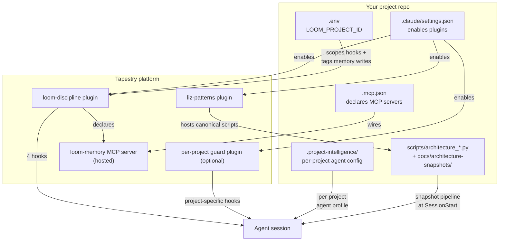

The Tapestry discipline stack is five cooperating pieces. None of them is heavy on its own. The discipline emerges from the COMBINATION — every piece is small but load-bearing.

This page is the orientation map. Each piece links to its deep-dive page where you'll find what it actually does, why it exists, how it fits with the others, and how to keep it healthy.

For the file-by-file reference, see [Load-bearing files](/reference/load-bearing-files/). To set up a project, see [Set up a new project](/how-to/set-up-a-new-project/). For diagnosis when something breaks, see [Recover from common failures](/how-to/recover-from-common-failures/).

## The five pieces



### 1. The plugins → [Read more](/explanation/plugins/)

Three plugins typically active per project:
- **`loom-discipline`** — the universal discipline source (PROBE hooks, MCP wiring, auto-recall, upskilling audit)
- **`liz-patterns`** — the canonical reusable agents, skills, and scripts
- A **per-project guard plugin** (optional) — project-specific guardrails like `sde-extraction-guard`'s framing-clarification gate

They compose, they don't replace. All three are designed to coexist.

### 2. The memory MCP → [Read more](/explanation/memory-mcp/)

`loom-memory` is the hosted HTTP MCP server (at `loom-agent-context.onrender.com/mcp/memory/`) exposing six tools: `memory_recall`, `memory_read`, `memory_write`, `memory_search`, `memory_list`, `memory_delete`. Every Tapestry-consuming project shares ONE instance; project scoping happens at the row level via `project_tags`. It's also the cross-agent channel by which the loom-agent, Tapestry-agent, MS-agent, and your project's agent coordinate.

### 3. The architecture-snapshot automation → [Read more](/explanation/architecture-snapshots/)

At session start, the `loom-discipline` plugin runs `scripts/architecture_snapshot.py` (a thin wrapper dispatching to the canonical script in `liz-patterns`) to produce a structural snapshot of your repo, diffs it against the prior baseline, and injects the result as session context. The agent starts each conversation with a current map of what's deployed and what changed since last session. The whole pipeline is invisible until it goes missing — which is why it gets its own page.

### 4. The plugin enable in `.claude/settings.json`

A one-line JSON entry per plugin in your project's `.claude/settings.json`:

```json
{
  "enabledPlugins": {
    "loom-discipline@lizo-loom": true,
    "liz-patterns@lizo-skills": true,
    "your-guard@lizo-skills": true
  }
}
```

Plugins are installed once per machine but enabled per project. Without the enable, an installed plugin doesn't fire in this project's sessions. Hooks bind at session start, so changes to this file require a Claude Code restart in this repo. See [The plugins](/explanation/plugins/) for the full lifecycle.

### 5. The per-project context (`.env` + `.project-intelligence/`)

Two project-rooted pieces that scope the discipline to YOUR project:

- **`.env`** holds `LOOM_PROJECT_ID` — the scope gate for hook activation and the tag applied to every memory write from this project. See [Memory MCP — How project_tags scope memory](/explanation/memory-mcp/#how-project_tags-scope-memory).
- **`.project-intelligence/<project-id>/`** holds the per-project agent profile (role, observatory config, candidate triggers). The discipline plugin is generic; this directory tells it what specialization to apply for THIS project.

## What the agent loses if a piece goes missing

| If this is missing or wrong | The agent loses |
|---|---|
| `.mcp.json` not declaring `loom-memory` AND plugin not enabled | All memory tools. The agent has no way to call `memory_recall` or `memory_write`. |
| `loom-discipline` plugin not enabled | All four hooks. No auto-recall at session start, no PROBE reminder per turn, no PreToolUse check, no Stop audit. |
| Plugin enabled but `LOOM_PROJECT_ID` unset | Hooks may no-op because the scope gate finds nothing to activate against. |
| `LOOM_PROJECT_ID` drifted (different value than expected) | Memory writes tag the "wrong" project; the agent recalls memories that don't match its operating context. |
| `.project-intelligence/` deleted or moved | The agent loses per-project specialization — it doesn't know what role it plays in this repo. |
| `liz-patterns` plugin missing | Architecture-snapshot wrappers can't find canonicals; snapshots stop being generated; canonical skills aren't invokable by name. |
| `scripts/architecture_snapshot.py` deleted | Snapshot pipeline silently no-ops at session start. Architecture awareness across sessions disappears. |
| `docs/architecture-snapshots/` deleted | Historical baseline lost; next snapshot is "first ever" with empty diff. Recovery is automatic on next session, but the historical record is gone. |

The recurring failure mode: **silent absence.** The agent doesn't know what tool it's missing because it never had it. It just stops checking memory, stops referencing recent architectural changes, stops citing files. You only notice when you compare it to a properly-wired agent in another project.

## How to verify your project is wired correctly

Use the [Set up a new project](/how-to/set-up-a-new-project/) checklist for a fresh project. For an existing project, run the [Load-bearing files audit script](/reference/load-bearing-files/#file-existence-audit-at-session-start) to check every piece is present.

## Why this site exists

In June 2026, the SDE_Extraction agent had been running without the `loom-discipline` plugin enabled and without `loom-memory` wired in its `.mcp.json` for about three weeks before anyone noticed. The CLAUDE.md in that repo told the agent to use `memory_recall` and `memory_write`, but the tools were never available in the session. The agent silently did what it could — reading the CLAUDE.md, accepting the framing, and never confirming the tools actually existed.

The fix was three lines of JSON. The reason it wasn't caught for three weeks is that absence is invisible: the agent had no negative-space awareness, the operator had no checklist to run, and nothing in the system loudly said "this is broken."

This site exists so that the next time someone creates a project that plugs into Tapestry, they have an explicit reference for what every piece is and what its absence looks like.

## Read next

- [The plugins](/explanation/plugins/) — deep dive on every plugin, lifecycle, maintenance
- [Memory MCP](/explanation/memory-mcp/) — what the MCP is, six tools, project scoping, memory maintenance
- [Architecture snapshots](/explanation/architecture-snapshots/) — the snapshot automation, wrapper pattern, drift detection
