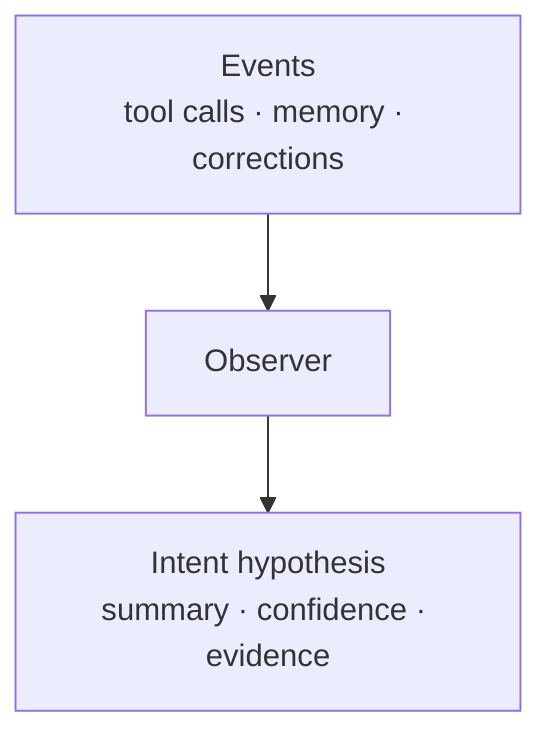

Telemetry records what happened: a tool call, a memory write, a file change, a correction. None of that says *why* you did it or whether it worked. Intent is the observer's answer to the why — "you were clarifying the project's architecture," stored as a hypothesis with a confidence score and the evidence behind it. It's something the observer works out by reading events, never a field that ships inside an event.

## Why it matters

The line between "what happened" and "what it meant" is the whole point. If intent were just another telemetry attribute, every emitter would be guessing at meaning at the moment of emission — with no evidence, no confidence, no way to revise. Keeping intent as a separate, observer-derived layer means a guess can be wrong, carry low confidence, and get corrected later. A telemetry field can't do any of that.

## How it works

Events flow up; meaning is derived on top of them:

| Layer | What it holds |
|---|---|
| **Events** | Facts telemetry can capture reliably — a call happened, a file changed |
| **Observer** | Reads events, prompts, memory, and diffs together and interprets them |
| **Intent hypothesis** | A guess at the why, with a confidence level and pointers to the evidence |

A hypothesis can land as `high`, `medium`, or `low` confidence — or `unknown`. Unknown is a valid result; the observer would rather admit it doesn't know than assert a wrong intent. Hypotheses can also be revised, and repeated revisions are themselves a signal that the observer is missing context.

## What you do

Nothing, for normal operation. The observer derives intent on its own. You see the result in the dashboard, which shows the hypotheses and their supporting evidence — not raw intent fields, because there are none to show.

## What it's not

- **Not a telemetry attribute.** Intent is never emitted with an event. Adding an intent field to telemetry would collapse interpretation into emission — the distinction this whole layer exists to keep.
- **Not a fact.** It's a hypothesis with confidence and evidence, open to revision.
- **Not certain by default.** "Unknown" is a real, acceptable outcome.

## Going deeper

- [The observer](/explanation/the-observer/) — the component that derives intent as it watches.
- [The signal hierarchy](/explanation/signal-hierarchy/) — why interpretation lives at the patterns level, not the events level.
- [OTel coordination contract](/reference/otel-coordination-contract/) — exactly what gets emitted (intent is deliberately not on the list), plus the hypothesis fields if you need them.

## Related

- [The observer](/explanation/the-observer/) — the layer that does the interpreting.
- [The signal hierarchy](/explanation/signal-hierarchy/) — where events, patterns, and structure sit relative to each other.
