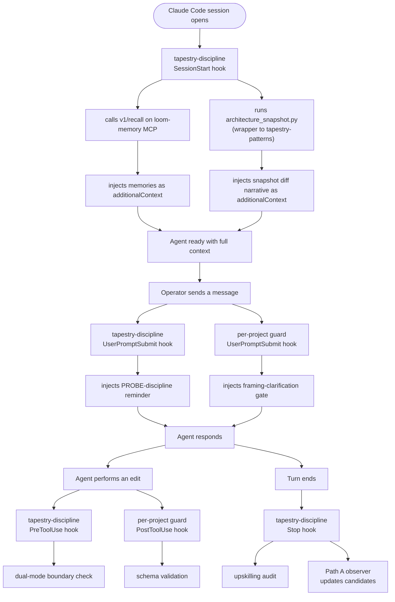

The Tapestry platform's behavior comes from a small number of Claude Code plugins. Each plugin has one job. They're designed to compose, not replace each other. This page explains every plugin you're likely to enable, what it actually does, how it interacts with the others, and how to keep your installation healthy.

For the file-by-file reference, see [Load-bearing files](/reference/load-bearing-files/). For setup steps, see [Set up a new project](/how-to/set-up-a-new-project/).

## The plugins, at a glance

| Plugin | Marketplace | Job |
|---|---|---|
| `tapestry-discipline` | `tapestry` | The universal discipline stack: PROBE hooks, memory MCP wiring, auto-recall at session start, upskilling audit at stop. |
| `tapestry-patterns` | `tapestry` | The canonical reusable agents, skills, and scripts (including the architecture-snapshot canonicals). |
| Per-project guards (`your-project-guard` etc.) | project-specific | Project-specific guardrails that complement `tapestry-discipline`. Each project that needs its own guard has its own. |

You will likely enable all three for any non-trivial Tapestry-consuming project.

The two `tapestry-*` plugins were consolidated into the tapestry monorepo 2026-06-22; the prior names + marketplaces (`tapestry-discipline@tapestry`, `tapestry-patterns@tapestry`) remain available during the transition window. New projects should use the `tapestry-*` names.

## `tapestry-discipline@tapestry` — the discipline source

**What it does:**
- Declares the `loom-memory` MCP server in its own `plugin.json`. Enabling the plugin = wiring the MCP.
- Installs four hooks that fire at specific Claude Code lifecycle events:
  - `SessionStart` — calls the memory REST endpoint `/v1/recall` for top-N memories tagged for your project, injects them as `additionalContext`. Also runs the architecture-snapshot pipeline if your repo has the wrappers. See [Architecture snapshots](/explanation/architecture-snapshots/).
  - `UserPromptSubmit` — injects the PROBE-discipline reminder at the top of every one of your messages.
  - `PreToolUse` (matched against `Edit|Write|MultiEdit`) — runs a boundary check that asks the agent to confirm dual-mode semantics for edits to platform services.
  - `Stop` — checks whether a substantive-work threshold was crossed (git action / 10+ tool calls / 30+ turns) without an upskilling report. If so, surfaces a loud warning.
- Honors `LOOM_PROJECT_ID` as the scope gate (v0.1.12+) so hooks only fire in projects that explicitly opted in.

**What you'd lose without it:** every behavior listed above. The agent reverts to default Claude Code with no memory, no PROBE reminder, no boundary check, no upskilling audit.

**Where it lives on disk:** `~/.claude/plugins/cache/tapestry/tapestry-discipline/<version>/`.

**Source repo:** [`Lizo-RoadTown/tapestry`](https://github.com/Lizo-RoadTown/tapestry) — the canonical home; the plugin lives at `integrations/claude-code/tapestry-discipline/` with the marketplace manifest at the repo root.

**Install:**
```
/plugin marketplace add Lizo-RoadTown/tapestry
/plugin install tapestry-discipline@tapestry
```

The prior `/plugin install loom-discipline@lizo-loom` (sourced from the-loom) still works during the transition window.

## `tapestry-patterns@tapestry` — the canonical patterns

**What it does:**
- Hosts the reusable agents and skills (`documentation`, `deep-research-pattern`, `next-actions-planning`, `infrastructure-mapping`, `agentic-skill-design`, `proposal-authoring`, and others).
- Hosts the canonical implementations of the architecture-snapshot scripts that your project's `scripts/architecture_snapshot.py` thin wrappers dispatch to.
- Provides the `tapestry-patterns:<name>` invocation surface so any project can invoke a canonical pattern by name.

**What you'd lose without it:**
- The architecture-snapshot pipeline can't run (wrappers can't find the canonical → write an error → SessionStart hook proceeds without the snapshot).
- Canonical patterns aren't invokable by name. You'd have to copy-paste skill prompts manually.

**Where it lives on disk:** `~/.claude/plugins/cache/tapestry/tapestry-patterns/<version>/`.

**Source repo:** `Lizo-RoadTown/tapestry` (formerly `claude-skills-marketplace`).

**Install:**
```
/plugin marketplace add Lizo-RoadTown/tapestry
/plugin install tapestry-patterns@tapestry
```

The prior `/plugin install liz-patterns@lizo-skills` (sourced from claude-skills-marketplace) still works during the transition window.

## Per-project guards (the `your-project-guard` pattern)

**What they do:** add a project-specific discipline layer ON TOP of `tapestry-discipline`. The canonical example is `your-project-guard`, which installs two hooks:
- `UserPromptSubmit` — injects a framing-clarification gate that catches the recurring drift where the operator asks for a "layer" and the agent builds a separate deployed system.
- `PostToolUse` (matched against `Edit|Write|MultiEdit`) — runs the project's existing `scripts/check_schema.py` after extraction-surface edits to block broken schemas.

**Important: they COMPLEMENT `tapestry-discipline`, they don't replace it.** The `your-project-guard` plugin's own `plugin.json` description says it explicitly. Both plugins should be enabled simultaneously.

**Where the guard plugin lives:** in the project's own repo at `plugins/<your-guard-name>/`, AND cached at `~/.claude/plugins/cache/<marketplace>/<your-guard-name>/`. The worked example to copy from is `your-project-guard` — a project-specific guard plugin built for a real research project that consumes the platform.

**Source pattern:** see `your-project` for the canonical example. If your project needs its own guard, model it on this pattern — own `.claude-plugin/plugin.json`, own `hooks/hooks.json`, own hook scripts (Node, Python, or shell), optionally own skill files.

## How the plugins interact

A typical session start with all three enabled:



The plugins run independently. They don't share state or call each other. Each plugin's hook fires for its own concern. If one plugin's hook fails or times out, the others still run.

There's no priority or ordering between them — Claude Code fires all hooks matching the lifecycle event, and whichever returns first returns first. The plugins are designed to be independent so the order doesn't matter.

## The install / enable / restart lifecycle

This is the most common source of "I added the plugin but nothing's happening" confusion.

**Plugins are installed once per machine.** `/plugin install <plugin>@<marketplace>` downloads the plugin's source into `~/.claude/plugins/cache/<marketplace>/<plugin>/<version>/`. After install, the plugin is AVAILABLE on your machine. It is NOT yet enabled in any specific project.

**Plugins are enabled per project.** Each project that wants to use the plugin must add it to that project's `.claude/settings.json` under `enabledPlugins`. Other projects don't see it unless they also enable it.

**Hooks bind at session start, not at runtime.** Enabling a plugin in `.claude/settings.json` does NOT make its hooks fire in your current session. You must close the project's Claude Code session entirely and reopen for the hooks to bind. `/plugin update` does NOT hot-swap hooks. Same applies after updating a plugin to a new version — restart to pick up the new hook scripts.

**The triple discipline:** for any change to "should this plugin be active here," you must touch `.claude/settings.json` AND restart Claude Code. Missing either step = no behavior change.

## How to keep plugins clean and updated

### Checking what's installed

```
/plugin list
```

Shows all plugins enabled for the current project. To see what's INSTALLED but maybe not enabled, look in the cache directly:

```sh
ls ~/.claude/plugins/cache/tapestry/
ls ~/.claude/plugins/cache/tapestry/
```

Each plugin directory contains version subdirectories (e.g., `tapestry-discipline/0.1.15/`). Multiple versions can coexist; Claude Code uses whichever the marketplace currently points at.

### Updating

To check for marketplace updates:

```
/plugin marketplace list
/plugin marketplace update <marketplace>
```

This refreshes the marketplace metadata. Installed plugins are then ready to be re-installed at the new version:

```
/plugin install tapestry-discipline@tapestry
```

This downloads the new version into the cache as a new subdirectory. **Restart Claude Code** for the new hooks to bind.

### Removing

```
/plugin remove <plugin>@<marketplace>
```

This removes the plugin from the project's `enabledPlugins` in `.claude/settings.json` (or asks you to do so manually). The plugin remains in your machine's cache for fast re-enable.

To completely wipe a plugin from disk, delete its cache directory:

```sh
rm -rf ~/.claude/plugins/cache/<marketplace>/<plugin>/
```

### Cleaning stale plugin caches

If `~/.claude/plugins/cache/` is bloated with old versions, you can delete the older version subdirectories under each plugin, keeping only the current one. Claude Code only reads the version the marketplace currently resolves to; older cached versions are dead bytes.

### Diagnosing "the plugin is installed but nothing works"

In priority order:

1. Confirm `.claude/settings.json` enables the plugin (`"tapestry-discipline@tapestry": true`).
2. Confirm you restarted Claude Code AFTER the settings change.
3. Confirm the marketplace is registered (`/plugin marketplace list` shows `tapestry`).
4. Confirm the plugin is in the cache (`ls ~/.claude/plugins/cache/tapestry/tapestry-discipline/`).
5. Check the plugin's hook scripts in the cache directly — they should be executable and free of syntax errors.
6. For the discipline plugin specifically, also confirm `LOOM_PROJECT_ID` is set in `.env` so the scope gate activates.

For deeper triage, see [Recover from common failures](/how-to/recover-from-common-failures/).

## When to build your own per-project plugin

You DON'T need a custom plugin for most projects. `tapestry-discipline` + `tapestry-patterns` cover the general discipline + canonical patterns. Most consuming projects just enable those two and that's enough.

You DO need a custom plugin when:

- Your project has a recurring drift class that the general discipline doesn't catch. The canonical example: the `your-project-guard` framing-clarification gate exists because one project kept hitting a specific drift where the operator asked for a "layer in the existing app" and the agent built a whole separate deployed system instead. The guard injects a per-turn gate that forces the agent to restate what kind of artifact it's building before scaffolding anything.
- Your project has a project-specific invariant check that runs on every edit to a particular surface (schema integrity, contract conformance, lint that the general discipline doesn't enforce).
- Your project bundles a methodology skill that's specific enough to belong with the project, not in the universal `tapestry-patterns`.

The pattern: bundle a project's own `plugins/<name>/` directory in the repo, register it as a local marketplace via `.claude-plugin/marketplace.json`, and enable alongside `tapestry-discipline` in `.claude/settings.json`. Worked example to copy: `your-project-guard` in a real consuming project.

## Related

- [The discipline stack](/explanation/discipline-stack/) — how plugins fit with MCP and per-project config
- [Memory MCP](/explanation/memory-mcp/) — what the loom-memory MCP that `tapestry-discipline` wires actually does
- [Architecture snapshots](/explanation/architecture-snapshots/) — the snapshot pipeline that the SessionStart hook runs
- [Load-bearing files](/reference/load-bearing-files/) — file-by-file reference of the plugin configs
