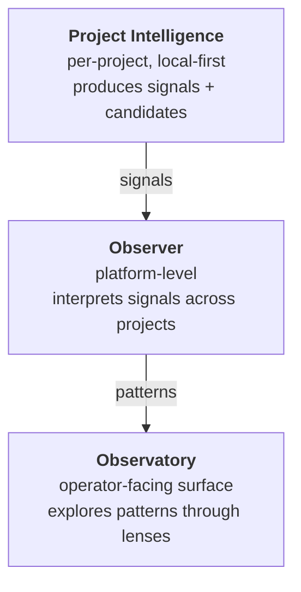

:::tip[On the marketing site]
For the outcome framing of Project Intelligence (what it accumulates, why it matters), see **[Project intelligence](/project-intelligence)** on the marketing site. This page keeps the precise three-noun distinction.
:::

Three different things often get collapsed into one word. Keeping them separate is the difference between "I have a dashboard" and "the platform is doing what it's supposed to do."

## The three things



| | Project Intelligence | Observer | Observatory |
|---|---|---|---|
| **What it is** | The signals-and-candidates layer attached to one project. Lives in `.project-intelligence/<project>/` and in the per-project memory scope. | A component (cron + on-demand subagent) that reads signals from many projects, applies interpretation, and writes patterns. | A surface — currently a dashboard, eventually multiple lens-equipped surfaces — where the operator explores those patterns. |
| **Lives where** | Inside the consuming project's repo + the per-project memory rows. | In `services/` (currently the self-observer cron in `the-loom`; future migration to Tapestry). | In `apps/web-dashboard/` (the Project Observatory console) and on the docs site at `/observatory`. |
| **Per-project or platform?** | Per-project. Each project has its own. | Platform. One observer, many projects observed. |  Platform. One observatory, many projects' patterns explored. |
| **Installed by** | `tapestry onboard <project>` writes the local intelligence scaffold + plugins. | Operator of the Tapestry platform stands it up once (Render cron). | Operator of the Tapestry platform deploys it (Vercel + dashboard). |
| **Produces** | Signals (via OTel + hooks), candidates (via local observer suggestions), agent + project context files. | Interpretations → patterns → candidate-registry entries → drift alerts. | Visualizations: candidate inbox, lens overlays, project-shape diffs, cross-project comparisons. |

## What this means in practice

When an operator runs `tapestry onboard my-project`:

- The project becomes **observable** — it emits signals via the discipline plugin's hooks + writes per-project intelligence files.
- The project does **not** install an observatory. The observatory is a platform-level surface that already exists at `tapestry-khaki.vercel.app/observatory`. Onboarding wires the project *into* it.
- A project can produce intelligence without anyone watching. That's fine — signals accumulate, and the observer interprets them on its own schedule (currently a 6-hour cron in `the-loom`).

## Why operators keep collapsing them

Three reasons:

1. **"Observability" is also one word.** Calling everything "observability" hides the layered structure underneath.
2. **The dashboard is the only visible artifact.** Operators see the cards and call the cards "the observatory." But cards are one *lens*; the observatory is the surface, not the lens.
3. **The setup commands are close together in time.** Operators run `tapestry onboard` and expect a dashboard to appear. The dashboard is already there; onboarding just gives it something to show.

## Failure modes the distinction prevents

| Confusion | What goes wrong |
|---|---|
| Project Intelligence = Observatory | Operator runs `tapestry onboard`, sees no dashboard appear, concludes onboarding failed. (It didn't; the dashboard lives elsewhere.) |
| Observer = Observatory | Operator looks at the dashboard, sees no findings, blames the observatory. (The dashboard is fine; the observer hasn't run yet, or has nothing to interpret.) |
| Project Intelligence = Observer | Operator expects the per-project files to *do* interpretation. They don't — they produce signals; interpretation is the platform's job. |

## How this composes with the rest of the platform

- **[Signal → Interpretation → Pattern](/explanation/signal-interpretation-pattern/)** is the pipeline that flows *through* these three things. Project Intelligence produces signals; the Observer turns signals into patterns via interpretation; the Observatory exposes patterns through lenses.
- **[Observatory lenses](/explanation/observatory-lenses/)** explains the surfaces inside the Observatory — the dashboard cards are one lens; many more are planned.
- **[The observer](/explanation/the-observer/)** is the component spec for the interpretation layer.
- **[Sharing intelligence across projects](/explanation/sharing-intelligence-across-projects/)** is what the Observer enables: patterns recognized in one project can become candidates in another.

## The shortest version

```
Project Intelligence: what one project is doing.
Observer:             what that probably means.
Observatory:          where patterns from many projects get explored.
```

Onboarding installs the first. The other two already exist at the platform level — onboarding wires the project into them.
