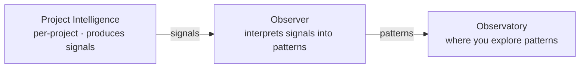

Three different things hide behind loose talk about "the observatory." **Project Intelligence** is what one project produces — signals and candidates. **The Observer** interprets those signals into patterns. **The Observatory** is the surface where you explore the patterns. Onboarding a project produces the first; the other two already run in your deployment.

## Why it matters

Run `tapestry onboard my-project`, expect a dashboard to appear, see nothing, and you conclude onboarding failed. It didn't. Onboarding makes a project *observable*; the dashboard lives elsewhere and was already there. The three-way distinction is what keeps you from debugging the wrong layer.

## How it works

| | What it is | Where it lives | Per-project or platform |
|---|---|---|---|
| **Project Intelligence** | The signals-and-candidates layer attached to one project. | Inside that project's repo + its per-project memory. | Per-project. Each project has its own. |
| **Observer** | Reads signals from many projects, interprets them, writes patterns. | Your backend (a cron, plus on-demand runs). | Platform. One observer, many projects. |
| **Observatory** | The surface where you explore those patterns through lenses. | Your dashboard deployment + the `/observatory` route. | Platform. One observatory in your deployment. |

## What you do

Run `tapestry onboard <project>`. That writes the project's local intelligence scaffold and wires it into your Observatory. After that, signals accumulate on their own and the Observer interprets them on its schedule — you don't have to be watching. The Observatory is your own deployment; the [public demo](https://tapestry-khaki.vercel.app/observatory) is a read-only reference on sample data.

## What it's not

- **Onboarding is not "installing an observatory."** It wires one project into the observatory you already run.
- **Project Intelligence does not interpret.** It produces signals; interpretation is the Observer's job.
- **An empty dashboard is not a broken observatory.** It usually means the Observer hasn't run yet, or has nothing to interpret.

## Going deeper

- [Observatory lenses](/explanation/observatory-lenses/) — the different ways you can look at the patterns inside the Observatory.
- [The observer](/explanation/the-observer/) — the component that turns signals into patterns.
- [Signal → Interpretation → Pattern](/explanation/signal-interpretation-pattern/) — the pipeline that flows through all three.

## Related

- [Project intelligence](/project-intelligence) — the outcome framing of what a project accumulates.
- [Sharing intelligence across projects](/explanation/sharing-intelligence-across-projects/) — what the Observer makes possible.
