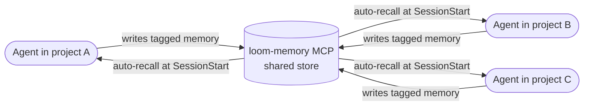

:::tip[On the marketing site]
For the value framing — "across ten projects, you're not one operator with ten projects' worth of experience" — see [Project intelligence](/project-intelligence/) on the marketing site. This page is the mechanism: what flows between projects, what to use it for, how to wire it on purpose.
:::

The headline value of plugging a project into Tapestry: **agents in different projects share intelligence.** This page is the practical guide to that capability — what the mechanism actually is, what to use it for, and how to wire it on purpose rather than by accident.

For the underlying memory mechanism in detail, see [The memory MCP](/explanation/memory-mcp/). For the pattern-recognition layer that turns observed behaviors into shared candidates, see [The observer](/explanation/the-observer/).

## Three concrete things that flow between projects

### 1. Memory persists — what one agent learns, all relevant agents access

A correction given once becomes a binding rule the agent operates under going forward. Tagged for one project, it shapes that project's agent across every future session. Tagged for multiple projects, it shapes all of them. Tagged universal, it shapes every agent on the platform.

The agent in your project does not start cold each session and does not learn in isolation.

### 2. Agents update each other directly

When work in one project hands off to another, or when a decision in one project affects sibling projects, the originating agent writes a memo addressed to the other project's agent. The receiving project's agent picks it up at next session start, in its auto-recall context, before the operator even types a message.

This is how coordination happens across the portfolio — not through DMs or hope, but through structured memos that flow through the same memory store every project's agent reads. The agents update each other.

### 3. Patterns and skills spread across projects

When the same pattern of work recurs in a project — a skill being invoked, a recipe being applied, a workflow taking shape — the observer notices and surfaces it as a candidate for codification. When a pattern recurs across multiple projects, it becomes a stronger candidate for promotion into a reusable shared skill that every project can then invoke by name.

What started as repeated behavior in one project becomes durable structure available to all projects. The platform's reusable skill set grows from observed cross-project recurrence.

## How those three flows show up concretely

The three flows above use one shared mechanism — the loom-memory MCP plus the discipline plugin's hooks. The categories of content that flow:

| Type of intelligence | What it looks like | Where it lives |
|---|---|---|
| **Decisions and facts** | "We chose X library because Y." "The Render service ID for project A is Z." | Memory MCP, tagged for the project(s) that should see it. |
| **Corrections and binding rules** | "Don't paraphrase another agent's position — PROBE the source." "Use real DB integration tests, not mocks, in this stack." | Memory MCP, usually project-scoped but sometimes universal when the rule applies everywhere. |
| **Observed patterns and proposals** | "This skill has been invoked 3+ times in your project — promotion candidate." "This pattern appears across three projects — codify it." | Architecture-registry candidates, mirrored into memory as `skill_idea` records (so they surface in auto-recall too). |

All three flow through the same plumbing: the shared loom-memory MCP, plus the discipline plugin's hooks that write to and read from it automatically.

## How the mechanism works

Every project's agent calls `memory_write` through the same hosted MCP server. The platform tags each write with the writing project's `LOOM_PROJECT_ID` automatically. At every session start, the discipline plugin's SessionStart hook calls `/v1/recall` to fetch the top-N most relevant memories for the current project — including memories tagged for that project AND universal cross-project memories.

The scoping behavior:

- **Tagged with one project** → recalled in that project's sessions only.
- **Tagged with multiple projects** → recalled in any of those projects' sessions.
- **No tags (universal)** → recalled in every project's sessions. Use sparingly — usually reserved for platform-wide discipline rules.

The cross-agent recall happens automatically. You do not configure it per project. You do not have to ask the agent to "check memory from project A" — the platform's recall surfaces relevant context regardless of which project wrote it, as long as the tags overlap.

## Patterns for using the channel intentionally

### Pattern 1 — Cross-agent handoff memos

When work in one project hands off to another, write a memo before closing the session. The receiving project's agent picks it up at next session start.

Naming convention: `<source_agent>_to_<dest_agent>_<topic>_<date>` — for example, `loom_agent_to_tapestry_agent_step1_migration_handoff_2026_06_19`.

Tag with BOTH projects so it surfaces in both contexts.

### Pattern 2 — Shared decisions

When a decision affects multiple projects (architectural, API contract, naming convention), write a single `decision` memory tagged for every affected project. Both agents read the rationale at session start; neither has to re-derive it.

Naming convention: `decision_<topic>_<date>`.

### Pattern 3 — Observed candidate proposals

The observer automatically writes proposals it surfaces into memory (`record_type: skill_idea`) tagged for the originating project. If a pattern appears in multiple projects, the operator (or, eventually, a policy daemon) writes a cross-project memo summarizing the convergent observation and tags it accordingly.

See [The observer](/explanation/the-observer/) for the automation; see this page for the conscious cross-project promotion step.

### Pattern 4 — Universal binding rules

When you give a correction that applies to every project (a discipline rule, a naming convention, a platform-wide pattern), the corrected agent writes a `feedback` memory with NO project tags. Universal recall surfaces it everywhere.

Recognize when a rule is universal vs project-specific: if you would correct ANY agent on ANY project the same way, the rule is universal. If only this project has this constraint, it's project-scoped.

### Pattern 5 — Friction-as-memory propagation

The single highest-leverage pattern. When you correct any agent, the discipline plugin's enforcement saves a `feedback` memory immediately — at the moment of correction. That memory then propagates per its tags:

- Tagged for your project → that project's agent operates under the rule going forward.
- Tagged universal → every project's agent does.
- Untagged today, expanded later → start project-scoped, broaden the scope when you see the rule applies elsewhere.

Over months, this is how the platform's collective discipline gets sharper. Each correction becomes a structural piece. Each project's agent gets the benefit of every other project's frictions.

## How to verify cross-project flow is working

A few quick checks:

**At session start in your project**, look at the auto-recall block at the top of the conversation. If it ONLY contains memories tagged for your project, the cross-project channel isn't surfacing universal memories. Likely cause: `LOOM_PROJECT_ID` tagging issue or the SessionStart hook not firing.

**Ask the agent in your project** "what cross-project decisions are relevant here?" — the agent should be able to recall memories from sibling projects via the platform's recall, not just from this project's tag.

**Write a test memory** with cross-project tags from one project, then start a session in another tagged project. The memory should appear in the new project's session-start context.

## What goes wrong if the channel breaks

| Failure | Symptom |
|---|---|
| Memory MCP wiring broken in one project | That project's agent stops contributing to AND receiving from the shared channel. Other projects still flow normally; the broken project goes dark. |
| `LOOM_PROJECT_ID` wrong in one project | That project's memories tag the wrong scope. They surface in the wrong contexts and don't surface where they should. |
| Universal-scoped memories accumulate noise | Recall in every project gets diluted with irrelevant universal entries. Periodically audit universal memories and re-scope them to specific projects when appropriate. |
| Cross-project memos get only one tag | Receiving project doesn't see them. Audit cross-agent memos to make sure they're multi-tagged. |

For each, see [Recover from common failures](/how-to/recover-from-common-failures/) for the symptom-to-fix table.

## Related

- [The memory MCP](/explanation/memory-mcp/) — the underlying mechanism, with the full set of memory types and tagging detail
- [The observer](/explanation/the-observer/) — how cross-project patterns get surfaced as candidates
- [The discipline stack](/explanation/discipline-stack/) — how the cross-project channel fits with the rest of the platform
- [The plugins](/explanation/plugins/) — what hooks the cross-agent channel into your project's sessions
