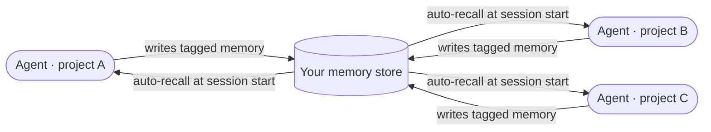

Plug several of your projects into Tapestry and their agents stop working in isolation. A correction you give in one project becomes a rule its agent follows from then on. A decision that affects three projects gets written once and read by all three at their next session start. A pattern that recurs across projects becomes a reusable skill any of them can invoke by name. All of it flows through one shared memory store — yours.

## Why it matters

Across ten projects, you don't want one project's hard-won correction to stay trapped in that project's transcripts. This is what keeps them connected: each project's agent gets the benefit of every other project's frictions and decisions, without you re-explaining anything. And because the store is your own deployment, the sharing stops at your boundary — nothing crosses to other operators or any central party.

## How it works

Three kinds of intelligence flow through that one store:

| What flows | Example | Scope |
|---|---|---|
| **Decisions and facts** | "We chose X because Y." A service ID for project A. | Tagged for the project(s) that should see it |
| **Corrections and rules** | "PROBE the source, don't paraphrase." "Use real DB tests here." | Usually project-scoped; universal when the rule applies everywhere |
| **Observed patterns** | "This pattern appears across three projects — codify it." | Surfaced by the observer, tagged accordingly |

Tagging decides reach: tag one project and it recalls there only; tag several and it recalls in all of them; leave it untagged and it recalls everywhere (use sparingly, for rules that genuinely apply to every project). At each session start, the agent fetches the most relevant memories for the current project — including the universal ones — before you type anything. You don't configure this per project; the tags do the routing.

## What you do

The recall is automatic, but a few habits make the channel pull its weight:

- **Handoff memos.** When work in one project hands off to another, write a memo before closing the session and tag *both* projects so it surfaces on both sides.
- **Shared decisions.** When a decision affects several projects, write it once, tagged for each. Nobody re-derives the rationale.
- **Let corrections propagate.** When you correct an agent, the correction is saved as memory at that moment. Tag it for the project, or leave it universal if you'd correct any agent the same way. Over months this is how your collective discipline sharpens.

## What it's not

- **Not shared with other operators.** Everything stays inside your own deployment. "Across projects" means across *your* projects, never across tenants.
- **Not manual lookup.** You don't ask the agent to "check project A's memory" — relevant context surfaces on its own when the tags overlap.
- **Not a place for everything-universal.** Untagged memories recall in every project and dilute the signal. Keep them rare and re-scope when you can.

## Going deeper

- [The memory MCP](/explanation/memory-mcp/) — the underlying mechanism, with the full set of memory types and tagging detail.
- [Recover from common failures](/how-to/recover-from-common-failures/) — what breaks if a project's wiring or tagging is wrong, and the fix for each.

## Related

- [The observer](/explanation/the-observer/) — how cross-project patterns get surfaced as candidates.
- [How the platform upskills itself](/explanation/upskilling/) — how a surfaced pattern becomes a reusable skill.
- [The plugins](/explanation/plugins/) — what hooks this channel into your sessions.
