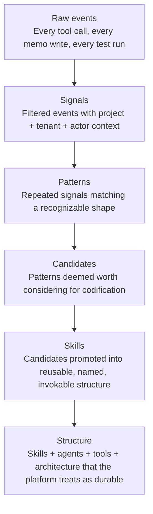

Tapestry doesn't treat all telemetry as the same kind of thing. There are levels, and the platform's components are interested in different levels.

## The hierarchy

Each level is a more concentrated, more deliberate form of the level below it. Each level is consumed by different components.

## Who consumes which level

| Level | Consumed by | What they ask |
|---|---|---|
| **Raw events** | Telemetry ingestion | Did this happen? Did it succeed? How fast? |
| **Signals** | Project observatory | What's happening in *this* project right now? |
| **Patterns** | Observer | What's recurring? What's stabilizing? What's drifting? |
| **Candidates** | Candidate registry + policy | Has this earned codification yet? |
| **Skills** | Skill compiler + plugin distribution | What's the canonical form of this thing operators invoke? |
| **Structure** | Architecture registry + platform contracts | What does the platform now treat as foundational? |

Notice that the observer **is not interested in events.** The observer is interested in *patterns* — and patterns are derived signals, not raw inputs. Asking the observer to ingest every tool call would drown it. The signal layer beneath it does the filtering.

Notice that the policy layer **is not interested in patterns.** The policy layer is interested in *structure formation* — should this candidate become durable? Patterns flow through to candidates before policy sees them.

## Why this ordering matters

Most observability systems collapse everything into "telemetry" and let the dashboard owner sort it out. That works when the question is *state* ("what's happening right now?"). It breaks down when the question is *trajectory* ("what's becoming?").

Trajectory questions need the stack:

- You can't tell whether a project is drifting by looking at one event. You need *patterns* — recurring signals across time.
- You can't tell whether a pattern deserves codification by looking at one pattern. You need *candidates* — patterns weighted by recurrence, durability, and operator approval.
- You can't tell whether a candidate is ready for promotion by looking at one candidate. You need *policy* — judgment about risk, scope, and dependencies.

Skipping a level forces the next level to do work it isn't designed for. The observer can't substitute for policy. Policy can't substitute for the skill compiler. The compiler can't substitute for architecture.

## What this means in practice

When you're writing a Tapestry component, the first question is: *which level of the hierarchy does this component consume?*

The answer determines:

- Where it lives in the platform (telemetry-ingestion vs project-observatory vs observer vs candidate-registry vs policy vs skill-compiler vs architecture-registry).
- What it stores (events vs signals vs patterns vs candidates vs skills vs structural facts).
- How long the data lives (events: hot; signals: warm; patterns: long-lived; candidates: persistent until promoted or rejected; skills + structure: permanent).
- Who can write to it (everyone can emit events; only observers can promote signals to patterns; only policy can promote candidates to skills; etc.).

If a component is unclear about its level, it's almost always either reading too low (overwhelmed by raw input) or writing too high (acting as policy when it should only be surfacing patterns).

## Cross-references

- [Project shape](/start/project-shape/) — the underlying object whose evolution this hierarchy tracks
- [The observer](/explanation/the-observer/) — the pattern-level component
- [How the platform upskills itself](/explanation/upskilling/) — the full Events → Structure journey, narrated
- [Architecture snapshots](/explanation/architecture-snapshots/) — the structure-level data
- [The memory MCP](/explanation/memory-mcp/) — the substrate that holds the lower levels' state
