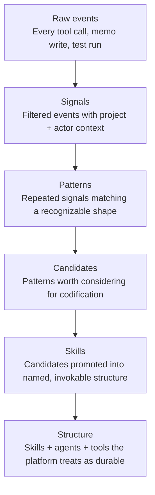

Tapestry doesn't treat all telemetry as the same kind of thing. A single tool call and a promoted skill are at opposite ends of a ladder. The same correction you make three sessions running starts as raw events, gets filtered into signals, recognized as a pattern, surfaced as a candidate, and — if it keeps recurring — promoted into a named skill. Six levels, each more deliberate than the one below it.

## Why it matters

The level a thing sits at tells you how much trust it has earned. Raw events are cheap and noisy; you have thousands per session. Structure is rare and durable; the platform treats it as foundational. Knowing where something sits tells you whether it's worth acting on yet — a single event means nothing, a pattern that's reached the candidate level has earned a closer look.

## How it works

Each level is consumed by a different part of the platform, and each asks a sharper question than the one below:

| Level | The question it answers |
|---|---|
| **Raw events** | Did this happen? Did it succeed? How fast? |
| **Signals** | What's happening in *this* project right now? |
| **Patterns** | What's recurring? What's stabilizing? What's drifting? |
| **Candidates** | Has this earned codification yet? |
| **Skills** | What's the canonical form of the thing you invoke? |
| **Structure** | What does the platform now treat as foundational? |

The data also lives for different lengths of time as it climbs: events are kept hot and briefly, signals warm, patterns long-lived, candidates persist until promoted or rejected, and skills and structure are permanent.

## What it's not

- **Not a severity scale.** A higher level isn't "more urgent." It's more *settled* — something that has survived repetition and review.
- **Not automatic promotion.** Climbing from candidate to skill is a deliberate decision, not a threshold that trips on its own.
- **Not a place you write directly.** You emit events by working. The higher levels are derived; you don't hand-author a pattern.

## Going deeper

- [The observer](/explanation/the-observer/) — the component that works at the pattern level.
- [Signal → Interpretation → Pattern](/explanation/signal-interpretation-pattern/) — the step that turns a signal into a pattern.
- [How the platform upskills itself](/explanation/upskilling/) — the full Events → Structure journey, narrated.

## Related

- [Project shape](/start/project-shape/) — the underlying object whose evolution this hierarchy tracks.
- [Architecture snapshots](/explanation/architecture-snapshots/) — the structure-level data.
- [The memory MCP](/explanation/memory-mcp/) — the substrate that holds the lower levels' state.
