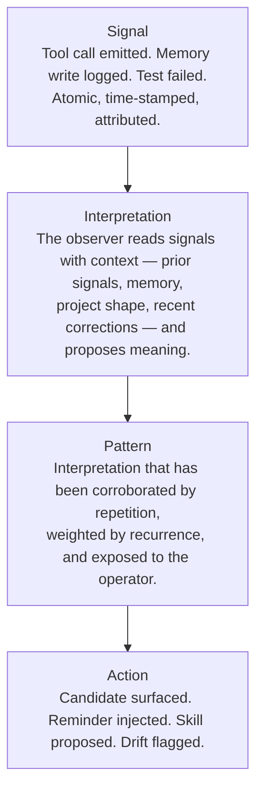

A signal is not yet a pattern. A pattern is what you get after something has interpreted the signal. Tapestry treats interpretation as a distinct layer with its own components, contracts, and failure modes — not as a side-effect of dashboards.

## The pipeline



Each arrow is doing work. Each arrow can fail independently.

## What lives where

| Layer | What it is | Component | Failure mode |
|---|---|---|---|
| **Signal** | An atomic event with attributes (timestamp, actor, tool, project, outcome). Produced by hooks, services, runtime instrumentation. | OTel pipeline + local `hooks.jsonl` | Missing emission → blind. Wrong attributes → unreadable. |
| **Interpretation** | A *hypothesis* about what a signal (or a cluster of signals) means in context. Produced by the observer reading signals + memory + transcripts + diffs. | The observer (cron + on-demand subagent) | No interpretation → patterns never form. Bad interpretation → wrong patterns. |
| **Pattern** | An interpretation that has recurred or been corroborated. Stored, named, queryable by lens. | Architecture Registry, Candidate Registry | Pattern without exposure → operator can't act on it. |
| **Action** | What the operator (or platform) does because of the pattern. | Plugin hook, candidate-promotion flow, dashboard card | Action without trace back to pattern → invisible governance. |

## One concrete instance: intent

[Observer-derived intent](/explanation/observer-derived-intent/) is one example of this pipeline. The signal is "tool call happened." The interpretation is "the operator was probably trying to X, with confidence Y, based on evidence Z." The pattern is "this operator keeps trying to X under conditions C." The action is "surface a skill candidate for X."

If intent were a *field on the signal* — emitted at the moment of the tool call — the interpretation layer would collapse into the emission layer, and the platform would be stuck with one guess per event, fixed in place, with no ability to revise. That's why intent is observer-derived, not telemetry-emitted. Same principle for any other derived attribute.

## How this composes with the rest of the platform

- **[The signal hierarchy](/explanation/signal-hierarchy/)** describes the *materials* pipeline: Events → Signals → Patterns → Candidates → Skills → Structure. That's the data flowing through. This page describes the *cognitive* pipeline that operates on those materials at the Signals→Patterns transition.
- **[The observer](/explanation/the-observer/)** is the component that runs the interpretation step.
- **[Observatory lenses](/explanation/observatory-lenses/)** are the surfaces through which operators encounter patterns — different lenses expose different patterns from the same underlying interpretations.
- **[Project Intelligence vs Observatory](/explanation/project-intelligence-vs-observatory/)** explains where signals come from (Project Intelligence) versus where patterns get explored (Observatory) — and why running `tapestry onboard` produces the former but not the latter.

## The shortest version

```
Signal: something happened.
Interpretation: here's what it probably meant.
Pattern: this kind of thing keeps meaning that.
Action: do something about it.
```

Each layer earns its own component. None of them can substitute for the others.
