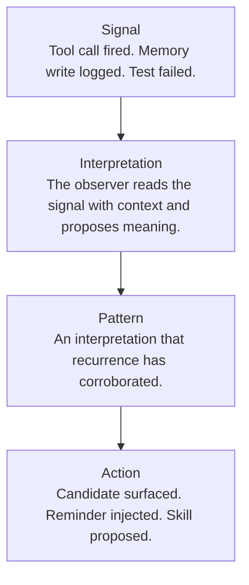

A signal is something that happened: a tool call fired, a memory write logged, a test failed. A pattern is something that keeps happening and means something. Between them sits a step that's easy to skip — interpretation. The observer reads a signal alongside the signals around it, your recent corrections, and the shape of the project, and proposes what it meant. A pattern is an interpretation that repetition has corroborated.

## Why it matters

This is why a pile of telemetry isn't the same as understanding. You can have every tool call logged and still know nothing about what's recurring, because nothing has read those signals and proposed meaning. The interpretation step is where raw events turn into something you can act on — and it's a distinct layer with its own component, not a side effect of a dashboard.

## How it works

Each step is real work, and each can fail on its own:

| Step | What it produces | If it breaks |
|---|---|---|
| **Signal** | An atomic, time-stamped, attributed event | Missing emission → blind. Wrong attributes → unreadable. |
| **Interpretation** | A hypothesis about what the signal meant in context | No interpretation → patterns never form. |
| **Pattern** | An interpretation that has recurred, named and stored | Pattern no one sees → you can't act on it. |
| **Action** | What you or the platform does because of the pattern | Action with no trace back → invisible. |

A concrete instance is [observer-derived intent](/explanation/observer-derived-intent/). The signal is "a tool call happened." The interpretation is "you were probably trying to do X." The pattern is "you keep trying to do X under these conditions." The action is "surface a skill candidate for X." Intent is worked out by the observer *after the fact*, which is why it can be revised as more signals arrive — if it were a fixed field stamped onto the event, you'd be stuck with one guess per event forever.

## What it's not

- **Not a property of the signal.** Meaning is derived later, with context, not emitted at the moment the event fires.
- **Not a one-shot guess.** Because interpretation is its own step, it can be revised as more evidence accumulates.
- **Not the same as the materials it operates on.** The [signal hierarchy](/explanation/signal-hierarchy/) is the data flowing through; this is the cognitive step that acts on it at the signals-to-patterns transition.

## Going deeper

- [The observer](/explanation/the-observer/) — the component that runs the interpretation step.
- [The signal hierarchy](/explanation/signal-hierarchy/) — the six-level ladder this step sits inside.
- [Observatory lenses](/explanation/observatory-lenses/) — the surfaces through which you encounter patterns.

## Related

- [Observer-derived intent](/explanation/observer-derived-intent/) — the worked example above, in full.
- [Project Intelligence vs Observatory](/explanation/project-intelligence-vs-observatory/) — where signals come from versus where patterns get explored.
