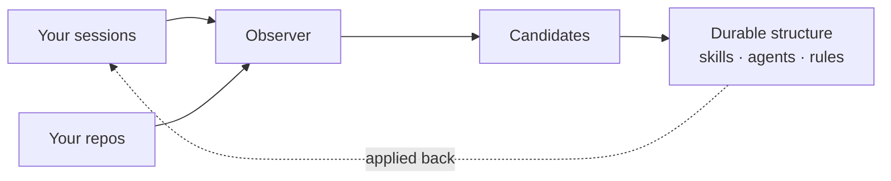

The observer is how Tapestry notices what *keeps* happening in your project — not single events, but patterns. The same correction three sessions running. A task you've now done the same way five times. A piece of structure that's drifted from where it belongs. It surfaces those, so a recurring pattern can become a reusable skill or rule instead of something you re-explain every time.

## Why it matters

Most tooling tells you what's happening *right now*: this test failed, this call was slow. The observer is the opposite — it ignores the single event and watches the trend. Is coordination on this project getting smoother or rougher? Is anything stabilizing into something worth making reusable? Those are questions you can't answer by staring at one session, and they're the ones the observer answers.

## How it works

Two observers run, each watching a different surface:

| Observer | What it watches | When it runs |
|---|---|---|
| **Session observer** | What happens inside a work session — which skills you used, what the session's upskilling report flagged | At the end of every session |
| **Repo observer** | What exists across your repos — structure that's drifted, patterns living somewhere they don't belong | On a schedule (every few hours) |

Both feed the same place: a list of **candidates**. The session observer notices "this pattern showed up again"; the repo observer notices "this structure has drifted." Each emits a candidate — something worth a second look. When a candidate keeps recurring, it gets promoted into durable structure: a skill, an agent, a rule.

That loop — notice a recurring pattern, promote it, apply it back — is the whole point. Friction you'd otherwise hit forever becomes structure that handles it for you.

## What you do

Nothing, for normal operation. Both observers run automatically once the discipline plugin is installed. You see the effect when candidates start accumulating over several sessions — that's the signal a pattern has earned a closer look. Promoting a candidate into durable structure is a separate, deliberate step, and it's yours to make.

## What it's not

- **Not a status dashboard.** It won't tell you whether something is up right now. It tells you which direction things are trending.
- **Not an AI reading your code.** Both observers are plain scripts — one reads session transcripts, the other reads file structure. No model, no judgment at this layer. The judgment is yours, when you decide whether a candidate is worth promoting.
- **Not real-time.** There's always lag between a pattern happening and a candidate appearing. That's fine — patterns only mean anything over time.
- **Not the promoter.** The observer surfaces candidates; it doesn't decide their fate. Whether one becomes durable structure is a separate decision.

## Going deeper

- [The Observer component](/systems/observer/) — how each observer is wired, how to verify it's running, and what fails if it's missing.

## Related

- [What Tapestry is](/start/what-stays-on-track/) — the other mechanisms that turn recurring friction into structure.
- [What Tapestry is not](/start/what-tapestry-is-not/) — why "observability system" is the wrong frame for it.
