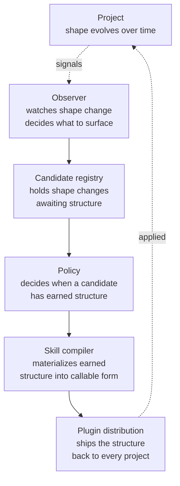
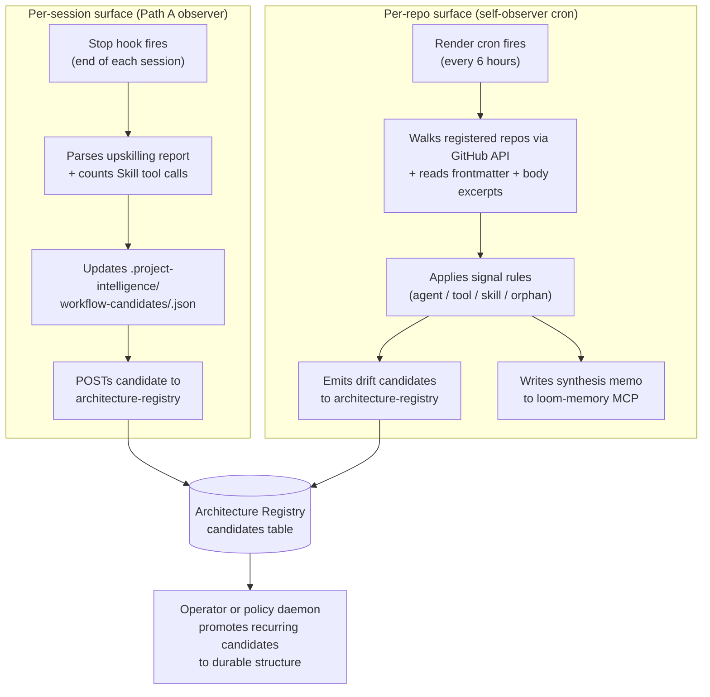

The observer is the central character of the platform. Read [User-agent interface](/start/user-agent-interface/), [Project shape](/start/project-shape/), and [What Tapestry is not](/start/what-tapestry-is-not/) before this page if you haven't already — the observer doesn't make sense outside that frame.

## Why the observer is first-class

Most platforms organize around their storage. *"We're a memory system."* *"We're a metrics database."* *"We're a vector store."* The storage is the noun; everything else is a feature on top.

Tapestry inverts that. The observer is the noun. Memory is one of its sensors. Telemetry is another. Architecture snapshots are a third. The candidate registry is its output. The policy gate is what acts on its decisions. The skill compiler is what materializes the result.

What the observer is *for* is the [user-agent interface](/start/user-agent-interface/) — the recurring coordination surface between operator and agents. Everything below is evidence about how those interfaces are evolving; everything above is what the platform produces when an interface stabilizes enough to earn durable structure.

If you draw the platform with the observer at the center, the rest of the architecture falls into place:



The observer's sensors:

- **Memory** — what the agent has learned about project shape (corrections, decisions, recurring friction)
- **Telemetry** — what executed, what failed, what was called (the runtime view of shape)
- **Architecture snapshots** — what structure exists at a point in time (the static view of shape)
- **Session transcripts** — what happened inside a session (the behavioral view of shape)
- **Cross-project signals** — what patterns repeat across the fleet (the portfolio view of shape)

None of those sensors *is* the platform. They feed the platform's central reasoner: the observer.

## What the observer watches for

The observer's primary job is to track the lifecycle state of every user-agent interface it knows about, and to detect transitions between states early. The five lifecycle states (from [user-agent interface](/start/user-agent-interface/#interface-lifecycle)):

| State | What the observer surfaces |
|---|---|
| **Active** | Health signals; routine telemetry; stable correction history |
| **Emerging** | Novelty signals; new correction patterns; expanding agent participation |
| **Changing** | Drift signals; correction-rate changes; memory thrash |
| **Degraded** | Failure signals; recurring corrections that aren't sticking; agent confusion across handoffs |
| **Stabilized** | Pattern → candidate → durable structure pipeline; reusable skill emergence |

Interface lifecycle is the *what*. The observer derives lifecycle state from underlying *shape* evidence — the four shape verbs from [project shape](/start/project-shape/#the-four-shape-verbs):

| Shape verb | What it tells the observer about the interface |
|---|---|
| **Drift** | An interface is becoming misaligned with operator intent; corrections aren't sticking |
| **Stabilize** | An interface is converging — patterns becoming candidates becoming skills |
| **Fragment** | One interface is fragmenting into incoherent variants across subagents or services |
| **Cohere** | Multiple interface variants are converging on one canonical form |

What the observer is **not** interested in:

- Individual raw events (telemetry ingestion handles those)
- Single-event state ("did this call succeed?" — that's observability's job, not the observer's)
- Current architecture snapshots in isolation (those are inputs; the observer cares about *deltas* — what changed about which interface)

The observer sits at the *patterns* level of the [signal hierarchy](/explanation/signal-hierarchy/) — events flow through telemetry → signals → patterns before the observer touches them.

## What each tracked interface carries

For each interface the observer tracks, it holds (per [user-agent interface](/start/user-agent-interface/#what-each-interface-carries)):

- **Purpose** — what coordination this surface supports
- **Participating agents** — which agents and operator take part
- **Operator expectations** — what "working" looks like from the operator's view
- **Memory dependencies** — which memory entries the interface relies on
- **Architecture dependencies** — which platform/repo structure supports it
- **Runtime signals** — telemetry exposing how the interface is being exercised
- **Friction signals** — where the interface is misaligned with intent
- **Correction history** — what the operator has corrected and when
- **Candidate durable structures** — what could earn promotion if the interface stabilizes

Today's observer implementation tracks a subset of this (skills invoked + recurring patterns from the upskilling report + cross-repo signal-rule output). The full set is the target shape; the gap between target and current is one of the open architectural questions.

## The two observer implementations

There are TWO observers cooperating. They watch different surfaces. Together they're the platform's pattern-recognition layer.

For where the observer fits in the recursive learning loop, see [The discipline stack — the recursive loop](/explanation/discipline-stack/#the-recursive-loop-miscommunication-becomes-architecture).

## The two observers in detail



The Path A observer watches what HAPPENS in sessions. The self-observer cron watches what EXISTS across repos. Both feed candidates into the same architecture-registry where promotion lifecycle takes over.

## Path A: the local session observer

**Where it lives:** in the `loom-discipline` plugin at `adapters/claude-code/loom-discipline/scripts/observer.py`. It runs as part of the plugin's Stop-hook pipeline — same hook that fires the upskilling audit.

**What it does:**

1. Reads the session's transcript JSONL.
2. Counts explicit `Skill` tool invocations across the session (objective signal; usually under-counts because skills are mostly applied behaviorally without an explicit Skill tool call).
3. Parses the most recent upskilling report in the transcript for the `Skills invoked: <name> (N uses)` pattern (the agent's introspective count — authoritative when present).
4. Merges both signal sources, taking the higher count per skill.
5. For each skill with count >= `MIN_COUNT_TO_CONSIDER`:
   - Loads the per-project longitudinal record from `.project-intelligence/workflow-candidates/<slug>.json`.
   - Dedups by `(session_id, skill_name)` — same skill in same session doesn't re-emit.
   - If new: POSTs a candidate to `/candidates` with `status=draft`.
   - If recurring across multiple sessions: PATCHes the candidate status as `sessions_seen` crosses thresholds — `draft → observed` at 2 sessions, `observed → recurring` at 3+.

**Why per-project longitudinal state:** the observer runs at the end of every session, but candidates only make sense over time. The `.project-intelligence/workflow-candidates/<slug>.json` files keep the count across sessions so the observer can tell "this is the 3rd session this pattern has appeared" without re-reading every prior session's transcript.

**What gets observed beyond skills:** the same Stop hook also surfaces promotion candidates the agent explicitly named in the upskilling report's "Promotion candidates" section. These are agent-surfaced proposals — "I think this pattern could become a reusable skill" — emitted as Path A candidates with `signals.is_new_skill_idea = true` and the agent's short description carried forward.

**What you do as the operator:** nothing. The Path A observer runs automatically when the plugin's Stop hook fires. You see its effect when candidates accumulate in the architecture-registry over multiple sessions.

## The self-observer Render cron

**Where it lives:** in `services/self-observer/` (currently in the-loom; eventual destination is `tapestry/services/self-observer/`). Deployed as Render cron `crn-d8n2q4ernols73d7upbg` running every 6 hours on the starter plan.

**What it does (one scan pass):**

1. `github_scanner.py` walks the registered repos via GitHub API, reading file lists, frontmatter, and the first ~100 lines of each file. Skips `_upstream/`, `deprecated/`, `_archive/` and similar exclude paths.
2. `main._is_self()` skips entries that are the observer itself (avoid recursive scans).
3. `telemetry_client.py` looks up `invocations_30d` for each candidate (v1 stub returns `None`; future versions will query project-observatory for actual usage).
4. `signal_rules.classify()` applies four classes of detection rules:
   - **Agent rules** — files that look like agent files but aren't registered as such; agent definitions in unexpected places
   - **Tool rules** — tool definitions; tool-shaped scripts; tools without canonical home
   - **Skill rules** — skill files; pattern-shaped content; SKILL.md files outside known locations
   - **Orphan check** — files that LOOK like platform components but have no registration anywhere
5. Each surfaced entry becomes a candidate POSTed to the architecture-registry with the observer's signal annotations.
6. `synthesis.py` produces a synthesis memo summarizing the scan run; writes it to the loom-memory MCP as `self_observer_synthesis_latest` so subsequent sessions can read the platform's current health snapshot.

**Why a cron and not a session hook:** session hooks see one session's activity. The self-observer sees the CURRENT STATE of the platform — what exists, what's stale, what's drifted from canonical homes (Pillar 1 violations). That requires a cross-repo scan that's heavier than a session hook can do.

**What you do as the operator:** nothing for normal operation. You read `self_observer_synthesis_latest` from memory when you want to know the platform's current health. You investigate emitted candidates when they accumulate.

## How the observer fits the recursive loop

[The recursive loop diagram on the discipline-stack page](/explanation/discipline-stack/#the-recursive-loop-miscommunication-becomes-architecture) shows two pathways converging at "discipline applied automatically":

- The **memory pathway** — correction → feedback memory → auto-recall → discipline applied
- The **observer pathway** — correction → observer counts in transcript → candidate emitted → discipline applied

The memory pathway works for individual corrections. The observer pathway works for PATTERNS — corrections that aren't a one-off but a recurring shape of friction. The memory pathway makes the AGENT smarter next session; the observer pathway makes the PLATFORM smarter across sessions and across projects.

A pattern that recurs in your project for three sessions becomes an `observed` candidate. If it keeps recurring across more sessions, or appears across multiple projects, the operator (or, eventually, a policy daemon) promotes it into durable structure — a skill, an agent, a runbook, a discipline rule.

## What the observer is not

- **Not an LLM running over your code.** The Path A observer is a pure-Python script that parses transcripts. The self-observer cron uses signal rules, not classification. Neither model nor judgment is involved at this layer.
- **Not real-time.** Path A fires at session-end. The self-observer fires every 6 hours. There's always lag between "the pattern happened" and "the candidate appears."
- **Not the promoter.** The observer emits candidates. Whether a candidate becomes durable structure is a separate decision — currently operator-gated; eventually a Tapestry policy daemon. The observer's job ends at "this pattern is worth looking at."
- **Not the architecture-snapshot pipeline.** The snapshot pipeline (see [Architecture snapshots](/explanation/architecture-snapshots/)) is structural — it records what exists. The observer is behavioral — it records what happens. They're complementary and both feed session/cross-session awareness, but they look at different surfaces.

## What fails if the observer is missing

| Component | If missing | Symptom |
|---|---|---|
| Path A observer in the plugin | Skill invocations and upskilling-report candidates never POST | Architecture-registry candidates table stops growing from session activity. Manual operator POSTs become the only path. |
| `.project-intelligence/workflow-candidates/` directory | Dedup state lost | Same skill in repeated sessions emits as new candidate every time. Status transitions never advance past `draft`. |
| Self-observer Render cron | No cross-repo drift scan | Pillar-1 violations (duplicates of canonical patterns living in non-canonical homes) accumulate undetected. |
| `self_observer_synthesis_latest` memory | Lost synthesis | Sessions can't read the platform's current health snapshot at start. |
| GitHub API access (token expired / rate-limited) | Cron runs error out | Surfaces in cron logs as failure. Investigate via Render dashboard. |

## How to verify the observer is working

For the Path A observer:

```sh
ls .project-intelligence/workflow-candidates/
```

You should see one JSON file per skill the agent has surfaced in any session. Each file's content shows the cumulative `sessions_seen`, the most-recent `status`, and the prior `session_id`s where the skill appeared.

For the self-observer cron:

```sh
# Check the most recent synthesis memo via the MCP
# (substitute your memory client of choice)
memory_read name=self_observer_synthesis_latest
```

Should return a synthesis written within the last 6 hours (cron interval). If older, the cron has failed — check the Render dashboard for `loom-self-observer` service status.

For both: in the architecture-registry, candidates emitted by the observer have a distinguishable `source` annotation. Operator inspection of the candidates table over time shows new candidates appearing without manual POSTs.

## Where the observer is going

The observer is part of the recursive-skill engine the platform is building toward. The current implementation handles two surfaces (session transcripts and repo state). Future additions, all gated on operator authorization:

- **Observation decomposer** (planned, `tapestry/services/observation-decomposer/`): when a recurring behavior is too compound to become one skill, decomposes it into a set of related candidates per a 9-artifact decomposition map.
- **Cross-project signal aggregation**: surface patterns that appear across MULTIPLE projects, not just within one. Stronger evidence than within-project recurrence.
- **Policy-gated auto-promotion**: when a candidate reaches a threshold of evidence and meets policy criteria, automatic promotion to durable structure without per-instance operator review.

None of those exist yet. The current observer is the foundation; future work adds discernment on top.

## Related

- [Project shape](/start/project-shape/) — the underlying object the observer watches
- [What Tapestry is not](/start/what-tapestry-is-not/) — why "observability system" is a misleading frame for Tapestry
- [The signal hierarchy](/explanation/signal-hierarchy/) — the levels of telemetry the observer consumes
- [The discipline stack](/explanation/discipline-stack/) — the recursive loop where the observer pathway joins the memory pathway
- [Plugins](/explanation/plugins/) — `loom-discipline` is what hosts the Path A observer in its Stop hook
- [Memory MCP](/explanation/memory-mcp/) — one of the observer's sensors; substrate for project-shape state
- [Architecture snapshots](/explanation/architecture-snapshots/) — the structural-snapshot sensor complementing the observer's behavioral sensors
- [Load-bearing files](/reference/load-bearing-files/) — file-by-file reference of observer components
