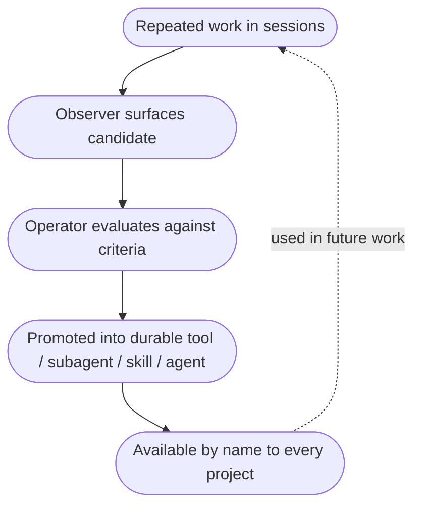
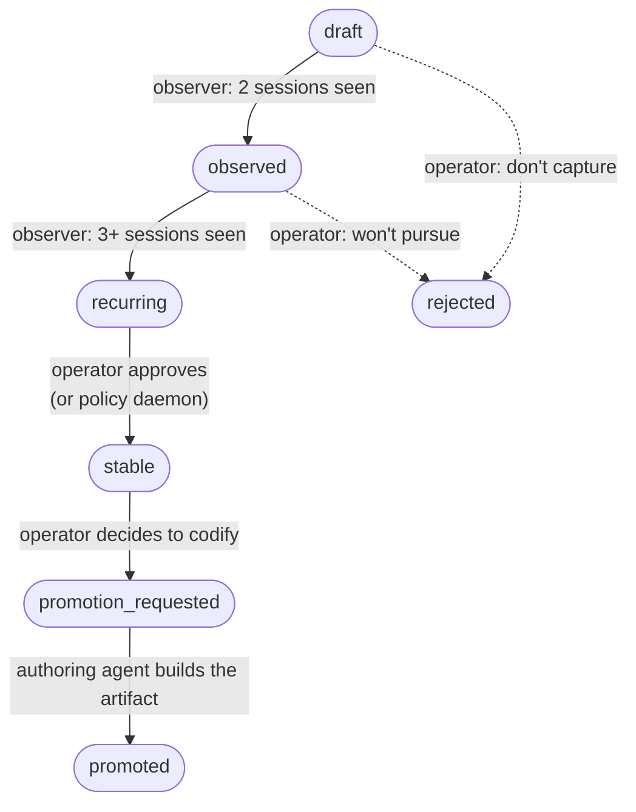

:::tip[See also]
For the outcome framing — "repeated work compiles into named skills, available in every project" — see the **Reusable skills** layer in [Project intelligence](/project-intelligence/) and the flow in [How it works](/how-it-works/). This page keeps the mechanism: how repeated work gets noticed, who decides, and what happens after.
:::

The platform's intelligence-spreading mechanism (memory across projects + cross-agent updates) keeps individual corrections from getting lost. But corrections alone don't add up to a richer platform. What does is **upskilling** — the loop that turns repeated work into reusable structure.

When the same pattern shows up enough times across enough sessions, the platform notices and surfaces it as a candidate for codification. The operator decides what to make of it: a tool, a subagent, a skill, or an agent. Once promoted, the new structure is available by name to every project on the platform. That's how the reusable catalog grows.

This page covers the full lifecycle — what gets noticed, what the criteria are for promoting it into each kind of artifact, who decides, and what happens after.

For the observation mechanism that surfaces candidates in the first place, see [The observer](/explanation/the-observer/). For how candidates flow through memory back to every agent, see [Sharing intelligence across projects](/explanation/sharing-intelligence-across-projects/).

## The upskilling loop

Raw repeated work → observed candidate → evaluated against the criteria → promoted into the right kind of structure → invocable from any project, including the one where the pattern was originally noticed. The loop closes.

## The promotion criteria (canonical)

The decision of WHAT to promote a candidate into is governed by a simple frequency-and-shape table. This is the canonical rubric the platform uses:

| Pattern frequency | What it should become | Why |
|---|---|---|
| **5+ same way, mechanical** | **Tool** — a Python function with deterministic inputs and outputs | The pattern is well-defined enough that no judgment is needed mid-execution. A function call is simpler, faster, and more reliable than an LLM doing the same work. |
| **3–5 occurrences, structured but with judgment** | **Subagent** — a specialist invoked with a persona, skills, and tool access for one bounded task | The shape is stable enough to codify, but each invocation needs judgment: which sub-step to take, when to ask, how to interpret. Subagents are LLM-powered with structure. |
| **2–3 occurrences, one-shot with variations** | **Skill** — a markdown methodology file the agent reads + applies | The pattern is recognizable but not yet rigid enough for a subagent. A skill captures the methodology; the agent applies judgment using it. |
| **1–2 occurrences** | Don't capture yet — wait for the third occurrence | One time is noise. Two times might be coincidence. Three is signal. Premature codification creates abstractions that don't fit the actual shape of the work. |

The four-row table above is the entire decision rubric. Every promotion question reduces to: how many times has this shape recurred, and how mechanical vs judgment-loaded is it?

## What each kind of artifact IS

The four artifact types in the table above correspond to four distinct things in the codebase:

**Tool.** A Python function exposed via the `@tool` decorator (or equivalent). Deterministic. Takes typed inputs, returns typed outputs. No LLM at the call site. Examples: `update_roadmap_status(item_id, new_status)`, `architecture_snapshot(repo_root)`. These get called millions of times because they're cheap.

**Subagent.** A specialist invoked by the main agent for one bounded task. Has its own persona (system prompt), its own tool access, often its own loaded skills. Returns a structured result. Example: a `documentation-reviewer` subagent that takes a draft + style guide and returns a critique. Each invocation is one LLM session within the larger conversation.

**Skill.** A markdown file (`SKILL.md`) at a known location. The main agent reads it when applicable and applies its methodology. No persona, no tool access of its own — it's read by the same agent doing the work. Example: `tapestry-patterns:documentation` (the skill that informs how docs get written across all projects).

**Agent.** A standalone agent file (`<name>.md`) registered in the platform's agents directory. Like a subagent but at a higher level — owns an ongoing responsibility across calls, not just one bounded task. Often deployed as a long-running process. Example: the `self-observer` cron is registered as an agent even though it's a deployed service; the role definition is the agent file, the implementation is the service.

The line between subagent and agent is the one called out in the migration docs as needing the most care: **skill if scope is bounded to a single call site; agent if scope is ongoing responsibility across calls.** A documentation reviewer invoked per-doc is a subagent. A continuous documentation auditor watching the whole repo is an agent.

## The candidate status lifecycle

A candidate progresses through statuses as evidence accumulates:

| Status | What it means | Who advances it |
|---|---|---|
| `draft` | The observer just emitted this on first sighting. | Auto (observer, first emission) |
| `observed` | Pattern recurred — 2 sessions have surfaced it. | Auto (observer, threshold transition) |
| `recurring` | 3+ sessions. Pattern is real and stable enough to evaluate seriously. | Auto (observer) |
| `stable` | Operator (or eventual policy daemon) confirmed this is worth codifying. | Operator or policy daemon |
| `promotion_requested` | Operator picked what to make it (tool, subagent, skill, agent) — work to build it is queued. | Operator |
| `promoted` | The artifact exists, is registered, and is invocable by name. | Authoring agent (the one that built it) |
| `rejected` | Operator decided this isn't worth capturing — usually because the pattern is too tied to one project, too noisy, or already covered by something else. | Operator |

The first three transitions (`draft → observed → recurring`) happen automatically as the observer accumulates sightings. The rest require explicit operator judgment — there is no auto-promotion in the current implementation, by design. A future policy service may auto-promote candidates that hit specific evidence thresholds, but that decision is gated on policy work that has not yet shipped.

## Who decides what

| Decision | Who makes it today | Who will eventually |
|---|---|---|
| First emission as a candidate | Observer (automatic, signal-rule-based) | Same |
| Threshold transitions (draft → observed → recurring) | Observer (automatic, count-based) | Same |
| Marking a candidate `stable` | Operator | Policy daemon (with evidence threshold + governance rules) |
| Picking the artifact kind (tool vs subagent vs skill vs agent) | Operator | Operator (this is the highest-judgment step; unlikely to auto-promote) |
| Authoring the artifact | The right authoring agent — for example, an orchestration-cataloging agent for tools, a proposal-authoring skill for skills, a web-app-scaffold agent for UI artifacts | Same; potentially auto-dispatched once `promotion_requested` |
| Marking it `promoted` | The authoring agent (after the artifact is created and registered) | Same |
| Rejecting / not capturing | Operator | Operator + policy rules that auto-reject patterns matching specific anti-patterns |

The platform is intentionally operator-in-the-loop for promotion right now. Auto-promotion is a planned capability gated on the Policy Service being fleshed out enough to govern it safely.

## What the observer evaluates against

The observer surfaces candidates using signal rules — pattern detectors that score a file or behavior against four categories:

- **Agent rules** — looks like an agent file (system prompt, tool list, persona) but isn't registered in the canonical agents directory
- **Tool rules** — looks like a tool function but isn't exposed via `@tool` registration
- **Skill rules** — looks like a methodology file (`SKILL.md`) but isn't in the canonical skills location
- **Orphan rules** — registered as a platform component but no usage detected (telemetry shows zero invocations over N days)

When a signal matches, the observer emits a candidate with the matched rule annotated in the `signals` field. The operator (or policy daemon) reads the signal annotations as evidence when evaluating the candidate.

The signal-rule code is the live source of truth. To add a new detection rule, extend `signal_rules.py` in the self-observer service. To tune existing weights, edit `config.py`'s `SIGNAL_WEIGHTS`. Tests pin the rule contract against fixtures from real platform repos.

## How upskilling makes the platform compound

Without the upskilling loop, each project's agent re-invents the same things. The same documentation pattern gets re-applied from scratch every time. The same architectural shape gets re-derived in every new session. Patterns stay locked inside individual projects' transcripts.

With the upskilling loop:

- The third time a pattern shows up, the observer surfaces it.
- The operator (or eventual policy daemon) decides what kind of artifact best captures it.
- The right authoring agent builds the artifact, registers it in the canonical location, and writes a memory tagged for every project that should know about it.
- The artifact becomes invocable by name from any project, immediately.
- The next time the pattern starts to recur, the agent reaches for the existing artifact instead of re-deriving the work.

This compounding is what makes a platform — not just a collection of repos with shared memory, but an actively-growing catalog of reusable structure that every project benefits from.

## What to do as an operator

You do not have to actively manage the upskilling loop. Most of it runs without you. What you do need to do:

- **Periodically scan recurring-status candidates.** The architecture-registry exposes `GET /candidates?status=recurring` — these are patterns the observer is confident about. Decide which are worth promoting and which are noise.
- **Pick the kind when you promote.** Use the criteria table above. If you find yourself promoting a `tool` for something that needs judgment, you may be premature — let it run as a `skill` first.
- **Reject when appropriate.** Patterns that are over-fit to one project, or that turn out to be coincidental, should be rejected with a brief reason so the rejection itself becomes part of the audit trail.

Beyond that, the platform handles the mechanical parts. The observer detects. The authoring agents build. Memory propagates. The catalog grows.

## Related

- [The observer](/explanation/the-observer/) — how patterns get noticed and surfaced in the first place
- [Sharing intelligence across projects](/explanation/sharing-intelligence-across-projects/) — how promotion memos flow to every project
- [The memory MCP](/explanation/memory-mcp/) — where candidates also live (mirrored from the registry) so they surface in auto-recall
- [The discipline stack](/explanation/discipline-stack/) — the platform context this loop lives inside
