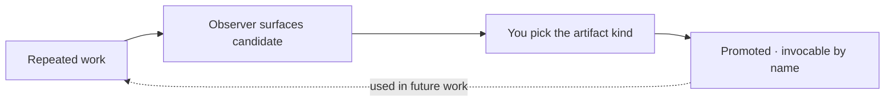

Upskilling is how repeated work becomes reusable structure. The third time you apply the same documentation pattern, or re-derive the same architectural shape, the observer surfaces it as a candidate. You decide what to make of it — a tool, a skill, a subagent, or an agent — and once promoted, it's invocable by name in every one of your projects. The next time the pattern starts to recur, the agent reaches for the existing thing instead of building it again.

## Why it matters

Without this loop, every project's agent re-invents the same work from scratch and patterns stay locked inside individual session transcripts. With it, repeated work compounds: each promotion adds to a catalog that every project draws on. That's the difference between a pile of repos that happen to share memory and a set that actually gets sharper over time.

## How it works

The decision of *what* to promote a pattern into comes down to how often it recurs and how much judgment it needs mid-run:

| Pattern | Becomes | Why |
|---|---|---|
| **5+ times, mechanical** | **Tool** — a function with typed inputs and outputs | Well-defined enough that no judgment is needed mid-run; a function call is cheaper and more reliable than an LLM doing it |
| **3–5 times, needs judgment** | **Subagent** — a specialist for one bounded task | Shape is stable, but each run needs judgment about which step to take |
| **2–3 times, varies** | **Skill** — a methodology file the agent reads and applies | Recognizable but not rigid; the agent applies judgment using it |
| **1–2 times** | Wait | Once is noise, twice might be coincidence, three is signal |

An **agent** is like a subagent but owns an ongoing responsibility across calls rather than one task. The line to watch: bounded to a single call site means skill or subagent; ongoing responsibility across calls means agent.

## What you do

Most of the loop runs without you. The observer detects patterns and advances a candidate through `draft → observed → recurring` automatically as sightings accumulate. Your part is the judgment the platform deliberately keeps in human hands:

- **Scan recurring candidates** periodically and decide which are worth promoting.
- **Pick the kind** using the table above. If a "tool" turns out to need judgment, let it run as a skill first.
- **Reject what's over-fit** to one project, with a brief reason so the rejection becomes part of the record.

After you mark a candidate for promotion, an authoring agent builds the artifact, registers it, and writes a memory so your other projects know it exists.

## What it's not

- **Not auto-promotion.** Nothing gets codified without your sign-off. The first three status transitions are automatic; everything past `recurring` is your call, by design.
- **Not a shared registry.** Promoted artifacts live in your own store and surface in your own projects. They are not pooled with other operators.
- **Not premature.** One or two sightings stay uncaptured on purpose — early codification creates abstractions that don't fit the real shape of the work.

## Going deeper

- [The observer](/explanation/the-observer/) — how candidates get surfaced in the first place.
- [Sharing intelligence across projects](/explanation/sharing-intelligence-across-projects/) — how a promotion memo reaches your other projects.
- [The signal hierarchy](/explanation/signal-hierarchy/) — where a "candidate" sits between raw events and finished structure.

## Related

- [The memory MCP](/explanation/memory-mcp/) — where candidates are mirrored so they surface in auto-recall.
- [The discipline stack](/explanation/discipline-stack/) — the context this loop runs inside.
