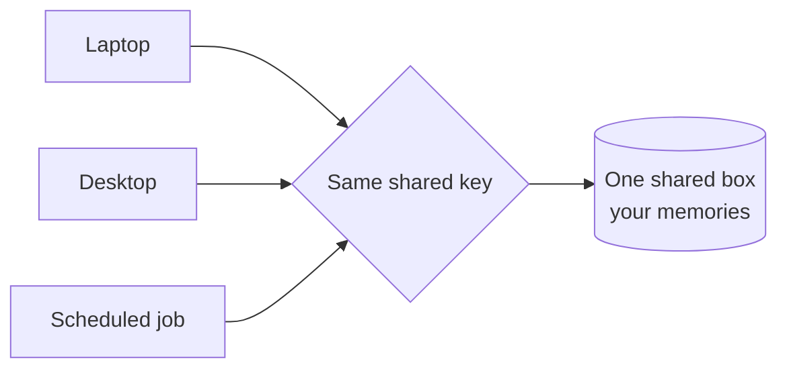

The other memory pages tell you what the store holds and how to run it. This one tells you *why it has the shape it has*, so that if you stand up your own you can make the same trade-offs on purpose. The [Shared language](/explanation/shared-language/) page defines the words in **bold-linked** text.

One honest thing first, because it shapes the rest: this design grew by trial and error, not from a single blueprint. It started from ideas in one of NVIDIA's agentic architectures, kept little of it, passed through a working version built on LanceDB, and borrowed structure from the deepagents pattern. What it is now is the result of tuning against one goal — **keep memory light, keep it from bloating, keep recall good enough to not be frustrating, across every machine.** That story is the real provenance; the reasons below are what it settled into.

## Why the shape matters

Memory is the floor the rest of the platform stands on. The observer, the discipline hooks, the cross-agent channel — none of them mean anything if the memory underneath is slow, bloated, or trapped on one machine. So the shape of this one store isn't a side detail; almost every choice in it is that one goal applied to a smaller piece. If you're deciding whether to adopt this store or build your own, the choices below are the ones that matter.

## The four goals and what serves them

A [record](/explanation/shared-language/#record) is one memory: a few **words** worth keeping, a short [fingerprint](/explanation/shared-language/#fingerprint) (384 numbers standing for what the words *mean*), and a few [labels](/explanation/shared-language/#label) (whose it is, which projects, who wrote it, when). The store is a collection of these. Every design choice serves one of four goals:

| The goal | What serves it | Why it works |
|---|---|---|
| **Stay light** | Small fingerprints, made locally by a small model; records are plain text | A record is a few words plus 384 numbers — cheap to store, and made on your own machine with no per-write fee and no internet |
| **Never bloat** | A record's name *is* its identity; deletes mark rather than erase | Resaving a name replaces that record instead of stacking a copy — the store stays the size of what you know, not how often you wrote it down |
| **Recall good-enough** | Search by meaning; everything on one record; a prebuilt shortcut for finding the closest | One query does "yours → this project → closest in meaning" in a single pass, and stays fast whether there are fifty memories or fifty thousand |
| **Work across machines** | One shared box, reached with a shared key | Every device presents the same key and lands in the same box, so the same recall works everywhere |

Two of those choices are worth a closer look, because they're the counterintuitive ones.

**A record's name is its address.** Save a memory under a name that already exists and it *overwrites* — it does not add a second record. Without this, every revision would pile up near-duplicates and the box would fill with slightly-different versions of the same thought. With it, the store holds one record per idea however many times you revise it. That single rule is most of why it never bloats.

**Everything recall needs is on the one record.** The words, the fingerprint, and the labels live together in one table, so a single lookup filters *and* ranks in one step. If the fingerprints lived in a separate specialized database, every recall would query two stores and stitch the answers together — slower, and one more thing to run. Keeping them together is why recall is one fast step.

## The scope model: two walls and one deliberately left out

Every record carries three labels that answer three different questions — whose it is, which projects, and which agent wrote it. From those, the three [scopes](/explanation/shared-language/#scope) people ask about fall out, and the surprising part is that **two are walls and the third is a wall the design leaves out on purpose:**

- **User scope is a hard wall.** Your memories sit under one owner-label, and the store itself refuses to return a record that isn't yours — enforced on every read and write, below the app.
- **Project scope is a soft sort.** Inside your own memories, project labels sort records by project. It's a helpful filter, not a barrier — a record can carry two project labels, and cross-project recall is allowed. A genuine wall *between* projects needs a separate owner-label, the same hard wall used between people.
- **Machine scope doesn't exist — and that's the point.** There is no "which machine" label at all. Your laptop, your desktop, a scheduled job — different machines, same shared key, so they all land in the same box. Machine isn't a boundary the store draws; it's the boundary it *refuses* to draw, because reaching the same memory from every machine is the reason the store exists in the first place.

One caution follows directly, and it's the one thing setup asks of you: because the shared key is what routes a machine to your box, every machine must carry the *same* key. A missing or mismatched key is turned away with an error; a machine pointed at a *different* box lands there and quietly finds it empty. Either way the fix is the same — set the one key, identically, everywhere.

## What running it asks of you

Nothing, for the shape itself. The store runs as one always-on service; the agent writes and recalls memories automatically. Your only job is the one thing the design can't do for you: keep every machine on the same key.

The store is tuned for one person with thousands of memories — that's *why* it stays small and fast. A public multi-tenant service would make different choices, and should; if that's what you're building, treat these choices as a starting point to re-decide, not a template to copy.

## Going deeper

- [Memory (component)](/systems/memory/) — how the store is wired, how to run it, and how to verify it.
- [The memory MCP](/explanation/memory-mcp/) — what accumulates in a running store, how project labels scope it, and how to keep it healthy.

## Related

- [Shared language](/explanation/shared-language/) — the eight words these pages use, defined once.
- [The memory](/explanation/the-memory/) — the concept, in brief, if you want the shorter version first.
- [The observer](/explanation/the-observer/) — whose synthesis memos are just more records in this same box.
