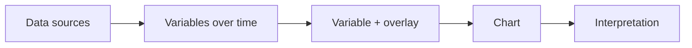

The Observatory is the console for watching coordination between you and your agents, across projects and over time. It lives at [`/observatory`](/observatory).

It shows:

- how a project's shape is changing,
- what the observer sees,
- where coordination friction appears,
- whether memory is helping or failing,
- how coordination is trending over time.

## How it works

The Observatory models telemetry as variables over time. You pick a variable, add an overlay variable, and choose a view; the console plots them and interprets the combination.

For each view, the console states what you are looking at, why the variables relate, what patterns the view can expose, the observer's current reading, and which signals are not yet instrumented.

## Instrumentation

Some variables are not yet instrumented — friction recurrence, memory misses, and corrections. They are selectable but have no data; the console shows them as *not instrumented*.

## In this section

- [Reading the Observatory](/observatory/reading-it/) — the controls, chart types, and interpretation.
- [Run the Observatory](/observatory/run-it/) — open it or run it locally.
- [The Observatory feed](/observatory/feed/) — the data the console reads, and how to supply it.
