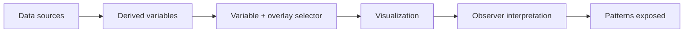

The Observatory is where you watch coordination between you and your agents — across projects, over time. It lives at [`/observatory`](/observatory).

It is deliberately **not** a dashboard of counters. "231 tool calls, 12 sessions" tells you nothing about whether coordination is working. The Observatory shows what the telemetry is supposed to *explain*:

- how the project's shape is changing,
- what the observer sees,
- where coordination friction appears,
- whether memory is helping or failing,
- whether things are getting better or worse.

## The model: variables, overlaid, interpreted

The Observatory treats telemetry as **selectable variables over time**, not fixed cards. You pick a variable, overlay a second, choose a view, and the observer explains what the combination can expose.

The intelligence is in the last steps: for any selected view, the console states *what you're looking at, why those variables matter together, what patterns it may expose, what the observer currently thinks,* and *what's blind or low-confidence.*

## Honest by construction

Most coordination signal isn't instrumented yet. The Observatory never fakes it. A variable that isn't measured (friction recurrence, memory misses, corrections) is still **selectable**, but it's drawn as *not instrumented* and the interpretation says the relationship can't be measured. Absence is shown, never coloured green.

As the [observer](/explanation/the-observer/) learns to derive those signals from transcripts and the [OTel coordination contract](/reference/otel-coordination-contract/) starts emitting them, the blind variables come alive — the console fills in without any UI change.

## This section

- **[Reading the Observatory](/observatory/reading-it/)** — the controls, the chart types, and the interpretation panel.
- **[Run the Observatory](/observatory/run-it/)** — launch it locally or open the deployed console.
- **[The Observatory feed](/observatory/feed/)** — the data contract: what the console reads, and how to wire a live source into it.
