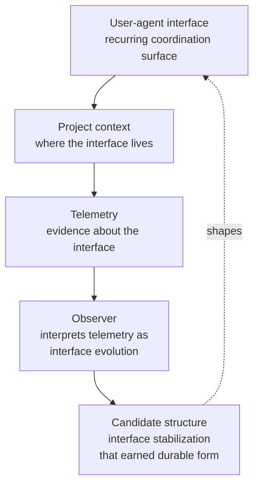

The primary object of observation. Read this before [project shape](/start/project-shape/) and [what Tapestry is not](/start/what-tapestry-is-not/) — those pages make more sense once this primitive is in place.

## Definition

**A user-agent interface is a recurring coordination surface where operator intent, agent behavior, project structure, memory, and correction activity meet.**

Some examples to make this concrete:

- The interface between you and your code-review agent in this repo
- The interface between you and a research subagent dispatched from a planner
- The interface between two agents passing context to each other across a tool call
- The interface that emerges when a new dashboard surface starts being used and your corrections shape what it shows
- The interface that degrades when an MCP server starts dropping requests and the agent's behavior shifts in response

Interfaces are not endpoints. They're not screens. They're not single conversations. They're the *recurring patterns of coordination* that exist between you and the agents working on your behalf — patterns that have purpose, history, expectations, and friction.

## Why this is the primary object

You will see Tapestry described as project observability, project telemetry, memory infrastructure, agent telemetry, or admin tooling. All of those are *components*. None of them is the thing being observed.

The thing being observed is the user-agent interface. Projects contain interfaces. Architecture is evidence about interfaces. Memory attaches to interfaces. Telemetry exposes how interfaces are exercised. Friction signals reveal where interfaces are misaligned with operator intent. Corrections are how interfaces stabilize over time.

If the platform optimizes for "observe projects" it produces a portfolio dashboard with no behavioral teeth. If the platform optimizes for "observe telemetry" it produces Grafana. If the platform optimizes for "observe memory" it produces a memory MCP. If the platform optimizes for "observe interfaces" it produces something that actually understands how work between operator and agents is changing — which is what's needed for the recursive upskilling loop to land in the right place.

## The architectural hierarchy

Read top-down: the interface is what exists; the project is its container; telemetry is the evidence trail; the observer interprets that trail as interface change; candidate structure is what earns durability when an interface stabilizes. Then the loop closes: durable structure shapes the next generation of interfaces.

## Interface lifecycle

Every interface is in one of these states at any time:

| State | Meaning | What the observer surfaces |
|---|---|---|
| **Active** | Interface is in regular use; behavior is predictable | Health signals; routine telemetry; stable correction history |
| **Emerging** | Interface is forming; coordination patterns are taking shape but not yet predictable | Novelty signals; new correction patterns; expanding agent participation |
| **Changing** | Interface is in flux; participants, expectations, or memory attachments are shifting | Drift signals; correction-rate changes; memory thrash |
| **Degraded** | Interface is failing intermittently; coordination is breaking down | Failure signals; recurring corrections that aren't sticking; agent confusion across handoffs |
| **Stabilized** | Interface has converged on a coherent form; corrections have effectively stopped | Pattern → candidate → durable structure pipeline; reusable skill emergence |

The observer's primary job is to know which lifecycle state each interface is in, and to detect transitions between states early.

## What each interface carries

For each tracked interface, the observer holds:

- **Purpose** — what coordination this surface exists to support
- **Participating agents** — which agents (and the operator) take part
- **Operator expectations** — what "working" looks like from the operator's view
- **Memory dependencies** — which memory entries the interface relies on
- **Architecture dependencies** — which platform/repo structure supports it
- **Runtime signals** — telemetry exposing how the interface is being exercised
- **Friction signals** — where the interface is misaligned with intent
- **Correction history** — what the operator has corrected and when
- **Candidate durable structures** — what could become a reusable skill / agent / tool / pattern if this interface stabilizes

## How this changes other Tapestry concepts

Project shape, the observer, architecture diffs, the dashboard, telemetry, memory — none of them go away. Their *role* changes:

| Concept | Old framing | New framing |
|---|---|---|
| **Project** | The thing being observed | A container of interfaces; context for interface analysis |
| **Project shape** | The observable structure that changes over time | The substrate that interfaces live on; shape change is evidence of interface change |
| **Architecture** | Diagrams of services + repos | Evidence about where interfaces live and how they coordinate |
| **Memory** | Storage layer for the agent's knowledge | Substrate where interfaces accumulate state |
| **Runtime telemetry** | What ran and what failed | Evidence about how interfaces are being exercised |
| **Friction** | Recurring operator corrections | The clearest signal of interface misalignment |
| **Observer** | Component that watches project change | Component that watches interface evolution |
| **Architecture diff** | What changed in the codebase | What changed about which interfaces exist, where, and how |
| **Dashboard** | UI for project telemetry | UI for understanding interface state and trajectory |

Do not search-and-replace "project" with "interface" anywhere. Projects are still important. Architecture is still important. Telemetry is still important. The change is that those things become **context** for understanding interfaces, rather than being treated as the primary object.

## The canonical principle

> **Tapestry observes project shape because project shape affects user-agent interfaces. The durable structure being built is not the project itself. The durable structure being built is the evolving coordination layer between the operator and the agents.**

That sentence is what every other doc on this site is one face of.

## Related

- [Project shape](/start/project-shape/) — the substrate interfaces live on
- [What Tapestry is not](/start/what-tapestry-is-not/) — anchoring against false frames; especially "Tapestry is not project observability"
- [The observer](/explanation/the-observer/) — the component that watches interface evolution
- [The signal hierarchy](/explanation/signal-hierarchy/) — the levels of evidence the observer interprets as interface change
- [How the platform upskills itself](/explanation/upskilling/) — what happens when an interface stabilizes enough to earn durable structure
