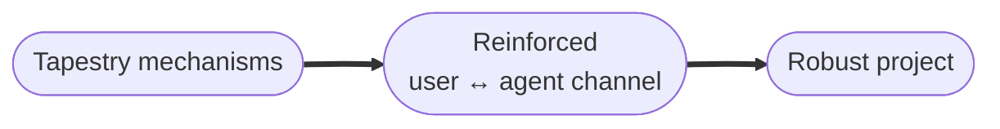

When you build with an agent, the project sits between you and the agent, and its quality tracks the quality of the channel between you — how well intent flows from you to the agent and back. Most failures in agent-assisted projects aren't agent failures or user failures in isolation. They're failures of that channel: specific, recurring ways it degrades. Tapestry's job is to reinforce the channel so the project gets better over time instead of worse.

## Why it matters

Left alone, these failures compound. The agent forgets what you told it last week. It drifts from your framing. It re-makes the same wrong call across sessions. Each is small, but together they turn into projects that erode session by session. Tapestry's bet is that each weak point can be reinforced by a specific mechanism, and that the mechanisms together turn miscommunications into structure rather than letting them dissolve into churn.

## How it works

Each weak point in the channel is paired one-to-one with a mechanism that targets it.

| Weak point | What it looks like | Mechanism |
|---|---|---|
| Memory loss across sessions | You said it last week; the agent doesn't have it now | `loom-memory` MCP |
| Drift from your framing | You asked for a dashboard layer; you got a separate system | Per-project guard plugins |
| Silent assumptions | The agent cites a file that doesn't say what it claims | PROBE-discipline reminders |
| Forgotten corrections | Corrected at minute 10; same drift back by minute 40 | Friction-as-memory rule |
| Architectural blindness | The agent has no idea what's deployed or what depends on what | Architecture snapshots |
| Repeated mistakes | Same wrong choice across sessions and projects | Upskilling audit |
| Patterns invisible across sessions | A behavior recurs, but no one session is long enough to see it | The observer |
| Invisible tool absence | The memory MCP is down and nothing says so | CORE DIRECTIVE 1 (halt if missing) |

Each mechanism is small and targets one failure mode. The discipline comes from the combination — every piece is small but load-bearing.

## What you do

Set up the wiring once, then nothing. The mechanisms run automatically through the discipline plugin and a handful of files in your repo — they declare the memory MCP, enable the plugins, scope the hooks, and hold your per-project profile. You don't invoke them by hand during a session.

## What it's not

- **Not a single feature.** No one mechanism keeps a project on track; the combination does.
- **Not loud when it fails.** The usual failure is silent absence — a missing piece just stops doing its one job. You notice by comparing against a properly-wired agent.
- **Not automatic without setup.** The wiring has to exist in your repo first.

## Going deeper

- [The discipline stack](/explanation/discipline-stack/) — why each mechanism exists and how they form a loop where miscommunications become architecture.
- [Load-bearing files](/reference/load-bearing-files/) — the file-by-file reference for the wiring in your repo and what the agent loses if a piece goes missing.
- [Set up a new project](/how-to/set-up-a-new-project/) — wiring a project from scratch.
- [Recover from common failures](/how-to/recover-from-common-failures/) — auditing an existing project.

## Related

- [Project shape](/start/project-shape/)
- [User-agent interfaces](/start/user-agent-interface/)
- [The observer](/explanation/the-observer/)
