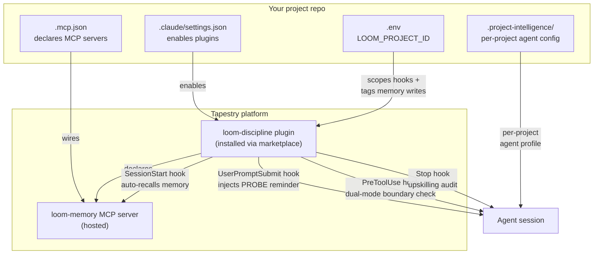

When you start a Claude Code session in `the-loom`, `Make_Skills`, or `tapestry`, the agent does several things automatically that an agent in a stock-config repo would NOT do:

- Recalls the top-N relevant memories from prior sessions and injects them as context at conversation start.
- Sees a PROBE-discipline reminder at the top of every one of your messages ("cite file:line, distinguish dev-tooling from runtime, save corrections as feedback memory immediately").
- Has access to `memory_recall`, `memory_write`, `memory_read`, `memory_search` MCP tools.
- HALTs and reports if those memory tools become unavailable mid-session (CORE DIRECTIVE 1).
- Emits an upskilling audit if it crosses a substantive-work threshold without recording a learning report (CORE DIRECTIVE 2).

None of this is built into Claude Code. It comes from a stack of four cooperating pieces. If any one of them is missing or misconfigured, the agent in your project quietly drops back to stock behavior — no error, no warning. It just starts checking memory less, citing less, drifting more.

## The four cooperating pieces

## What each piece does in one sentence

1. **The `loom-discipline` plugin** is the source of the discipline behavior — its hooks fire at session start, per turn, before tool use, and at stop.
2. **The `loom-memory` MCP server** is the cross-session memory store, hosted at `loom-agent-context.onrender.com`. The plugin declares it; your project's `.mcp.json` can also declare it as belt-and-suspenders.
3. **Your project's `.claude/settings.json`** enables the plugin. If this entry is missing, the plugin doesn't load and none of the hooks fire.
4. **Your project's `.env` `LOOM_PROJECT_ID`** scopes the hooks to your project (the plugin honors it for activation) and tags every memory write so the agent in your project sees memories tagged for your project on recall.

Plus one supporting piece:

5. **`.project-intelligence/<project-id>/`** holds the per-project agent profile — what the agent IS in your project (researcher? developer? operator?), what events it should log, what makes a candidate worth surfacing. The plugin reads these to specialize behavior per project.

## What the agent loses if a piece goes missing

| If this is missing or wrong | The agent loses |
|---|---|
| `.mcp.json` not declaring `loom-memory` AND plugin not enabled | All memory tools. The agent has no way to call `memory_recall` or `memory_write`. |
| Plugin not enabled in `.claude/settings.json` | All four hooks. No auto-recall at session start, no PROBE reminder per turn, no PreToolUse check, no Stop audit. |
| Plugin enabled but `LOOM_PROJECT_ID` unset | Hooks may no-op because the scope gate finds nothing to activate against. |
| `LOOM_PROJECT_ID` drifted (different value than expected) | Memory writes tag the "wrong" project; the agent recalls memories that don't match its operating context. |
| `.project-intelligence/` deleted or moved | The agent loses per-project specialization — it doesn't know what role it plays in this repo. |
| Architecture-snapshot scripts deleted from `scripts/` | The SessionStart snapshot pipeline silently no-ops (the hook reads from these scripts and skips when absent). The agent loses the architecture context at session start. |

The recurring failure mode: **silent absence.** The agent doesn't know what tool it's missing, because it never had it. It just starts answering questions without checking memory and you wonder why it feels different than the agent you talked to last week.

## How to verify your project is wired correctly

Use the [Set up a new project](/how-to/set-up-a-new-project/) checklist for a fresh project. For an existing project, see [Recover from common failures](/how-to/recover-from-common-failures/) and check each "symptom" row — even if you don't have the symptom yet, the table tells you what to inspect.

For a full file-by-file breakdown, see [Load-bearing files](/reference/load-bearing-files/).

## Why this site exists

In June 2026, the SDE_Extraction agent had been running without the `loom-discipline` plugin enabled and without `loom-memory` wired in its `.mcp.json` for about three weeks before anyone noticed. The CLAUDE.md in that repo told the agent to use `memory_recall` and `memory_write`, but the tools were never available in the session. The agent silently did what it could — reading the CLAUDE.md, accepting the framing, and never confirming the tools actually existed.

The fix was three lines of JSON. The reason it wasn't caught for three weeks is that absence is invisible: the agent had no negative-space awareness, the operator had no checklist to run, and nothing in the system loudly said "this is broken."

This site exists so that the next time someone creates a project that plugs into Tapestry, they have an explicit reference for what every piece is and what its absence looks like.
