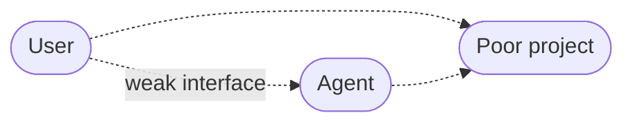
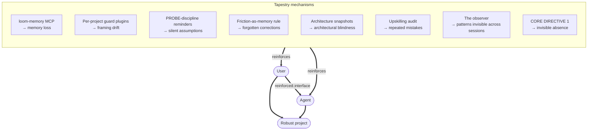
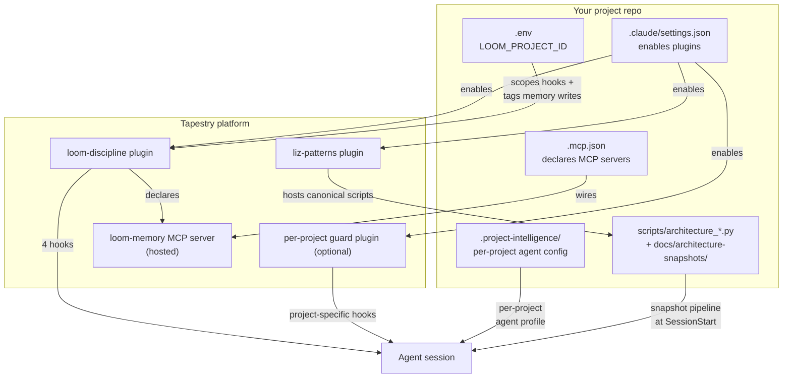

## A project is what the interface produces

When you build a project with an agent, the project sits between you and the agent. The quality of the project is determined by the quality of the interface between you — by how well intent flows from you to the agent and back. When that interface is weak, the project is weak.

Most of the failures in agent-assisted projects aren't agent failures or user failures in isolation. They're failures of the channel between them — specific, recurring, predictable ways that interface degrades:

| Weak bond | What it looks like in practice |
|---|---|
| Memory loss across sessions | You said something important last week; the agent doesn't have it this week. |
| Drift from your framing | You asked for a "layer in the dashboard"; the agent built a separate deployed system. |
| Silent assumptions | The agent cites a file that doesn't actually say what the agent says it says. |
| Forgotten corrections | You corrected the agent at minute 10; by minute 40, the same drift is back. |
| Architectural blindness | The agent has no idea what's deployed, what changed, or what depends on what. |
| Repeated mistakes | Same misunderstanding, same wrong architectural choice, across sessions and projects. |
| Patterns invisible across sessions | A behavior recurs across many sessions but no single session is long enough to surface it. |
| Invisible tool absence | The memory MCP is down or unwired and nothing tells anyone. |

Each is a specific way the interface fails. Left unaddressed, they compound into projects that get worse over time, not better.

## What Tapestry does

Tapestry is the proposition that each of those weak bonds can be reinforced by a specific mechanism, and that the mechanisms together convert miscommunications into architecture rather than letting them dissolve into churn.

Each mechanism is small. Each targets a specific failure mode. The discipline emerges from the COMBINATION — every piece is small but load-bearing.

For why each mechanism exists and how they form a recursive loop where miscommunications become architecture, see [The discipline stack](/explanation/discipline-stack/).

## What this looks like concretely in your repo

The mechanisms above don't exist in the abstract — they're concrete pieces wired into your project repo plus pieces hosted on the platform side.

The five concrete pieces in your repo:

1. **`.mcp.json`** declares the loom-memory MCP server.
2. **`.claude/settings.json`** enables the loom-discipline plugin (and any per-project guards).
3. **`.env`** holds `LOOM_PROJECT_ID` — the scope gate for hook activation and the tag applied to every memory write.
4. **`.project-intelligence/<project-id>/`** holds the per-project agent profile (role, observatory config).
5. **`scripts/architecture_*.py`** are thin wrappers that dispatch to the canonical snapshot scripts in the `liz-patterns` plugin.

The two platform-side pieces (hosted, not in your repo):

- **The `loom-discipline` plugin** — installed once per machine; enabled per project; provides the four lifecycle hooks (SessionStart, UserPromptSubmit, PreToolUse, Stop).
- **The `loom-memory` MCP server** — hosted at `loom-agent-context.onrender.com/mcp/memory/`; shared across every Tapestry-consuming project, scoped per-project via `project_tags`.

## What the agent loses if a piece goes missing

The recurring failure mode is **silent absence**. The agent doesn't crash when something's missing — it just stops doing one thing it should be doing. You only notice when you compare it to a properly-wired agent.

| If this is missing or wrong | The agent loses |
|---|---|
| `.mcp.json` not declaring `loom-memory` AND plugin not enabled | All memory tools. No `memory_recall` or `memory_write` available. |
| Plugin not enabled in `.claude/settings.json` | All four hooks. No auto-recall, no PROBE reminder, no boundary check, no upskilling audit. |
| Plugin enabled but `LOOM_PROJECT_ID` unset | Hooks may no-op. Scope gate has nothing to activate against. |
| `LOOM_PROJECT_ID` drifted | Memory writes tag the wrong project. Recall surfaces the wrong context. |
| `.project-intelligence/` deleted or moved | Agent loses per-project specialization. |
| `scripts/architecture_snapshot.py` deleted | Snapshot pipeline silently no-ops at session start. Architecture awareness across sessions disappears. |

## Read next

To audit an existing project: [Recover from common failures](/how-to/recover-from-common-failures/).

To set up a new project from scratch: [Set up a new project](/how-to/set-up-a-new-project/).

To understand WHY each mechanism exists at the structural level (the user-agent interface, the reinforcement model, the recursive miscommunication-becomes-architecture loop): [The discipline stack](/explanation/discipline-stack/).

For the file-by-file reference: [Load-bearing files](/reference/load-bearing-files/).

## Why this site exists

In June 2026, the SDE_Extraction agent had been running without the `loom-discipline` plugin enabled and without `loom-memory` wired in its `.mcp.json` for about three weeks before anyone noticed. The CLAUDE.md in that repo told the agent to use `memory_recall` and `memory_write`, but the tools were never available in the session. The agent silently did what it could — reading the CLAUDE.md, accepting the framing, and never confirming the tools actually existed.

The fix was three lines of JSON. The reason it wasn't caught for three weeks is that absence is invisible: the agent had no negative-space awareness, the operator had no checklist to run, and nothing in the system loudly said "this is broken."

This site exists so that the next time someone creates a project that plugs into Tapestry, they have an explicit reference for what every piece is and what its absence looks like — and why each piece is there in the first place.
