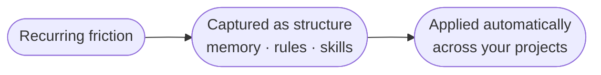

Tapestry is an intelligence that watches across all your projects and creates durable structure wherever there's recurring friction — a correction you keep making, a workflow you keep redoing by hand, a mistake that keeps coming back. When something recurs, Tapestry turns it into structure: a rule, a skill, or a piece of memory the agent uses automatically next time.

## Why it matters

An agent doesn't get better on its own. It's fixed until the next model ships — and when a new model arrives, it can behave differently enough that you have to recalibrate to it. So the improvement in your work can't come from the agent alone. It comes from the structure that accumulates around it: the corrections, decisions, and patterns captured once and then carried forward. That structure is what survives a model change and keeps your projects improving instead of resetting.

## How it works

Friction shows up in recognizable ways, and each is captured by a specific mechanism so it doesn't have to be re-solved every session:

| What keeps going wrong | What captures it |
|---|---|
| The agent forgets what you told it last week | `loom-memory` MCP |
| It drifts from your framing | Per-project guard plugins |
| It asserts things the files don't support | PROBE-discipline reminders |
| A correction doesn't stick — same drift an hour later | Friction-as-memory rule |
| It has no idea what's deployed or what depends on what | Architecture snapshots |
| The same mistake recurs across sessions and projects | Upskilling audit |
| A pattern recurs, but no single session is long enough to see it | The observer |
| A required tool is silently missing | CORE DIRECTIVE 1 (halt if missing) |

Each mechanism is small. The value is the combination: friction gets noticed, captured, and turned into something the agent applies automatically — across every project, not just the one you're in.

## What you do

Set up the wiring once, then nothing. The mechanisms run automatically through the discipline plugin and a few files in your repo. You work normally; the structure accumulates as you go.

## What it's not

- **Not a single feature.** No one mechanism does it; the combination does.
- **Not loud when it fails.** A missing piece just quietly stops doing its job — you notice by comparing against a properly-wired agent.
- **Not automatic without setup.** The wiring has to exist in your repo first.

## Related

- [The observer](/explanation/the-observer/) — how recurring friction gets noticed and turned into structure.
- [The discipline stack](/explanation/discipline-stack/) — how the mechanisms form a loop where miscommunications become architecture.
- [What Tapestry is not](/start/what-tapestry-is-not/) — common wrong frames.
- [Set up a new project](/how-to/set-up-a-new-project/) — wiring a project from scratch.
