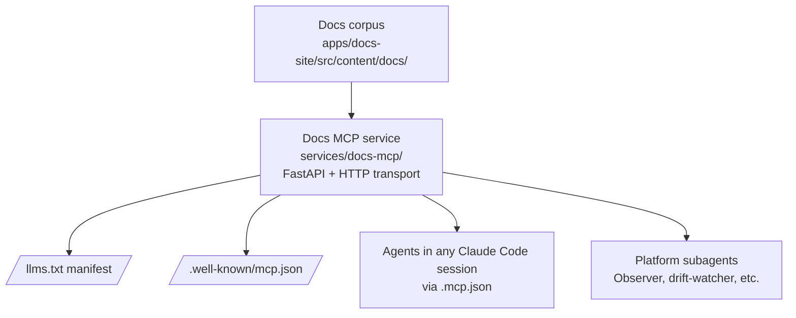

:::caution[Skeleton built — not yet deployed]
The service skeleton lives at [`services/docs-mcp/`](https://github.com/Lizo-RoadTown/tapestry/tree/main/services/docs-mcp). It runs locally; deployment to Render is the next step (operator-gated). Until deployment lands, the `consuming the existing deployment` section below describes the intended interface but the URLs are placeholders.
:::

## What it will be

An MCP server (HTTP transport) that exposes three tools backed by the Tapestry documentation:

| Tool | Purpose |
|---|---|
| `tapestry_docs_search` | Full-text + tag search over the docs corpus |
| `tapestry_docs_read` | Read a named doc by slug |
| `tapestry_docs_list` | List doc slugs by section or tag |

Modeled on the public pattern LangChain uses for [their docs MCP](https://langchain-ai.github.io/) — Mintlify ships docs sites with a `.well-known/mcp.json` manifest + a `/llms.txt` corpus file + a hosted MCP endpoint. Agents in any Claude Code session (or other MCP client) can query the docs directly without web scraping.

Planned location: `services/docs-mcp/` following the `the-loom/services/agent-context/` template (FastAPI + StreamableHTTPSessionManager + tool definitions). Will publish `.well-known/mcp.json` + `/llms.txt` at the docs site root.

## Why it will exist

Three failure modes the Docs MCP closes:

1. **Operators don't read docs that aren't where they're working.** Embedding the docs as an MCP-callable tool means an agent in a Tapestry-consuming project can `tapestry_docs_search("how do I add a project?")` mid-session instead of the operator having to context-switch.
2. **Agents currently fabricate URLs and slugs.** Without a tool that returns ground-truth doc references, agents pattern-match from training data — often badly. The Docs MCP gives them a canonical source.
3. **Other agents on the platform can use the docs.** Subagents (the Observer, drift-watchers, the architecture analyst) can query the docs corpus to look up canonical definitions when interpreting signals.

## How it will interact with the platform



The Docs MCP reads the static doc corpus (no DB needed for a first pass — disk-backed search is sufficient at this corpus size). It publishes a discovery manifest (`mcp.json`) and a flattened text corpus (`llms.txt`) at the docs site root, so any MCP client can auto-configure.

## Planned setup

**Consuming the deployed Docs MCP (future):** add to your project's `.mcp.json`:

```json
{
  "mcpServers": {
    "tapestry-docs": {
      "transport": {
        "type": "http",
        "url": "https://tapestry-docs-mcp.onrender.com/mcp/"
      }
    }
  }
}
```

The `tapestry-discipline` plugin will declare this server in its `plugin.json` so it auto-installs alongside the discipline plugin once the service is live.

**Self-hosting (future):**

1. Copy `services/docs-mcp/` (once it exists) into your Tapestry deployment.
2. Deploy as a Render Web Service. No database required for the first pass.
3. Wire `apps/docs-site/` to publish `.well-known/mcp.json` + `/llms.txt` at the site root (Vercel rewrite or static build).
4. Point your `.mcp.json` at your deployment's URL.

## Planned verification

- Call `tapestry_docs_search` with a known phrase; result includes the expected slug.
- Call `tapestry_docs_read` with a known slug; result is the page body.
- Open `https://tapestry-khaki.vercel.app/.well-known/mcp.json` — returns the discovery manifest.
- Open `https://tapestry-khaki.vercel.app/llms.txt` — returns the flattened corpus.

## Build status

| Step | Status |
|---|---|
| Service skeleton (FastAPI + mcp_http + tool defs) | Done — `services/docs-mcp/{main,mcp_http,mcp_server}.py` |
| Corpus indexing + search implementation | Done — `services/docs-mcp/{corpus,indexer}.py` (in-memory token-frequency index) |
| `/llms.txt` generation | Done — served by the service at `/llms.txt`; Vercel rewrite from docs site root is the publish step |
| `/.well-known/mcp.json` generation | Done — served by the service at `/.well-known/mcp.json`; same publish step |
| Render deployment | Pending — `services/docs-mcp/render.yaml.example` is the blueprint; operator deploys from Render dashboard |
| `plugin.json` wiring for `tapestry-discipline` | Pending — depends on the deployed URL |
| Test suite | Pending — follow-on PR |

When deployment lands, this page updates to remove the caution banner and the "Build status" table; URL placeholders become real.

## Related

- [Memory](/systems/memory/) — the template service this will follow (`the-loom/services/agent-context/`)
- [Platform dependencies — Render](/reference/platform-dependencies/) — the deployment target
- [The plugins](/explanation/plugins/) — what auto-installs the MCP into operator projects
- [LangChain Mintlify docs MCP pattern](https://langchain-ai.github.io/) — the public reference implementation
