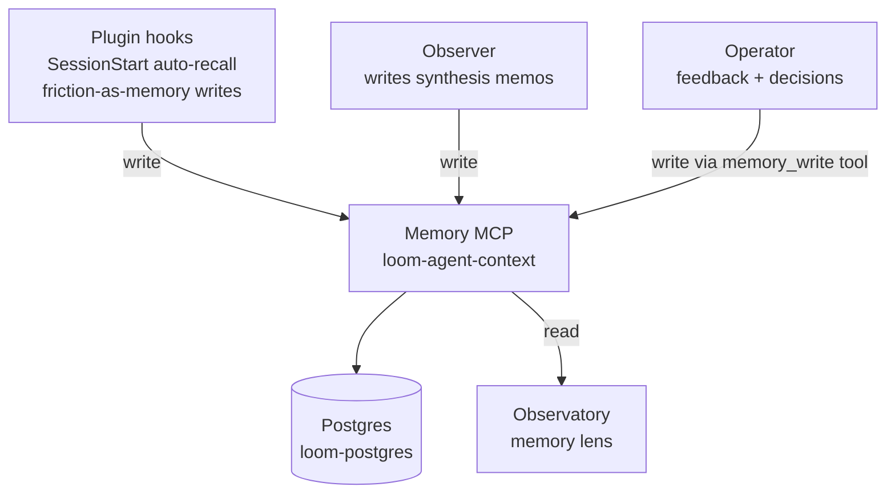

Memory is the persistence layer that holds typed records across sessions, projects, and agents. Every other component depends on it.

## What it is

An MCP server (HTTP transport) at `https://loom-agent-context.onrender.com/mcp/memory/` exposing six tools:

| Tool | Purpose |
|---|---|
| `memory_read` | Read a named record |
| `memory_write` | Create or update a record with typed metadata |
| `memory_recall` | Tag-filtered batch read (used by SessionStart auto-recall) |
| `memory_search` | Full-text + tag search |
| `memory_list` | List record names by tag |
| `memory_delete` | Remove a record |

Records are typed (`feedback`, `project`, `user`, `reference`, etc.), tagged with project scope (`["the-loom"]`, `["tapestry"]`, `["sde-extraction"]`), attributed to an actor (`claude-code`, the operator, the Observer), and chained via provenance links.

Currently lives at `the-loom/services/agent-context/` (Render service `loom-agent-context`). Forward path: migrate into `tapestry/services/agent-context/` once boundaries firm up.

## Why it exists

Without persistent memory, every session starts cold. Operators have to re-explain context; agents make the same mistakes; corrections evaporate. The cost is paid every conversation.

Memory turns those costs into one-time learnings. A correction saved once becomes guidance forever after. A project's accumulated context auto-recalls at SessionStart. The Observer's synthesis memos compound over time.

Memory is the substrate of [the shared multi-agent memory model](/explanation/sharing-intelligence-across-projects/) — hierarchical scopes, provenance chains, visibility tiers, reinforcement model.

## How it interacts with the platform



The Memory MCP is read-write to plugins (auto-recall at SessionStart, friction writes mid-session), the Observer (synthesis memos), and operators (typed records via memory_write). It backs onto Postgres (`loom-postgres` on Render). The Observatory reads through it for the memory lens.

## Setup

**Consuming the existing deployment (default):** add `loom-memory` to your project's `.mcp.json`:

```json
{
  "mcpServers": {
    "loom-memory": {
      "transport": {
        "type": "http",
        "url": "https://loom-agent-context.onrender.com/mcp/memory/"
      }
    }
  }
}
```

That's it. `tapestry onboard` writes this block for you. Each operator gets a fallback tenant — no JWT needed (v0.1.8 wired self-host fallback per `the-loom/services/agent-context/mcp_self_host_middleware.py`).

**Self-hosting Memory:**

1. Copy `the-loom/services/agent-context/` into your Tapestry deployment.
2. Provision a Render Postgres instance for record storage.
3. Deploy as a Render Web Service from `the-loom/infra/deploy/render.yaml` (search `loom-agent-context`).
4. Required env vars:
   - `DATABASE_URL` — Render Postgres connection string
   - `PLATFORM_MODE=hosted` (multi-tenant) or `=self_host` (single-tenant, default)
   - JWT verification keys (only for `hosted` mode)
5. Point your `.mcp.json` at your deployment's URL.

See [Platform dependencies](/reference/platform-dependencies/) for the full Render setup.

## Verify

- **MCP server is reachable:** call `memory_list` with a known tag. Non-error response = reachable.
- **SessionStart auto-recall works:** start a new Claude Code session in a project with prior memories. The session header should include an auto-recall block listing past memories tagged for the project.
- **Writes persist:** call `memory_write` for a test record, then `memory_read` it. The record should round-trip with metadata intact.
- **Tag scoping works:** write a record with `project_tags=["test-scope"]`, then `memory_recall` with that tag — only that record returns.

## Troubleshoot

| Symptom | Likely cause | Where to look |
|---|---|---|
| `MCP UNREACHABLE: HTTP 404` in SessionStart hook | Render cold-start (service spinning up) | Wait 30-60s; restart Claude Code; if persistent, check Render dashboard for service health |
| `memory_write` returns success but record absent on `memory_read` | Tag mismatch; you wrote to one tag but recalled with another | Check `project_tags` on the write call matches the `tags` filter on the read call |
| `memory_write` returns 4xx with WAF block | Render WAF blocking content that looks like Python (`try`/`except`/`import` patterns) | Simplify the memo content; see `feedback_render_waf_blocks_python_looking_memory_writes` |
| Auto-recall block empty in SessionStart | No records tagged for current project | Verify `LOOM_PROJECT_ID` in `.env` matches a tag you've written records with |
| MCP tools missing from Claude Code | `.mcp.json` malformed or not loaded | Restart Claude Code; check JSON syntax; verify `transport.url` is reachable from your machine |
| `[loom-memory · MCP UNREACHABLE: HTTP 404]` on localhost | Hook check is misconfigured for localhost; the actual hosted endpoint works | Confirm by calling `memory_list` directly — if it succeeds, the localhost check is stale and not load-bearing |

## Related

- [The memory MCP (explanation)](/explanation/memory-mcp/) — the conceptual page
- [Sharing intelligence across projects](/explanation/sharing-intelligence-across-projects/) — the multi-agent memory model
- [Load-bearing files](/reference/load-bearing-files/#mcp) — the `.mcp.json` contract
- [Observer](/systems/observer/), [Observatory](/systems/observatory/) — the components that read Memory most heavily
- [CORE DIRECTIVE 1](https://github.com/Lizo-RoadTown/tapestry/blob/main/docs/CORE_DIRECTIVES.md) — why Memory access is mandatory, not optional
