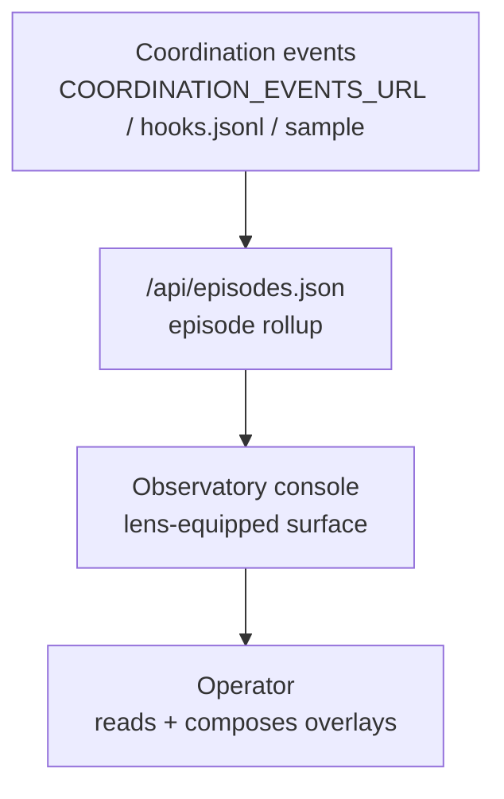

The Observatory is the operator-facing web surface where the platform's interpretations get explored. This page covers how it's wired and how to run it. For what it is and how to read it, see [The Observatory](/observatory/about/).

The cockpit lives in the docs site at `apps/docs-site/src/pages/observatory.astro`, live at [tapestry-khaki.vercel.app/observatory](https://tapestry-khaki.vercel.app/observatory).

## How it interacts with the platform

**Today**, the Observatory is a coordination-episode console. It reads a single endpoint — `/api/episodes.json` — which resolves its data in order: the `COORDINATION_EVENTS_URL` you set, else the local `~/.claude/logs/hooks.jsonl`, else a bundled sample snapshot. It rolls raw hook events into readable episodes.

**Designed** (not yet wired): the multi-lens console reading Memory, the Architecture Registry, and the Candidate Registry directly, with an operator approve/reject write-back to candidates. Those lenses are backed by the episode feed today, not live reads of Memory + the registries.

## Setup

You run your own. The cockpit deploys with the docs site on Vercel.

1. Fork `Lizo-RoadTown/tapestry` (the docs site lives at `apps/docs-site/`).
2. Set the data source in your Vercel project:
   - `COORDINATION_EVENTS_URL` — a URL serving coordination events (the episode feed's source). If unset, the console falls back to the local `hooks.jsonl` and then a bundled sample, so the page still renders.
3. Deploy to Vercel — `vercel deploy --prod`, or connect the repo for auto-deploys.

The console at `/observatory` then reads from `COORDINATION_EVENTS_URL`. See [Platform dependencies](/reference/platform-dependencies/) for the full Vercel setup.

## Verify

- **Console loads:** open `/observatory` — the page renders without errors and episode cards are visible (a bundled sample renders even with no data source set).
- **Your data is showing:** with `COORDINATION_EVENTS_URL` set, recent episodes from your event source should appear rather than the sample.
- **Drill-down works:** click an episode — its supporting hook events should be navigable.

## Troubleshoot

| Symptom | Likely cause | Where to look |
|---|---|---|
| Page loads but cards empty | No event source and the sample failed to load | Set `COORDINATION_EVENTS_URL`; the console falls back to a bundled sample otherwise |
| Only the sample / old episodes show | `COORDINATION_EVENTS_URL` unset or stale | Vercel dashboard → project → Settings → Environment Variables → set `COORDINATION_EVENTS_URL` |
| Episodes look empty of signal | The upstream event source has no recent hook events | Confirm telemetry is flowing (see [Telemetry](/systems/telemetry/)) into whatever `COORDINATION_EVENTS_URL` serves |
| Build fails in Vercel | Missing env vars during build | Vercel build logs; set required vars; redeploy |

## Related

- [The Observatory](/observatory/about/) — what it is and how to read it.
- [Memory](/systems/memory/), [Registry](/systems/registry/), [Observer](/systems/observer/) — the systems the console surfaces (via the episode feed today; directly as designed).
- [Platform dependencies — Vercel](/reference/platform-dependencies/) — the external service setup.
