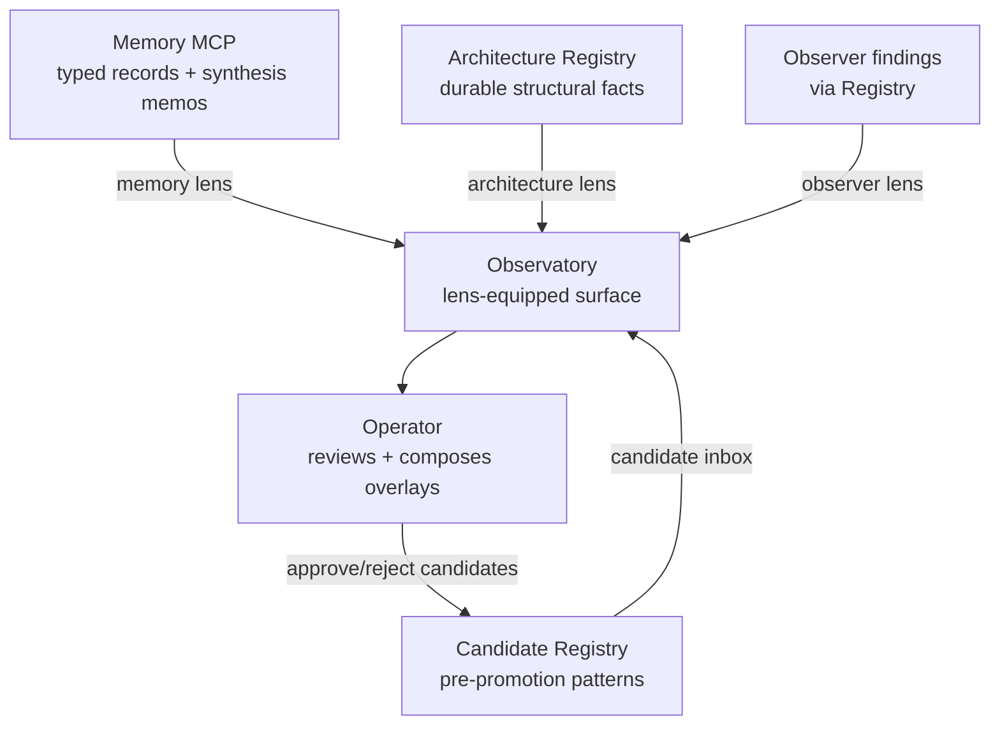

The Observatory is the surface. Operators encounter the platform's interpretations here — through lenses that foreground different dimensions of the same underlying patterns.

## What it is

A platform-level web surface with two parts today:

- **The cockpit** — `apps/docs-site/src/pages/observatory.astro` + `apps/docs-site/src/lib/observatory.ts`. Interactive variable-overlay view of recent candidates + memory writes + architecture diffs. Live at [tapestry-khaki.vercel.app/observatory](https://tapestry-khaki.vercel.app/observatory).
- **The Observatory docs section** — the docs pages under [`/observatory/`](/observatory/about/) explaining what the surface is, how to read it, and how to run it.

Forward path: more lenses (memory lens, architecture lens, coordination lens, observer lens, cross-project lens) will land as separate views inside the cockpit, composable as overlays. See [Observatory lenses](/explanation/observatory-lenses/) for the conceptual model.

The Observatory is distinct from Project Intelligence (per-project, local) and from the Observer (the interpretation runtime). See [Project Intelligence vs Observatory](/explanation/project-intelligence-vs-observatory/).

## Why it exists

Patterns need a surface for exploration. Without one, the Observer's findings live in the Registry but never reach the operator's eye; the platform's interpretations stay invisible; corrections and promotions can't happen.

The Observatory is also why Tapestry doesn't ship a single canonical dashboard. Different operator questions need different lens compositions — a single dashboard would force one axis on every question. The Observatory holds the lenses; operators choose which to compose.

## How it interacts with the platform

The Observatory reads from Memory, the Architecture Registry, and the Candidate Registry. It writes back when the operator approves or rejects candidates (the only direct write path). Every lens reads a different combination of those sources.

## Setup

**Consuming the existing deployment (default):** open [tapestry-khaki.vercel.app/observatory](https://tapestry-khaki.vercel.app/observatory). No install. The dashboard reads from the Registry + Memory; if your project's signals have reached the platform, the lenses populate automatically.

**Self-hosting the Observatory:**

1. Fork `Lizo-RoadTown/tapestry` (the docs site lives at `apps/docs-site/`).
2. Set env vars in your Vercel project:
   - `MEMORY_BASE_URL` — your Memory MCP deployment URL
   - `REGISTRY_BASE_URL` — your Registry deployment URL
   - `OBSERVATORY_AUTH_*` — if you want to gate access (optional; defaults to public read)
3. Deploy to Vercel — `vercel deploy --prod` or connect the repo for auto-deploys.
4. The cockpit at `/observatory` will start reading from your deployed Memory + Registry.

See [Platform dependencies](/reference/platform-dependencies/) for the full Vercel setup.

## Verify

- **Cockpit loads:** open `/observatory` — page renders without errors; cards visible.
- **Data is fresh:** look at the "last updated" timestamp on any card; should be within the last hour if signals are flowing.
- **Lenses populate:** the candidate inbox shows pending candidates (if the Observer has run); the memory card shows recent writes (if Memory is reachable); the architecture card shows recent diffs (if snapshots are running).
- **Drill-down works:** click any finding → the supporting evidence (memory rows, signal records, registry entries) should be navigable.

## Troubleshoot

| Symptom | Likely cause | Where to look |
|---|---|---|
| Page loads but cards empty | No upstream data — Observer hasn't run, or Registry empty | Check Observer + Registry status first; the Observatory is a read-only consumer |
| Memory lens empty but Memory works | `MEMORY_BASE_URL` env var unset in Vercel | Vercel dashboard → project → Settings → Environment Variables |
| Candidate inbox shows old candidates only | Observer cron stale | See [Observer troubleshoot](/systems/observer/#troubleshoot) |
| 401 / 403 on cockpit | Auth env vars set but operator not authenticated | Either authenticate, or unset auth vars to revert to public read |
| Build fails in Vercel | Missing env vars during build | Vercel build logs; set required vars; redeploy |
| Lens overlays not composing | Frontend rendering bug | Browser console; file an issue with the cockpit screenshot |

## Related

- [Observatory lenses](/explanation/observatory-lenses/) — the conceptual model for the lens surface
- [Project Intelligence vs Observatory](/explanation/project-intelligence-vs-observatory/) — where the Observatory sits relative to the per-project intelligence layer
- [The Observatory docs section](/observatory/about/) — Reading the Observatory, Run the Observatory, The Observatory feed
- [Memory](/systems/memory/), [Registry](/systems/registry/), [Observer](/systems/observer/) — the three sources every lens reads
- [Platform dependencies — Vercel](/reference/platform-dependencies/) — the external service setup
