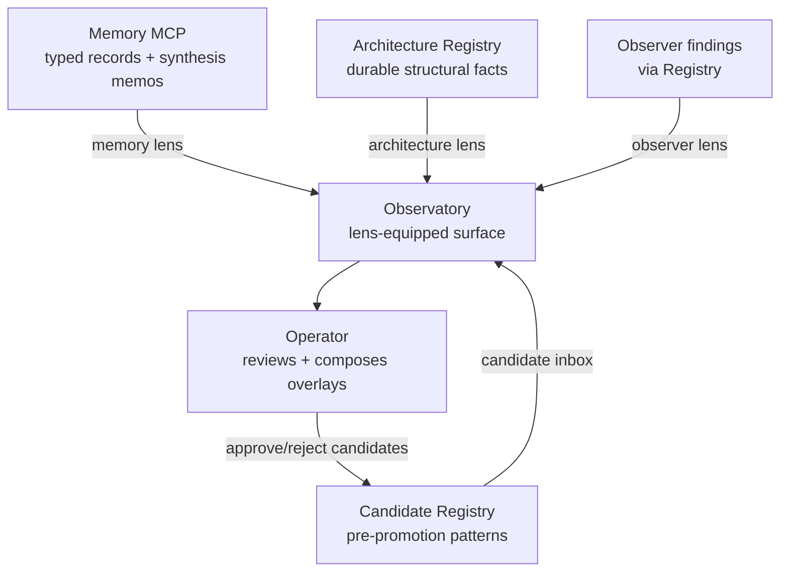

The Observatory is the operator-facing web surface where the platform's interpretations get explored. This page covers how it's wired and how to run it. For what it is and how to read it, see [The Observatory](/observatory/about/).

The cockpit lives in the docs site at `apps/docs-site/src/pages/observatory.astro`, live at [tapestry-khaki.vercel.app/observatory](https://tapestry-khaki.vercel.app/observatory).

## How it interacts with the platform

The Observatory reads from Memory, the Architecture Registry, and the Candidate Registry, and writes back only when the operator approves or rejects a candidate. Each lens reads a different combination of those sources.

## Setup

You run your own. The cockpit deploys with the docs site on Vercel.

1. Fork `Lizo-RoadTown/tapestry` (the docs site lives at `apps/docs-site/`).
2. Set env vars in your Vercel project:
   - `MEMORY_BASE_URL` — your Memory MCP deployment URL
   - `REGISTRY_BASE_URL` — your Registry deployment URL
   - `OBSERVATORY_AUTH_*` — optional; gate access (defaults to public read)
3. Deploy to Vercel — `vercel deploy --prod`, or connect the repo for auto-deploys.

The cockpit at `/observatory` then reads from your deployed Memory + Registry. See [Platform dependencies](/reference/platform-dependencies/) for the full Vercel setup.

## Verify

- **Cockpit loads:** open `/observatory` — the page renders without errors and cards are visible.
- **Data is fresh:** any card's "last updated" timestamp should be within the last hour if signals are flowing.
- **Lenses populate:** the candidate inbox shows pending candidates (if the Observer has run); the memory card shows recent writes (if Memory is reachable); the architecture card shows recent diffs (if snapshots are running).
- **Drill-down works:** click any finding — the supporting evidence (memory rows, signal records, registry entries) should be navigable.

## Troubleshoot

| Symptom | Likely cause | Where to look |
|---|---|---|
| Page loads but cards empty | No upstream data — Observer hasn't run, or Registry empty | Check Observer + Registry status first; the Observatory is a read-only consumer |
| Memory lens empty but Memory works | `MEMORY_BASE_URL` unset in Vercel | Vercel dashboard → project → Settings → Environment Variables |
| Candidate inbox shows old candidates only | Observer cron stale | [Observer troubleshoot](/systems/observer/#troubleshoot) |
| 401 / 403 on cockpit | Auth env vars set but operator not authenticated | Either authenticate, or unset auth vars to revert to public read |
| Build fails in Vercel | Missing env vars during build | Vercel build logs; set required vars; redeploy |

## Related

- [The Observatory](/observatory/about/) — what it is and how to read it.
- [Memory](/systems/memory/), [Registry](/systems/registry/), [Observer](/systems/observer/) — the sources every lens reads.
- [Platform dependencies — Vercel](/reference/platform-dependencies/) — the external service setup.
