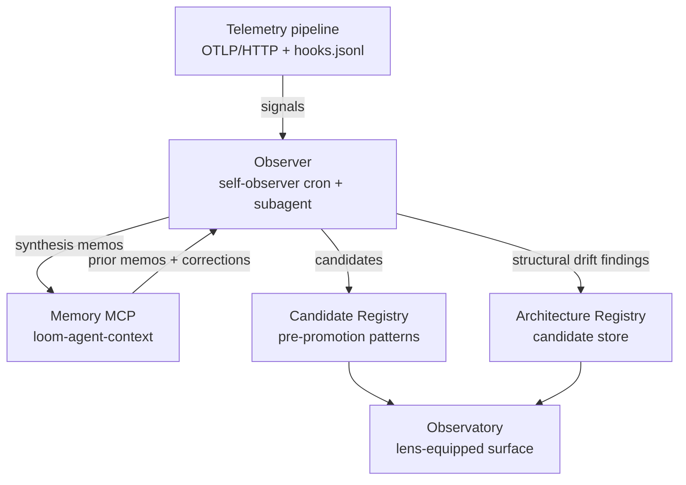

The Observer is the component that produces patterns from signals. Nothing else in Tapestry does interpretation; the Observer is the layer.

## What it is

A component with two runtime modes:

- **Scheduled cron** — runs every 6 hours, scans your repos for category drift, writes synthesis memos + candidate findings.
- **On-demand subagent** — invoked from a Claude Code session via `Agent({subagent_type: "tapestry-patterns:drift-watcher"})` or `tapestry-patterns:agentic-upskilling` to interpret a single project's recent activity.

Lives at `services/self-observer/` (Render cron `tapestry-self-observer-cron` — `autoDeploy:false`, so it runs only after the operator provisions its secrets and enables it).

## Why it exists

Telemetry produces signals. Signals are not patterns. Without a dedicated interpretation layer, every consumer would have to re-invent interpretation locally, and every interpretation would die with the session that ran it.

The Observer is also why intent is observer-derived rather than emitted as a telemetry field. Intent is one specific instance of what the Observer produces.

## How it interacts with the platform

The Observer reads from telemetry + memory and writes to the Architecture + Candidate registries plus back into memory (as synthesis memos). It does not call the Observatory directly — the Observatory reads the registries.

## Setup

The Observer is platform-level. You stand it up as part of your deployment; your projects consume its output.

**Consuming the existing deployment (default):** nothing to install. The Observer runs as the `tapestry-self-observer-cron` Render cron (operator-enabled). Patterns it produces show up in the Architecture + Candidate registries and surface in the Observatory.

**Self-hosting the Observer:**

1. Copy `services/self-observer/` into your Tapestry deployment.
2. Deploy as a Render cron — schedule from `render.yaml` (search for `tapestry-self-observer-cron`).
3. Required env vars (see `services/self-observer/config.py`):
   - `LOOM_MEMORY_URL` — points to your Memory MCP
   - `TAPESTRY_ARCHITECTURE_REGISTRY_URL` (or `LOOM_ARCHITECTURE_REGISTRY_URL`) — where it POSTs candidates
   - `TAPESTRY_REGISTRY_URL` — the project-registry, for fleet discovery
   - `TAPESTRY_PROJECT_ID` — the project row its own candidates file under
   - `OBSERVER_JWT` — Bearer to the Tapestry services (leave empty for self-host)
   - `GITHUB_TOKEN` — for scanning your (private) repos
4. The cron's signal-rule definitions live in `services/self-observer/signal_rules.py`; tune them to your project set.

See [Platform dependencies](/reference/platform-dependencies/) for the full Render + Grafana setup.

## Verify

- **The cron ran recently:** Render dashboard → `tapestry-self-observer-cron` → Logs → look for a `scan complete: ...` line within the last 6h.
- **The Observer is producing candidates:** query the registry — `curl https://your-registry-host.example.com/candidates?limit=5` should return recent entries with `source_path` set to `path_b` (evidence `kind: self_observation`).
- **Memory contains synthesis memos:** call `memory_recall` with the platform's standard observer tag (e.g., `["self-observer-synthesis"]`); recent memos should return.
- **The Observatory surfaces Observer findings:** open the Observatory console; the Observer lens should show non-zero findings if the cron has run.

## Troubleshoot

| Symptom | Likely cause | Where to look |
|---|---|---|
| Observatory cards look empty | Cron hasn't run since the last reset, or no signals to interpret | Render logs for `tapestry-self-observer-cron`; if cron is fine, check that telemetry is flowing (see [Telemetry](/systems/telemetry/)) |
| Candidates not appearing in registry | Cron is running but registry POST is failing | Check the `tapestry-self-observer-cron` stdout for HTTP errors against `TAPESTRY_ARCHITECTURE_REGISTRY_URL` |
| Synthesis memo missing | Memory MCP unreachable | See [Memory](/systems/memory/) troubleshoot table |
| On-demand subagent never returns | `liz-patterns` or `tapestry-patterns` plugin not installed | `/plugin list` in Claude Code; reinstall if missing |
| Cron firing but no findings | `signal_rules.py` thresholds too high for the project's signal volume | Lower the thresholds; re-run; check whether findings appear |

## Related

- [The observer (explanation)](/explanation/the-observer/) — the conceptual page
- [Memory](/systems/memory/), [Telemetry](/systems/telemetry/), [Registry](/systems/registry/), [Observatory](/systems/observatory/) — the components the Observer interacts with
