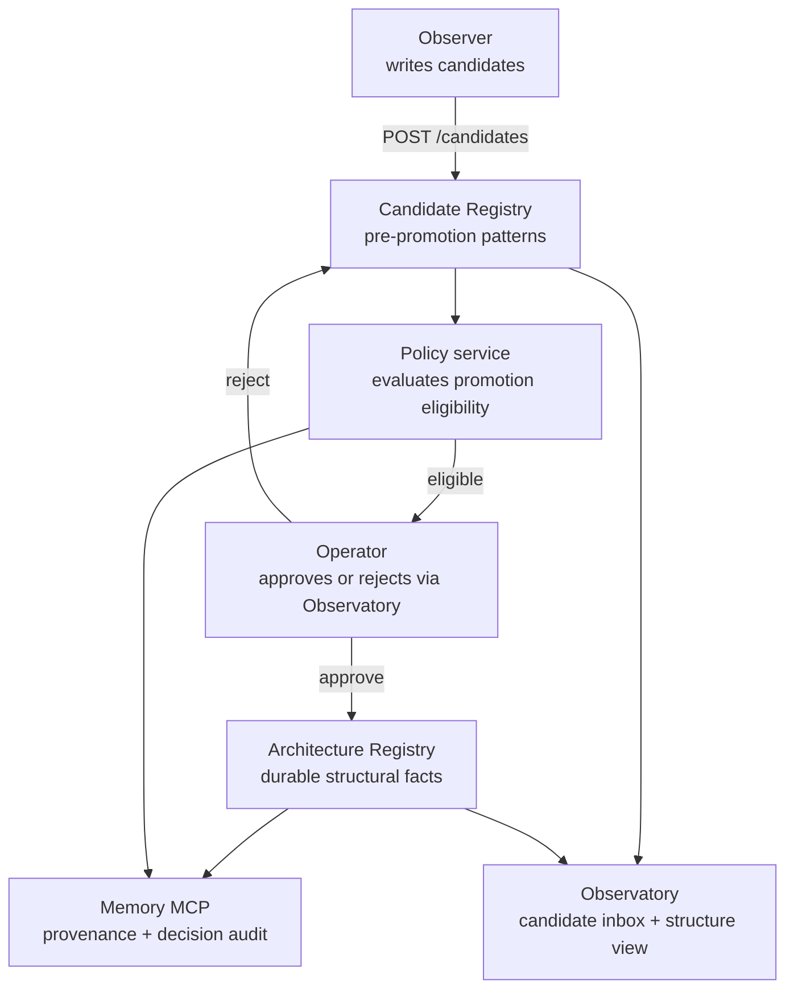

The Registry is where patterns live. Candidates first, structure after. Two services, one governance flow.

## What it is

Two services:

| Service | Purpose | Lives at |
|---|---|---|
| **Architecture Registry** | **Today:** the promotion-candidate store — accepts, persists, and transitions candidates, and auto-dispatches promoted `skill` candidates to the engine. **Designed:** the durable structural-fact store the platform treats as settled — promoted patterns, registered skills, structural drift as nodes/edges. | `services/architecture-registry/` (Render service `loom-architecture-registry`) |
| **Candidate Registry** | Patterns surfaced by the Observer that haven't been promoted yet. Includes recurrence count, supporting evidence, observer confidence. | Same service tree; same Postgres backend; separate tables |

The promotion flow — the platform's upskilling loop — goes: Observer writes a candidate → the registry holds it with reinforcement metadata → Policy records a decision → operator approves → the candidate advances, and a promoted `skill` candidate auto-dispatches to the engine to be compiled.

**Live today vs designed.** Observer → candidates → the registry is **live**. Promoted `skill` candidates are **code-wired** to dispatch to the engine (`main.py`), but the engine isn't deployed yet, so that leg isn't running end-to-end. The promotion **decision is manual-first** (Policy is soft/records-only). The durable structural-fact store (nodes/edges/decisions beyond skills) and demotion review are **designed, not built**.

## Why it exists

A pattern isn't immediately a fact. The Observer might have low confidence; the pattern might have appeared once and not recurred; the operator might disagree. Putting every observation directly into the structure store would either commit the platform to bad findings, or force the Observer to be over-cautious and lose subtle patterns.

Separating Candidate from Architecture solves this: the Observer can be eager (write every plausible pattern as a candidate), and only patterns that survive recurrence + policy + operator review become durable facts.

This is the structural backbone of how the platform upskills itself — the Candidate → Skill → Structure journey runs through the Registry.

## How it interacts with the platform

The Observer writes; the Policy service evaluates; the operator decides; the Architecture Registry stores. Memory records the audit trail. The Observatory exposes both sides through lenses.

## Setup

**Consuming the existing deployment (default):** nothing to install. Both Registry services run on Render. The Observer + Policy + Observatory talk to them automatically.

**Self-hosting the Registry:**

1. Copy `services/architecture-registry/` into your Tapestry deployment.
2. Provision a Render Postgres instance (can share with Memory's Postgres if you prefer one DB).
3. Deploy as a Render Web Service from `render.yaml` (search `architecture-registry`).
4. Required env vars:
   - `LOOM_DB_URL` — Render Postgres connection string (the shared `loom-postgres`)
   - `LOOM_SKILL_BRIDGE_SECRET` — HMAC shared secret for the engine bridge (see `bridge_hmac.py`)
   - `LOOM_JWT_PUBLIC_KEY` — hosted-multitenant JWT verification (hosted mode only)
   - `SELF_HOST_TENANT_ID` — the tenant self-host rows carry (else reads scope to the nil tenant)
5. Same service handles both Candidate and Architecture endpoints; no separate deployment.
6. Point the Observer's `TAPESTRY_ARCHITECTURE_REGISTRY_URL` env var at your deployment.

See [Platform dependencies](/reference/platform-dependencies/) for the full Render setup.

## Verify

- **Service is reachable:** `curl https://your-registry-host.example.com/health` returns 200.
- **Candidates are accumulating:** `curl https://your-registry-host.example.com/candidates?limit=5` returns recent entries; `created_at` within last 24h means the Observer is feeding it.
- **Promotions are landing:** query the Architecture Registry endpoint for entries with `promoted_at` set.
- **Operator can review:** open the Observatory candidate inbox; new candidates should appear with their supporting evidence.

## Troubleshoot

| Symptom | Likely cause | Where to look |
|---|---|---|
| Observatory candidate inbox empty | Observer not writing, or write failing | Check `tapestry-self-observer-cron` Render logs for POST errors; see [Observer troubleshoot](/systems/observer/#troubleshoot) |
| Candidates exist but never promote | Policy service rejecting, or operator hasn't reviewed | Query Candidate Registry with `?status=pending_review`; check Policy service logs |
| Architecture Registry diverges from expected facts | Manual writes bypassing Policy | Audit Memory for `architecture_registry_write` records without a matching `policy_decision` |
| Bridge to the engine failing | HMAC secret mismatch | Verify `LOOM_SKILL_BRIDGE_SECRET` matches between Tapestry's Registry and the skill engine |
| `503` from Render endpoint | Cold start | Wait 30-60s; if persistent, check Render dashboard for service health |
| Postgres connection timeouts | Connection pool exhausted | Check `loom-postgres` connection count in Render dashboard; scale up the pool in `storage.py` if needed |

## Related

- [Observer](/systems/observer/) — the primary writer
- [Observatory](/systems/observatory/) — where operators review candidates
- **The engine bridge** — the bidirectional contract with the skill engine. The Architecture Registry pushes promotion candidates; the engine pushes back registered-skill metadata + runtime telemetry. HMAC-signed via `LOOM_SKILL_BRIDGE_SECRET`; implementation lives in `services/architecture-registry/bridge_hmac.py` + `bridge_models.py`. A public docs page is planned but not yet written.
