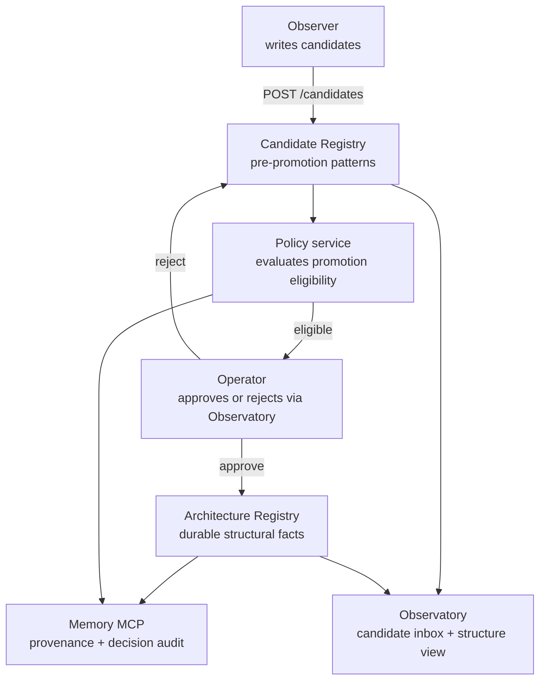

The Registry is where patterns live. Candidates first, structure after. Two services, one governance flow.

## What it is

Two services:

| Service | Purpose | Lives at |
|---|---|---|
| **Architecture Registry** | The durable structural facts the platform treats as settled — promoted patterns, registered skills, structural drift findings. | `the-loom/services/architecture-registry/` (Render service `loom-architecture-registry`) |
| **Candidate Registry** | Patterns surfaced by the Observer that haven't been promoted yet. Includes recurrence count, supporting evidence, observer confidence. | Same service tree; same Postgres backend; separate tables |

The promotion flow goes: Observer writes a candidate → Candidate Registry holds it with reinforcement metadata → Policy service evaluates → operator approves or rejects → on approval, candidate migrates to Architecture Registry as a durable fact.

## Why it exists

A pattern isn't immediately a fact. The Observer might have low confidence; the pattern might have appeared once and not recurred; the operator might disagree. Putting every observation directly into the structure store would either commit the platform to bad findings, or force the Observer to be over-cautious and lose subtle patterns.

Separating Candidate from Architecture solves this: the Observer can be eager (write every plausible pattern as a candidate), and only patterns that survive recurrence + policy + operator review become durable facts.

This is the structural backbone of [how the platform upskills itself](/explanation/upskilling/) — the Candidate → Skill → Structure journey runs through the Registry.

## How it interacts with the platform

The Observer writes; the Policy service evaluates; the operator decides; the Architecture Registry stores. Memory records the audit trail. The Observatory exposes both sides through lenses.

## Setup

**Consuming the existing deployment (default):** nothing to install. Both Registry services run on Render. The Observer + Policy + Observatory talk to them automatically.

**Self-hosting the Registry:**

1. Copy `the-loom/services/architecture-registry/` into your Tapestry deployment.
2. Provision a Render Postgres instance (can share with Memory's Postgres if you prefer one DB).
3. Deploy as a Render Web Service from `the-loom/infra/deploy/render.yaml` (search `loom-architecture-registry`).
4. Required env vars:
   - `DATABASE_URL` — Render Postgres connection string
   - `BRIDGE_HMAC_SECRET` — for the make-skills bridge (see `bridge_hmac.py`)
   - `MEMORY_BASE_URL` — to write audit memos
   - `OTEL_EXPORTER_OTLP_*` — for emitting registry runtime telemetry
5. Same service handles both Candidate and Architecture endpoints; no separate deployment.
6. Point the Observer's `CANDIDATE_REGISTRY_URL` + `ARCHITECTURE_REGISTRY_URL` env vars at your deployment.

See [Platform dependencies](/reference/platform-dependencies/) for the full Render setup.

## Verify

- **Service is reachable:** `curl https://loom-architecture-registry.onrender.com/health` returns 200.
- **Candidates are accumulating:** `curl https://loom-architecture-registry.onrender.com/candidates?limit=5` returns recent entries; `created_at` within last 24h means the Observer is feeding it.
- **Promotions are landing:** query the Architecture Registry endpoint for entries with `promoted_at` set.
- **Operator can review:** open the Observatory candidate inbox; new candidates should appear with their supporting evidence.

## Troubleshoot

| Symptom | Likely cause | Where to look |
|---|---|---|
| Observatory candidate inbox empty | Observer not writing, or write failing | Check `loom-self-observer` Render logs for POST errors; see [Observer troubleshoot](/systems/observer/#troubleshoot) |
| Candidates exist but never promote | Policy service rejecting, or operator hasn't reviewed | Query Candidate Registry with `?status=pending_review`; check Policy service logs |
| Architecture Registry diverges from expected facts | Manual writes bypassing Policy | Audit Memory for `architecture_registry_write` records without a matching `policy_decision` |
| Bridge to make-skills failing | HMAC secret mismatch | Verify `BRIDGE_HMAC_SECRET` matches between Tapestry's Registry and Make_Skills' engine |
| `503` from Render endpoint | Cold start | Wait 30-60s; if persistent, check Render dashboard for service health |
| Postgres connection timeouts | Connection pool exhausted | Check `loom-postgres` connection count in Render dashboard; scale up the pool in `storage.py` if needed |

## Related

- [How the platform upskills itself](/explanation/upskilling/) — the Candidate → Skill → Structure flow that runs through the Registry
- [Sharing intelligence across projects](/explanation/sharing-intelligence-across-projects/) — cross-project candidate recurrence
- [The signal hierarchy](/explanation/signal-hierarchy/) — Candidates and Skills are levels in the hierarchy
- [Observer](/systems/observer/) — the primary writer
- [Observatory](/systems/observatory/) — where operators review candidates
- **Make_Skills engine bridge** — the bidirectional contract with `Lizo-RoadTown/Make_Skills`. The Architecture Registry pushes promotion candidates; the engine pushes back registered-skill metadata + runtime telemetry. HMAC-signed via `BRIDGE_HMAC_SECRET`; implementation lives in `the-loom/services/architecture-registry/bridge_hmac.py` + `bridge_models.py`. A public docs page is planned but not yet written.
