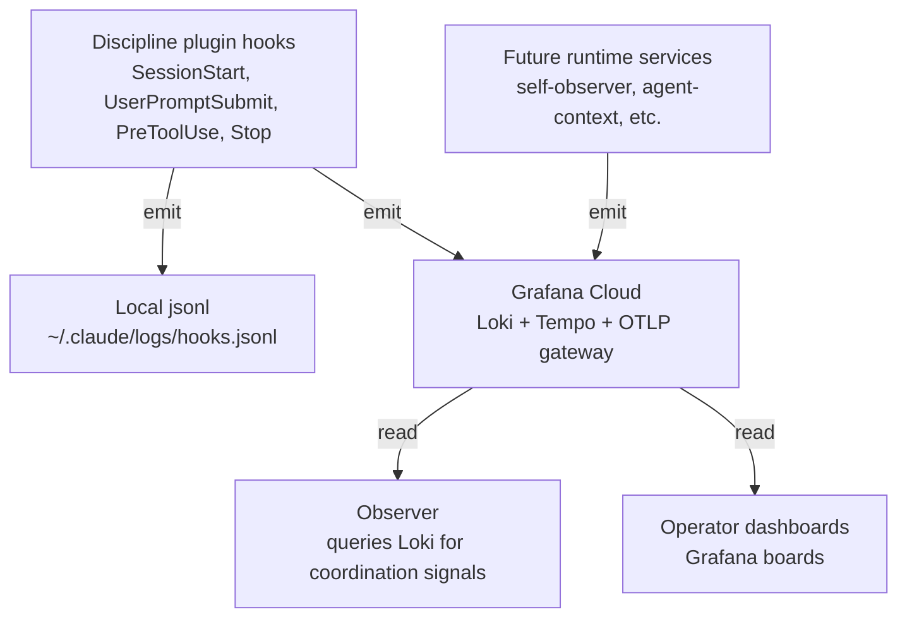

Telemetry is the transport that gets signals from where they're produced (your machine, the platform's services) to where they can be interpreted (the Observer) and explored (the Observatory).

## What it is

A pipeline with three parts:

- **Producers** — the `tapestry-discipline` plugin's hooks (`SessionStart`, `UserPromptSubmit`, `PreToolUse`, `Stop`) emit one OTLP/HTTP log per event. Future platform services emit too.
- **Transport** — OTLP/HTTP over the public internet to Grafana Cloud's OTLP gateway, plus a local-first append to `~/.claude/logs/hooks.jsonl` (source of truth — local writes succeed even if remote push fails).
- **Destination** — Grafana Cloud (Loki for logs, Tempo for traces). Read by the Observer for interpretation and by operators via dashboards.

The local-and-remote dual-write is by design: `hooks.jsonl` is always the source of truth, OTel is the cross-machine extension.

## Why it exists

Without a transport, every signal stays where it was produced. The Observer can't read across machines; operators can't see what's happening on other operators' projects; cross-project pattern recognition is impossible.

OTel was chosen as the canonical transport for two reasons:
1. It's the standard the rest of the observability ecosystem speaks (Grafana, Datadog, Honeycomb, etc.) — substitutable backends.
2. The typed-attribute contract ([OTel coordination contract](/reference/otel-coordination-contract/)) means signals carry their semantic structure with them, not just bytes.

This is the upstream of Signal → Interpretation → Pattern — telemetry is what produces the *signal*; everything downstream is interpretation.

## How it interacts with the platform



The hooks dual-write: local always, remote when env vars are set. Other platform services emit OTel from their own runtime. The Observer reads Grafana for cross-machine pattern recognition; operators read dashboards.

## Setup

**Consuming the existing pipeline (default):** set your OTel credentials. Add to your project's `.env`:

```sh
OTEL_EXPORTER_OTLP_ENDPOINT=<gateway URL>
OTEL_EXPORTER_OTLP_HEADERS=Authorization=Basic%20<base64(instance_id:token)>
OTEL_EXPORTER_OTLP_PROTOCOL=http/protobuf
OTEL_RESOURCE_ATTRIBUTES=service.namespace=loom,deployment.environment=dev
OTEL_SERVICE_NAME=tapestry-discipline
```

Without these, the discipline plugin still works — local `hooks.jsonl` writes are unconditional. Only the cross-machine extension is missing.

**Self-hosting Telemetry:**

1. Sign up for [Grafana Cloud Free tier](https://grafana.com/auth/sign-up/create-user) — 10K series of metrics, 50 GB logs, 50 GB traces.
2. Create an Access Policy with `logs:write` and `traces:write` scopes; copy the token.
3. Get your OTLP endpoint URL from Grafana Cloud → Connections → Add new connection → OpenTelemetry (OTLP).
4. Distribute the endpoint + token to operators (each puts them in their own `.env`).
5. (Optional) Stand up a self-hosted LGTM stack instead if you want to avoid Grafana Cloud entirely — the OTel emission code doesn't change; only the endpoint URL changes.

See [Platform dependencies](/reference/platform-dependencies/) for the full Grafana setup.

## Verify

- **Local jsonl is writing:** trigger any tool call in Claude Code, then check `~/.claude/logs/hooks.jsonl` for a new line.
- **OTel emission is succeeding:** in Grafana Cloud → Explore → Loki → query `{service_name="tapestry-discipline"}` → recent entries should appear within seconds.
- **No silent failures:** check `~/.claude/logs/hook-otel-errors.log` — empty file (or absent) means OTel pushes are succeeding.
- **Typed attributes are correct:** an emitted record should contain the typed fields from the [OTel coordination contract](/reference/otel-coordination-contract/) (e.g., `tapestry.coordination_context_id`, `tapestry.actor.role`).

## Troubleshoot

| Symptom | Likely cause | Where to look |
|---|---|---|
| `hooks.jsonl` has entries, Grafana doesn't | OTel env vars unset, or push failing | Check `~/.claude/logs/hook-otel-errors.log`; verify env vars present in shell that launched Claude Code |
| Grafana shows old entries but nothing recent | Hook scripts crashing silently | Run a hook script directly: `python integrations/claude-code/tapestry-discipline/scripts/session_start.py` and check stderr |
| `Authorization` header rejected | Token mismatch or quoting issue | Re-copy from Grafana Cloud → Access Policies; ensure `Basic%20` URL-encoding is preserved |
| Local jsonl missing | `CLAUDE_PROJECT_DIR` set but log dir doesn't exist | `mkdir -p ${CLAUDE_PROJECT_DIR}/.claude/logs` or unset the var to fall back to `~/.claude/logs/` |
| Signals reach Grafana but Observer doesn't see them | Observer's Grafana query path wrong | Check `the-loom/services/self-observer/telemetry_client.py` for the Loki query template |
| Cross-machine signals fail | Operator hasn't been given OTel credentials | Platform owner shares from Grafana Cloud → Access Policies |

## Related

- [OTel coordination contract](/reference/otel-coordination-contract/) — the typed-attribute schema
- [Load-bearing files — `OTEL_*`](/reference/load-bearing-files/) — the env-var contract
- [Observer](/systems/observer/) — the primary consumer of Telemetry signals
- [Platform dependencies — OTel + Grafana](/reference/platform-dependencies/) — the external service setup
