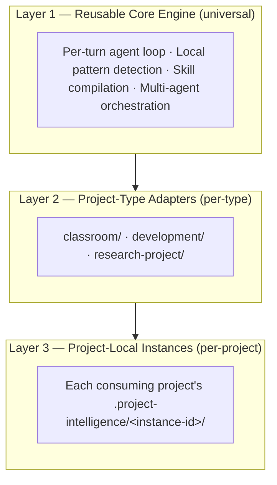
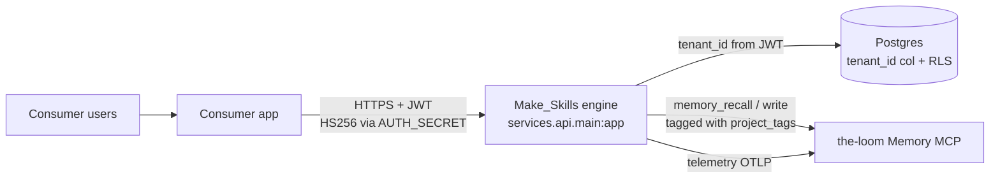

# Architecture — Make_Skills (the engine)

This document draws the **clean lines** between layers and modes inside the engine. Every change from 2026-04-28 onward MUST consider both modes (self-host and hosted-multitenant), with documentation and tests for both.

If you're a contributor: this is the map. If you're an agent: read this before structural changes.

The engine has no frontend. Frontends live in separate consumer repos (the first one is consuming application). See [`docs/proposals/make-skills-engine-vs-consumer-scope.md`](docs/proposals/make-skills-engine-vs-consumer-scope.md) for the engine/consumer boundary.

---

## The three-layer engine model

Per [`docs/proposals/2026-05-31-three-layer-engine-spec.md`](docs/proposals/2026-05-31-three-layer-engine-spec.md), the recursive skill engine is structured as three nested layers:



**Anchor:** *Make_Skills improves local agency and produces candidates. The-loom observes across projects, governs promotion, and stores durable structure.*

| Layer | Lives in | Purpose |
|---|---|---|
| **Reusable core engine** | `core/` (post-migration; today at `platform/api/`) | Pattern detection, candidate generation, runtime loop, skill compilation, orchestration. Project-type-agnostic. |
| **Project-type adapter** | [`adapters/<type>/`](adapters/) | Customizes the core for one CLASS of consuming projects (classroom-support-app, software-development, research-project) |
| **Project-local instance** | Each consuming project's `.project-intelligence/<instance-id>/` (NOT in this repo) | Local skill candidates, observed workflows, user preferences, promotion candidates |

The MVP migration plan (staged across 5 phases) is at [`docs/plans/2026-06-01-mvp-migration.md`](docs/plans/2026-06-01-mvp-migration.md). Today the core code lives at `platform/api/`; the target is `core/` + `adapters/` + `services/`.

---

## Two deployment modes (always supported, parallel)

### Self-host (single-tenant, default)

A user clones the engine repo, runs `docker compose up`, has a fully functional personal agent platform. No auth. No tenant boundaries. All data on their machine. Consumer UI is optional — they can hit the engine directly with curl/HTTP clients or run a consumer locally.

```text
[consumer app, optional]  -->  localhost:8001  -->  api.main:app (FastAPI)
                                                       |
                                                       v
                                                    postgres (Docker)
```

The old LanceDB memory MCP is being deprecated; the-loom's pgvector memory MCP at `https://loom-agent-context.onrender.com/mcp/memory/` is its replacement. See [`docs/plans/2026-06-01-mvp-migration.md`](docs/plans/2026-06-01-mvp-migration.md) Phase 4.

### Hosted multi-tenant

The same engine code runs as a hosted service. A consumer application (typically deployed in front of the engine, e.g., on Vercel) sits in front with its own auth and identity. Each consumer-issued JWT carries a `tenant_id`; the engine verifies the JWT (`AUTH_SECRET` shared with the consumer) and scopes all queries by tenant.



**The same engine code runs both modes.** Mode is determined by env vars (`PLATFORM_MODE`) and auth presence, not by separate codepaths.

---

## Make_Skills' position in the wider platform

Make_Skills sits inside a multi-module platform alongside the-loom (cross-project intelligence + memory + observatory + governance):

```mermaid
flowchart LR
    subgraph LOOM["the-loom (platform — cross-project)"]
        L1[Memory MCP]
        L2[Project Registry]
        L3[Project Observatory]
        L4[Architecture Registry]
        L5[Policy / Promotion Governance]
    end

    subgraph MS["Make_Skills (this repo)"]
        M1[Core engine]
        M2[Adapters]
        M3[Skill catalog]
    end

    subgraph CONS["Consuming projects"]
        P1["Consumer A (classroom)"]
        P2["Consumer B (research)"]
        P3["Consumer C (...)"]
    end

    CONS -- "agent endpoint requests" --> MS
    MS -- "memory_recall/write<br/>telemetry/promotion candidates" --> LOOM
    LOOM -- "ratified structure" --> MS
    MS -- "compiled skills" --> CONS
```



| Make_Skills owns | The-loom owns |
|---|---|
| Local agency-pattern detection inside a project instance | Cross-project structure recognition |
| Skill candidate generation (Path A) | Platform-side candidate generation (Path B) + ratification of both |
| Skill compilation (markdown → CompiledSkill) | Durable structure persistence (catalog, ArchitectureNodes) |
| Per-turn runtime agent loop | Memory storage (`mcp__loom-memory__*`) |
| Multi-agent orchestration | Project Observatory + telemetry ingestion |
| Project-type adapters | Project Registry |

---

## Ownership tiers (orthogonal axis: data + identity isolation)

A different cut from the three-layer engine model above. This view is about WHO owns the data + WHO can change it.

### Tier 1: Engine code (always shared)

**What:** the agent runtime, the API, generic tools, the skill compilation pipeline.

**Lives in:** `core/` (post-migration; today `platform/api/`), `subagents/<name>/AGENTS.md` templates, `skills/_upstream/`.

**License:** Apache 2.0.

**Contribution rule:** PRs welcome. Must work in both deployment modes. Must include tests for both. Tenant-scoping is mandatory.

### Tier 2: Tenant identity & isolation (mode-dependent)

**What:** who's making this request, what data are they allowed to see.

**Self-host:** trivial. `tenant_id = "default"`. No auth code path executes.

**Hosted:** real auth. `tenant_id` comes from a verified JWT signed by the consumer. Storage queries inherit it via the `tenant_ctx_var` ContextVar.

### Tier 3: Tenant configuration (per-tenant, user-editable)

**What:** persona, subagents, model choices, skill allowlist.

**Self-host:** filesystem (`AGENTS.md`, `deepagents.toml`).

**Hosted:** per-tenant directory or Postgres. NOT git-tracked.

### Tier 4: Tenant data (per-tenant, isolated)

**What:** conversations, memory writes via the-loom MCP (tagged by `project_tags`), per-project state.

Memory storage now lives in the-loom (the LanceDB-in-Make_Skills predecessor is being deprecated). Conversation checkpoints still in Postgres locally.

### Tier 5: Publishable content (opt-in shared)

**What:** skills, agents, knowledge graph nodes the user explicitly chooses to share — flows through the-loom's Architecture Registry for ratification.

---

## Repo strategy

**The engine is its own repo** as of 2026-05-26 (PR #52). Consumer code lives in separate repos.

**Target shape (per the MVP migration plan):**

```text
Make_Skills/                       (this repo — the engine)
├── core/                          Layer 1 (target; today at platform/api/)
│   ├── runtime/
│   ├── skill_making/
│   ├── providers/
│   ├── orchestration/
│   ├── auth/
│   ├── db/
│   ├── tools/
│   └── observability/             (telemetry emission helpers — Project Observatory itself in the-loom)
│
├── adapters/                      Layer 2 (stubbed today)
│   ├── README.md                  Contract definition
│   ├── classroom/
│   ├── development/
│   └── research-project/
│
├── services/
│   ├── api/                       FastAPI entry (uvicorn target)
│   ├── skill_making/              Receives promotion candidates from the-loom
│   └── admin/                     Inspectors, dev tooling
│
├── skills/ + skills_private/      Methodology skill library (bundled)
├── subagents/                     Subagent definitions
├── chatgpt/, copilot/, vs_code/   Integrations for other AI clients
├── scripts/                       Engine tooling
├── deprecated/                    Old code retained for reference (LanceDB memory etc.)
├── docs/
│   ├── proposals/                 Architecture decisions
│   ├── plans/                     Time-bounded execution plans
│   ├── runbooks/                  Operational guides
│   └── test-runs/                 Friction-surface logs
├── AGENTS.md                      Default tenant config
├── deepagents.toml                Default tenant config
├── render.yaml                    Render Blueprint
└── platform/deploy/               Dockerfile + Render config (retained after migration)
```

**Today**: code at `platform/api/`; target shape lands across Phases 1-5 of the migration plan. Compatibility shims at every old import path during the transition.

Consumers (separate repos):

- consuming application — student-facing consumer
- consuming application (classroom example) — classroom hub (MVP at n=1)
- consuming application (research example) — research-heavy project

**Hard rule:** the engine doesn't import from any consumer. Consumers call the engine over HTTPS + MCP, never as a Python module.

---

## Two-mode discipline (every PR going forward)

### What "considers both modes" means

A PR is incomplete unless it answers:

1. **What changes for self-host?** Does the user need to update env vars, rebuild, run a migration?
2. **What changes for hosted-multitenant?** Same questions, plus: does it touch tenant scoping?
3. **Tests:** unit + integration tests covering both modes? At minimum: a test with `tenant_id = "default"` (self-host) and one with a synthetic non-default `tenant_id` (hosted).
4. **Docs:** does the doc explain both modes?

### Anti-patterns to reject in PRs

- Hardcoded paths or queries without tenant scoping
- "We'll add multi-tenancy later" — too late once data is being written
- Code that reads tenant config from a hardcoded filesystem path (must go through `config_loader`)
- Tests that only cover self-host mode

---

## Mode detection

```bash
PLATFORM_MODE=self_host    # or "hosted"
```

`platform/api/auth.py` reads this and selects the auth backend at startup. All tenant-aware code calls `_resolve_tenant()` / reads `tenant_ctx_var`.

---

## What's aligned + what's pending

### Aligned (shipped)

- ✓ Engine/consumer split (PR #52)
- ✓ Engine-only README + ARCHITECTURE.md (PR #53; this file revised again 2026-06-01)
- ✓ Skill-making bridge spec (PR #54) — wire contract with the-loom
- ✓ Three-layer engine spec proposal (PR #55) — module structure
- ✓ Adapter stub directories (PR #56) — `adapters/classroom`, `adapters/development`, `adapters/research-project`
- ✓ MVP migration plan (PR #57) — Phases 1-5 staged, Liz-ratified
- ✓ JWT contract documented and shipped (HS256 via `AUTH_SECRET`)
- ✓ `platform/api/` is one module, no cross-imports from consumers
- ✓ `render.yaml` deploys the engine independently

### Pending

- **Phase 1 of MVP migration** — scaffold empty `core/` + `services/` directories (zero-risk; ready to execute)
- **Phases 2-5 of MVP migration** — extract modules into `core/`, isolate skill-making, deprecate LanceDB memory, move runtime + main
- **Adapter implementations** — beyond the stubs, actual `manifest.json` + `watches.json` + `pattern-triggers.json` etc. (post-Phase-5)
- **`services/skill-making/` implementation** — receives promotion candidates from the-loom (per the bridge spec)
- **Tenant abstraction refinement** — auth.py + auth_bridge.py share logic that should consolidate
- **Config loader abstraction** — `FilesystemConfigLoader` (self-host) + `MultiTenantConfigLoader` (hosted)
- **Smoke-test consumer** — pre-Phase-5 gate per the migration plan (a real consumer's actual HTTP calls OR a minimal smoke-test script)

See [ROADMAP.md](ROADMAP.md) for the broader pillar-level view.
