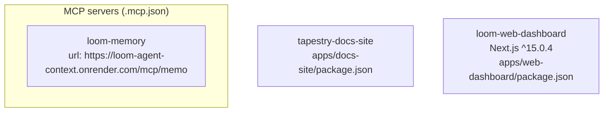

# Architecture snapshot — 2026-06-23T02:08:54.069651+00:00

**Git SHA:** `374c1013915a19c9dc0d46d4d5afa96bb59b2e88`
**Repo shape (auto-detected):** `mixed`
**Generated by:** canonical `architecture_snapshot.py` in `liz-patterns` plugin

Deterministic + shape-agnostic. For prose narrative and diagnosis, see the
matching `-narrative.md` (produced by the architecture-analyst agent).

## Diagram

## Node packages (2 package.json)

### `apps/docs-site/package.json` — tapestry-docs-site v0.1.0
- Scripts: `dev`, `build`, `preview`
- Total deps: 6, devDeps: 0

### `apps/web-dashboard/package.json` — loom-web-dashboard v0.0.1
- Scripts: `dev`, `build`, `start`, `lint`, `type-check`
- Total deps: 3, devDeps: 9
- Key pinned versions:
  - `next`: `^15.0.4`
  - `react`: `^19.0.0`
  - `react-dom`: `^19.0.0`
  - `tailwindcss`: `3.4.14`
  - `typescript`: `5.6.3`

## Python dependencies (6 manifests, 25 packages)

### `packages/auth/pyproject.toml` (pyproject.toml, 1 packages)

### `packages/cli/pyproject.toml` (pyproject.toml, 0 packages)

### `services/agent-context/requirements-test.txt` (requirements.txt, 4 packages)
- `asgi-lifespan >=2.1,<3`
- `httpx >=0.27,<1`
- `pytest >=8.0,<9`
- `pytest-asyncio >=0.24`

### `services/agent-context/requirements.txt` (requirements.txt, 8 packages)
- `fastapi ==0.115.4`
- `fastembed ==0.4.2`
- `mcp >=1.20,<2`
- `pgvector ==0.3.6`
- `psycopg-pool ==3.2.4`
- `psycopg[binary] ==3.2.3`
- `python-jose[cryptography] ==3.3.0`
- `uvicorn[standard] ==0.32.0`

### `services/project-registry/requirements.txt` (requirements.txt, 5 packages)
- `fastapi ==0.115.4`
- `psycopg-pool ==3.2.4`
- `psycopg[binary] ==3.2.3`
- `python-jose[cryptography] ==3.3.0`
- `uvicorn[standard] ==0.32.0`

### `services/skill-making/requirements.txt` (requirements.txt, 7 packages)
- `fastapi >=0.115`
- `httpx >=0.27`
- `langchain-core >=0.3`
- `psycopg-pool >=3.2`
- `psycopg[binary] >=3.2`
- `pydantic >=2`
- `uvicorn[standard] >=0.32`

## MCP servers (`.mcp.json`)

- `loom-memory` — url: `https://loom-agent-context.onrender.com/mcp/memory/`

## Top-level inventory

### Directories (depth-1)

| Directory | Files (depth 1) | Subdirs |
|---|---:|---:|
| `apps/` | 0 | 3 |
| `docs/` | 0 | 12 |
| `engine/` | 0 | 4 |
| `infra/` | 0 | 4 |
| `integrations/` | 0 | 6 |
| `packages/` | 0 | 6 |
| `scripts/` | 2 | 0 |
| `services/` | 0 | 9 |
| `templates/` | 1 | 4 |

### Notable root files

- `.mcp.json` (file)
- `.project-intelligence` (dir)
- `CLAUDE.md` (file)
- `README.md` (file)
