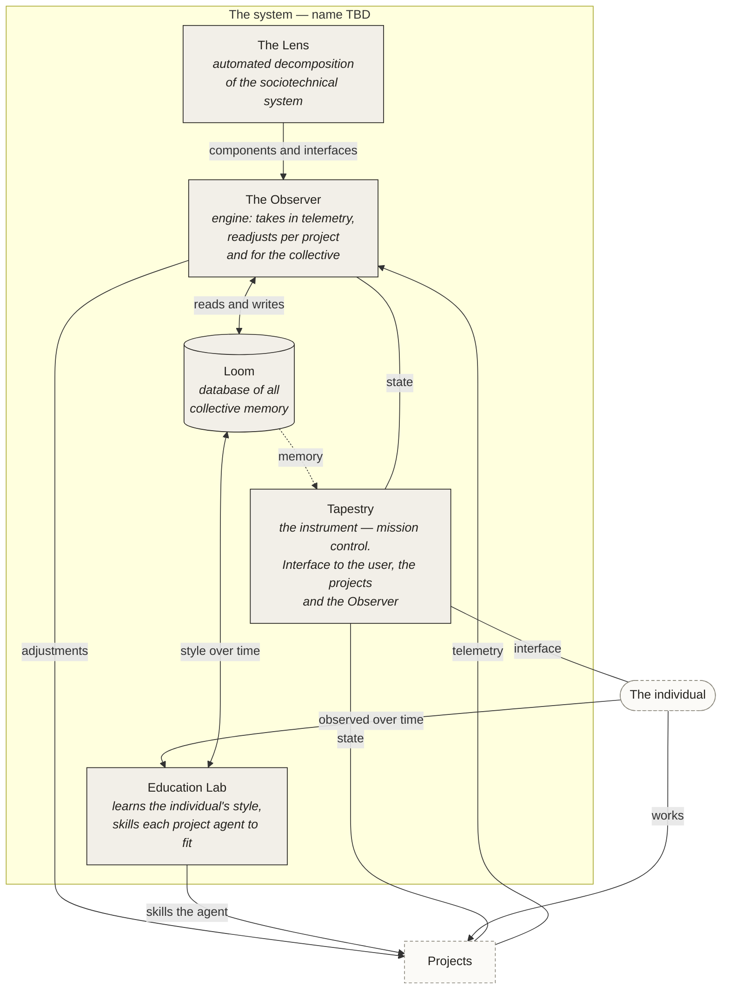
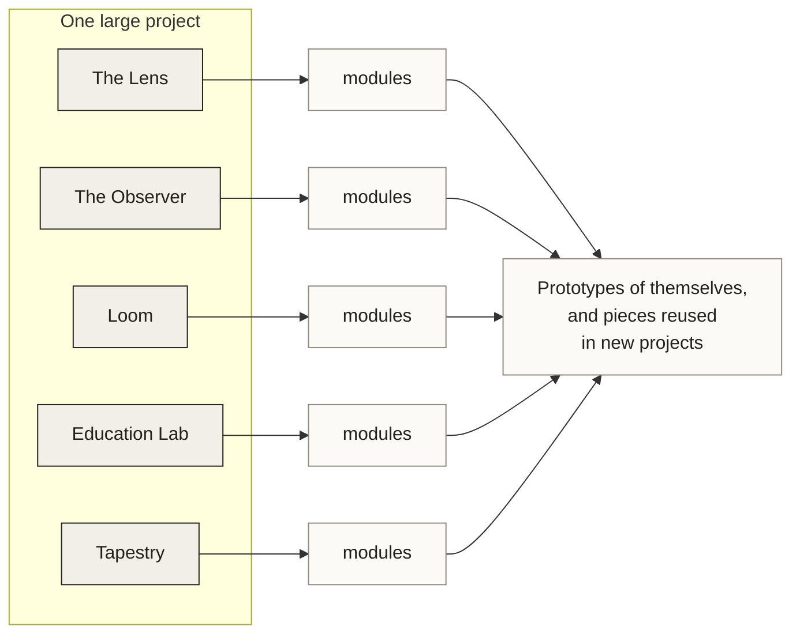

# The system — one project, five parts

**Author:** Liz Osborn
**Recorded:** 2026-10-10
**Status:** architecture stated; the name of the whole is open

---

## What this is

Five pieces that have been built and described separately are one system. This
document states what each part is, in Liz's own terms, and what holds them
together.

The system's name is **not yet decided**. Candidates are listed at the end.
Everywhere this document says *the system*, a name will replace it.

---

## The parts

### Loom — the memory

The database holding all the collective memory. Everything the system has
learned, across every project and every person, lives here. The other parts
read from it and write to it; none of them owns it.

### Tapestry — the instrument

The interface. Tapestry is where a person meets the system, and where the
projects and the Observer meet each other. **Mission control**: the surface
that makes the state of everything legible and operable from one place.

### The Observer — the engine

The engine at the back. It takes in all the telemetry and readjusts
accordingly — per project, and for the collective. The Observer is the part
that makes the system adaptive rather than merely instrumented: it does not
only record what happened, it changes what happens next.

### The Lens — the decomposition

Automated decomposition of the sociotechnical system. The Lens is what turns
an undifferentiated system into named components and the interfaces between
them, so the rest of the system has something structured to reason about.

### Education Lab — the personalisation

A module that collects information about an individual's style over time and
adjusts each project's agent to fit. It answers a question the other parts
cannot: *how should this project be skilled, for this person?* Skill is fitted
to the learner, not assumed.

---

## What holds them together

Each part produces something the next one needs.

- **The Lens** decomposes a system into components and interfaces.
- **The Observer** watches those components and adjusts to what it sees.
- **Loom** keeps what has been learned, for this project and across all of them.
- **Education Lab** reads the individual over time and tunes the agents to them.
- **Tapestry** is where all of it becomes visible and operable.

The through-line: *decompose, observe, remember, adapt, present.*

---

## The design rule: one project, many reusable pieces

The system is **one large project**. But every section continues to produce
**tiny modular pieces that can be prototyped on their own and reused in new
projects**.

This is a deliberate constraint, not an accident of how the work grew. It means:

- A part is not finished when it works inside the system. It is finished when a
  piece of it can be lifted out and used somewhere else.
- Each section should be able to build prototypes *of itself* from its own
  modules — the pieces compose back into the thing they came from.
- Reuse is the test of whether a boundary was drawn in the right place. A module
  nobody can reuse is a sign the decomposition was wrong.

That last point connects the rule back to the method: the system is built the
way the Lens says systems should be read.

---

## Diagram

---

## Modularity, drawn

---

## Naming

Repository names and display names are deliberately separate. The repos stay as
they are; the system presents the parts under the names above.

| Repo | Presented as |
| --- | --- |
| `tapestry` | Tapestry |
| `lens-core` | The Lens |
| `education-lab` | Onboarding Assessment Lab / Education Lab |
| *(loom)* | Loom |
| *(observer)* | The Observer |

**The whole system still needs a name.** Candidates, with the reasoning:

- **Warp** — in weaving, the warp is the set of threads held in tension on the
  loom, through which everything else is woven. It literally means *the
  structural substrate everything is built across*. It extends Loom and
  Tapestry without clashing, and it is short.
- **The Weave** — names the whole fabric rather than one thread. Holds Loom and
  Tapestry naturally; slightly softer than Warp.
- **Loomworks** — plainest, most product-like, least metaphorical.

Open question for Liz. Nothing in this document depends on which is chosen.
