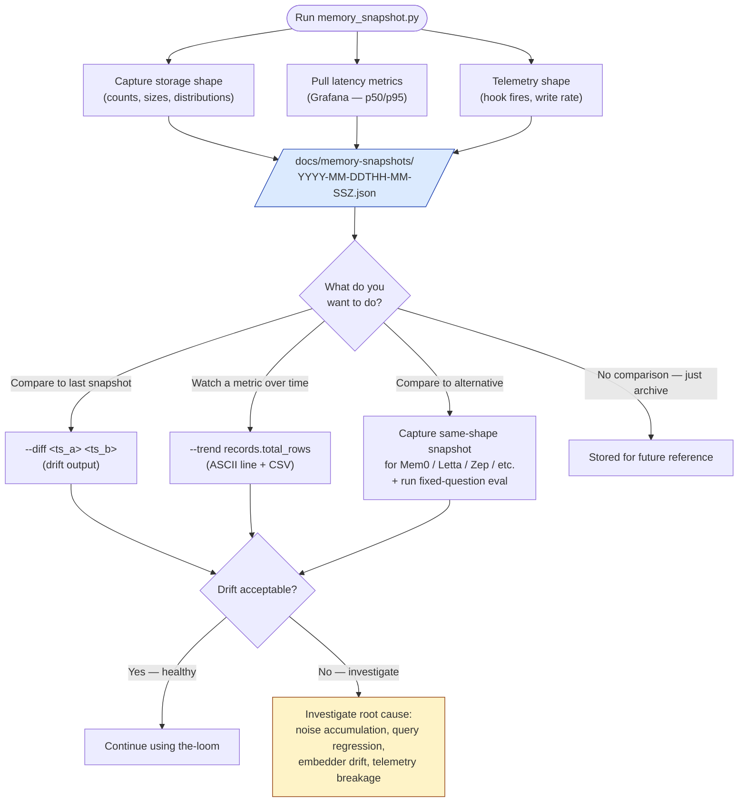

# Assessment protocol — measuring the-loom over time

**Audience:** Liz, future agents.
**Purpose:** Capture functionality + efficiency at intervals so the-loom can be compared against itself over time and against external alternatives.
**Companion docs:** [database-shape-and-layers.md](database-shape-and-layers.md), [how-agents-use-memory.md](how-agents-use-memory.md).

## What this doc is

The two questions this answers:

1. **Is it working?** (functionality)
2. **Is it efficient — and is it getting more or less efficient over time?** (efficiency)

The mechanism: a snapshot script (`scripts/memory_snapshot.py`) that you can run at any time, on any schedule, and which writes a JSON file to `docs/memory-snapshots/<timestamp>.json`. Snapshots are append-only. Diffs between snapshots show drift. Comparison to external alternatives is a manual exercise but the same snapshot format makes it tractable.

## The assessment loop



The snapshot is the artifact that makes assessment *possible*. Without it you have no t=0 to compare against, no quantified drift, no shared format for alternative-system comparison.

## What to capture

### Storage shape (cheap, capture every snapshot)

| Metric | Source | Why it matters |
|---|---|---|
| Total `records` rows | `SELECT count(*) FROM records` | Growth rate over time. Sudden jumps = bulk write events to investigate. |
| Rows by `type` | `SELECT type, count(*) FROM records GROUP BY type` | Are you writing more feedback than lessons? More episodic than long-term? |
| Rows by `actor` | `SELECT actor, count(*) FROM records GROUP BY actor` | Which agent kinds are contributing? Liz alone, or other agents too? |
| Rows by `visibility` | `SELECT visibility, count(*) FROM records GROUP BY visibility` | How many are soft-deleted? Public vs private split? |
| Rows by month | `SELECT to_char(to_timestamp(ts), 'YYYY-MM') AS month, count(*) FROM records GROUP BY month` | Activity over time. |
| Project tag distribution | `SELECT unnest(project_tags) AS tag, count(*) FROM records GROUP BY tag` | Cross-project memory share. |
| Total `projects` rows | `SELECT count(*) FROM projects` | Onboarding rate. |
| Project kinds | `SELECT kind, count(*) FROM projects GROUP BY kind` | dev / paused / archived ratio. |
| `records` table size on disk | `SELECT pg_size_pretty(pg_relation_size('records'))` | Storage growth. |
| Vector index size | `SELECT pg_size_pretty(pg_relation_size('records_vector_hnsw_idx'))` | HNSW overhead. |
| Total DB size | `SELECT pg_size_pretty(pg_database_size(current_database()))` | Are we near the Render plan limit? |

### Quality (manual, capture monthly or after material change)

The harder question. Two methods, run them on the same fixed eval set so you can compare over time:

**Method 1 — Fixed-question recall hit rate.** Maintain a list of ~20 questions you ask the-loom often (e.g. "what's my testing preference?", "what's the bridge spec between Make_Skills and the-loom?", "how does RLS work in the records table?"). For each question, run `memory_recall(context=question, n=5)` and score:

- **Hit** — at least one of the top-5 is genuinely the right memory
- **Miss** — none of the top-5 are right but one exists in the store
- **Absent** — there's no memory that should match (you've never written it)

Track hit rate per snapshot. If it drops, either memories are accumulating noise or the embedder needs tuning.

**Method 2 — Sample audit.** Pull 10 random recently-surfaced memories from your auto-recall log and score: was this actually relevant to what came next in the session? This is the "did the hook help me?" measure.

### Latency (cheap, capture every snapshot)

| Metric | How |
|---|---|
| `/v1/recall` p50/p95 | Grafana Loki query on the `loom-agent-context` service. The snapshot script can fetch + cache the last-24h values via the Grafana HTTP API. |
| `memory_recall` MCP tool p50/p95 | Same source. |
| `memory_write` p50/p95 | Same source. |
| SessionStart hook total elapsed | Hook emits `elapsed_ms` in its log_event call. Available in Loki. |

Latency only matters relative to itself. If p95 doubles after a change, investigate. Absolute numbers depend on Render's cold-start state, which is noisy.

### Telemetry shape (cheap, capture every snapshot)

| Metric | Source | Why it matters |
|---|---|---|
| SessionStart fires per day | Grafana Loki — `event=SessionStart action=snapshot_emitted` | How often is the-loom active? |
| MCP tool calls per day | Grafana Loki — `service=loom-agent-context endpoint=mcp` | Recall vs write ratio. |
| Hook errors per day | Grafana Loki — `level=error component=hook` | Did something break silently? |
| `/v1/recall` 5xx rate | Loki | Service health. |

## The snapshot script

`scripts/memory_snapshot.py` — pure stdlib + psycopg, no extra deps beyond what's in requirements. Run:

```powershell
# Reads LOOM_DB_URL from .env in the repo root
& "C:/Users/Liz/anaconda3/python.exe" scripts/memory_snapshot.py
```

Writes a single JSON file: `docs/memory-snapshots/<UTC-timestamp>.json`.

### What the JSON contains

```json
{
  "schema_version": 1,
  "captured_at_iso": "2026-06-01T19:23:08Z",
  "captured_at_epoch": 1748808188.0,
  "host": "loom-postgres-internal-or-external",
  "db_name": "loom",
  "tables": {
    "records": {
      "total_rows": 47,
      "by_type": {"feedback": 14, "project": 18, "lesson": 5, ...},
      "by_actor": {"claude-code": 30, "unknown": 17, ...},
      "by_visibility": {"private": 47, "public": 0, "deleted": 0},
      "by_month": {"2026-05": 32, "2026-06": 15},
      "table_size_bytes": 1572864,
      "index_sizes_bytes": {"records_vector_hnsw_idx": 524288, ...}
    },
    "projects": {
      "total_rows": 8,
      "by_kind": {"dev": 6, "paused": 1, "archived": 1}
    },
    "repos": {"total_rows": 8},
    "machines": {"total_rows": 3}
  },
  "project_tag_distribution": {"the-loom": 22, "make-skills": 14, ...},
  "db_size_bytes": 12582912,
  "notes": "free-form: anything material that happened since last snapshot"
}
```

### Snapshots are append-only

Never edit a past snapshot. They're the historical record. The script writes a fresh file with a timestamped name; nothing gets overwritten.

## Comparing snapshots

Two ways:

### Diff between two snapshots

```powershell
& "C:/Users/Liz/anaconda3/python.exe" scripts/memory_snapshot.py --diff 2026-05-15T12-00-00Z 2026-06-01T19-23-08Z
```

Prints a side-by-side diff to stdout: row count deltas, type distribution shifts, size growth. Useful for "what happened this month?" reviews.

### Trend over the full snapshot history

Read every JSON in `docs/memory-snapshots/`, sort by timestamp, plot any metric over time. The script has a `--trend <metric>` mode that prints a simple ASCII trend line for terminal viewing, plus dumps the time series as CSV for spreadsheet/Grafana ingestion.

```powershell
& "C:/Users/Liz/anaconda3/python.exe" scripts/memory_snapshot.py --trend records.total_rows
```

## Comparing to alternatives

When you want to know "is the-loom doing the right thing, or would another memory system be better?", run the same evaluation against the alternative. Capture the result in a snapshot-shaped file at `docs/memory-snapshots/comparisons/<alt-name>-<date>.json` and note in the top-level `notes` field which alternative it represents.

Candidate alternatives worth comparing periodically:

| Alternative | What it does | Why compare |
|---|---|---|
| **Mem0** (mem0.ai) | Managed memory layer with auto-extraction from conversation | Different write model (auto vs explicit). Would friction-as-memory still work, or does auto-extraction miss the WHY? |
| **Letta** (letta.com, formerly MemGPT) | Memory-aware agent runtime with hierarchical memory (recall vs core) | Different retrieval model. Does the hierarchical approach beat single-tier semantic search at scale? |
| **LanceDB on disk** | What Make_Skills originally used | Latency comparison (local file vs Postgres roundtrip). Has the migration cost us speed? |
| **Cognee** | Graph-based knowledge layer | Different storage model entirely. Are relationships between memories ("X supersedes Y") more useful than tag-based filtering? |
| **Zep** | Long-term memory with built-in temporal awareness | Built-in decay model. Does the-loom's `ts_last_accessed` column need a real decay algorithm wired? |

Comparison axes (use the same eval set):

1. **Recall quality on fixed-question set** (hit rate)
2. **Latency p50/p95** for recall + write
3. **Storage cost** for equivalent data volume
4. **Operational complexity** — how many things to keep running
5. **Lock-in cost** — what's the migration story away from it
6. **The WHY field** — does the alternative preserve user-intent context the way the-loom's `why` column does?

These are subjective. Capture your judgment in the snapshot `notes` field; the file becomes the record of what you thought when.

## Suggested cadence

| Cadence | What |
|---|---|
| **Every session start (automatic)** | The architecture snapshot fires via SessionStart hook. Already happening. |
| **Weekly** | Run `scripts/memory_snapshot.py` (storage shape + counts). Cheap, no eval. |
| **Monthly** | Run the fixed-question recall hit rate (Method 1 above). Note hit rate trend. |
| **Quarterly** | Sample audit (Method 2) + an alternative comparison if anything notable has shifted in the memory-layer landscape. |
| **After material change** | Whenever the schema, embedding model, or retrieval logic changes: snapshot before + after. Make the comparison the PR's verification artifact. |

## What "good" looks like

Healthy signals:

- `records.total_rows` grows linearly with use, not exponentially (would indicate write-without-thought)
- Feedback memories accumulate at a steady rate (corrections being captured)
- Hit rate on fixed-question set stays ≥ 80% as the store grows
- `/v1/recall` p95 stays under 1.5s
- Hook error rate near zero

Warning signals:

- `by_type.feedback` drops to zero for a month (am I capturing friction or skipping it?)
- HNSW index size grows much faster than table size (would indicate dimension drift or bloat)
- Hit rate drops below 70% (noise accumulating, or store needs curation)
- p95 latency doubles without infrastructure change (query regression)
- One project's `project_tags` count dwarfs all others when work is spread across projects (forgetting to tag)

## Mental model

- **Snapshots are like git tags for the memory store.** They mark a point in time you can come back to.
- **Counts answer "is it growing right?"; latency answers "is it fast enough?"; hit rate answers "is it useful?".** Watch all three.
- **External comparisons are most valuable after a material change you've made.** Don't compare for sport — compare when you've changed something and want to know if the change paid off.
- **The `notes` field is a journal.** Use it. Future-you reading the snapshot needs to know what was happening in the world that month.
