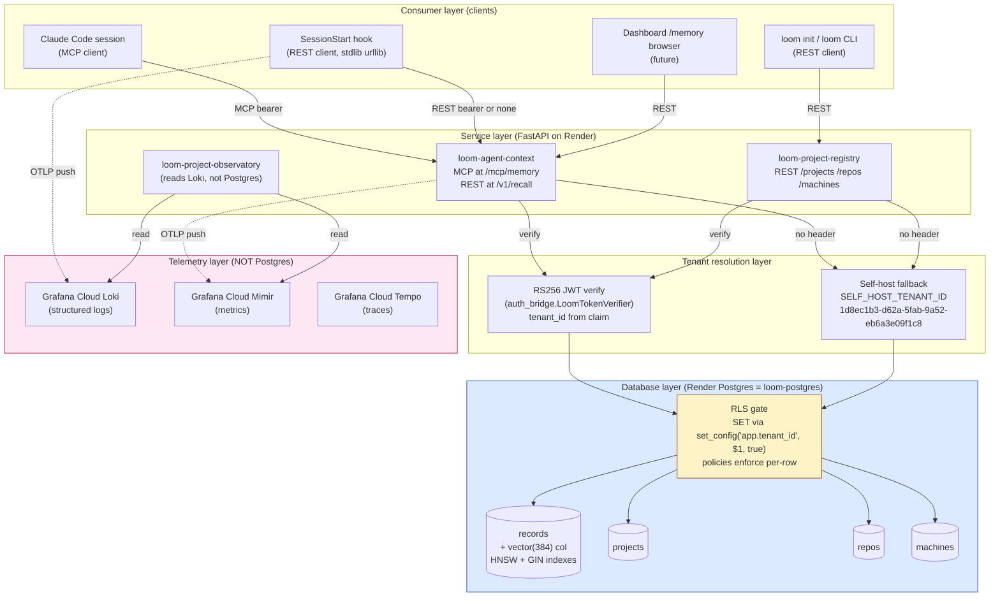
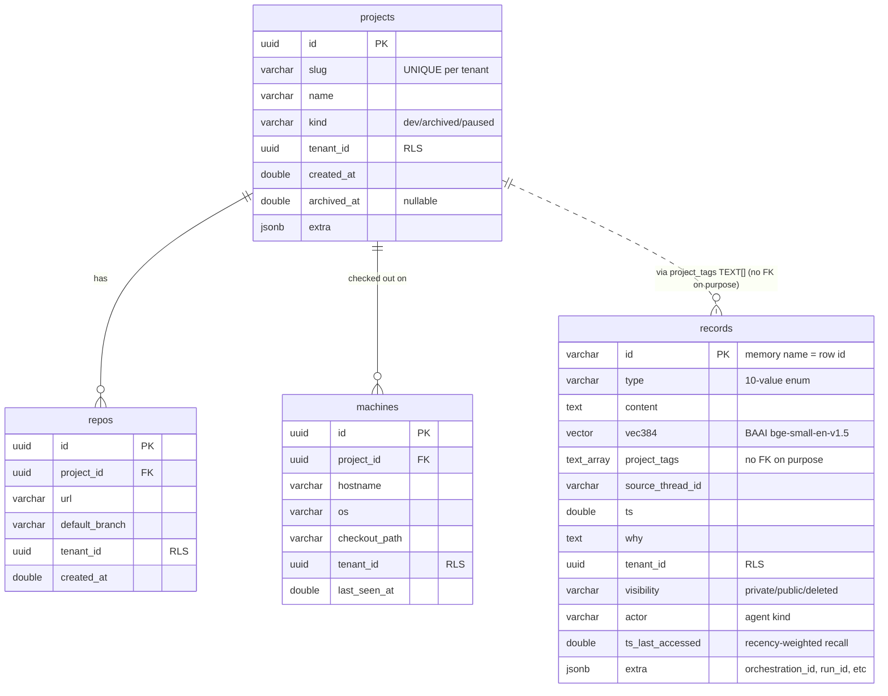
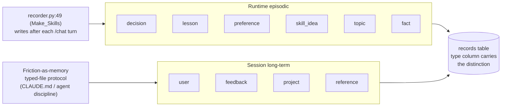
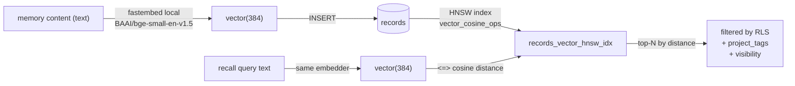
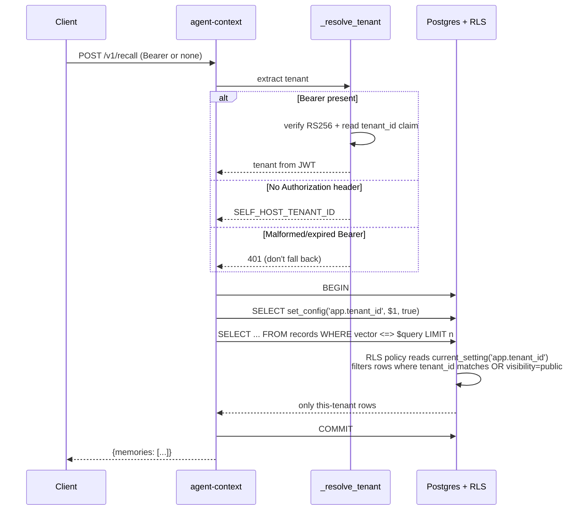

# Database — shape, layers, reasoning

**Audience:** Liz, future agents picking up this repo.
**Status:** Living doc. Updated when schema or layering changes.
**Last verified against code:** 2026-06-01.

## What this doc is

The single source of truth for **what the database is**, **how it's structured**, **why it's structured that way**, and **how requests flow through it**. Companion docs:

- [how-agents-use-memory.md](how-agents-use-memory.md) — the agent-side process (what I and other agents actually do)
- [assessment-protocol.md](assessment-protocol.md) — how to measure functionality + efficiency over time

## ELI5

One Postgres database (`loom-postgres`, hosted on Render) backs every service in the-loom that needs durable state. Each service owns specific tables and never reads tables it doesn't own. A database-level safety policy (Row-Level Security) prevents any tenant's data from leaking into another tenant's queries even if the service code has a bug. Memory entries get a 384-number meaning-fingerprint (a vector embedding) so we can search by meaning, not just keywords. Telemetry (hook fires, tool calls, latencies) does NOT live in Postgres — it streams to Grafana Cloud via OpenTelemetry. Postgres is for things that need transactional integrity + cross-session recall; Grafana is for things that are high-volume and time-series.

## Quick reference — what lives where

### Tables that exist today

| Table | Owned by | Purpose | Migration | Vector? |
|---|---|---|---|---|
| `records` | Agent Context Service | Cross-project memory entries (the things you `/remember`) | [001](../../infra/migrations/001_init_memory.sql) | yes (384-dim) |
| `projects` | Project Registry | Top-level project rows (slug, name, kind) | [002](../../infra/migrations/002_init_projects.sql) | no |
| `repos` | Project Registry | Git repos belonging to a project (FK → projects) | [002](../../infra/migrations/002_init_projects.sql) | no |
| `machines` | Project Registry | Machines where a project is checked out (FK → projects) | [002](../../infra/migrations/002_init_projects.sql) | no |

### Tables planned (not yet built)

| Table | Owning service | When | Purpose |
|---|---|---|---|
| `audit_events` | Audit Log | Phase 4 | Postgres mirror of the Loki audit stream (durable replay) |
| `architecture_nodes` / `_edges` | Architecture Registry | V2.x | Recognized modules + relationships per project |
| `decisions` / `observations` / `tasks` | Architecture Registry | V2.x | Decisions made, patterns observed, work to do |

### What does NOT live in Postgres

| Data | Lives where | Why |
|---|---|---|
| TelemetryEvents (hook fires, tool calls) | Grafana Cloud Loki + Mimir | Too high-volume for Postgres; time-series tools are purpose-built |
| Traces | Grafana Cloud Tempo | Same; structured for span/parent queries |
| Profiles (future) | Grafana Cloud Pyroscope | Same |

Source of authority: [docs/proposals/2026-05-25-platform-data-model.md](../proposals/2026-05-25-platform-data-model.md).

## Layer diagram



**The five layers:**

1. **Consumer layer** — anything that calls the platform: a Claude Code session via MCP, the SessionStart hook via REST, the future dashboard, the `loom init` CLI.
2. **Service layer** — FastAPI services on Render. One service per bounded context. They expose HTTP surfaces (MCP transport or plain REST).
3. **Tenant resolution layer** — every service request resolves to a tenant_id before touching the database. If a Bearer token is present, RS256 JWT verify extracts `tenant_id` from the claim. If no Authorization header, fall back to `SELF_HOST_TENANT_ID` (Liz's stable UUID). A malformed Bearer is rejected with 401 — never silently falls back.
4. **Database layer** — `loom-postgres` on Render. RLS policies gate every row. The service sets `app.tenant_id` per-transaction; policies enforce it.
5. **Telemetry layer** — entirely separate from Postgres. OTLP pushes to Grafana Cloud Loki/Mimir/Tempo. The Project Observatory Service reads from there, not from the DB.

## ER diagram — current schema



## The `records` table in depth

This is the load-bearing table for memory and the most complex of the four.

### Type enum (10 values)

The `type` column distinguishes two emission paths:



Source: [infra/migrations/001_init_memory.sql:86-95](../../infra/migrations/001_init_memory.sql#L86-L95), [services/agent-context/mcp_server.py:93-97](../../services/agent-context/mcp_server.py#L93-L97).

**Why one table not two:** queries usually want both ("everything relevant to this conversation"). Splitting would double every recall.

### Vector embedding pipeline



- **Model:** BAAI/bge-small-en-v1.5, 384 dimensions, runs locally via fastembed (no API call). ([storage.py:46-47](../../services/agent-context/storage.py#L46-L47))
- **Index type:** HNSW with `vector_cosine_ops` — chosen over IVFFlat because: lower maintenance, no rebuild on inserts, fits our scale (single-user, ~10K memories). ([001_init_memory.sql:116-121](../../infra/migrations/001_init_memory.sql#L116-L121))
- **Distance operator:** `<=>` (cosine distance) matches the index.

**Switching models = schema migration.** A different model = different dimension count = `vector(N)` column needs ALTER. Not casual.

### Multi-agent / orchestration fields

These three columns were added during the v3 design pass:

| Column | Type | Purpose |
|---|---|---|
| `actor` | VARCHAR(128) | Which agent kind wrote it. `claude-code`, `cursor`, `subagent:researcher-coordinator`. |
| `ts_last_accessed` | DOUBLE PRECISION | For recency-weighted retrieval and future decay. Writes via storage layer on read. |
| `extra` | JSONB | Forward-compat: `orchestration_id`, `run_id`, `parent_session_id`, `affected_entities`, `trigger`, `outcome`. Adding a new field doesn't require a migration. |

GIN index on `extra` (jsonb_path_ops) enables fast containment queries: `WHERE extra @> '{"orchestration_id":"X"}'`. ([001_init_memory.sql:128-135](../../infra/migrations/001_init_memory.sql#L128-L135))

### Why `project_tags` is TEXT[] and not a FK

A memory can apply to multiple projects, or to no specific project (cross-cutting feedback). A FK to `projects.slug` would force every memory to belong to exactly one project, which doesn't match how cross-project preferences work. The Project Registry is the authoritative project list; `records` references projects by slug (not by FK) and tolerates references to projects that haven't been registered yet (Phase 2 backwards compat). ([001_init_memory.sql:38-44](../../infra/migrations/001_init_memory.sql#L38-L44), [002_init_projects.sql:40-44](../../infra/migrations/002_init_projects.sql#L40-L44))

## How RLS actually works

The single most important design choice. Every tenant-scoped table has RLS enabled, and every service that touches the table sets `app.tenant_id` for the transaction before issuing queries. The DB itself enforces isolation; the service code can't forget.

### The pattern (Pillar 0 from Make_Skills)



### The gotcha (already burned us once)

`SET LOCAL app.tenant_id = $1` is a Postgres syntax error — `SET LOCAL` rejects bind parameters. The right form is:

```sql
SELECT set_config('app.tenant_id', $1, true)
```

The `true` third arg makes it transaction-local (equivalent to SET LOCAL semantics) and the value can be bound safely.

Recorded as memory `lesson_postgres_set_local_no_bind_params`. Implementation: [storage.py:130-142](../../services/agent-context/storage.py#L130-L142).

### The four RLS policies on `records`

| Policy | Operation | Rule |
|---|---|---|
| `records_tenant_read` | SELECT | `visibility = 'public'` OR `tenant_id = app.tenant_id` |
| `records_tenant_insert` | INSERT | `tenant_id = app.tenant_id` |
| `records_tenant_update` | UPDATE | `tenant_id = app.tenant_id` |
| `records_tenant_delete` | DELETE | `tenant_id = app.tenant_id` |

`projects` / `repos` / `machines` use a single combined policy (`USING (tenant_id::text = current_setting('app.tenant_id', true))`). All operations gated by the same rule. ([002_init_projects.sql:117-134](../../infra/migrations/002_init_projects.sql#L117-L134))

**Forgetting to set `app.tenant_id`:** the COALESCE fallback returns the all-zeros UUID, which matches no real rows. Silent no-op, not a leak.

## Design reasoning — the choices that matter

### 1. One DB, many bounded contexts (not one DB per service)

**Why:** Render starter tier gives one Postgres. Splitting now would force cross-DB foreign keys (impossible in Postgres) into application-level integrity (brittle). Each service *owns* its tables and *never reads* tables owned by another. Boundary is enforced by code discipline + RLS, not by physical separation. ([infra/migrations/README.md:46-55](../../infra/migrations/README.md#L46-L55))

### 2. RLS as the tenant envelope (not application-level filtering)

**Why:** if every service has to add `WHERE tenant_id = ?` to every query, one missed clause is a data leak. RLS makes the DB itself refuse cross-tenant reads. Pattern inherited from Make_Skills Pillar 0.

### 3. Vector embeddings inline (not a separate vector DB)

**Why:** pgvector + HNSW is sufficient for our scale (single-user, thousands of memories). No second system to operate, deploy, or pay for. One SQL statement filters by tenant + project + similarity simultaneously.

### 4. Ten-value `type` enum (not two tables)

**Why:** queries usually want both episodic and long-term memories together ("what's relevant"). Splitting tables would double every recall. One column, CHECK constraint enforces the enum.

### 5. JSONB `extra` column (not "we'll add columns as needed")

**Why:** orchestration metadata (orchestration_id, run_id, parent_session_id) is needed in some queries but not others, and the exact shape will evolve as multi-agent coordination patterns settle. Adding a new field becomes a JSON write, not a migration. GIN index keeps containment queries fast.

### 6. `project_tags` as TEXT[] (not FK to projects.slug)

**Why:** a memory can apply to multiple projects or to none. FK semantics don't match. The Project Registry remains authoritative; records reference by string.

### 7. Telemetry to Grafana Cloud (not Postgres)

**Why:** Postgres is the wrong shape for high-volume time-series. Grafana Cloud's Loki/Mimir/Tempo are purpose-built. The Project Observatory Service is a *reader*, not a writer; it never touches Postgres.

## Future migrations (planned)

| Migration | Adds | When |
|---|---|---|
| 003 (planned) | `audit_events` table — Postgres mirror of Loki audit stream | Phase 4 |
| 004 (planned) | `architecture_nodes`, `architecture_edges` — recognized modules + relationships per project | V2.x |
| 005 (planned) | `decisions`, `observations`, `tasks` — Architecture Registry's first-class entities | V2.x |
| 006 (planned) | `tenants` table — when multi-user lands; today tenant_id is a free-form UUID | When humancensys.com or another consumer needs hosted-multi-tenant |
| 007 (planned) | `_migrations` tracker + startup auto-migrate in agent-context entry script | Phase 4 |

## Operational notes

- **Connection pool:** psycopg3 AsyncConnectionPool, min=2 max=10 per service. ([storage.py:107-108](../../services/agent-context/storage.py#L107-L108))
- **Pgvector registration:** every pooled connection registers the vector type via `register_vector_async(conn)`. Without this, vector columns return raw bytes. ([storage.py:83-86](../../services/agent-context/storage.py#L83-L86))
- **Migrations are append-only.** Never edit a migration after it lands; write a new one that ALTERs. ([infra/migrations/README.md:16-19](../../infra/migrations/README.md#L16-L19))
- **Each migration must be idempotent.** `CREATE IF NOT EXISTS`, `DROP POLICY IF EXISTS … CREATE POLICY …` patterns throughout.

## Mental model — what to hold in your head

- **One DB, many tables, strict ownership.** Memory tables = Agent Context. Project tables = Project Registry. Future architecture tables = Architecture Registry.
- **RLS is the safety belt.** The DB itself refuses cross-tenant reads. Forgetting to set `app.tenant_id` returns zero rows, not all rows.
- **`tenant_id` is who. `project_tags[]` is what-project. `actor` is which-agent. `extra` is the forward-compat slot.**
- **Telemetry doesn't touch Postgres.** OTel → Grafana Cloud. Postgres is for memories + project structure + (later) audit + architecture nodes.
- **Migrations are append-only, numerically prefixed, idempotent.**
- **The embedding model dictates the vector column dimension.** Changing it is a migration, not a swap.
