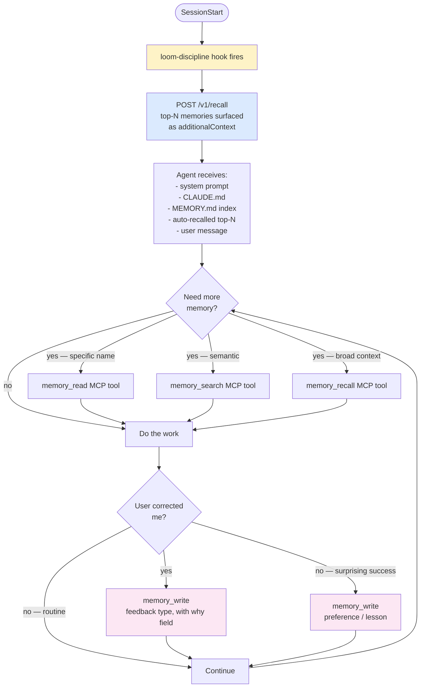
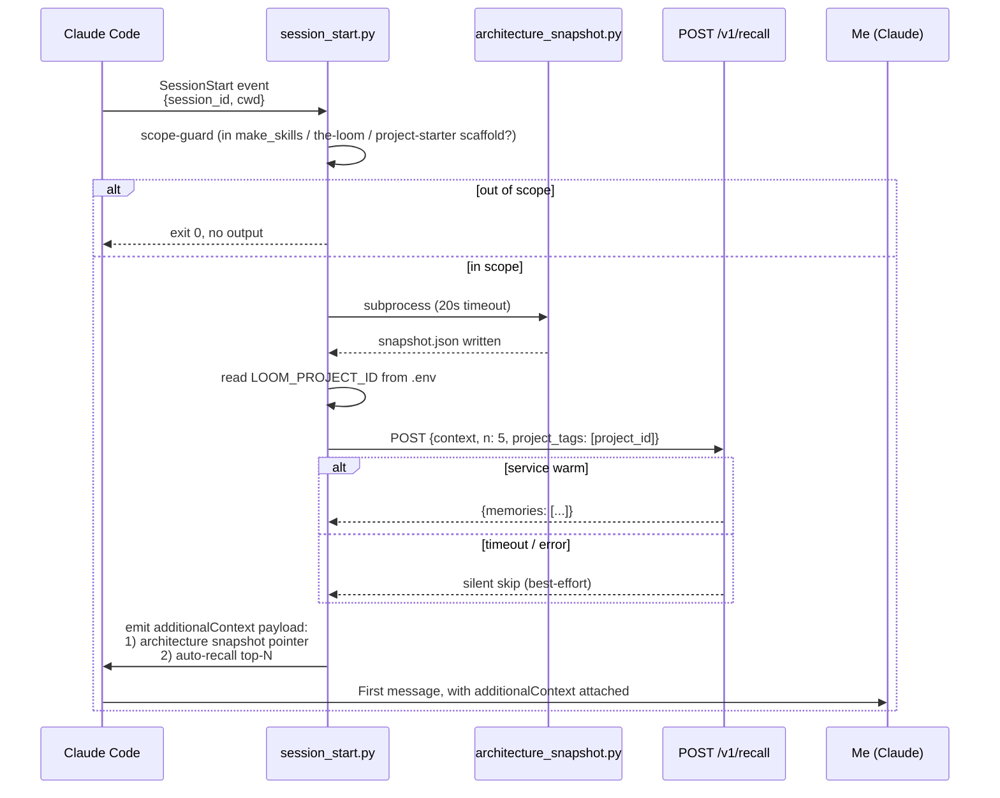
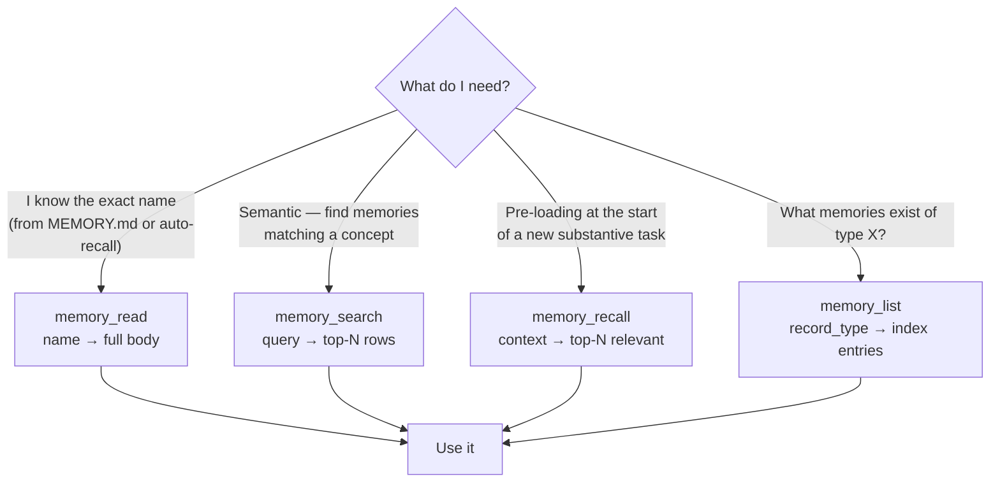
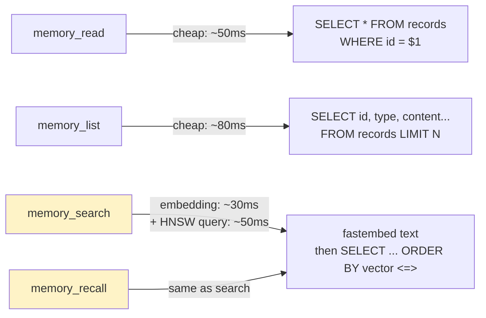
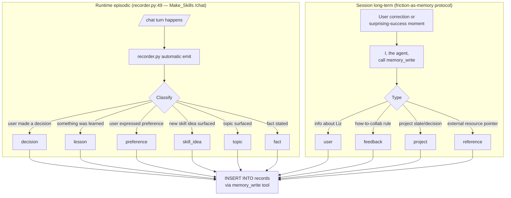
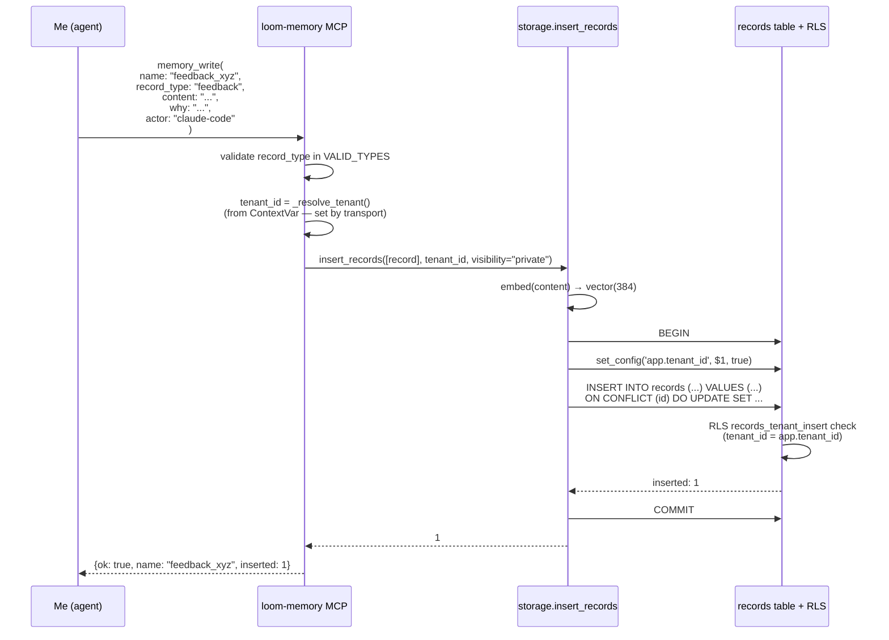
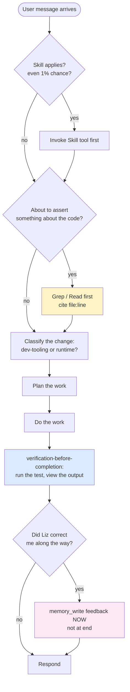

# How agents use the memory store

**Audience:** Liz, future agents picking up this repo.
**Status:** Living doc. Updated when the protocol changes.
**Companion docs:** [database-shape-and-layers.md](database-shape-and-layers.md), [assessment-protocol.md](assessment-protocol.md).

## What this doc is

A walkthrough of what an agent (including me, Claude) actually does with the memory store. The mechanical process, in order, with diagrams. This is the doc you read when you want to understand "what is this agent doing right now and is it being efficient?"

## The agent's loop with memory — high-level



The loop has four phases:
1. **Pre-load** — SessionStart hook auto-recalls before I ever read the user's message.
2. **Targeted retrieval** — during work, I pull specific memories as needed.
3. **Friction capture** — when corrected or when a non-obvious approach works, write a memory immediately (not at session end).
4. **Loop back** — every new substantive turn can trigger more recall.

## Phase 1 — SessionStart auto-recall

The first thing that happens when a session starts. I don't trigger this; the hook does, before I see anything.

### What the hook does

The `loom-discipline` plugin (and the `make-skills-discipline` plugin) registers a `SessionStart` hook that runs [adapters/claude-code/loom-discipline/scripts/session_start.py](../../adapters/claude-code/loom-discipline/scripts/session_start.py).



Source: [session_start.py:80-166](../../adapters/claude-code/loom-discipline/scripts/session_start.py#L80-L166) (the `_try_recall` function).

### What I see when I wake up

When the hook fires successfully, the additionalContext block looks like:

```
[loom-discipline · architecture-snapshot]
Snapshot: docs/architecture-snapshots/2026-06-01T19-23-08Z-snapshot.json
Diff:     docs/architecture-snapshots/2026-06-01T19-23-08Z-diff.md

Invoke the architecture-analyst subagent ...

[loom-memory · auto-recall]
Surfaced 5 relevant memories at session start:
  - [feedback] feedback_pre_response_discipline: Binding rules for every response: PROBE before asserting...
  - [project] project_canonical_platform_spec_v3: the-loom is a unified agent-agnostic project intelligence...
  - [lesson] lesson_postgres_set_local_no_bind_params: SET LOCAL rejects bind parameters in psycopg...
  - ...
Full bodies available via the loom-memory MCP's memory_read tool (pass the name field).
```

That's my pre-loaded context before I see the user's first message. I treat the auto-recall as a hint about *what's likely relevant*, not the full answer — if a memory looks relevant, I `memory_read` the full body.

### Why REST, not MCP, for the hook

The hook is a one-shot Python subprocess. Stdlib urllib is enough; the MCP HTTP transport requires a session handshake we'd rather not do from a process that lives for ~6 seconds. The `/v1/recall` endpoint is the REST counterpart to the MCP `memory_recall` tool, with the same semantics. ([session_start.py:280-291](../../adapters/claude-code/loom-discipline/scripts/session_start.py#L280-L291) — design note in code comment.)

## Phase 2 — Targeted retrieval during work

After the auto-recall, I have a *hint* of what's relevant. During the conversation I pull more memories on demand. There are three MCP tools and they're not interchangeable:



### Decision rules I follow

| Situation | Tool | Why |
|---|---|---|
| Auto-recall surfaced `feedback_response_tone_keep_tight` and I want the full rule | `memory_read("feedback_response_tone_keep_tight")` | Cheap, one-shot, exact match |
| Liz mentions something I don't have full context on — "the bridge spec" | `memory_search("bridge spec skill-making engine HMAC")` | Vector similarity finds related memories without me knowing exact names |
| Starting a substantive task in a new project | `memory_recall("starting auth flow work on humancensys-app", project_tags=["humancensys-app"])` | Pre-load relevant context |
| Auditing what feedback exists | `memory_list(record_type="feedback")` | Cheap index, no bodies |

Tool definitions: [services/agent-context/mcp_server.py:131-281](../../services/agent-context/mcp_server.py#L131-L281).

### Read-path cost model



`memory_search` and `memory_recall` have the same cost (recall is search with a default n=5). The embedding step is local (no network) but spins up fastembed on first call; the model loads once per process, ~80MB. Searches after the first are dominated by the SQL roundtrip to Render.

## Phase 3 — Writing memories (friction-as-memory)

This is the part where I act, not just consume. The rule is: **when something is worth remembering, write it immediately. Don't defer to session end. Don't summarize at the end of the turn.**

### Two emission paths



Source: [database-shape-and-layers.md § type enum](database-shape-and-layers.md#type-enum-10-values).

### When I (Claude in this repo) write a memory

The discipline that the loom-discipline plugin loads into my context says:

| Trigger | Action |
|---|---|
| Liz corrects me ("no, not that") | Write `feedback` memory NOW, before continuing. Include **Why:** the reason she gave + **How to apply:** when it kicks in. |
| Liz confirms a non-obvious choice worked ("yes exactly, keep doing that") | Write `feedback` memory. Validated judgment calls drift away if only corrections are captured. |
| Liz states a project goal/decision/constraint | Write `project` memory. Include **Why:** + **How to apply:**. |
| External resource named (a Linear project, a Grafana dashboard) | Write `reference` memory pointing at it. |
| I learn something about Liz's role/skills/preferences | Write `user` memory. |
| A hard-won debugging/operational lesson surfaces | Write `lesson` memory (runtime episodic, but I write it manually because session_long-term protocol covers it too — the type column lets either path emit either type). |

Source: my discipline rules, the canonical `feedback_pre_response_discipline` memory.

### What a memory_write actually looks like



Source: [mcp_server.py:323-361](../../services/agent-context/mcp_server.py#L323-L361), [storage.py:151-239](../../services/agent-context/storage.py#L151-L239).

**Upsert is atomic** — one `INSERT … ON CONFLICT DO UPDATE` call. Make_Skills' original LanceDB version did delete-then-insert (LanceDB lacks UPSERT); the-loom dropped that pattern. ([mcp_server.py:34-40](../../services/agent-context/mcp_server.py#L34-L40))

## My personal process — what I check before responding

This is the wrapper around every response, encoded in `feedback_pre_response_discipline`:



The pre-response checklist (the discipline rules):

1. **PROBE before asserting** — Grep/Read first, cite file:line. Training-data defaults aren't citations.
2. **Distinguish dev-tooling from runtime** — every infra piece serves either Liz developing the-loom OR the-loom's running services. Name which.
3. **Cite skills by name** — when I invoke a skill, say so explicitly.
4. **Friction as memory NOW** — when Liz corrects me, write the feedback memory before continuing.
5. **Layered explanation default** — every architecture/infra explanation: ELI5 → quick reference → depth (cite file:line) → mental model.
6. **Probe existing infrastructure before adding new** — Grep for existing patterns first.
7. **Verify values, not just names** — two similarly-named constants can resolve to different values.

## Efficiency dimensions you (Liz) can assess

Things you can compare *over time* and *vs alternatives*:

| Dimension | What to look at | Where to find it |
|---|---|---|
| **Recall latency** | p50/p95 of `/v1/recall` and `memory_recall` MCP calls | Grafana Loki — filter by `service=loom-agent-context endpoint=/v1/recall` |
| **Recall quality** | Were the surfaced memories actually relevant to what came next? | Manual eval on a fixed question set; see [assessment-protocol.md](assessment-protocol.md) |
| **Hook fire rate** | How often SessionStart fires (per day, per project) | Grafana Loki — `event=SessionStart` |
| **Memory write rate** | Memories written per session, per day, per type | `scripts/memory_snapshot.py` — see assessment-protocol |
| **Memory size growth** | Total rows, total DB size on disk | Postgres `pg_relation_size('records')`; snapshot script captures this |
| **Cache reuse pattern** | Same memories surfaced repeatedly? | `ts_last_accessed` column on `records` (writes by storage layer on read — to be implemented) |
| **Friction-to-write latency** | Time from correction to memory_write commit | Currently manual; future: hook-level instrumentation |
| **MCP transport reliability** | Drop rate of MCP client connections | OpenTelemetry traces in Grafana Tempo |

See [assessment-protocol.md](assessment-protocol.md) for how to capture these on a schedule and compare snapshots.

## Common failure modes (mine to watch for)

| Failure | What goes wrong | Mitigation |
|---|---|---|
| **Asserting from memory instead of the file** | I claim something about the code based on training data or a memory; the actual code says otherwise | PROBE rule: Grep/Read first, cite file:line |
| **Skipping memory_write because the moment passed** | A friction moment happens mid-turn; I forget to capture it before continuing | Friction-as-memory rule: write NOW, not at session end |
| **Re-recalling the same memories every turn** | I call `memory_recall` with the same context multiple times in one session, wasting embedding compute | Reuse the auto-recall surface; only call `memory_recall` when scope changes (new task, new project) |
| **Writing memories that duplicate existing ones** | I write `feedback_xyz` when `feedback_abc` already covers the rule | Check `memory_list(record_type="feedback")` first; update existing if applicable |
| **Forgetting `actor` / `extra` / `project_tags`** | Memory is unattributed → harder to filter later | Always populate `actor`; populate `project_tags` when work is project-scoped |
| **Soft-deleting and not realizing it persists** | `memory_delete` doesn't remove the row; it sets visibility='deleted'. Re-writing the same name re-creates it. | Read the row first if you need to know history |

## Mental model — how I think about the memory store

- **Memory is the substrate that survives me.** The next session won't have my conversation context; it WILL have my memories. Write so future-Claude can act on them.
- **Two paths exist (episodic vs session long-term) but they share one table.** Don't worry about the path; pick the right `record_type` for the moment.
- **The hook reads before I do.** What it surfaces is what's already in my context. I don't need to re-recall what's already there.
- **Friction is data.** A correction is the most valuable signal I get; capture it immediately or lose it.
- **The DB enforces tenant isolation. I don't have to think about it.** Just call the tool with the right name and let RLS do its job.
