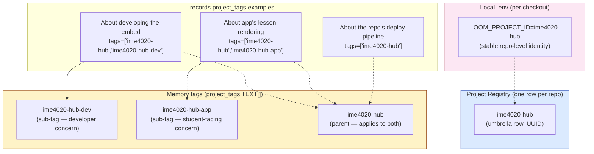
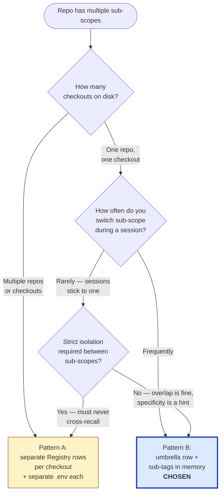

# Project scoping — Pattern B (umbrella + sub-tags)

**Audience:** Liz, future agents.
**Status:** Adopted 2026-06-06. The canonical pattern for any repo with multiple in-repo concerns (dev vs app, multiple sections, multiple consumer surfaces).
**Companion docs:** [database-shape-and-layers.md](database-shape-and-layers.md), [how-agents-use-memory.md](how-agents-use-memory.md).

## The decision

When a single git repository hosts **more than one coherent scope of work** (e.g. developing the application *and* the running application's behavior; or two course sections of one hub; or multiple consumer surfaces sharing a codebase) — the platform records:

- **One Project Registry row** = the umbrella project (the repo)
- **Multiple `project_tags`** = the sub-scopes (memory-write conventions)

NOT one Registry row per sub-scope. NOT one mega-tag across the whole repo.

## ELI5

"The Registry knows about the repository. The memory tags know which slice of the repo a thought belongs to."

If you're working on the developer side of the IME 4020W hub, your memory says "this is about ime4020-hub AND ime4020-hub-dev." Recall scoped to dev surfaces it; recall scoped to the whole repo also surfaces it. Recall scoped to *just app* doesn't.

## The shape



## Why this pattern (and not the alternatives)



**For IME 4020 Hub** (the case that drove this decision): one repo, one checkout, frequent context switching during a session, soft isolation (cross-recall is fine when the agent flags it). Pattern B is the right fit.

**For projects that need hard isolation** (e.g. a hypothetical multi-tenant SaaS where every customer's memory MUST be invisible to every other customer's recall): Pattern A's separate Registry rows + separate `.env` files give you the strong boundary. But that's not what the repo-with-sub-scopes problem looks like.

## Decision gate — "which tag(s) should I attach to this memory?"

The agent (Claude, or any other) writing a memory in a Pattern B repo runs this decision tree before calling `memory_write`:

```mermaid
flowchart TB
    Write([Writing a memory in a Pattern B repo]) --> Q1{Does this memory<br/>apply to the WHOLE repo<br/>regardless of sub-scope?}
    Q1 -->|Yes — repo-level<br/>e.g. CI, deploy,<br/>shared libraries| Umbrella[Tag: umbrella only<br/>e.g. ['ime4020-hub']]
    Q1 -->|No — specific<br/>to a sub-scope| Q2{Does it apply to<br/>ONE sub-scope or<br/>MULTIPLE?}

    Q2 -->|One sub-scope| Q3{Should it ALSO<br/>be findable from<br/>the umbrella?}
    Q2 -->|Multiple sub-scopes| Multi[Tag: all relevant subs +<br/>umbrella e.g.<br/>['ime4020-hub',<br/>'ime4020-hub-dev',<br/>'ime4020-hub-app']]

    Q3 -->|Yes — almost always yes<br/>default to inclusive| Both[Tag: umbrella + sub<br/>e.g. ['ime4020-hub',<br/>'ime4020-hub-dev']]
    Q3 -->|No — sub-scope only,<br/>strong isolation needed| SubOnly[Tag: sub only<br/>e.g. ['ime4020-hub-dev']<br/>RARE — justify in 'why' field]

    style Both fill:#dbeafe,stroke:#1e40af,stroke-width:3px
```

**Default to including the umbrella tag.** It costs nothing at write time and makes the memory recoverable when someone is recalling at the broader repo scope. The only reason to omit the umbrella is when you specifically want the sub-scope to remain invisible to the umbrella's recall.

## Decision gate — "which tag(s) should I pass at recall time?"

```mermaid
flowchart TB
    Recall([Calling memory_recall or memory_search]) --> Q1{What's the scope<br/>of what you're<br/>about to do?}
    Q1 -->|Working on the whole repo<br/>no specific sub-scope yet| Umbrella[project_tags=<br/>['ime4020-hub']<br/>Returns: umbrella +<br/>all sub-scope memories]
    Q1 -->|Working specifically<br/>on one sub-scope| Q2{Want shared<br/>repo-level memories<br/>surfaced too?}

    Q2 -->|Yes — usually yes| Both[project_tags=<br/>['ime4020-hub',<br/>'ime4020-hub-dev']<br/>Returns: umbrella +<br/>this sub-scope only]
    Q2 -->|No — strict<br/>sub-scope only| SubOnly[project_tags=<br/>['ime4020-hub-dev']<br/>Returns: only memories<br/>tagged with this sub<br/>RARE]

    style Both fill:#dbeafe,stroke:#1e40af,stroke-width:3px
    style Umbrella fill:#dbeafe,stroke:#1e40af
```

The storage layer's `project_tags && %s::text[]` (array overlap in [storage.py:274-276](../../services/agent-context/storage.py#L274-L276)) returns any memory whose `project_tags` array shares at least one element with the query array. So `["ime4020-hub", "ime4020-hub-dev"]` at recall time matches a memory tagged `["ime4020-hub"]` OR `["ime4020-hub-dev"]` OR `["ime4020-hub", "ime4020-hub-dev"]`.

## Schema support

Pattern B requires no schema changes. It works because:

- `records.project_tags` is `TEXT[]` (no FK), accepts any string ([001_init_memory.sql:74](../../infra/migrations/001_init_memory.sql#L74))
- GIN index on `project_tags` enables fast array-overlap queries ([001_init_memory.sql:124-126](../../infra/migrations/001_init_memory.sql#L124-L126))
- Storage layer uses `&&` (overlap) operator at recall time, not `@>` (contains) — so multi-tag recall is OR, not AND

## Pattern B in the Registry today (post-backfill 2026-06-06)

Seven umbrella rows now exist:

| Slug | Sub-tags (memory conventions) | Repo |
|---|---|---|
| `the-loom` | (none — single-scope) | `Lizo-RoadTown/the-loom` |
| `make-skills` | (none — single-scope, currently splitting into engine + consumer) | `Lizo-RoadTown/Make_Skills` |
| `summer-2026-hub` | (none) | `Lizo-RoadTown/summer-2026-hub` |
| `sde-extraction` | (none) | private |
| `claude-skills-marketplace` | (none) | `Lizo-RoadTown/claude-skills-marketplace` |
| **`ime4020-hub`** | **`ime4020-hub-dev`, `ime4020-hub-app`** | one repo with two instances |
| `classroom-hub-starter` | (none — template repo) | private |

Only IME 4020 currently uses sub-tags. Other umbrellas could grow sub-tags later without any schema change — just convention.

## When to ADD a sub-tag to an existing umbrella

Trigger condition: you find yourself writing memories that you'd want to filter by within a repo, and the filter falls on a clean semantic boundary (developer concern vs operational concern; this customer vs that customer; this surface vs that surface).

Don't pre-create sub-tags speculatively. The cost is zero to start using a new sub-tag the moment a memory needs it.

## Mental model

- **Registry rows are namespace identity.** They're the platform's list of "real projects."
- **Sub-tags are recall scopes.** They're a memory-side convention for "this memory is about that slice of the work."
- **The umbrella tag is the default.** Including it on every memory in a Pattern B repo makes recall robust to a missed sub-tag.
- **Hard isolation needs Pattern A.** Pattern B gives soft isolation by tag overlap; that's enough for repo-internal concerns, not enough for cross-tenant data separation.

## What the agent does differently in a Pattern B repo

When I open a Claude Code session in a Pattern B repo:

1. SessionStart hook reads `.env` → `LOOM_PROJECT_ID=ime4020-hub` (the umbrella)
2. Auto-recall fires with `project_tags=["ime4020-hub"]` → surfaces all umbrella + sub-scope memories
3. As I start working, I notice the conversation has a sub-scope flavor (e.g., the user is asking about the embedded student agent)
4. **Next `memory_write` I make includes the sub-tag:** `project_tags=["ime4020-hub", "ime4020-hub-app"]`
5. Future recalls scoped to `["ime4020-hub-app"]` find it without needing the umbrella context

The convention is in the agent's discipline, not in the schema. Schema only provides the array; the discipline adds the umbrella + sub-tag combination.
