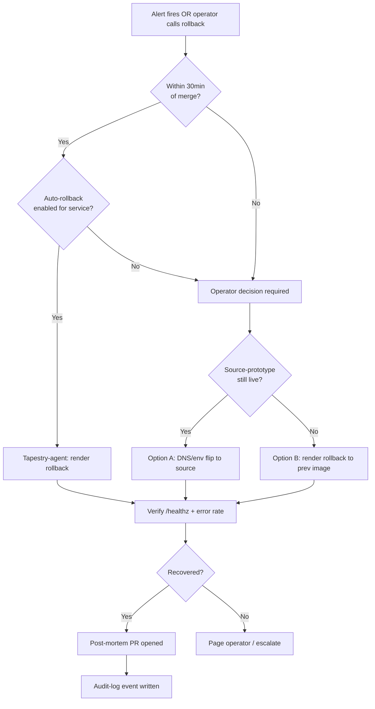

# Migration CI/CD pipeline architecture

Engineering plan for the CI/CD that moves capabilities from legacy source repos (`the-loom`, `Make_Skills`) into Tapestry, and stays reusable for the next migration (future client monorepo → Tapestry-fork). Binding rules from `docs/playbook/migration/00-doctrine.md` apply: parallel-build, source-stabilize → migrate → freeze → archive, no big-bang, two prep PRs, capability names preserved regardless of deploy count.

## 1. Pipeline stages

Five GitHub Actions workflows run on every migration PR opened against `tapestry/main`. Each is a separate file under `.github/workflows/` so they can be reused per future migration target by copying `.github/workflows/migration-*.yml` into a fresh Tapestry-fork.

| # | Workflow file | Trigger | What it checks | Pass criteria | Gate |
|---|---|---|---|---|---|
| 1 | `migration-pr-shape.yml` | `pull_request` open/sync | PR title is Conventional Commits (`amannn/action-semantic-pull-request@v5`, copy of `Make_Skills/.github/workflows/pr-title-lint.yml:27`); PR body contains a filled migration template (see §7); `docs/migration/import-map.md` has been edited in this PR; `naming-corrections.md` updated if any renames | All four assertions true | Hard block |
| 2 | `migration-static-checks.yml` | `pull_request` | `ruff check`, `pyright`, `pnpm lint`, `pnpm typecheck`. Diff-only mode — only files changed in this PR | Zero errors | Hard block |
| 3 | `migration-tests.yml` | `pull_request` | Unit + contract tests for the imported capability. Contract tests live in `tests/contracts/<capability>/` and are the parity oracle (see §3) | All green, contract coverage ≥ prior source-repo coverage | Hard block |
| 4 | `migration-staging-deploy.yml` | `pull_request` synchronize, after #1-#3 green | Builds the affected service Docker image, pushes to GHCR with tag `pr-<num>-<sha>`, triggers Render preview env via `render.yaml` `previews: generation: automatic` (pattern from `Make_Skills/render.yaml:20`) | Render preview boots, `/healthz` returns 200, ingress URL posted to PR | Hard block |
| 5 | `migration-parity.yml` | `workflow_run` after #4 succeeds | Runs the parity harness (see §3) against the staging URL and against the source-prototype URL pulled from `docs/migration/import-map.md`. Posts side-by-side diff as PR comment | All declared parity assertions pass | Soft block (operator can override with `parity-overridden` label + reason in PR body; logged to audit) |

Promotion to production happens **on merge to main**, handled by a sixth workflow `migration-promote.yml` triggered by `push: branches: [main]` — it tags the merge commit and Render auto-deploys (`autoDeploy: true`, `Make_Skills/render.yaml:14`).

## 2. Staging environment topology

Reuse Render preview environments. They already work for `Make_Skills` (`render.yaml:20-22`). Each migration PR gets its own ephemeral staging stack.

| Item | Value |
|---|---|
| Per-PR URL pattern | `tapestry-<service>-pr-<num>.onrender.com` |
| Lifetime | Auto-destroyed on PR close (Render default) |
| Database | **Per-PR Postgres** (not shared with prod). Set `previews.generation: automatic` on the DB block in `infra/deploy/render.yaml`. Cost: ~$0.50/PR/day on starter; cap with `previewsExpireAfterDays: 7` |
| Secrets | Mirrored from prod via `sync: false` + Render env-group `tapestry-staging-shared` (see §6) |
| Service count | Only the services touched by the PR boot. `migration-staging-deploy.yml` parses the import-map diff and sets `RENDER_DEPLOY_SCOPE=<service-list>` to skip irrelevant services |
| Source-prototype side | Stays live in its existing Render deploy (`loom-agent-context.onrender.com`, etc.) — this is the parity reference. No staging copy needed for source |

For future client migrations, this same shape works: their source-prototype deploys remain untouched; their Tapestry-fork's per-PR previews are the only new spend.

## 3. Parity-check gates

Before merge, the parity harness (`tools/parity/run.py`, new in Tapestry) asserts that **Tapestry-staging behaves equivalently to the source-prototype** for the capability being migrated. Assertions are typed by migration kind.

| Migration kind | Assertions |
|---|---|
| **Service lift** (e.g., `the-loom/services/agent-context` → `tapestry/services/agent-context`) | Same OpenAPI spec (`packages/schemas/<svc>.openapi.yaml` diff-equal). Same HTTP status codes on the contract-test suite. Same DB schema (`pg_dump --schema-only` byte-equal post-normalization). p95 latency within 1.5× of source on 100-request synthetic load |
| **Data migration** | Row counts equal per table. Checksum equal on every tenant-scoped table (`SELECT md5(string_agg(row::text, '')) GROUP BY tenant_id`). RLS policies present and equivalent |
| **API parity** | Replay last 1000 prod requests (sanitized) against both source + staging. Response bodies diff-equal modulo declared allow-list of fields (timestamps, request IDs). Captured in `tools/parity/replay.py` |
| **Telemetry parity** | OTLP traces from a smoke session reach both source's Grafana and Tapestry's Grafana with same span names, same attribute keys. Run via `tools/parity/otlp_smoke.py` |
| **Skill/engine parity** | Same `SKILL.md` → same compiled `StructuredTool` signature. Same agent loop produces same tool-call sequence on a fixed seed prompt |

Parity output is a structured JSON written to PR artifacts + summarized as a PR comment. Override requires the `parity-overridden` label + a justification paragraph in the PR body — logged to `audit-log` service on merge.

## 4. Deployment phases

Tapestry deploys via Render Blueprint (`infra/deploy/render.yaml`). Three rollout shapes, picked per service type. Service type is declared in `infra/deploy/service-manifest.yaml`.

| Service type | Rollout | Rollback shape |
|---|---|---|
| **Stateless API** (e.g., `services/policy`, `services/skill-making`) | Render rolling deploy — default behavior. New instance health-checks `/healthz` before old instance retires. Window: ~60s | Render dashboard "Rollback to previous deploy" — one click. Reverts container image only |
| **Stateful service with migrations** (e.g., `services/agent-context`, `services/project-registry`) | Migration runs in a Render pre-deploy command (`buildCommand` is a no-op; `preDeployCommand: alembic upgrade head`). Forward-only migrations. New code starts only after migration succeeds | Image rollback as above, **plus** a separate "down-migration" PR if schema must revert. Default: never reverse-migrate — fix forward |
| **Front-of-house dashboard** (`apps/web-dashboard` on Vercel) | Vercel preview → Vercel promote-to-prod via `vercel --prod`. Atomic | Vercel "Instant Rollback" to previous deployment ID |

No canary at v1 — single-tenant scale doesn't justify the traffic-splitting cost. Document as a phase-2 add behind `infra/deploy/canary.md` for future client deploys where it matters.

## 5. Rollback procedure

| Step | Action |
|---|---|
| Trigger | Any of: `/healthz` failing for >5min, error rate >5% over 10min, parity-harness post-deploy drift alarm, operator command |
| Decision authority | Operator (Liz) for prod. On-call agent (Tapestry-agent) can roll back automatically if alert fires AND PR was merged within last 30min — explicit policy in `docs/playbook/migration/02-rollback.md` |
| Mechanism | Render dashboard or `render rollback <service> <prev-deploy-id>` via CLI. Vercel dashboard for `apps/` |
| **What reverts** | Container image, environment variable diff applied in this deploy, Render service config |
| **What does NOT revert** | Forward-applied DB migrations (data integrity), rotated secrets (security), audit-log entries (immutable). Source-prototype is the fallback truth — re-route traffic via DNS/env-var flip back to `loom-*.onrender.com` if Tapestry's revert path is non-viable. The legacy isn't frozen until parity holds for N days (default 7); this rollback path stays available during that window |
| Logging | Rollback event POSTed to `services/audit-log` with `kind=rollback`, `pr=<num>`, `triggered_by=<operator|alert>`, `reason=<text>` |



## 6. Secrets + config management

Single source of truth: **Render Environment Groups**. Two groups per Tapestry-fork:

- `tapestry-prod-shared` — bound to production services
- `tapestry-staging-shared` — bound to PR previews

Secret migration from legacy to Tapestry is a manual operator step (no API-driven cross-account transfer for safety). Procedure encoded in `docs/playbook/migration/04-secrets.md`:

1. List source secrets: `render env vars --service loom-<svc>` (output kept local, never committed)
2. For each, create matching key in `tapestry-prod-shared` with same value
3. Tapestry `render.yaml` declares the variable with `sync: false` + `fromGroup: tapestry-prod-shared` (extends pattern at `Make_Skills/render.yaml:23-79`)
4. Run `tools/secrets/drift-check.py` weekly via cron — compares declared-required vars in `render.yaml` against present-in-group keys; opens an issue if drift detected
5. Rotation: new value set in source AND in `tapestry-*-shared`; `LOOM_SKILL_BRIDGE_SECRET` (`Make_Skills/render.yaml:59`) is the canonical example — same value on both sides until source is frozen

Env-var-vs-secret split: anything non-sensitive (URLs, feature flags, mode selectors like `PLATFORM_MODE`) stays in `render.yaml` with `value:`. Anything sensitive uses `sync: false` and lives only in the env group.

## 7. Migration PR template

Lives at `.github/PULL_REQUEST_TEMPLATE/migration.md`. Selected via `?template=migration.md` URL param or auto-applied on branches named `migration/*`.

```markdown
## Migration scope
- **Capability:** <name>
- **Source:** <repo>/<path> @ <commit>
- **Destination:** tapestry/<path>
- **Decision:** [ ] Lift  [ ] Refactor  [ ] Rewrite  [ ] Retire
- **Linked import-map row:** <link to line in docs/migration/import-map.md>

## Prep PRs (Doctrine Rule 5)
- [ ] Prep-1 (source-side) merged: <link>
- [ ] Prep-2 (Tapestry destination slot) merged: <link>

## Parity declaration
- **Migration kind:** [ ] service-lift [ ] data [ ] api [ ] telemetry [ ] skill-engine
- **Source endpoint/artifact for comparison:** <url or path>
- **Allowed-drift fields:** <list, or "none">

## Required artifacts
- [ ] `docs/migration/import-map.md` updated
- [ ] `docs/migration/naming-corrections.md` updated (if renames)
- [ ] `CHANGELOG.md` entry (pattern from `Make_Skills/.github/workflows/changelog-required.yml:42`)
- [ ] Contract tests under `tests/contracts/<capability>/`
- [ ] ADR opened under `docs/adr/` if architecture decision is implied

## Rollout
- **Service type:** [ ] stateless [ ] stateful-with-migration [ ] front-of-house
- **Forward-only migration?** yes / no / N/A
- **Rollback window:** source-prototype stays live for N days = <N>

## Approvals
- [ ] Tapestry-agent code review
- [ ] Operator (Liz) sign-off
- [ ] security-review-agent (required if touches FS/network/shell, per UMBRELLA.md:136)
```

## End-to-end sequence

```mermaid
sequenceDiagram
    participant Op as Operator
    participant Src as Source repo
    participant Tap as Tapestry PR
    participant GA as GitHub Actions
    participant RP as Render preview
    participant Par as Parity harness
    participant RProd as Render prod
    participant Aud as audit-log

    Op->>Src: Prep-1 PR (extract/normalize)
    Op->>Tap: Prep-2 PR (destination slot)
    Op->>Tap: Open migration PR
    Tap->>GA: pr-shape + static + tests
    GA-->>Tap: green
    GA->>RP: build image, deploy preview
    RP-->>GA: /healthz 200
    GA->>Par: run parity vs source
    Par->>Src: replay/probe source
    Par->>RP: replay/probe staging
    Par-->>Tap: comment with diff
    Op->>Tap: review + approve
    Op->>Tap: merge
    Tap->>RProd: autoDeploy on main push
    RProd->>RProd: preDeployCommand (migrations)
    RProd-->>Op: deploy success notification
    Op->>Src: mark capability frozen (followup PR)
    Tap->>Aud: write migration_complete event
    Note over RP: PR closed → preview destroyed
    Note over Src: Stays live N days as rollback fallback
```

## Reuse for future migrations

The workflows (`migration-*.yml`), the parity harness (`tools/parity/`), the PR template, the doctrine doc, and the Render env-group pattern are designed to be copied wholesale into any future Tapestry-fork. Per-client customization lives in three places only: `docs/migration/legacy-repo-inventory.md` (their source repos), `docs/migration/import-map.md` (their destinations), `infra/deploy/service-manifest.yaml` (their service types). Everything else stays.
