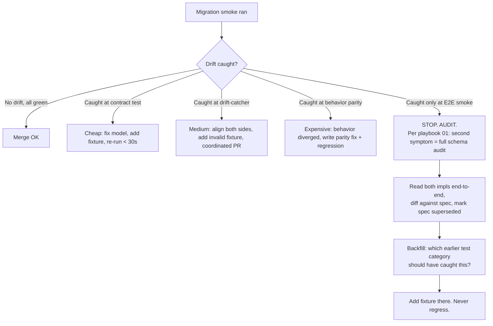
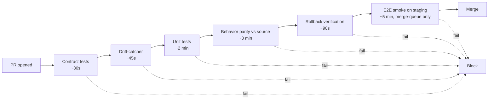

# Migration testing strategy

How every migration step into Tapestry proves it works — and how we catch the drift class that bit us three times in 24 hours.

## The four test categories (mandatory for every migration step)

Every migration PR (Lift / Refactor / Rewrite per `docs/migration/README.md:22-27`) must satisfy ALL FOUR before the import-map row flips to `Imported`. No exceptions.

### 1. Contract tests — pinned schema invariants

**Pattern:** `Make_Skills/services/skill_making/tests/test_models_schema_invariants.py:1-227`. Pydantic models loaded, dicts mutated one field at a time, `ValidationError` asserted on every drift shape (rename, move, extra, type change).

**What goes here for Tapestry:**
- Every wire-contract model gets an invariants test pinning: field placement (top-level vs nested per `test_capability_tags_top_level_not_in_frontmatter`), exact field names (`test_source_body_md_field_name`, the literal `lesson_third_spec_drift` bug), `extra='forbid'` at every layer (`test_top_level_extra_field_rejected`), enum exhaustivity (`test_bridge_error_code_enum_exhaustive` — count members, don't just spot-check).
- Every public REST endpoint gets a schema-shape test asserting response key set is exactly `{...}` — no additions are silent.
- DB schemas: column set + nullability + RLS policy presence asserted via `information_schema` query.

**Lives in:** `tests/contract/<service>/test_<model>_invariants.py`. Runs on every PR. Wall time budget: <30s for whole contract suite.

### 2. Behavior parity tests — source vs Tapestry-staging

Same input, both implementations, asserts identical output. The migration's value gate.

**Pattern:** pytest parametrize over a fixture corpus, run source-repo function in subprocess (or via HTTP for services), run Tapestry-staging equivalent, assert deep-equal on response shape AND status code AND DB side effect.

**Tool:** `syrupy` snapshots OR `deepdiff` with explicit ignore-keys for timestamps/UUIDs/PIDs. Snapshots committed under `tests/parity/snapshots/`.

### 3. End-to-end smoke

**Pattern:** `Make_Skills/scripts/verify_bridge_receiver.py:1-337`. Real DB, real pool, calls receiver function directly (not via HTTP — strips the FastAPI plumbing as a noise source). Numbered scenarios (`[1] HMAC mismatch -> 401`, `[2] Schema fail -> 400`, …). Each `_assert` exits non-zero on first failure. Cleanup in `finally`.

**Scaled to Tapestry:** `scripts/smoke/<service>.py`. One script per Tapestry service. Run against the staging Render deploy of the service + a throwaway Postgres branch. **All seven assertion shapes from `verify_bridge_receiver.py:186-329` are the template:** auth-fail, schema-fail, happy-path, deferred-handling, replay/idempotency, unknown-tenant, downstream-side-effect.

### 4. Rollback verification

Untested rollback ≠ rollback. Every migration step ships with `scripts/rollback/<step>.py` that:
1. Reverts the import-map row to prior status
2. Re-points consumers to source repo (env var swap)
3. Asserts source repo's smoke script passes after the swap

Run in CI on every PR that modifies the migration. Asserts the rollback executes clean against a forked staging DB. **If rollback verification doesn't run, the migration is one-way and the PR is rejected.**

## What "parity" means precisely

| Migration kind | Parity assertions |
|---|---|
| **Service** (e.g. `services/agent-context/` lift) | (a) Each documented endpoint: same status, same response keys, same response value types for a corpus of 20+ requests. (b) RLS-scope parity: query as tenant A, assert tenant B's rows invisible — both sides. (c) Auth parity: HS256 JWT signed with same `AUTH_SECRET` accepted by both; invalid token rejected by both with same status. |
| **Schema** | (a) Row count parity per table. (b) Distribution parity: `SELECT count(*), <discriminator>` GROUP BY matches source ±0. (c) RLS parity: `SET app.tenant_id = X; SELECT count(*)` matches per-tenant on both sides. (d) Index presence: `pg_indexes` row set equal. |
| **Client library** (CLI, SDK) | (a) Exit-code parity: same args → same exit code across a fixture matrix. (b) Output-format parity: stdout matches byte-for-byte after timestamp/UUID redaction. (c) Stderr error class parity (regex-match, not exact). |

## The drift-catcher (the missing gate)

This is the new test that would have caught all three `lesson_*` drifts at CI time.

**Mechanism:** import BOTH source-side model AND Tapestry-destination model. Parametrize over the golden-payload corpus. For each payload assert source.validate-result.is_valid == dest.validate-result.is_valid AND on validation failure the rejected-field-set is identical.

```python
# tests/drift_catcher/test_promotion_candidate_parity.py
@pytest.mark.parametrize("name,payload,expected_valid", load_corpus("promotion_candidate"))
def test_source_and_dest_agree(name, payload, expected_valid):
    src_ok, src_errs = try_validate(loom.PromotionCandidatePayload, payload)
    dst_ok, dst_errs = try_validate(tapestry.PromotionCandidatePayload, payload)
    assert src_ok == dst_ok == expected_valid, f"{name}: src={src_ok} dst={dst_ok}"
    if not src_ok:
        assert errfields(src_errs) == errfields(dst_errs)
```

Runs on every PR that touches either model. Failure blocks merge on both sides via cross-repo required check.

## Golden-payload corpus

**Lives at:** `tests/fixtures/golden/<contract>/`. One directory per wire contract. Each directory contains:
- `valid/*.json` — payloads that MUST validate
- `invalid/<reason>/*.json` — payloads that MUST reject (`invalid/missing_candidate_kind/*.json`, `invalid/source_format_present/*.json` — one subdir per drift the lessons documented)
- `MANIFEST.yaml` — corpus version, contract version, last-updated, source-of-truth ref

**Maintenance rule:** every spec drift caught in production adds a fixture to the relevant `invalid/<reason>/` directory in the SAME PR that fixes the drift. The fixture is the regression test.

**Versioning:** `MANIFEST.yaml.contract_version` bumps when the contract changes. Drift-catcher loads corpora matching `min_contract_version <= dest_version <= max_contract_version`. Old corpora retained 2 contract versions back.

## Continuous-parity scheduling

While prototype version still runs (parallel-build doctrine, `migration/README.md:14`), parity matters per-merge AND continuously — the prototype can drift after migration.

- **On every PR (either repo):** drift-catcher + contract tests. <2 min budget.
- **On every merge to main (either repo):** behavior parity tests against staging. ~10 min.
- **Nightly cron (GitHub Actions, 03:00 UTC):** full E2E smoke against staging Tapestry + live prototype. Diff results. Post to `#migration-parity` Slack on divergence. Posts GREEN once per week to confirm cron is alive.
- **Weekly (Sunday):** rollback verification full sweep — every active migration's rollback script runs against a fresh staging DB.

Parity cron stops when import-map row flips to `Archived` (source retired per `migration/README.md:27`).

## Test data + fixtures

- **Tenant fixtures:** `tests/fixtures/tenants.sql`. Two tenants minimum (`tenant_a`, `tenant_b`) plus the `SELF_HOST_TENANT_ID` / `DEFAULT_TENANT_ID` mapping pair (from `verify_bridge_receiver.py:36-39`) — the Option B mapping pattern documented in `docs/playbook/migration/02-cross-fleet-uuid-mismatch.md`. **The fixture file pins the cross-fleet UUID pair; drift on these is a contract violation.** Note the asymmetry: Make_Skills' `DEFAULT_TENANT_ID` is still a hardcoded literal at `Make_Skills/core/db/migrations.py:31` (the all-zeros UUID baked in since Pillar 0), while Tapestry's `SELF_HOST_TENANT_ID` is now env-resolved per `packages/auth/python/loom_auth/auth_bridge.py:97` (canonical env `SELF_HOST_TENANT_ID`, deprecated alias `LOOM_SELF_HOST_TENANT_ID`, all-zeros placeholder fallback). The fixture must pin BOTH actual values used at runtime.
- **Skill fixtures:** `tests/fixtures/skills/*.skill.md`. Five canonical skills covering each `candidate_kind` value (per `test_candidate_kind_accepts_all_9_kinds` in `test_models_schema_invariants.py:93-109`).
- **Candidate fixtures:** generated from skill fixtures via `tests/fixtures/build_candidates.py`. Reset on each test session via pytest fixture scope=session + transaction rollback per test.
- **Seeding:** `make test-seed` — wraps `psql -f tenants.sql && python build_candidates.py`. Idempotent.
- **Reset:** every test runs inside a SAVEPOINT that rolls back on teardown. E2E smoke uses dedicated `tapestry_test` DB, truncated at session start.

## What does NOT run on every PR

| Test | Cadence | Why deferred |
|---|---|---|
| Full E2E smoke against live staging Render deploy | On merge to main + nightly | Render deploy is slow (~5 min); PR feedback would degrade |
| Rollback verification full sweep | Weekly | Provisioning fresh DB per migration is expensive (~15 min × N migrations) |
| Cross-tenant RLS fuzzing | Nightly | Hour-long fuzz run; per-PR contract tests cover the documented holes |
| Schema migration performance benchmarks | On schema PRs only | Irrelevant when migration is code-only |
| Parity tests against archived migrations | Never (deleted) | Source repo is read-only; no drift possible |

## Diagrams





The ordering is deliberate: cheapest, highest-drift-catch-rate gates first. A bad rename dies in 30 seconds at contract tests; we never burn the 5-minute staging smoke on a known-broken PR.

## The non-negotiables

1. No migration PR merges without all four categories green.
2. Every production drift becomes a fixture in `tests/fixtures/golden/<contract>/invalid/<reason>/` in the same PR that fixes it.
3. The drift-catcher is a cross-repo required check. Either side updating its model alone fails the check until the other side aligns. This enforces the "coordinated PR" rule from `docs/playbook/migration/01-bridge-spec-drift-pattern.md:38-40` at CI time, not at smoke time.
4. Rollback verification is part of CI, not part of "incident response." A migration without a tested rollback is one-way and the operator must approve one-way explicitly.
