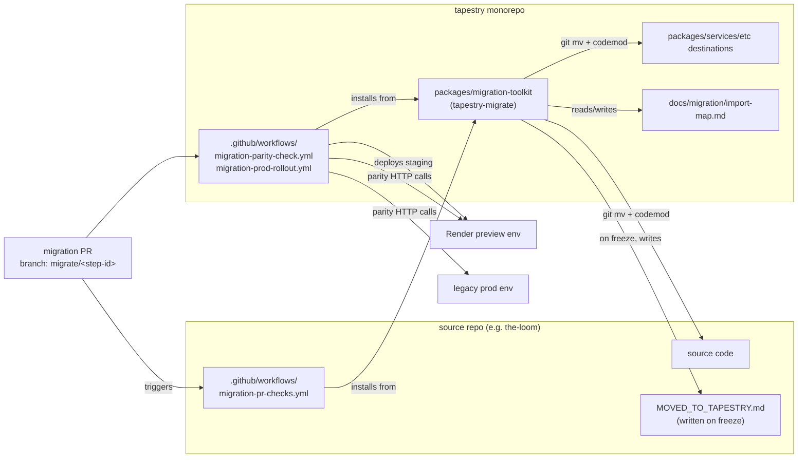
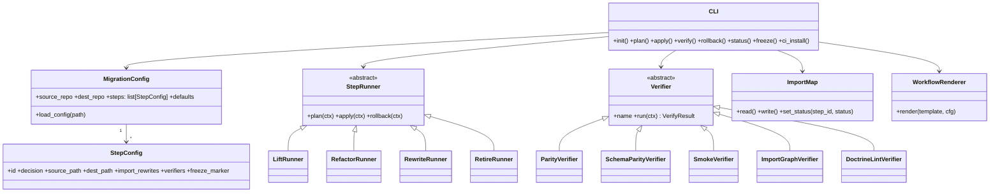

# Migration toolkit module design

**Status:** design draft, not yet implemented
**Doctrine references:** `playbook/migration/00-doctrine.md` Rules 3, 5; `migration/README.md` workflow steps 1–6.

## 1. Where it lives

**Decision: in-tree at `tapestry/packages/migration-toolkit/`. Not a separate repo.**

Justification: (a) the toolkit's correctness is co-evolving with Tapestry's own slot layout (`UMBRELLA.md` packages slot), so version skew between a separate repo and Tapestry's destination conventions would create false-positive parity reports; (b) `packages/` is exactly the distributable-shared-code slot UMBRELLA.md already names, and the toolkit IS distributable shared code — it ships to client-fork repos via `pip install tapestry-migrate` from a private index built off the tapestry monorepo, the same way `packages/sdk` will. Splitting later is a `git subtree split` if a client needs the package without the rest of Tapestry.

## 2. Module structure

```text
tapestry/packages/migration-toolkit/
├── pyproject.toml                 # name = "tapestry-migrate", entry = tapestry_migrate.cli:app
├── README.md
├── CHANGELOG.md
├── src/tapestry_migrate/
│   ├── __init__.py                # exports public API (see §3)
│   ├── cli.py                     # Typer app; commands in §6
│   ├── config/
│   │   ├── __init__.py
│   │   ├── schema.py              # MigrationConfig, StepConfig (Pydantic v2)
│   │   ├── loader.py              # load_config(path) -> MigrationConfig
│   │   └── defaults.py            # DEFAULT_KINDS, DEFAULT_GATES
│   ├── runners/
│   │   ├── __init__.py
│   │   ├── base.py                # class StepRunner (ABC): plan/apply/rollback
│   │   ├── lift.py                # LiftRunner (git mv + import rewrite)
│   │   ├── refactor.py            # RefactorRunner (libcst codemods)
│   │   ├── rewrite.py             # RewriteRunner (no-op skeleton + commit msg)
│   │   └── retire.py              # RetireRunner (source-side freeze marker)
│   ├── verifiers/
│   │   ├── __init__.py
│   │   ├── base.py                # class Verifier (ABC): name, run(ctx) -> VerifyResult
│   │   ├── parity.py              # ParityVerifier (response-shape diff vs source)
│   │   ├── schema_parity.py       # SchemaParityVerifier (sqlglot column diff)
│   │   ├── smoke.py               # SmokeVerifier (httpx ping + status assertions)
│   │   ├── import_graph.py        # ImportGraphVerifier (no back-edges to legacy)
│   │   └── doctrine_lint.py       # DoctrineLintVerifier (Rule 1 language scan)
│   ├── codemods/
│   │   ├── __init__.py
│   │   ├── import_rewrite.py      # libcst transformer: the_loom.x -> tapestry.x
│   │   └── readme_seed.py         # seed destination README per UMBRELLA convention
│   ├── manifest/
│   │   ├── __init__.py
│   │   ├── import_map.py          # read/write docs/migration/import-map.md
│   │   └── status.py              # StepStatus enum (proposed/in-flight/imported/frozen)
│   ├── github_actions/
│   │   ├── __init__.py
│   │   ├── render.py              # render_workflow(template, ctx) -> yaml str
│   │   └── templates/             # Jinja2 .yml.j2 files (see §5)
│   │       ├── migration-pr-checks.yml.j2
│   │       ├── migration-staging-deploy.yml.j2
│   │       ├── migration-parity-check.yml.j2
│   │       └── migration-prod-rollout.yml.j2
│   ├── git/
│   │   ├── __init__.py
│   │   ├── cross_repo.py          # source-repo + tapestry-repo handles
│   │   └── prep_pr.py             # two-prep-PR helpers (Doctrine Rule 5)
│   └── telemetry/
│       ├── __init__.py
│       └── emit.py                # POST to services/telemetry-ingestion
└── tests/
    ├── fixtures/                  # tiny source-repo + tiny dest-repo
    ├── test_runners.py
    ├── test_verifiers.py
    └── test_cli.py
```

Idempotency convention follows `Make_Skills/core/db/migrations.py:35-62` (`run_all` re-entrant, `CREATE … IF NOT EXISTS`-style guards): every runner's `apply()` is safe to re-run; state lives in `import-map.md`, not in side-effects.

## 3. Public API surface

```python
# tapestry_migrate/__init__.py
from .config.schema import MigrationConfig, StepConfig
from .runners.base import StepRunner, StepResult
from .verifiers.base import Verifier, VerifyResult
from .manifest.import_map import ImportMap, StepStatus

def load_config(path: Path) -> MigrationConfig: ...
def run_step(cfg: MigrationConfig, step_id: str, *, dry_run: bool = False) -> StepResult: ...
def verify_step(cfg: MigrationConfig, step_id: str, *, gates: list[str] | None = None) -> list[VerifyResult]: ...
def rollback_step(cfg: MigrationConfig, step_id: str) -> StepResult: ...
def register_runner(kind: str, runner_cls: type[StepRunner]) -> None: ...      # plugin hook
def register_verifier(name: str, verifier_cls: type[Verifier]) -> None: ...    # plugin hook
def render_workflow(template_name: str, cfg: MigrationConfig) -> str: ...
```

`StepRunner` ABC: `plan(ctx) -> Plan`, `apply(ctx) -> StepResult`, `rollback(ctx) -> StepResult`.
`Verifier` ABC: `name: str`, `run(ctx) -> VerifyResult` (returns `passed: bool, evidence: dict`).

## 4. Configuration schema

`migration.yaml` at the source-repo root drives each step. Pydantic v2 model.

```yaml
toolkit_version: "0.1"
source_repo: { url: "https://github.com/Lizo-RoadTown/the-loom", path: "." }
dest_repo:   { url: "https://github.com/Lizo-RoadTown/tapestry",  path: "." }

defaults:
  decision: refactor          # lift | refactor | rewrite | retire
  gates: [doctrine_lint, import_graph, smoke]
  freeze_legacy_on: parity_verified

steps:
  - id: agent-context-mcp
    decision: lift
    source_path: services/agent-context
    dest_path:   services/agent-context
    import_rewrites: { "the_loom.services.agent_context": "tapestry.services.agent_context" }
    verifiers:
      - parity:        { source_url: "https://loom-agent-context.onrender.com", dest_url: "$STAGING_URL" }
      - schema_parity: { source_dsn: "$SOURCE_DSN", dest_dsn: "$DEST_DSN", tables: [conversations, agent_memory] }
      - smoke:         { endpoints: ["/healthz", "/mcp/memory/"] }
    freeze_marker: "MOVED_TO_TAPESTRY.md"
```

Field defaults: `decision` defaults from `defaults.decision`; `verifiers` empty → run `defaults.gates` only; `freeze_marker` defaults to `MOVED_TO_TAPESTRY.md`; `import_rewrites` defaults to `{"<source_pkg>": "tapestry.<dest_pkg>"}` inferred from paths.

Example shapes:
- **service migration:** `decision: lift`, parity + schema_parity verifiers.
- **schema migration:** `decision: refactor`, `schema_parity` only, `freeze_marker: null`.
- **client library:** `decision: rewrite`, `import_graph` + `smoke` only.
- **docs migration:** `decision: lift`, `doctrine_lint` only.

## 5. GitHub Actions templates

All ship as reusable workflows (`on: workflow_call`) under `github_actions/templates/`. The CLI's `tapestry-migrate ci install` renders them into `.github/workflows/` of the consuming repo.

| Workflow | Trigger | Inputs | Does | Outputs |
|---|---|---|---|---|
| `migration-pr-checks.yml` | `pull_request` on branches `migrate/**` | `step_id` (str) | Loads `migration.yaml`; runs `doctrine_lint`, `import_graph`, dry-run `plan`. Posts plan as PR comment. | `plan.json` artifact. |
| `migration-staging-deploy.yml` | `workflow_dispatch`; `push` to `migrate/**` after PR checks pass | `step_id`, `staging_env` | Applies the step to a staging branch in dest_repo, deploys to a Render preview, exports `$STAGING_URL`. | `staging_url`. |
| `migration-parity-check.yml` | `workflow_run` after staging deploy succeeds | `step_id`, `staging_url`, `source_url` | Runs `parity`, `schema_parity`, `smoke` verifiers against source vs staging. Fails the run if any gate fails. | `parity-report.json` artifact + PR comment. |
| `migration-prod-rollout.yml` | `workflow_dispatch` (gated by `environment: production` reviewer) | `step_id` | Merges the migrate branch, updates `import-map.md` status → `imported`, writes the legacy `MOVED_TO_TAPESTRY.md` marker via a source-repo PR. | `commit_sha`, `freeze_pr_url`. |

Human approval is enforced via GitHub `environment` protection rules on the prod-rollout job, not in toolkit code.

## 6. CLI commands

`tapestry-migrate` (Typer, entry point `tapestry_migrate.cli:app`):

1. `init <step-id> --kind <lift|refactor|rewrite|retire>` — scaffold a step entry in `migration.yaml`.
2. `plan <step-id>` — print what `apply` would do; no writes.
3. `apply <step-id>` — run the step; updates `import-map.md` status → `in-flight`.
4. `verify <step-id> [--gate <name>]…` — run verifiers; emit JSON report.
5. `rollback <step-id>` — revert the `apply` (git reset of the step's commits in dest; restore source if freeze marker was written).
6. `status [--step <id>]` — read `import-map.md` + show per-step state.
7. `freeze <step-id>` — write `MOVED_TO_TAPESTRY.md` in source, status → `frozen`.
8. `ci install` — render workflow templates into `.github/workflows/`.
9. `ci render <template>` — print a single workflow YAML to stdout (for review).
10. `import-map sync` — reconcile `docs/migration/import-map.md` against `migration.yaml`.
11. `doctor` — diagnostic: source/dest git access, env vars, registered runners/verifiers.
12. `version` — toolkit version + which runners/verifiers are registered.

## 7. Plugin/extension points

Two extension surfaces, both via Python entry points in `pyproject.toml`:

- `tapestry_migrate.runners` — registers a `StepRunner` subclass under a `kind` string. A new kind (e.g. `nosql_schema`) ships as a separate package `tapestry-migrate-nosql` declaring `[project.entry-points."tapestry_migrate.runners"] nosql_schema = "tapestry_migrate_nosql:NoSQLRunner"`. The core loader calls `importlib.metadata.entry_points()` at startup and calls `register_runner` for each.
- `tapestry_migrate.verifiers` — same mechanism for verifiers (e.g. `gcp_parity`, `mongo_schema_parity`).

In-process registration via `register_runner` / `register_verifier` covers ad-hoc cases (a one-off client-specific verifier in their repo's `conftest.py`-style bootstrap module).

Workflow templates are overrideable: the CLI looks for `.tapestry-migrate/templates/<name>.yml.j2` in the consuming repo before falling back to the packaged template.

## 8. What the toolkit does NOT do

- **Does not own service deploy specifics.** It calls Render/Vercel via their existing GitHub Actions (`render-deploy-action`, `amondnet/vercel-action`); it does not embed deploy logic.
- **Does not manage secrets.** Secrets come from GitHub Actions `secrets:` context. The toolkit reads env vars, never writes them.
- **Does not replace human approval.** Prod rollout requires a GitHub `environment` reviewer. The toolkit refuses to merge a step PR itself.
- **Does not run the legacy/source repo's tests.** Each repo owns its CI. The toolkit only runs cross-repo parity checks.
- **Does not delete source code.** Retirement is a freeze marker + status change. Archival is an operator-driven separate action.
- **Does not invent destination slots.** If `dest_path` doesn't already exist in Tapestry (with at least a README per Doctrine Rule 5 Prep-2), `apply` fails fast.
- **Does not edit `docs/migration/legacy-repo-inventory.md` or `naming-corrections.md`.** Those are operator-authored.

## 9. First-3-PRs roadmap

**v0.1.0 — minimum viable (3 PRs):**
1. Skeleton package, `MigrationConfig` schema, `load_config`, `cli.py` with `init`/`plan`/`status`/`version`/`doctor`, `LiftRunner` only, `DoctrineLintVerifier` + `ImportGraphVerifier`. Tested against a fixture source/dest pair.
2. `migration-pr-checks.yml` template + `ci install`/`ci render`. CI runs the two v0.1 gates on every `migrate/**` PR in Tapestry.
3. `import-map.md` read/write + `import-map sync`. Used to land the first real migration (agent-context-mcp lift) end-to-end manually.

**v0.2.0:** `RefactorRunner` (libcst rewrites), `SmokeVerifier`, `SchemaParityVerifier`, `migration-staging-deploy.yml`, `migration-parity-check.yml`. Enables the first migration where parity is machine-checked, not eyeballed.

**v1.0.0:** all four runners, all six verifiers, all four workflow templates, entry-point plugin loading, `rollback` end-to-end, `freeze` writing legacy markers, telemetry emission to `services/telemetry-ingestion`. Stable schema for `migration.yaml`. First client-fork uses it without modification.

## 10. Diagrams

### Container diagram



### Internal module layers



---

**Pattern citations:**
- Idempotent `run_all` re-entrancy + status-table-as-state model: `Make_Skills/core/db/migrations.py:35-62` and `:380-394`.
- Scenario-table verification structure (numbered scenarios, `_assert(condition, label)`, exit non-zero on first failure, cleanup in `finally`): `Make_Skills/scripts/verify_bridge_receiver.py:175-333`. `SmokeVerifier` and `ParityVerifier` copy this structure verbatim.
- Doctrine language list (Rules 1, 3, 5): `tapestry/docs/playbook/migration/00-doctrine.md:9-23, 32-40, 49-55`. `DoctrineLintVerifier` greps for the "language to avoid" list against the migration PR diff.
