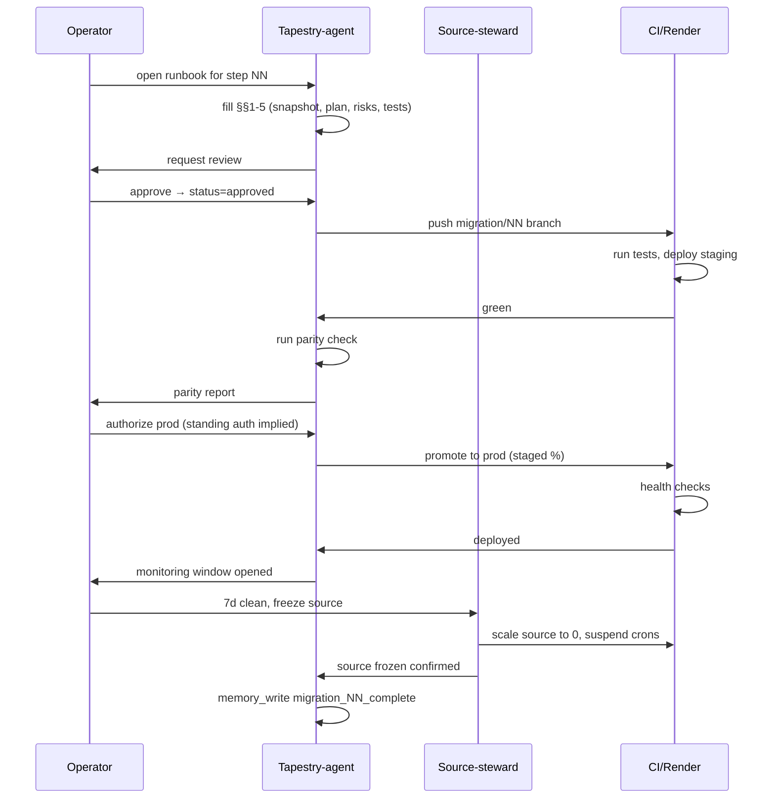

# Migration runbook template

Every migration step uses this template. No exceptions, no "this step is small enough to skip." Same structure makes parallel migrations reviewable.

---

## 1. Runbook lifecycle states

```mermaid
stateDiagram-v2
    [*] --> proposed
    proposed --> approved: operator + Tapestry-agent sign-off
    approved --> staging-deployed: CI green on staging branch
    staging-deployed --> parity-verified: parity check matrix passes
    parity-verified --> prod-rolling: operator authorizes rollout
    prod-rolling --> prod-deployed: health checks green for 30min
    prod-deployed --> monitoring: 24h observation window opens
    monitoring --> complete: 7d window closes, source frozen
    complete --> [*]

    approved --> aborted: blocker found
    staging-deployed --> aborted: staging fails irrecoverably
    parity-verified --> rolled-back: parity regression
    prod-rolling --> rolled-back: rollback trigger fires
    prod-deployed --> rolled-back: monitoring trigger fires
    aborted --> [*]
    rolled-back --> proposed: re-plan
```

**Required artifacts per gate:**

| Transition | Artifact |
|---|---|
| `proposed → approved` | Filled runbook §§1-5, ADR if architectural |
| `approved → staging-deployed` | CI run URL, staging deploy URL |
| `staging-deployed → parity-verified` | Parity check report (§7) |
| `parity-verified → prod-rolling` | Operator written authorization (PR comment or memory write) |
| `prod-rolling → prod-deployed` | Render deploy ID, health-check screenshot |
| `prod-deployed → monitoring` | Monitoring dashboard link, alert wiring confirmed |
| `monitoring → complete` | 7d incident-free log, source-freeze confirmation |
| `* → rolled-back` | Rollback PR, incident memory write |
| `* → aborted` | Abort rationale memory write |

---

## 2. The runbook document template

```markdown
# Step NN — <short name>

**Owner:** <operator handle>
**Source repo:** <make-skills | the-loom>
**Source path:** <path/to/subsystem>
**Destination:** tapestry/<path>
**Decision:** [ ] Lift  [ ] Refactor  [ ] Rewrite  [ ] Retire
**Status:** proposed
**ADR:** <link or N/A>

## Pre-flight checklist
- [ ] Source code grep'd; all callers identified
- [ ] Source env vars enumerated (names + current values in Render)
- [ ] Source cron jobs enumerated (names + schedules)
- [ ] Destination path collision-checked
- [ ] No in-flight PR on source that touches this surface
- [ ] Memory recall run for `feedback_*` matching this subsystem

## Pre-step capability snapshot
Concrete APIs the source currently exposes:
- Endpoints: `<METHOD /path>` → contract
- Background jobs: `<job-name>` → schedule + side effects
- DB tables touched: `<schema.table>` → read/write
- External calls: `<service>` → purpose
- Env vars consumed: `<NAME>` → meaning

## Change plan
- Files added in Tapestry: <list>
- Files modified in Tapestry: <list>
- Source files frozen (no edits permitted): <list>
- Migration path: <how a request flows during overlap>

## Risk register
| Risk | Probability | Impact | Mitigation |
|---|---|---|---|
| <risk> | L/M/H | L/M/H | <action> |

## Test matrix
Reference `02-testing-strategy.md` test classes. Mark applicable:
- [ ] Unit — destination
- [ ] Contract — source vs destination wire-compat
- [ ] Integration — staging DB
- [ ] Parity — shadow traffic compare
- [ ] Smoke — prod canary
- [ ] Regression — downstream consumers

## Staging deploy
1. Branch: `migration/NN-<slug>`
2. Render staging service: <service-id>
3. Env vars to set on staging (check existing first, per `feedback_check_for_existing_value_before_setting_env_var`): <list>
4. Migrations to run: <list>
5. Deploy command / Render auto-deploy: <which>

## Parity check (go/no-go)
Run for ≥ 1 hour or N requests, whichever larger.
- [ ] Response body diff < 0.1% (excluding timestamps/UUIDs)
- [ ] Latency p95 within 20% of source
- [ ] Error rate ≤ source
- [ ] No new schema constraint violations
- [ ] Downstream consumers unchanged behavior

**Go:** all five green. **No-go:** any red → back to `approved`.

## Production rollout
- Rollout style: [ ] cutover  [ ] shadow→primary  [ ] percentage
- Percentage steps: <e.g. 10% → 50% → 100% with 30min gaps>
- Rollback trigger conditions:
  - Error rate > 2× baseline for 5min
  - p95 latency > 1.5× baseline for 10min
  - Any 5xx on critical endpoint <list>
  - Downstream consumer escalation
- Rollback command: <exact Render redeploy or DNS flip>

## Sign-off
- [ ] Operator: <handle> @ <date>
- [ ] Tapestry-agent: <session-id> @ <date>
- [ ] Source steward (make-skills or the-loom): <handle> @ <date>

## Post-deployment monitoring
- **24h window:** error rate, latency, alert count → dashboard <link>
- **7d window:** drift detection, downstream incident review
- Alert routes: <where pages go>

## Source prototype retirement
Only after 7d window clean:
- [ ] Source endpoint returns 410 Gone OR redirects to Tapestry
- [ ] Source Render service scaled to 0 OR converted read-only
- [ ] Source cron jobs disabled (see `04-render-cron-orphans.md`)
- [ ] Source env vars deleted from Render
- [ ] Source code path tagged `migrated-NN` in git
```

---

## 3. Per-gate sign-off requirements

| Gate | Approvers | Recording mechanism |
|---|---|---|
| `proposed → approved` | Operator + Tapestry-agent | PR review on runbook file |
| `approved → staging-deployed` | CI (automated) | Green check on commit |
| `staging-deployed → parity-verified` | Tapestry-agent runs check, operator countersigns | Parity report committed; memory write `migration_NN_parity_verified` |
| `parity-verified → prod-rolling` | Operator only (standing authorization per `feedback_dont_default_to_waiting_for_merge_approval_when_authorization_is_standing` — proceed unless operator has paused this specific step) | PR comment or signed memory write |
| `prod-rolling → prod-deployed` | Automated health checks | Render deploy success + green checks |
| `monitoring → complete` | Operator + source steward | Memory write `migration_NN_complete` |
| `* → rolled-back` | Whoever pulled trigger | Incident memory write + rollback PR |

ADRs required for: Rewrite decisions, schema changes, any change to public API contracts.

---

## 4. Common failure-mode sub-runbooks

### 4a. Spec drift (ref `01-bridge-spec-drift-pattern.md`)
**Symptoms:** parity check shows field-name/shape divergence.
**Immediate:** halt rollout; pin source spec version; diff against destination.
**Follow-up PR:** align destination to source spec OR publish breaking-change notice with consumer migration window.

### 4b. UUID mismatch (ref `02-cross-fleet-uuid-mismatch.md`)
**Symptoms:** destination rejects records with "unknown tenant/agent".
**Immediate:** stop writes; snapshot both ID maps.
**Follow-up PR:** ID translation table + backfill migration; do not regenerate UUIDs.

### 4c. Auth bridge duplication (ref `03-auth-bridge-duplication-trigger.md`)
**Symptoms:** two services validating same JWT, conflicting refresh.
**Immediate:** designate one validator; other becomes pass-through.
**Follow-up PR:** delete duplicate validator; add contract test asserting single source.

### 4d. Render cron orphans (ref `04-render-cron-orphans.md`)
**Symptoms:** job runs in both source + destination.
**Immediate:** disable source cron in Render dashboard (suspend, don't delete).
**Follow-up PR:** document disabled cron in runbook §retirement; delete after 7d.

### 4e. Env var conflict
**Symptoms:** destination reads env var with stale value from source's last set.
**Immediate:** per `feedback_check_for_existing_value_before_setting_env_var` — read current Render value before overwriting; if different, halt.
**Follow-up PR:** ADR documenting which service owns the var going forward.

---

## 5. The "Tapestry is canonical" gate

This is the transition `parity-verified → prod-rolling`. After it, Tapestry holds the contract; the source prototype is FROZEN.

**Confirms parity:**
- Parity check (§7) green ≥ 1 hour
- Contract tests pass against both source + destination
- Operator written authorization (per standing-authorization principle: proceed unless explicitly paused)

**Stays running in source during overlap:**
- Read endpoints only, returning data from shared DB
- No writes accepted; source returns 410 on write paths
- Cron jobs suspended

**Source Render service becomes read-only:**
1. Set source env var `READ_ONLY_MODE=true`
2. Verify write endpoints return 410
3. Suspend cron jobs in Render dashboard
4. Reduce instance count to minimum
5. Memory write: `migration_NN_source_frozen` with timestamp + service ID

---

## 6. The "source repo archived" gate

LAST step of the entire Tapestry migration, after every per-subsystem runbook reaches `complete`.

**Verified before archive:**
- [ ] All subsystem runbooks at `complete`
- [ ] Zero traffic to source Render services for 30d
- [ ] All cron jobs deleted (not suspended) in source Render
- [ ] All source env vars deleted from Render
- [ ] DNS records pointing at Tapestry only
- [ ] Final tag: `archived-YYYY-MM-DD` on source repo `main`

**Archive location:** GitHub repo archived in-place (settings → archive). Repo stays read-accessible at original URL forever. Do not delete.

**Linkability of historical references:**
- Commit SHAs in source remain resolvable
- ADRs in Tapestry reference source commits by full SHA + repo URL
- Migration runbooks committed to `tapestry/docs/migration-cicd/runbooks/NN-<slug>.md` — each is the permanent record of what moved and why

---

## Swim-lane: one migration step


