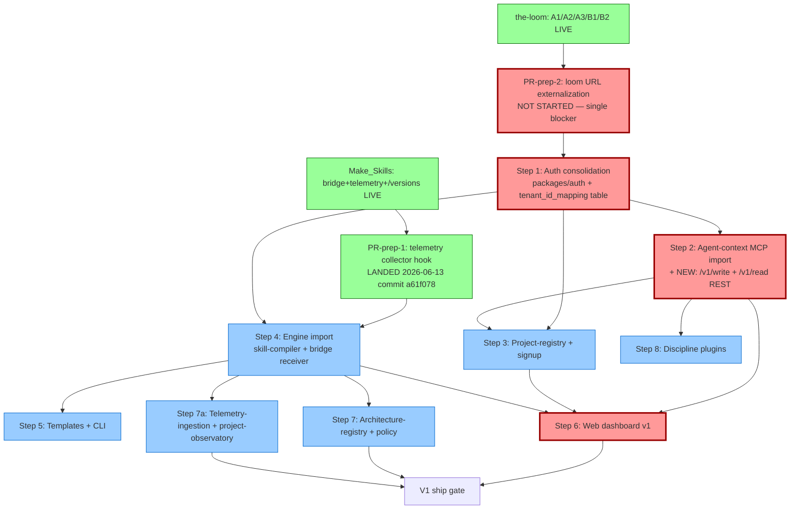
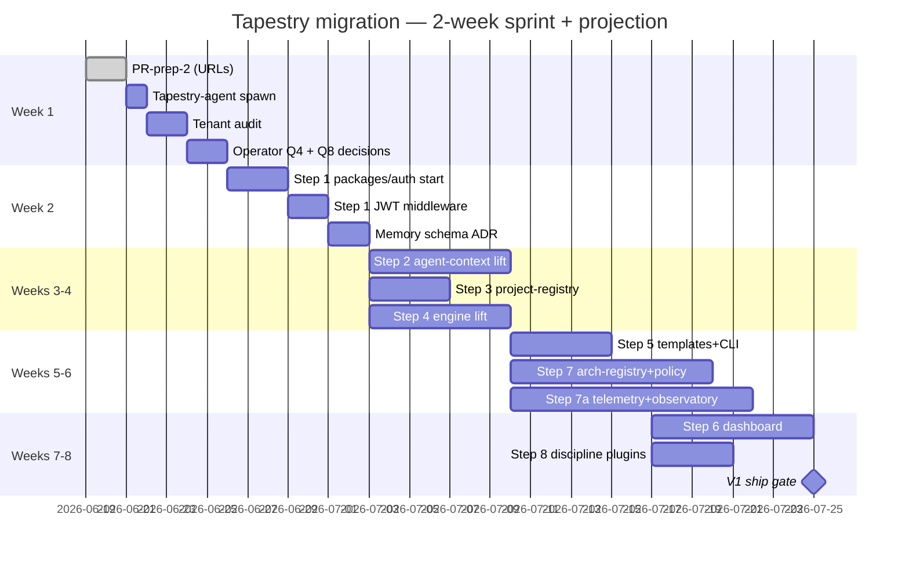
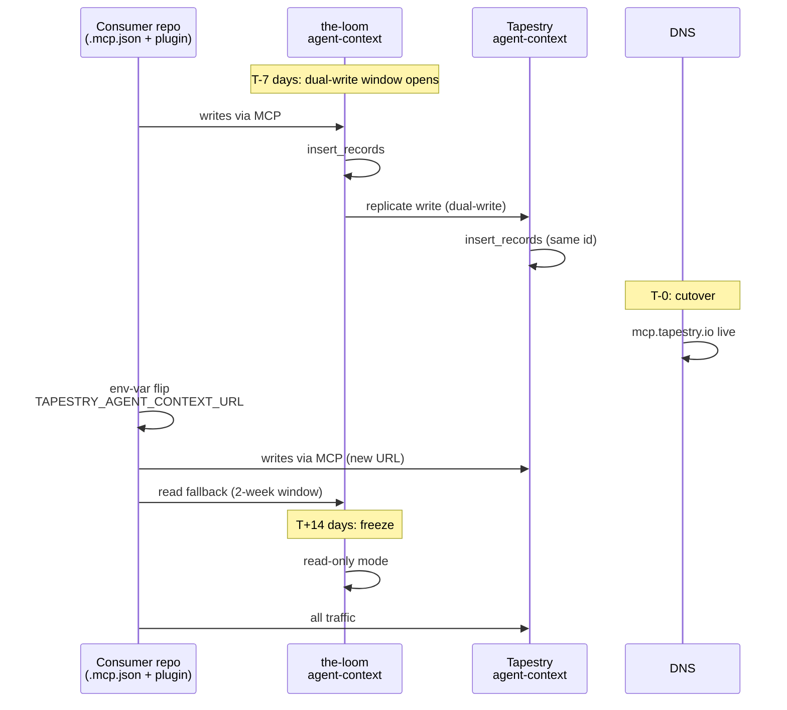

# Tapestry migration readiness + sequenced execution plan

**Date:** 2026-06-18
**Author:** loom-agent (Opus 4.7), executed in `c:/Users/Liz/the-loom/`
**Status:** Draft — pending evaluator subagent critique + operator (Liz) arbitration
**Companion artifacts:**
- v1 roadmap: [`tapestry/docs/proposals/2026-06-13-v1-scope-and-roadmap.md`](../proposals/2026-06-13-v1-scope-and-roadmap.md)
- MANIFESTO: [`tapestry/MANIFESTO.md`](../../MANIFESTO.md)
- Runtime-observation followup: [`tapestry/docs/research/2026-06-18-outside-review-runtime-observation-followup.md`](../research/2026-06-18-outside-review-runtime-observation-followup.md)
- the-loom platform audit: [`the-loom/docs/research/2026-06-17-platform-state-audit.md`](https://github.com/Lizo-RoadTown/the-loom/blob/main/docs/research/2026-06-17-platform-state-audit.md)
- Binding rule: loom-memory `feedback_tapestry_is_canonical_loom_and_make_skills_are_legacy_source_2026_06_13`
- Binding rule: loom-memory `feedback_tapestry_parallel_build_not_pause_and_migrate_2026_06_12`
- Operating framework: `tapestry/docs/migration-cicd/` (see §0 below)

---

## §0. Operating framework — `tapestry/docs/migration-cicd/`

**This plan sequences against an existing operating framework, it does not invent one.** Per `tapestry_migration_cicd_plan_committed_2026_06_13`, MS-agent shipped a 5-document migration CI/CD plan at `tapestry/docs/migration-cicd/` on 2026-06-13:

| # | Document | What it provides |
|---|---|---|
| 01 | [`01-pipeline-architecture.md`](../migration-cicd/01-pipeline-architecture.md) | 6 GitHub Actions workflows, Render preview envs, parity gates per migration kind, rollback procedure, secrets management, PR template |
| 02 | [`02-testing-strategy.md`](../migration-cicd/02-testing-strategy.md) | 4 mandatory test categories + **drift-catcher** test + golden-payload corpus + continuous-parity scheduling |
| 03 | [`03-migration-toolkit-design.md`](../migration-cicd/03-migration-toolkit-design.md) | Reusable `tapestry-migrate` Python package at `packages/migration-toolkit/`, 12 CLI commands, plugin hooks |
| 04 | [`04-runbook-template.md`](../migration-cicd/04-runbook-template.md) | 8-state runbook state machine + filled-out-able template per migration step |
| — | [`README.md`](../migration-cicd/README.md) | Index + 8 contract assertions (binding once ratified) |

**Every step in §5 below maps to a `runbooks/NN-<slug>.md` artifact filled out per the doc-04 template, gated by the doc-02 drift-catcher + parity tests, executed via the doc-01 pipeline workflows.** Where this plan says "done criterion = X," that translates to a runbook state-machine transition (`scoped → designed → parity-verified → prod-rolling → complete`); "parity gate" means a CI gate from doc-02; "1 PR per concern" means a PR built from the doc-01 template + migration-toolkit CLI commands.

**The 8 contract assertions are binding for every step:**

1. No migration PR merges without all 4 test categories green.
2. Every production drift becomes a fixture in `tests/fixtures/golden/<contract>/invalid/<reason>/` in the same PR that fixes it.
3. The drift-catcher is a cross-repo required check.
4. Rollback verification is part of CI, not incident response.
5. Tapestry is canonical; source prototype is frozen at the `parity-verified → prod-rolling` transition.
6. Source repo is archived only after every per-subsystem runbook reaches `complete` + 30 days of zero traffic.
7. The toolkit ships as `tapestry/packages/migration-toolkit/`, distributable as `pip install tapestry-migrate`.
8. Per-client customization lives in 3 files only.

If a recommendation in this plan disagrees with `tapestry/docs/migration-cicd/` doctrine, **the doctrine wins**. This plan adds: (a) ordering of steps against the existing v1 roadmap, (b) cataloging of work landed this session that needs migration treatment, (c) the operator-decision surface — not new doctrine.

**Implied PR-prep-3:** ship `packages/migration-toolkit/` v0.1.0 per doc-03 §9 BEFORE any per-step runbook starts. Status today: designed, not implemented. Treat as a parallel track to PR-prep-1 / PR-prep-2.

---

## §1. TL;DR

**Readiness: YELLOW.** Source repos are stabilized (the-loom: A1/A2/A3/B1/B2 all live as of 2026-06-18 05:36 UTC; Make_Skills: bridge receiver + telemetry sender + `/versions` shipped as of 2026-06-13). Tapestry repo is **entirely empty scaffold** — every `services/*/`, `engine/*/`, `packages/*/`, `apps/*/`, `infra/*/`, `integrations/*/` directory contains nothing but a `README.md`. There is no PR-prep-2 (loom-side URL externalization) yet, no `packages/auth/` extraction yet, and no Tapestry-agent spawned. **The single blocker is PR-prep-2** — every hardcoded `loom-*.onrender.com` URL (10 production files, listed in §6) must become env-overridable before Step 2 cutover, otherwise consuming repos cannot retarget atomically. **Open Tapestry-agent when PR-prep-2 ships and Step 1 (auth) inputs are gathered** (see §4). Wall-clock estimate at one operator + two AI agents working in parallel: **4-6 weeks to Step 6 (web-dashboard), 6-8 weeks to v1 ship gate (Steps 6+7 done).**

---

## §1.5 Parallel-build framing (binding)

This plan honors `feedback_tapestry_parallel_build_not_pause_and_migrate_2026_06_12` verbatim:

> *"We keep building in the repo until the new one is built fully, a lot of the information isn't yet known. I am still experimenting."* — Liz, 2026-06-12

**What this means for execution:**

- Existing source repos (the-loom, Make_Skills) KEEP being built. No pausing. The work that landed this session (A1/A2/A3/B1/B2) is the kind of in-flight refinement that continues until each piece stabilizes.
- Migration happens when Tapestry is fully built **for a given piece** — not all-at-once, not on a fixed gantt cadence. Each step in §5 starts only when its source-repo capability has reached a stable contract.
- The 6-8 week wall-clock estimate in §1 is a *capacity estimate*, not a deadline. It assumes work proceeds in parallel; if source-repo experimentation discovers something that changes the destination shape, the estimate moves and that's expected.
- "Step N done" means the corresponding source-repo piece has stabilized AND been ported AND its runbook reached `complete` per §0 contract assertion #5. Steps are NOT independently rushed.

**What this rules out:**

- Lift-and-shift of in-flight work
- Freezing source repos to "make migration easier"
- Treating source-repo work as legacy debt that should shrink (it shrinks naturally as each piece migrates; it is not pushed out)

---

## §2. Current state inventory

### Table 2.1 — the-loom assets to migrate

| Subsystem | Source location | LOC | Dev-tooling or runtime | Production status | Tapestry destination | Port complexity | Data-migration |
|---|---|---|---|---|---|---|---|
| `services/agent-context/` (MCP host) | `the-loom/services/agent-context/{main,mcp_http,mcp_server,storage,auth_bridge,mcp_self_host_middleware}.py` | 1,567 LOC | runtime | live on starter plan ([`render.yaml:80`](https://github.com/Lizo-RoadTown/the-loom/blob/main/render.yaml#L80)) | `tapestry/services/agent-context/` (currently README-only stub) | moderate | schema-copy (pg_dump records table → Tapestry Postgres) |
| `services/agent-context/` (NEW: `/v1/write` + `/v1/read` REST endpoints, landed B1 commit `9262943`) | [`main.py:210-267`](https://github.com/Lizo-RoadTown/the-loom/blob/main/services/agent-context/main.py#L210-L267) | ~60 LOC | runtime | live as of 2026-06-18 | must port verbatim — NOT in original v1 roadmap | trivial | none |
| `services/architecture-registry/` | `the-loom/services/architecture-registry/{main,models,storage,bridge_models,bridge_hmac,promote_dispatcher,registration_handler,auth_bridge}.py` | 2,162 LOC | runtime | live on free; absorbs candidate-registry slot | `tapestry/services/architecture-registry/` (currently README-only stub) | heavy (largest single service; 7 endpoints + dispatch chain + ack receiver) | schema-copy (candidates table) |
| `services/architecture-registry/` (NEW: A3 auto-trigger at PATCH time, commit `63cf1ea`) | [`main.py:190-259`](https://github.com/Lizo-RoadTown/the-loom/blob/main/services/architecture-registry/main.py#L190-L259) | ~25 LOC | runtime | live as of 2026-06-18; only fires for `candidate_type='skill'` | port verbatim; **but see §6 cross-cutting note about Tapestry policy-daemon write path** | trivial code; non-trivial architectural choice | none |
| `services/policy/` | `the-loom/services/policy/{main,models,storage,auth_bridge}.py` | 741 LOC | runtime | live on free; audit-immutable by RLS | `tapestry/services/policy/` (currently README-only stub) | moderate | schema-copy (policy_decisions, append-only) |
| `services/project-registry/` | `the-loom/services/project-registry/{main,models,storage,auth_bridge}.py` | 960 LOC | runtime | live on free; CRUD for projects/repos/machines | `tapestry/services/project-registry/` (currently README-only stub) | moderate | schema-copy (projects, repos, machines) |
| `services/project-observatory/` | `the-loom/services/project-observatory/main.py` (23 lines) | 23 LOC | runtime (stub) | live on free; **/health stub only** ([line 21-23](https://github.com/Lizo-RoadTown/the-loom/blob/main/services/project-observatory/main.py#L21-L23)) | `tapestry/services/project-observatory/` (currently README-only stub) | n/a — re-design needed | none (stub) |
| `services/telemetry-ingestion/` | `the-loom/services/telemetry-ingestion/{main,bridge_hmac,bridge_models,skill_usage_handler}.py` | 438 LOC | runtime | live on free; receives `/skill-used` HMAC POSTs from MS engine | `tapestry/services/telemetry-ingestion/` (currently README-only stub) | moderate (logs-only today; needs Postgres rollup + query API for self-host parity per followup §1.6) | none today (no DB writes); will need rollup-table migration when query API ships |
| `services/self-observer/` (cron) | `the-loom/services/self-observer/{main,github_scanner,signal_rules,candidate_client,memory_client,synthesis,telemetry_client,config}.py` | 1,465 LOC | runtime (Render cron `0 */6 * * *`, plan starter, `crn-d8n2q4ernols73d7upbg`) | live + producing candidates | maps to `tapestry/services/project-observatory/` per MANIFESTO §4.3, NOT to a dedicated self-observer dir (per `feedback_tapestry_is_canonical...` mapping: "project-observatory" carries this role) | heavy (1,465 LOC across 8 files; new B2 `memory_client.py` + `synthesis.py` from commit `478d7e3` are tightly coupled to agent-context URL) | none |
| `infra/migrations/` | `the-loom/infra/migrations/001-006*.sql` | 6 migrations | dev-tooling (they CREATE runtime tables) | applied to loom-postgres | `tapestry/infra/migrations/` (currently README-only stub) | trivial (re-run same SQL on Tapestry Postgres) | this IS the data-migration plan |
| `adapters/claude-code/loom-discipline/` (plugin) | `the-loom/adapters/claude-code/loom-discipline/` (27 files: scripts, hooks, agents, skills, tests) | ~3k LOC across 12 .py + 1 .mjs + manifests | dev-tooling | live; published via `claude-skills-marketplace/lizo-loom` | `tapestry/integrations/claude-code/discipline/loom/` (currently README-only stub) | moderate (well-isolated; URL hardcoded at [`plugin.json:30`](https://github.com/Lizo-RoadTown/the-loom/blob/main/adapters/claude-code/loom-discipline/.claude-plugin/plugin.json#L30) + [`session_start.py:77`](https://github.com/Lizo-RoadTown/the-loom/blob/main/adapters/claude-code/loom-discipline/scripts/session_start.py#L77) + [`observer.py:84`](https://github.com/Lizo-RoadTown/the-loom/blob/main/adapters/claude-code/loom-discipline/scripts/observer.py#L84)) | none |
| `apps/web-dashboard/` | `the-loom/apps/web-dashboard/` (Next.js 14: page.tsx, candidates/page.tsx, dashboard/page.tsx, layout.tsx + .next build cache) | 4 pages | runtime (deployed via Vercel TBD; Phase 6 in-flight per platform audit §6) | live state per audit; URL-hardcoded at [`page.tsx:25,28`](https://github.com/Lizo-RoadTown/the-loom/blob/main/apps/web-dashboard/app/page.tsx#L25) + [`candidates/page.tsx:34,37`](https://github.com/Lizo-RoadTown/the-loom/blob/main/apps/web-dashboard/app/candidates/page.tsx#L34) | `tapestry/apps/web-dashboard/` (currently README-only stub) | heavy (UI + 2 server actions + Grafana iframe) | none |
| `loom-cli/` (scaffolder) | `the-loom/loom-cli/loom_cli/{cli,init,__main__}.py` | ~4 files | dev-tooling | live (per audit; intended HTTP client for project-registry) | `tapestry/packages/cli/` (currently README-only stub) | moderate (URL hardcoded at [`init.py:48,197`](https://github.com/Lizo-RoadTown/the-loom/blob/main/loom-cli/loom_cli/init.py#L48)) | none |
| `render.yaml` (loom-postgres + 7 services + 2 crons) | `the-loom/render.yaml` (341 lines) | dev-tooling | infra-as-code; canonical for loom Render account | `tapestry/infra/deploy/render.yaml` (currently README-only stub) | moderate | covered by infra/migrations |

### Table 2.2 — Make_Skills assets to migrate

| Subsystem | Source location | Production status | Tapestry destination | Port complexity | Data-migration |
|---|---|---|---|---|---|
| Skill-compiler | `Make_Skills/core/skill_making/compiler.py` (single file per PROBE: `ls Make_Skills/core/skill_making/` → only `compiler.py`) | working ([`bridge_closed_end_to_end_2026_06_13`](#) confirms kind=skill compiles end-to-end) | `tapestry/engine/skill-compiler/` (README-only stub) | moderate | n/a (stateless compiler) |
| Bridge receiver | `Make_Skills/services/skill_making/{bridge_receiver,hmac_verify,ack_sender,compile_worker,models,idempotency,tenant_mapping}.py` (7 files, ~50KB) | live, smoke-verified 2026-06-13 | `tapestry/services/skill-making/` (README-only stub) | heavy (7 modules, HMAC + idempotency + tenant mapping) | yes — idempotency table + tenant_mapping table |
| Telemetry sender (PR-prep-1) | `Make_Skills/services/skill_making/telemetry_sender.py` + `telemetry_collector.py` (commit `a61f078` 2026-06-13 wired the loop hook) | live | `tapestry/services/skill-making/` (sender side) — destination endpoint moves to `tapestry/services/telemetry-ingestion/` | trivial | none |
| API gateway (FastAPI) | `Make_Skills/services/api/main.py` (37 KB, 30+ endpoints) | live (chat, agents, skills, sessions, secrets, providers, MCP, roadmap, threads endpoints) | mostly NOT migrating to Tapestry — humancensys-app consumer absorbs the chat/agents/sessions/secrets endpoints per the [bridge contract memo](#) | scoped split (~80% of endpoints belong to humancensys-app, not Tapestry) | none |
| Adapters (project-type) | `Make_Skills/adapters/{development,classroom,research-project}/` | exists | `tapestry/engine/adapters/{development,classroom,research}/` (engine/adapters exists as scaffold) | moderate (only `development/` ships v1 per roadmap §4) | none |
| Templates | **MISSING from filesystem** — `Make_Skills/templates/` does not exist (PROBE: `ls Make_Skills/templates/` → "No such file or directory"). Roadmap §4 promises a `templates/software-project/` ships in v1. Either lives in another path inside Make_Skills, or template seed material has not been authored yet. | UNKNOWN | `tapestry/templates/software-project/` (currently has 4 README-only stubs: classroom-project, operations-project, research-project, software-project) | UNKNOWN — needs operator clarification | none |
| Runtime/tool telemetry (engine side) | `Make_Skills/services/skill_making/telemetry_collector.py` | live | `tapestry/engine/agency-to-structure/` (emitter side per [`feedback_tapestry_is_canonical...`](#) mapping) | moderate | none |
| Default-seed contract | `Make_Skills/adapters/default-seed-contract.md` | spec only | `tapestry/templates/` or `tapestry/engine/adapters/` | trivial | none |

### Table 2.3 — Tapestry repo current state

PROBE'd 2026-06-18 via `ls` against every top-level directory.

| Directory | Contents | Status |
|---|---|---|
| `services/agent-context/` | `README.md` only | **empty scaffold** |
| `services/architecture-registry/` | `README.md` only | **empty scaffold** |
| `services/audit-log/` | `README.md` only | **empty scaffold** (v1 roadmap §3 collapses into architecture-registry pod, so this may stay empty) |
| `services/candidate-registry/` | `README.md` only | **empty scaffold** (v1 roadmap §3: absorbed by architecture-registry, so this should be deleted/redirected) |
| `services/policy/` | `README.md` only | **empty scaffold** |
| `services/project-observatory/` | `README.md` only | **empty scaffold** |
| `services/project-registry/` | `README.md` only | **empty scaffold** |
| `services/skill-making/` | `README.md` only | **empty scaffold** |
| `services/telemetry-ingestion/` | `README.md` only | **empty scaffold** |
| `engine/adapters/` | (PROBE'd top-level only; subdirs not enumerated) | scaffold |
| `engine/agency-to-structure/` | `README.md` only | **empty scaffold** |
| `engine/local-observer/` | `README.md` only | **empty scaffold** |
| `engine/skill-compiler/` | `README.md` only | **empty scaffold** |
| `packages/auth/` | `README.md` only | **empty scaffold** |
| `packages/cli/` | `README.md` only | **empty scaffold** |
| `packages/schemas/` | (not enumerated; likely scaffold) | scaffold |
| `packages/sdk/` | scaffold | scaffold |
| `packages/shared-types/` | scaffold | scaffold |
| `packages/ui/` | scaffold | scaffold |
| `apps/admin-console/` | scaffold | scaffold (deferred per v1 roadmap §4) |
| `apps/docs-site/` | scaffold | scaffold (v1 marketing/docs question — see roadmap §7 Q5) |
| `apps/web-dashboard/` | `README.md` only | **empty scaffold** |
| `infra/migrations/` | `README.md` only | **empty scaffold** |
| `infra/deploy/` | `README.md` only | **empty scaffold** (render.yaml destination) |
| `infra/docker/`, `infra/terraform/` | scaffold | scaffold |
| `integrations/claude-code/` | `README.md` only | **empty scaffold** (discipline plugin destination) |
| `integrations/{codex,github,grafana,mcp,vscode}/` | scaffold | scaffold (all deferred per v1) |
| `templates/{classroom,operations,research,software}-project/` | all README-only | **empty scaffold** |
| `docs/` | `adr/`, `api-contracts/`, `architecture/`, `migration/`, `migration-cicd/`, `playbook/`, `proposals/`, `research/`, `security/` (docs exist; this is the only populated tree) | populated with proposals + research + MANIFESTO |
| `MANIFESTO.md`, `MASTER_CHECKLIST.md`, `ROADMAP.md`, `README.md`, `LICENSE` | populated | binding docs |

**Bottom line:** every code-bearing destination is empty. Every step in the v1 roadmap starts from zero code. The 12 documentation files (proposals, ADR, architecture, migration playbook) are the only substantive content. Tapestry is a "described, not built" repo today.

---

## §3. Dependency graph



**Hard prerequisites:**
- PR-prep-2 blocks Step 1 (no atomic URL cutover without it)
- Step 1 blocks Steps 2, 3, 4 (all need JWT + tenant_id resolution)
- Step 4 blocks Steps 5, 7, 7a (engine must exist before its callers move)
- Step 2 + 3 + 4 jointly block Step 6 (dashboard reads from all three)

**Soft prerequisites:**
- Step 2 unblocks Step 8 (discipline plugin's hardcoded URL resolves to Tapestry MCP)
- Step 7a could move earlier (bundled with Step 4) so engine telemetry-sender targets Tapestry directly — open question Q4 from roadmap §7

**Parallel opportunities:**
- Steps 3 + 4 can run concurrently after Step 1 (different teams)
- Step 5 (templates + CLI) can run in parallel with Steps 7 + 7a
- Step 8 (discipline plugin) can interleave with Steps 3-7 once Step 2 lands

**Longest-running step:** Step 6 (web-dashboard v1) — heavy frontend work, 4-6 PRs, requires all backing services live in Tapestry first. Tied with Step 7 (architecture-registry + policy import, ~2,900 LOC of production code).

**Critical path:** PR-prep-2 → Step 1 → Step 2 → Step 6 → ship.

---

## §4. "When to open Tapestry-agent" recommendation

### The trigger condition

**Open Tapestry-agent when ALL three are true:**

1. **PR-prep-2 has landed in the-loom.** Every URL in [the 10 production files listed in §6](#6-cross-cutting-concerns) is now env-overridable (config resolution: `$TAPESTRY_*_URL` → `tapestry.config.json` → marketplace-published default).
2. **PR-prep-2 equivalent has landed in Make_Skills.** The engine's `LOOM_ENGINE_BASE_URL` + `LOOM_REGISTRATION_ACK_URL` + `LOOM_TELEMETRY_CALLBACK_URL` are env-driven (they already are per [`promote_dispatcher.py:88-105`](https://github.com/Lizo-RoadTown/the-loom/blob/main/services/architecture-registry/promote_dispatcher.py#L88-L105) defaults). Verify Make_Skills side: bridge receiver should accept any source URL via env.
3. **Liz has decided the answer to Open Question 4** from roadmap §7: does telemetry-ingestion migrate at Step 4 (bundled with engine) or Step 7a (after main migration)? This is Tapestry-agent's first owned decision; she must seed the answer.

### Preparation gates that must clear in the-loom + Make_Skills BEFORE switch

| Gate | Where | Done criterion | Status today |
|---|---|---|---|
| A1 (cold-start strategy) | the-loom render.yaml + memory | starter plan + retired keep-warm cron + corrected memory record | **DONE** — `render.yaml:80 plan: starter`, commit `4f601e1` |
| A2 (orphan service deletion) | the-loom render.yaml | `loom-mcp-memory-server` deleted from render.yaml + Render dashboard | **DONE** — commit `f8ed543` |
| A3 (dispatch auto-trigger) | the-loom architecture-registry/main.py | `BackgroundTasks` fires on PATCH `promotion_requested` for kind=skill; 8 tests | **DONE** — commit `63cf1ea` |
| B1 (REST `/v1/write` + `/v1/read`) | the-loom agent-context | endpoints + 10 tests | **DONE** — commit `9262943` |
| B2 (synthesis memo write) | the-loom self-observer | `memory_client.py` + `synthesis.py` + main.py hook; 29 tests | **DONE** — commit `478d7e3` |
| PR-prep-1 (engine telemetry hook) | Make_Skills | runtime loop → telemetry_sender → /skill-used | **DONE** — commit `a61f078` 2026-06-13 |
| PR-prep-2 (URL externalization) | the-loom | 10 hardcoded URLs → env-driven | **NOT STARTED** |
| Source-side audit of `record` rows for tenant_id correctness (audit §C1) | the-loom postgres | `SELECT COUNT(*), tenant_id FROM records GROUP BY tenant_id` confirms zero cross-tenant leakage | **NOT VERIFIED** |
| Operator decision on Q4 (telemetry migration pacing) | n/a (operator-only) | decision recorded as ADR in `tapestry/docs/adr/` | **PENDING** |
| Operator decision on templates v1 (Q from §2.2) | n/a | clarify whether `templates/software-project/` lives in Make_Skills somewhere or needs authoring | **PENDING** |

### What "opening Tapestry-agent" means concretely

The first three commits Tapestry-agent authors should be:

1. **`docs/adr/0001-source-of-truth-for-shared-postgres-schemas.md`** — declares whether each schema (`arch_registry.*`, `policy.*`, `project_registry.*`, `agent_context.*`) lives in `tapestry/infra/migrations/` or is forklifted from the-loom verbatim. This is the load-bearing decision that governs Steps 2-7.
2. **`packages/auth/python/auth_bridge.py` + `pyproject.toml`** — the unified auth package. Currently duplicated 4+ times across the-loom services per [the audit observation at `auth_bridge.py:11-14`](#) (the file's own comment threshold). This is the actual first Tapestry code; everything else depends on it.
3. **`infra/migrations/001_init_memory.sql`** — verbatim copy of [`the-loom/infra/migrations/001_init_memory.sql`](https://github.com/Lizo-RoadTown/the-loom/blob/main/infra/migrations/001_init_memory.sql) (266 lines). Step 2's destination Postgres needs this; Tapestry-agent owns the migration sequence going forward.

The first directory Tapestry-agent owns: `tapestry/docs/adr/` + `tapestry/infra/migrations/` + `tapestry/packages/auth/`.

The first decision delegated to Tapestry-agent: **the answer to Q1 from §7 below** (data-migration cutover strategy for live records). Loom-agent + ms-agent should NOT decide this; it crosses both source repos and the destination.

### Risk of opening too early

- **No PR-prep-2 → atomic URL cutover impossible.** Every consuming repo's `.mcp.json` + plugin manifest + dashboard env points at `loom-*.onrender.com`. Without externalization, Step 2 cutover requires N+1 simultaneous commits across N consuming repos. With externalization, it's one env-var flip per consumer.
- **No tenant_id audit → migrated data may carry latent multi-tenant bugs.** the-loom is single-tenant today; if any row was ever written under a non-`SELF_HOST_TENANT_ID` value (PROBE: not verified), Tapestry inherits that contamination.
- **No Q4 decision → Tapestry-agent's first major architectural call is one nobody briefed them on.** They will either re-do the work or block waiting on the operator.

### Risk of opening too late

- **the-loom keeps accreting changes that must be re-ported.** The runtime-observation followup itself created NEW endpoints (B1 `/v1/write` + `/v1/read`) that aren't in the v1 roadmap; every additional week of source-side work creates more cross-cutting migration debt.
- **The bridge contract drift recurs.** [`lesson_third_spec_drift_payload_schema_2026_06_13`](#) records the bridge already drifted three times. Long source-side stabilization with no destination-side owner increases the odds of a fourth drift between the two source repos.
- **Operator context decays.** The longer source repos stay "the place where work happens," the more entrenched the legacy-source framing becomes — which the binding rule explicitly forbids.

### Recommendation: open Tapestry-agent in **week 1**, gated by PR-prep-2 completion

**Supersession note:** this recommendation overrides the prior defer-condition in `tapestry_v1_plan_synthesized_proposal_2026_06_13` §E (*"defer until first non-trivial migration touches >2 slots simultaneously AND neither current agent has clean ownership"*) per Liz's 2026-06-13 directive in `feedback_tapestry_is_canonical_loom_and_make_skills_are_legacy_source_2026_06_13` (*"Tapestry-agent: SPAWN NOW"*). The later memo wins. The v1 plan's other settled choices (SKU shape, auth provider, customization model, billing tier, deployment topology) are not affected.

Concretely: when PR-prep-2 ships (estimated 1-2 days of operator + loom-agent work; see §8), spawn Tapestry-agent the same day. Their first sprint is the three commits listed above + the answer to Q1.

---

## §5. Sequenced execution plan

For each step, in roadmap order.

### PR-prep-1 — Engine telemetry collector hook

**Roadmap reference:** v1 roadmap §5 PR-prep-1
**Status:** **DONE** 2026-06-13 (Make_Skills commit `a61f078`)
**Inputs needed:** none remaining
**Outputs produced:** real telemetry to `/skill-used` endpoint on the-loom's telemetry-ingestion
**Effort:** completed
**Executor:** ms-agent
**Failure modes:** n/a (already shipped)
**Done criterion:** **MET** — commit shipped, telemetry sender wired to loop

### PR-prep-2 — Loom-side URL externalization

**Roadmap reference:** v1 roadmap §5 PR-prep-2
**Status:** **NOT STARTED — the single blocker**
**Inputs needed:**
- the 10 hardcoded URLs catalogued in §6 below
- decision on env-var naming convention (`TAPESTRY_AGENT_CONTEXT_URL` vs `LOOM_AGENT_CONTEXT_URL` — recommend `TAPESTRY_*` per roadmap §5)
- consumer-repo audit (which other repos consume each URL — see [audit §8 affected repos list](https://github.com/Lizo-RoadTown/the-loom/blob/main/docs/research/2026-06-17-platform-state-audit.md#8-what-breaks-at-tapestry-migration))

**Outputs produced:**
- Every hardcoded `loom-*.onrender.com` becomes `os.environ.get("TAPESTRY_<X>_URL", "https://loom-<x>.onrender.com")` (legacy URL is default until cutover)
- `auth_bridge.py` extracted to a `the-loom/packages/auth/` Python package (currently duplicated 4+ times)
- 1 PR per file; each reversible

**Effort:** 4-6 hours operator + loom-agent
**Executor:** loom-source steward (loom-agent in this session) — should NOT be Tapestry-agent (Tapestry-agent doesn't exist yet)
**Failure modes:**
- Forgetting one URL → consumer breaks at cutover (mitigation: grep before commit, regression test against the list in §6)
- Externalizing too aggressively (env vars that are never set) → silent fallback to legacy works but signals migration not done (mitigation: log at startup when env var is unset and default is used)
**Done criterion:** `grep -rE 'loom-[a-z-]+\.onrender\.com' the-loom/ --exclude-dir=docs --exclude-dir=tests` returns zero hits in production source (tests + docs + snapshots can retain the literal strings)

### Step 1 — Auth consolidation

**Roadmap reference:** v1 roadmap §5 Step 1
**Inputs needed:**
- WorkOS AuthKit account decision (operator) — recommended per roadmap §6
- Decision: single Postgres tenant_id_mapping table location (recommend `tapestry/infra/migrations/000_init_platform.sql`)
- Existing `auth_bridge.py` code from the-loom (4+ duplicated copies — pick the architecture-registry version as canonical, verified against agent-context, policy, project-registry per the audit's observation)
- LOOM_JWT_PRIVATE_KEY current location: [`render.yaml:99`](https://github.com/Lizo-RoadTown/the-loom/blob/main/render.yaml#L99) on `loom-agent-context` only

**Outputs produced:**
- `tapestry/packages/auth/` populated (Python module + tests)
- `tapestry/infra/migrations/000_init_platform.sql` with `tenant_id_mapping` table
- Tapestry api gateway scaffold with JWT validation middleware
- WorkOS AuthKit integration (or `AUTHKIT_DISABLED=true` self-host fallback per roadmap §6)

**Effort:** 2-3 PRs; ~3-5 developer-days
**Executor:** Tapestry-agent (destination owner) + loom-agent (source migration)
**Failure modes:**
- WorkOS integration delays — mitigation: ship with self-host JWT-only first
- Tenant_id mapping table design wrong (single column vs FK chain) — mitigation: ADR-first
**Done criterion:** Tapestry api gateway validates a JWT minted by `the-loom/scripts/mint_loom_token.py` (or its replacement) AND issues a new JWT via WorkOS test mode

### Step 2 — Agent-context MCP import

**Roadmap reference:** v1 roadmap §5 Step 2
**Inputs needed:**
- Step 1 done
- PR-prep-2 done (URL externalization)
- `the-loom/services/agent-context/` source (1,567 LOC)
- `the-loom/infra/migrations/001_init_memory.sql` (266 lines)
- DNS for `mcp.tapestry.io` subdomain
- **Decision (NEW):** B1's `/v1/write` + `/v1/read` REST endpoints — port verbatim or displace MCP transport (see Q from §7)

**Outputs produced:**
- `tapestry/services/agent-context/` populated with full source
- `tapestry/infra/migrations/001_init_memory.sql` applied to Tapestry Postgres
- `mcp.tapestry.io` direct subdomain (NOT through REST gateway — stateful protocol)
- Dual-write window: legacy writes to both postgres instances for 2 weeks per audit recommendation §8.5
- Data migration: `pg_dump records | pg_restore` to Tapestry Postgres
- Consumer flip: every `.mcp.json:5` in the-loom, Make_Skills, tapestry, project-starter, claude-skills-marketplace, plus any consuming projects updated to new URL

**Effort:** 1 main PR + 1 cutover PR + 1 freeze PR; ~5-7 developer-days
**Executor:** Tapestry-agent (destination) + loom-agent (source)
**Failure modes:**
- Memory data loss during cutover (mitigation: dual-write window + read-fallback to legacy for 14 days)
- MCP handshake protocol differences between transport implementations (mitigation: port `mcp_http.py` verbatim, not reimplemented)
- pgvector extension missing on Tapestry Postgres (mitigation: ADR-first; ensure plan supports it)
**Done criterion:** every consuming repo's `.mcp.json` points at `mcp.tapestry.io`; `memory_recall` returns identical results from both old + new; legacy is frozen-read-only

### Step 3 — Project-registry + signup endpoint

**Roadmap reference:** v1 roadmap §5 Step 3
**Inputs needed:**
- Steps 1, 2 done
- `the-loom/services/project-registry/` source (960 LOC)
- `the-loom/infra/migrations/002_init_projects.sql`
- New signup flow design (email verify, project CRUD)

**Outputs produced:**
- `tapestry/services/project-registry/` populated
- Tenant signup endpoint live
- `the-loom/loom-cli/loom_cli/init.py` URL flipped to Tapestry

**Effort:** 2-3 PRs; ~3-4 developer-days
**Executor:** Tapestry-agent + loom-agent
**Failure modes:**
- Signup flow couples to WorkOS UI flow (mitigation: signup is its own PR, separate from registry CRUD migration)
**Done criterion:** `tapestry init <project>` creates a project in Tapestry's project-registry, NOT the-loom's

### Step 4 — Engine import (skill-compiler + skill-making receiver)

**Roadmap reference:** v1 roadmap §5 Step 4
**Inputs needed:**
- Steps 1, 2 done
- `Make_Skills/core/skill_making/compiler.py` source
- `Make_Skills/services/skill_making/` (7 modules)
- Existing bridge HMAC contract (must preserve [per `bridge_closed_end_to_end_2026_06_13`](#))
- Decision: bundle Step 7a (telemetry-ingestion) into this step OR ship later (open Q4)

**Outputs produced:**
- `tapestry/engine/skill-compiler/` populated
- `tapestry/services/skill-making/` populated
- HMAC contract preserved; `LOOM_ENGINE_BASE_URL` envs flipped to Tapestry endpoint
- Legacy Make_Skills bridge frozen after smoke

**Effort:** 2-3 PRs; ~5-7 developer-days
**Executor:** Tapestry-agent + ms-agent
**Failure modes:**
- Drift between engine canonical models and loom-side wire contract recurs (mitigation: [coordinated-pair alignment lesson](#) — port models.py first, rewrite loom-side to match exactly, same protocol used in PR #29)
- Engine + receiver share idempotency table; migrating one without the other corrupts state (mitigation: bundled cutover)
**Done criterion:** end-to-end smoke from Tapestry architecture-registry → Tapestry engine → Tapestry registration_handler closes the loop for kind=skill (the recursive proof per `bridge_closed_end_to_end_2026_06_13`)

### Step 5 — Templates + CLI

**Roadmap reference:** v1 roadmap §5 Step 5
**Inputs needed:**
- Steps 1-4 done
- `the-loom/loom-cli/` source
- **MISSING:** `templates/software-project/` source (PROBE shows `Make_Skills/templates/` does not exist — operator clarification needed)

**Outputs produced:**
- `tapestry/packages/cli/` with cross-platform `tapestry init` command (replaces PowerShell-only [`new-loom-project.ps1`](https://github.com/Lizo-RoadTown/the-loom/blob/main/scripts/new-loom-project.ps1))
- `tapestry/templates/software-project/` populated

**Effort:** 3-4 PRs; ~5-7 developer-days
**Executor:** Tapestry-agent + ms-agent
**Failure modes:**
- Templates source location unclear (mitigation: operator clarification before starting; possible authoring effort from scratch)
- Cross-platform CLI fights Windows path separators (mitigation: use Node.js or Python from start, not PowerShell)
**Done criterion:** `tapestry init my-app` on Windows + macOS + Linux scaffolds a working consuming-project repo

### Step 6 — Web dashboard v1

**Roadmap reference:** v1 roadmap §5 Step 6
**Inputs needed:**
- Steps 2, 3, 4 done
- `the-loom/apps/web-dashboard/` source (Next.js 14)
- Phase 6 maturity in the legacy source (audit §6 notes Phase 6 is in flight)
- Vercel deployment target

**Outputs produced:**
- `tapestry/apps/web-dashboard/` populated
- Vercel deploy
- Dashboard wired to `api.tapestry.io` (no more direct `loom-*.onrender.com`)
- Grafana iframe URL via `NEXT_PUBLIC_GRAFANA_DASHBOARD_URL` (no change — Grafana Cloud is external)

**Effort:** 4-6 PRs; ~7-10 developer-days
**Executor:** Tapestry-agent + loom-agent
**Failure modes:**
- Phase 6 features (project picker, multi-tenant prep) aren't done in legacy at migration time (mitigation: defer those features OR finish them in legacy before lift)
- Server-action API changes (mitigation: API contract version-locked)
**Done criterion:** Promote/Hold/Reject buttons on `app.tapestry.io/candidates` PATCH a Tapestry candidate (audit-logged in Tapestry policy)

### Step 7 — Architecture-registry + policy import

**Roadmap reference:** v1 roadmap §5 Step 7
**Inputs needed:**
- Step 4 done
- `the-loom/services/architecture-registry/` source (2,162 LOC across 8 modules)
- `the-loom/services/policy/` source (741 LOC)
- A3 auto-trigger code at `architecture-registry/main.py:234-249` — **must port verbatim** OR redesign per Tapestry policy daemon
- `infra/deploy/render.yaml` for Tapestry

**Outputs produced:**
- `tapestry/services/architecture-registry/` populated
- `tapestry/services/policy/` populated
- `tapestry/infra/migrations/003_init_candidates.sql` + `004_init_policy.sql` applied
- Data migration: candidates + policy_decisions tables forklifted

**Effort:** 4-6 PRs; ~8-12 developer-days (largest single migration; 2,900+ LOC + the dispatch chain + the HMAC ack receiver)
**Executor:** Tapestry-agent + loom-agent
**Failure modes:**
- A3 auto-trigger architectural mismatch with Tapestry policy daemon (see §6 cross-cutting note) — mitigation: ADR-first on policy-daemon write path
- Bridge HMAC secret rotation during cutover (mitigation: dual-secret window)
**Done criterion:** Promote click in Tapestry dashboard → Tapestry architecture-registry → Tapestry policy → Tapestry engine → kind=skill compiled → Tapestry candidate marked `promoted`. Same recursive proof as `bridge_closed_end_to_end_2026_06_13` but inside Tapestry.

### Step 7a — Telemetry-ingestion + project-observatory import

**Roadmap reference:** v1 roadmap §5 Step 7a (added in revision; open Q4)
**Inputs needed:**
- Step 4 done (engine telemetry-sender targets need a Tapestry endpoint)
- `the-loom/services/telemetry-ingestion/` source (438 LOC; logs-only today)
- `the-loom/services/project-observatory/` source (23 LOC — STUB)
- **NEW from followup §4.2:** decision on Postgres rollup + read API for self-host parity
- **NEW from followup §2:** decision on observation-decomposer component (the missing architecture)
- **NEW from followup §3.1:** policy-bounded cascade design (max_auto_level per kind/risk)

**Outputs produced:**
- `tapestry/services/telemetry-ingestion/` populated WITH Postgres rollup + read API (per followup §1.6 — not optional for self-host parity)
- `tapestry/services/project-observatory/` populated (replaces stub with real query API)
- **NEW:** `tapestry/services/candidate-decomposer/` or `tapestry/engine/observation-decomposer/` (followup §2.4)
- **NEW:** policy daemon enhanced with `actionable_backlog_count` metric (followup §3.3)

**Effort:** 2-3 PRs for the lift + 4-6 PRs for the new components; ~10-15 developer-days
**Executor:** Tapestry-agent + loom-agent
**Failure modes:**
- Observation-decomposer scope creep (mitigation: minimum-viable first — decompose into `(kind, signals[])` tuples only, defer artifact-emission logic to v2)
- Self-host telemetry parity gap persists (mitigation: Postgres rollup IS in scope; don't ship logs-only)
**Done criterion:** A skill invocation 30 times in 30 days → telemetry-ingestion writes Postgres row → project-observatory query API returns `invocations_30d=30` → self-observer's `TelemetryClient.invocations_30d` (currently stubbed to `None` per the followup) returns the real number → orphan detection branch fires correctly

### Step 8 — Discipline plugins

**Roadmap reference:** v1 roadmap §5 Step 8
**Inputs needed:**
- Step 2 done (so plugin URL config resolves to Tapestry MCP)
- `the-loom/adapters/claude-code/loom-discipline/` source (27 files)
- `Make_Skills/adapters/claude-code/make-skills-discipline/` source — **DOES NOT EXIST per `feedback_tapestry_is_canonical...` reconciliation 2026-06-14** (make-skills-discipline was deleted from marketplace in commit `63604cd`). So Step 8 migrates ONE flavor, not two.
- Marketplace publishing CI

**Outputs produced:**
- `tapestry/integrations/claude-code/discipline/loom/` populated
- Marketplace plugin publishes from Tapestry CI (not from the-loom)
- Default URL in `.claude-plugin/plugin.json` flipped from `loom-agent-context.onrender.com` to Tapestry MCP

**Effort:** 2-3 PRs; ~3-4 developer-days
**Executor:** Tapestry-agent + loom-agent
**Failure modes:**
- Plugin hook contract changes during port (mitigation: port verbatim, change in v2)
**Done criterion:** `claude --plugin install tapestry-discipline@tapestry` resolves to Tapestry source; hooks fire identically; URL points at Tapestry MCP

---

## §6. Cross-cutting concerns (carry-over items)

### New code from this session that must migrate cleanly

**6.1 — NEW REST endpoints in agent-context (B1, commit `9262943`)**

[`the-loom/services/agent-context/main.py:210-267`](https://github.com/Lizo-RoadTown/the-loom/blob/main/services/agent-context/main.py#L210-L267) — `POST /v1/write` + `POST /v1/read`. **Not in original v1 roadmap.** These were created so the self-observer cron can write the synthesis memo without doing the MCP transport handshake.

**Migration handling:** port verbatim to `tapestry/services/agent-context/`. They co-exist with the MCP transport at `/mcp/memory/*`. **Open question (§7):** should `/v1/write` + `/v1/read` become Step 2's canonical write/read surface (and the MCP transport become a thin wrapper)? Loom-agent recommends NO — MCP-is-canonical per [`feedback_mcp_is_canonical_not_optional`](#), REST is the secondary affordance for non-MCP callers. Decision belongs to operator + Tapestry-agent.

**6.2 — A3 auto-trigger lives at HTTP endpoint layer (commit `63cf1ea`)**

[`the-loom/services/architecture-registry/main.py:221-226`](https://github.com/Lizo-RoadTown/the-loom/blob/main/services/architecture-registry/main.py#L221-L226) carries an explicit Tapestry-survival note in the docstring:

> Tapestry-survival note: this trigger lives at the HTTP endpoint layer. If Tapestry's policy daemon writes status='promotion_requested' via the same PATCH endpoint, this code ports unchanged. If the policy daemon writes status directly to the DB or via a private storage API that bypasses the HTTP endpoint, this trigger MUST migrate (database trigger, domain-event handler, or post-commit hook in storage).

**Migration handling:** Tapestry-agent's ADR before Step 7 must answer: does Tapestry's policy daemon write through the HTTP endpoint, or directly to storage? If the latter, A3 needs to migrate to a database trigger (Postgres) OR a domain-event handler at the storage layer. This is a non-trivial architectural call.

**6.3 — B2 self-observer pieces (commit `478d7e3`)**

Two new modules:
- [`memory_client.py`](https://github.com/Lizo-RoadTown/the-loom/blob/main/services/self-observer/memory_client.py) — calls `/v1/write` + `/v1/read` against agent-context
- [`synthesis.py`](https://github.com/Lizo-RoadTown/the-loom/blob/main/services/self-observer/synthesis.py) — produces the §3.3 synthesis memo

**Migration handling:** port to `tapestry/services/project-observatory/` per MANIFESTO §4.3 mapping (project-observatory absorbs the self-observer role). URL targets rebind from `loom-agent-context.onrender.com` to `mcp.tapestry.io`. The §3.3 synthesis memo's content survives unchanged because the schema survives unchanged.

**6.4 — Hardcoded `loom-*.onrender.com` URLs (PR-prep-2 target list)**

Inventory per PROBE 2026-06-18 (excluding `docs/` + `tests/` + architecture snapshots):

| File | Line(s) | URL |
|---|---|---|
| `the-loom/apps/web-dashboard/app/page.tsx` | 25, 28 | architecture-registry + policy |
| `the-loom/apps/web-dashboard/app/candidates/page.tsx` | 34, 37 | architecture-registry + policy |
| `the-loom/adapters/claude-code/loom-discipline/.claude-plugin/plugin.json` | 30 | agent-context |
| `the-loom/adapters/claude-code/loom-discipline/scripts/session_start.py` | 77 | agent-context |
| `the-loom/adapters/claude-code/loom-discipline/scripts/observer.py` | 84 | architecture-registry |
| `the-loom/loom-cli/loom_cli/init.py` | 48, 197 | project-registry + agent-context |
| `the-loom/services/architecture-registry/promote_dispatcher.py` | 43, 45, 46, 90, 97, 104 | engine (Make_Skills) + ack-callback + telemetry-callback |
| `the-loom/services/architecture-registry/bridge_models.py` | 28, 29 | ack + telemetry endpoints (in docstring) |
| `the-loom/services/self-observer/config.py` | 109, 113, 117, 178 | architecture-registry + telemetry-ingestion + agent-context + project-registry |
| `the-loom/scripts/backfill_projects.py` | 45 | project-registry |
| `the-loom/scripts/new-loom-project.ps1` | 60, 129 | project-registry + agent-context |
| `the-loom/scripts/audit_concrete_rules.py` | 45 | agent-context |
| `the-loom/scripts/mint_loom_token.py` | 44 | agent-context |
| `the-loom/render.yaml` | 66, 298, 300 | engine + architecture-registry + telemetry-ingestion |

**Migration handling:** PR-prep-2 converts each to `os.environ.get("TAPESTRY_<NAME>_URL", "https://loom-<x>.onrender.com")` (legacy is default until Step 2 cutover). Test files + docs + architecture snapshots can keep the literal — they're not in the runtime request path.

### Stuck-candidate replay capability

A3's auto-trigger (commit `63cf1ea`) fires only on NEW status PATCH transitions — pre-A3 candidates already at `status='promotion_requested'` do NOT auto-fire. This was acknowledged in the A3 commit body and confirmed in production: the `layered-explanation` candidate (id `5a423ed3-1063-4fb7-9f53-f23082cdbb56`) was promoted via dashboard on 2026-06-13 BEFORE A3 shipped, sat stuck for 5 days, and was manually dispatched on 2026-06-18 via `POST /candidates/{id}/dispatch-promotion`. End-to-end succeeded (engine compiled skill `401f4ab6-119b-4ad1-abfb-141e7339213c`).

**The capability gap:** this same manual fix will be needed for any other candidates stuck during the migration window (cutover periods, transient engine outages, pre-A3 backlog elsewhere). Without a defined replay, each occurrence is ad-hoc operator+agent work.

**Wired into existing migration-cicd doctrine (NOT new infra):**

- **As a `packages/migration-toolkit/` CLI command:** add `tapestry-migrate replay-stuck-candidates [--kind=skill] [--dry-run]` to the doc-03 §3 command set. The command queries architecture-registry for `status=promotion_requested AND kind IN supported_kinds`, surfaces a confirm-list, then fires `POST /candidates/{id}/dispatch-promotion` for each. Output schema mirrors the engine ack response.
- **As a runbook subsection per doc-04:** in §4 ("operational hooks") of each migrating service's runbook, add a "Stuck-candidate sweep" entry that the operator runs at the `parity-verified → prod-rolling` transition + once during the 30-day soak. Each sweep is recorded as a runbook checkpoint (auditable).
- **As a §3.3 health-flag trigger:** the self-observer synthesis memo's RED rule already fires when `oldest_stuck_candidate_age > 24h` (per `synthesis.py:_RED_STUCK_AGE_SECONDS`). When RED for stuck-candidates, the runbook subsection above is the operator's prescribed action.

**Not new code in the-loom.** This capability lives in Tapestry's migration toolkit + runbook system; the-loom side already has the `POST /candidates/{id}/dispatch-promotion` endpoint the toolkit calls. No source-repo work required.

### Architectural debt deferred per the followup

**6.5 — 8 destination handlers for non-skill candidate kinds**

Today only `kind=skill` compiles end-to-end ([`bridge_closed_end_to_end_2026_06_13`](#)). The other 8 (`agent`, `inline_tool`, `external_tool`, `architecture_pattern`, `service`, `machine_support`, `process`, `orchestration`) ack-defer. **Per followup §4.2, this stays deferred to Tapestry.** Don't try to land in legacy. Each handler is its own architecture decision.

**6.6 — Observation-decomposer component (the missing architecture per followup §2)**

> A repeated behavior is not promoted as a whole. It is decomposed into artifact candidates.

The component does not exist in any source repo today. Per followup §2.4, it lands in Tapestry as `engine/observation-decomposer/` OR `services/candidate-decomposer/`. **Step 7a is the most natural slot** because the policy daemon also moves there.

**6.7 — Memory schema redesign**

Per [the platform audit §3 gap analysis](https://github.com/Lizo-RoadTown/the-loom/blob/main/docs/research/2026-06-17-platform-state-audit.md#3-memory-layer), the current schema misses hierarchical scopes, provenance chains, four-tier visibility, reinforcement model, and memory_class taxonomy (episodic/semantic/procedural). **Deferred per audit recommendation §B and followup §4.2.** Land cleanly in Tapestry's `infra/migrations/`, not retrofit in the-loom. Schema design ADR before Step 2.

**6.8 — Three sub-component caveats from followup §3.1**

- **Risk classifier** (input to `max_auto_level` decision) — needs to land before policy-bounded cascade fires
- **Judgment-substep skill-vs-agent disambiguation rule** — needs to land before observation-decomposer fires for judgment artifacts
- **Sibling unsupported_candidate threshold formalization** — needs to land with `actionable_backlog_count` metric in policy daemon

**All three are Step 7a-scope.** Tapestry-agent should ADR each one in sequence as they hit the implementation.

---

## §7. Risks + open questions

### Q1 — What happens to live data at migration?

**The records.** the-loom postgres has live memory records ([`records` table at `001_init_memory.sql:69-97`](https://github.com/Lizo-RoadTown/the-loom/blob/main/infra/migrations/001_init_memory.sql#L69)). Audit recommendation §C1 demands a `SELECT COUNT(*), tenant_id FROM records GROUP BY tenant_id` before migration — confirms zero cross-tenant leakage. **NOT YET RUN.**

**The candidates.** [`session_state_self_observer_loop_closed_input_side_2026_06_13`](#) records 40 self_observation candidates across 4 repos. These must migrate.

**The policy decisions.** Audit-immutable by RLS construction. pg_dump | pg_restore preserves audit chain.

**Recommended:** Tapestry-agent's first ADR (after `0001-source-of-truth-for-shared-postgres-schemas.md`) is `0002-data-migration-cutover-strategy.md` — covers all four tables (records, candidates, policy_decisions, projects) + dual-write window + freeze-read-only fallback per [audit §8.5](https://github.com/Lizo-RoadTown/the-loom/blob/main/docs/research/2026-06-17-platform-state-audit.md#8-what-breaks-at-tapestry-migration).

### Q2 — What happens to operator's existing memory records?

Same answer as Q1. The records survive verbatim — column-for-column compatible because schema is unchanged. The operator's `feedback_*`, `lesson_*`, `project_*`, `bridge_closed_end_to_end_*` records all keep their names; the memory MCP's `memory_read` resolves them identically from Tapestry's instance.

**Caveat:** the schema redesign deferred to Tapestry (§6.7) will likely ADD columns (parent_memory_id, memory_class, four-tier visibility). Existing rows get NULL defaults. Backfill scripts may be needed for the reinforcement model.

### Q3 — What happens to discipline-plugin-loaded sessions during cutover?

The plugin's `plugin.json:30` URL becomes env-driven via PR-prep-2. During cutover:

1. PR-prep-2 ships → plugin reads `$TAPESTRY_AGENT_CONTEXT_URL` (default: legacy URL); existing sessions continue working
2. Step 2 cutover → operator sets `TAPESTRY_AGENT_CONTEXT_URL=https://mcp.tapestry.io`; new sessions read from Tapestry MCP; in-flight sessions complete against whichever MCP they loaded (per [`reference_plugin_loader_binds_at_session_start`](#) — plugin binding is session-start-only)
3. Legacy MCP freezes-read-only → in-flight sessions still read; new writes go to Tapestry only

**Mitigation:** dual-write window of 14 days (audit §8.5). No session loses data.

### Q4 — What happens to the bridge between MS-side engine and loom-side architecture-registry during cutover?

The bridge today: `architecture-registry/promote_dispatcher.py` POSTs to `make-skills-api.onrender.com/bridge/promotion-candidate`. After Step 4, the engine lives in Tapestry. The bridge becomes intra-Tapestry (Tapestry's architecture-registry → Tapestry's engine).

**Risk window:** between Step 4 and Step 7. Tapestry has the engine; the-loom still has the architecture-registry. The bridge spans two repos again — but this time the OTHER direction (Tapestry-engine receives from the-loom-architecture-registry). Solvable via env-var flip: `LOOM_ENGINE_BASE_URL=https://engine.tapestry.io`.

### Q5 — Is the existing v1 roadmap still accurate post this session?

**Mostly yes. Two delta:**

1. **B1 added `/v1/write` + `/v1/read` REST endpoints** to agent-context. Not in the v1 roadmap's Step 2 brief. Step 2 must port them. (Resolved by recognizing this; no roadmap change needed.)
2. **A3 added auto-dispatch trigger** at `architecture-registry/main.py:234-249`. Not in v1 roadmap's Step 7 brief. Step 7 must port it AND make the policy-daemon-write-path architectural decision (§6.2). (May require a roadmap revision footnote.)

**No structural changes to the 8-step sequence.** No new steps needed.

### Q6 — Should B1's `/v1/write` + `/v1/read` REST endpoints displace the MCP transport at Step 2?

**Loom-agent recommends NO.** Rationale:

- MCP-is-canonical per [`feedback_mcp_is_canonical_not_optional`](#); REST is the secondary affordance
- Existing consumers (the-loom dashboard, Claude Code plugin, claude-code-cli) call MCP; flipping them to REST is unnecessary churn
- `/v1/write` + `/v1/read` exist for callers that CAN'T do MCP (the Render cron — `httpx` is simpler than the MCP HTTP transport handshake)
- Both surface the same underlying `storage.insert_records` (per [agent-context/main.py:238-241](https://github.com/Lizo-RoadTown/the-loom/blob/main/services/agent-context/main.py#L238-L241)); no consistency risk

**Operator + Tapestry-agent decision.** Document as `tapestry/docs/adr/0003-mcp-vs-rest-write-surface-canonical.md`.

### Q7 — The three sub-components from followup §3.1 — when in the sequence?

- **Risk classifier:** lands with policy daemon (Step 7a). Cannot ship policy-bounded cascade without it.
- **Judgment-substep skill-vs-agent rule:** lands with observation-decomposer (Step 7a). Decomposer can't disambiguate without it.
- **Sibling unsupported_candidate threshold:** lands with `actionable_backlog_count` metric in policy daemon (Step 7a). Operator-facing health flag needs the threshold.

**All three are Step 7a.** Each is its own ADR.

### Q8 — Where do the templates actually live?

PROBE: `Make_Skills/templates/` does not exist. Roadmap §4 promises `templates/software-project/` ships v1. **Unknown.** Either:

(a) Templates live in another path inside Make_Skills (needs grep — `find Make_Skills -type d -name "*template*"`)
(b) Template seed material is in `Make_Skills/adapters/development/` (path exists per PROBE)
(c) Templates have not been authored yet

**Resolution:** operator clarification before Step 5.

### Q9 — Self-host telemetry parity (from followup §1.6)

If Tapestry's `services/telemetry-ingestion/` also ships log-only (like the-loom's does today), the self-host blind flaw persists at a different repo. **Per followup §1.6, MUST include Postgres rollup + read API for self-host parity.** Step 7a scope; non-negotiable.

### Q10 — Risk: bridge spec drift recurs across the migration window

[`lesson_third_spec_drift_payload_schema_2026_06_13`](#) records the bridge drifted three times pre-2026-06-13. Each drift was the SAME root cause: spec-vs-implementation. **Mitigation:** preserve the coordinated-pair alignment doctrine (PR #29). When Tapestry's bridge ships, port the canonical models.py FIRST and rewrite the receiver to match exactly. Don't allow independent evolution between Tapestry's architecture-registry and Tapestry's engine.

---

## §8. Recommended next 2-week sprint

Sized for one operator + two AI agents (loom-agent + soon-to-be Tapestry-agent) working in parallel.

### Week 1

**Day 1-2 — PR-prep-2 (loom-agent + operator)**
- Externalize the 14 hardcoded URLs from §6.4 → env-driven config
- Extract `auth_bridge.py` (4+ duplicate copies) into `the-loom/packages/auth/`
- 1 PR per concern; reversible
- **Trigger to advance:** `grep -rE 'loom-[a-z-]+\.onrender\.com' the-loom/ --exclude-dir=docs --exclude-dir=tests` returns 0 hits

**Day 2-3 — Tapestry-agent spawn (operator)**
- Spawn Tapestry-agent (the canonical destination owner per [`feedback_tapestry_is_canonical...`](#) directive "Tapestry-agent: SPAWN NOW")
- Brief: this document + MANIFESTO + v1 roadmap + runtime-observation followup
- First commits assigned: 0001 (schema source-of-truth ADR), 0002 (data-migration cutover ADR), `packages/auth/python/auth_bridge.py`, `infra/migrations/001_init_memory.sql` verbatim copy
- **Trigger to advance:** Tapestry-agent's first three commits land

**Day 3-5 — Tenant_id audit (loom-agent + operator)**
- Run `SELECT COUNT(*), tenant_id FROM records GROUP BY tenant_id; SELECT COUNT(*), tenant_id FROM candidates GROUP BY tenant_id; SELECT COUNT(*), tenant_id FROM policy_decisions GROUP BY tenant_id; SELECT COUNT(*), tenant_id FROM projects GROUP BY tenant_id;`
- Confirm every row is under `SELF_HOST_TENANT_ID = 1d8ec1b3-d62a-5fab-9a52-eb6a3e09f1c8`
- If any leakage: investigate before migration
- Document in `tapestry/docs/adr/0002-data-migration-cutover-strategy.md`
- **Trigger to advance:** audit query results recorded in ADR

**Day 5-7 — Operator Q4 + Q8 decisions**
- Q4: telemetry-ingestion at Step 4 (bundled) or Step 7a (separate)? Operator-only call.
- Q8: where do templates live? `find Make_Skills -type d -name "*template*"` + operator confirms
- **Trigger to advance:** both questions answered + recorded as ADRs

### Week 2

**Day 8-10 — Step 1 start: packages/auth + tenant_id_mapping (Tapestry-agent)**
- Port `the-loom/packages/auth/` (now extracted by PR-prep-2) to `tapestry/packages/auth/`
- Author `tapestry/infra/migrations/000_init_platform.sql` with `tenant_id_mapping` table
- WorkOS AuthKit account spin-up (operator)
- API gateway scaffold (FastAPI or Next.js API routes — Tapestry-agent decides)

**Day 10-12 — Step 1 finish + Step 2 input prep (Tapestry-agent + loom-agent)**
- JWT validation middleware in Tapestry api gateway
- Self-host fallback path
- Begin Step 2 prep: `pg_dump records` snapshot from loom-postgres
- DNS request for `mcp.tapestry.io`

**Day 12-14 — Tapestry-agent's first major decision: Q1 + memory schema redesign ADR**
- ADR `0003-mcp-vs-rest-write-surface-canonical.md`
- ADR `0004-memory-schema-redesign-for-v1.md` (hierarchical scopes, provenance chains, four-tier visibility, reinforcement model, memory_class taxonomy)
- These ADRs unblock Step 2's `infra/migrations/001_init_memory.sql` — port verbatim with column additions for new schema slots

**End-of-sprint deliverable:** Step 1 done. Step 2 unblocked. Tapestry-agent owns 4 ADRs + `packages/auth/` + `infra/migrations/000` + `001`. PR-prep-2 done in the-loom. Tenant audit confirms data is clean. Operator has decided Q4 + Q8.

**Wall-clock from sprint end to v1 ship gate:** 4-6 weeks. Critical path: Step 2 (5-7 days) → Step 6 (7-10 days) parallel with Step 7 (8-12 days).

---

## Appendix A — PROBE citation index

| Claim | File:line |
|---|---|
| Tapestry services dir is README-only | `c:/Users/Liz/tapestry/services/agent-context/` ls returned `README.md` only (PROBE 2026-06-18) |
| All 10+ Tapestry destination dirs are empty scaffold | PROBE 2026-06-18: same for `services/architecture-registry/`, `services/audit-log/`, `services/candidate-registry/`, `services/policy/`, `services/project-observatory/`, `services/project-registry/`, `services/skill-making/`, `services/telemetry-ingestion/`, `engine/agency-to-structure/`, `engine/local-observer/`, `engine/skill-compiler/`, `packages/auth/`, `packages/cli/`, `apps/web-dashboard/`, `infra/migrations/`, `infra/deploy/`, `integrations/claude-code/` |
| A1 landed | `the-loom/render.yaml:80` shows `plan: starter`; commit `4f601e1` |
| A2 landed | commit `f8ed543` removed `loom-mcp-memory-server` from render.yaml |
| A3 landed at `main.py:234-249` | `the-loom/services/architecture-registry/main.py:234` reads `if payload.status == "promotion_requested" and row.get("candidate_type") == "skill"` |
| A3 Tapestry-survival note | `the-loom/services/architecture-registry/main.py:221-226` carries explicit docstring |
| B1 endpoints exist | `the-loom/services/agent-context/main.py:210` (`@app.post("/v1/write")`), `:245` (`@app.post("/v1/read")`) |
| B2 memory_client + synthesis exist | `ls the-loom/services/self-observer/` shows `memory_client.py` (134 LOC) + `synthesis.py` (260 LOC) |
| Make_Skills bridge receiver structure | `ls Make_Skills/services/skill_making/` shows 7 modules (bridge_receiver, hmac_verify, ack_sender, compile_worker, models, idempotency, tenant_mapping, telemetry_collector, telemetry_sender) |
| Make_Skills templates dir does NOT exist | `ls Make_Skills/templates/` returned "No such file or directory" |
| `core/skill_making/` has only `compiler.py` | `ls Make_Skills/core/skill_making/` returned `compiler.py` only |
| Engine telemetry sender shipped | Make_Skills commit `a61f078` (2026-06-13): "feat(telemetry): PR-prep-1 wire engine collector hook → /skill-used (#76)" |
| 10+ hardcoded URLs in production code | Grep result in §6.4 |
| loom-cli has init.py with URL at lines 48 + 197 | `the-loom/loom-cli/loom_cli/init.py` PROBE'd |
| make-skills-discipline plugin retired | `feedback_tapestry_is_canonical...` content: "make-skills-discipline plugin was a subset; deleted from claude-skills-marketplace in commit `63604cd`" + CLAUDE.md confirms |
| Service LOC counts | `wc -l` output in PROBE; agent-context = 1,567; architecture-registry = 2,162; policy = 741; project-registry = 960; telemetry-ingestion = 438; project-observatory = 23; self-observer = 1,465 |
| Tapestry MANIFESTO §4.3 maps self-observer to project-observatory | `tapestry/MANIFESTO.md:191-202` |
| Bridge closes end-to-end for kind=skill only | loom-memory `bridge_closed_end_to_end_2026_06_13` |

---

## Appendix B — Mermaid diagrams

### B.1 — Migration timeline (2-week sprint + projection)



### B.2 — Cutover sequence for Step 2 (agent-context)



### B.3 — A3 dispatch trigger architectural decision (§6.2)

```mermaid
flowchart TD
    PD[Tapestry policy daemon decides promote]
    Q{Write path?}
    HTTP[PATCH /candidates/{id}/status<br/>via HTTP]
    STOR[Direct storage.update_candidate_status]
    BG[BackgroundTask fires<br/>dispatch_promotion]
    DBT[Database trigger OR<br/>domain-event handler]
    ENG[Engine bridge]

    PD --> Q
    Q -->|via HTTP endpoint| HTTP
    Q -->|direct DB write| STOR
    HTTP --> BG
    STOR --> DBT
    BG --> ENG
    DBT --> ENG

    style BG fill:#9f9
    style DBT fill:#ff9
    style Q fill:#f99
```

The green path is what the-loom does today (A3 commit). The yellow path requires migration work in Step 7. The red diamond is the Tapestry-agent ADR-first decision.

---

## Appendix C — Risk matrix

| Risk | Likelihood | Impact | Mitigation |
|---|---|---|---|
| PR-prep-2 misses a hardcoded URL | medium | high (consumer breaks at cutover) | Grep regression test + checklist in §6.4 |
| Step 2 cutover loses memory data | low | catastrophic | Dual-write window + read-fallback for 14 days per audit §8.5 |
| Bridge HMAC contract drifts again during Step 4 | medium | high (loop breaks) | Port canonical models.py FIRST per PR #29 doctrine |
| A3 architectural mismatch with Tapestry policy daemon (§6.2) | high | medium (need migration to DB trigger) | ADR-first; don't merge Step 7 until decided |
| Templates source missing (Q8) | medium | medium (Step 5 blocked) | Operator clarification week 1 |
| Tenant_id contamination latent in records table | low | high (multi-tenant bugs surface in v2) | Audit query in week 1 sprint |
| Tapestry-agent over-extends scope (gold-plates) | medium | medium (slips ship date) | Calibrate-by-stakes per [`feedback_calibrate_subagent_discipline_by_stakes`](#) |
| Telemetry-ingestion ships logs-only in Tapestry too (self-host parity gap) | medium | medium | Followup §1.6 makes Postgres rollup non-negotiable; Step 7a scope |
| Q4 decision (Step 4 bundle vs Step 7a) is delayed | medium | low | Operator-only call, force decision in week 1 |
| Observation-decomposer scope creep (§6.6) | high | medium | MVP-first: decompose to `(kind, signals[])` only; defer artifact-emission to v2 |
| Plugin loader session-binding causes inconsistent MCP target mid-cutover | low | low | Documented in [`reference_plugin_loader_binds_at_session_start`](#) |
| Bridge cross-repo span widens during weeks 3-7 (engine in Tapestry, registry in the-loom) | high | medium | Env-var flip mitigates; 4-week window only |
| WorkOS AuthKit integration delays Step 1 | medium | medium | Ship self-host JWT-only first; defer WorkOS to Step 1b |
| `templates/operations-project/` etc. cause scope creep | medium | low | Only `software-project/` ships v1 per roadmap §4 |
| pgvector extension missing on Tapestry Postgres | low | high (no semantic memory) | ADR `0001-shared-postgres-schemas` confirms plan supports extensions |

---

## Closing

The runtime-observation followup landed in the-loom this session (A1/A2/A3/B1/B2). The platform is more stable than it was 24 hours ago. **But Tapestry remains entirely empty scaffold.** Every README-only directory in the destination represents work that has not yet been authored.

The recommendation is unambiguous: **ship PR-prep-2, spawn Tapestry-agent, and start Step 1 within 7 days.** This is consistent with the binding parallel-build rule (§1.5): source-repo work continues in the-loom + Make_Skills until each piece is ready for migration; PR-prep-2 is the first piece. Tapestry-agent's role is to receive ported capabilities AS THEY STABILIZE in source — not to pull in-flight work prematurely. The 7-day target is when *the first capability* (auth + agent-context) is stable enough to begin Step 1, not when "everything migrates."

The v1 ship gate is 6-8 weeks out from the start of week 1, assuming the operator + two agents move in parallel and Phase 6 dashboard work matures in the legacy source during weeks 3-7.

## Edits-deferred ledger (per eval)

The independent evaluator (`2026-06-18-tapestry-migration-readiness-and-execution-EVAL.md`) flagged **4 load-bearing edits** (applied in this revision: §0 migration-cicd reference, §1.5 parallel-build callout + §8 Closing fix, §4 supersession note, §6 stuck-candidate replay) PLUS 13 line-edits and 8 "missed items" worth a follow-up pass:

**Line-edits deferred** (cosmetic; tone/precision; no semantic load):
- 13 spots flagged in eval §6 — surface-level wording adjustments. Not addressed in this revision.

**Missed items deferred** (substantive; each is a future plan addition, not a fix to existing text):
- Drift-watcher pattern slotting in migration workflows
- Marketplace cutover specifics for `tapestry-discipline` plugin
- Render dual-stack topology during cutover window
- Make_Skills-side PR-prep-2 equivalent
- Tapestry GitHub Actions provisioning (the doc-01 workflows need actual `.github/workflows/*.yml` files committed)
- Operator session-restart cycle (CC session restarts pin MCP URL; cutover affects)
- Tapestry Postgres provisioning + extension verification
- Arbitration protocol when multi-agent steps conflict mid-execution

These are NOT in this revision. They are tracked here so a future pass can address them deliberately rather than absorbing them silently into the plan. The 4 load-bearing edits are the operator-authorized scope; the 13 + 8 are visible-future-work.

---

— loom-agent, 2026-06-18
