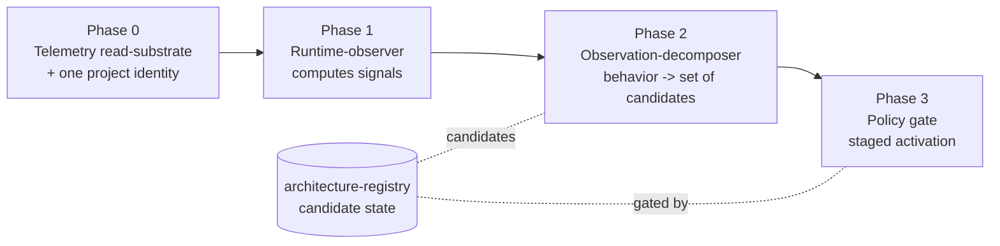

# Plan: Observer capacity build sequence

**Status:** Draft — for operator approval of the sequence before any runtime code
**Date:** 2026-08-23
**Authors:** Liz, agent-assisted
**Builds on:** [`docs/adr/0001-observer-topology.md`](../adr/0001-observer-topology.md) (ratified), [`docs/proposals/2026-06-18-runtime-observation-deferred-to-tapestry.md`](../proposals/2026-06-18-runtime-observation-deferred-to-tapestry.md)

## Goal

Build the observer's deferred capacity: **read telemetry → compute signals → decompose repeated behavior into candidates → policy-gate activation.** ADR-0001 ratified the topology and the proposal deferred the build to Tapestry; the operator directed on 2026-08-23 that we start building it. This plan turns the ratified topology into an ordered, dependency-driven build sequence. It proposes **no runtime code** — it sequences the work so the operator approves the order and the first increment before anything is written.

## Grounding — what's designed vs. what exists today

Designed and ratified: ADR-0001's seven components with fixed homes; the safety boundary (the decomposer never activates; policy owns risk + activation); the rule that observation signals are not candidate kinds. The proposal adds the decomposition map (a behavior splits into a *set* of candidates, never one) and the self-host-parity requirement.

Current Tapestry state (PROBEd 2026-08-23) — the slot tree exists but the relevant components are stubs:

| Component | Ratified home | Tapestry today | Working source |
|---|---|---|---|
| telemetry-ingestion | `services/telemetry-ingestion/` | README-only stub | `the-loom/services/telemetry-ingestion/` (log-only, no DB, no read API) |
| runtime-observer + read layer | `services/project-observatory/` | README-only stub | `the-loom/services/project-observatory/` (health stub) |
| observation-decomposer | `services/observation-decomposer/` | **no directory** | greenfield — no source in either repo |
| self-observer | `services/self-observer/` | **no directory** | `the-loom/services/self-observer/` (full) |
| architecture-registry | `services/architecture-registry/` | README-only stub | `the-loom/services/architecture-registry/` (full; `models.py` CANDIDATE_TYPE 9-value enum + `signals` JSONB) |
| policy | `services/policy/` | README-only stub | `the-loom/services/policy/` (full) |
| local-observer | `engine/local-observer/` | README-only stub | `the-loom/adapters/claude-code/loom-discipline/scripts/observer.py` |
| memory | `services/agent-context/` | **real, built** | mirror in the-loom |

Two hard facts drive the order: **no telemetry Postgres schema exists in either repo** (the read-substrate is greenfield, to be modeled on [`infra/migrations/001_init_memory.sql`](../../infra/migrations/001_init_memory.sql)), and **the self-observer's telemetry read is a stub returning `None`** (`the-loom/services/self-observer/telemetry_client.py:22-35`) — so nothing downstream can read telemetry until the substrate exists.

## The dependency chain (why this order)

The observer can't read telemetry until telemetry is stored somewhere readable; it can't decompose until it can read; it can't gate until it can decompose. That gives a strict spine:

Each phase lands at its ADR-0001 home, design-first, on operator approval — **nothing is built in the-loom** (the proposal explicitly forbids a sibling runtime-observer there).

## Phase 0 — Telemetry read-substrate + one project identity (the first unblock)

The whole capacity is blocked here; this is the recommended first increment.

- **Home:** `services/telemetry-ingestion/` (+ a new telemetry migration under `infra/migrations/`, next free number — coordinate with the `architecture-registry` migration so the two don't contend for the same slot).
- **Today:** the-loom receiver logs to Loki via stdout only — "no DB layer today" (`the-loom/services/telemetry-ingestion/skill_usage_handler.py:21-23`); persistence is stdout→Loki (`:68-87`); no read API. Tapestry side is a README stub.
- **Build:**
  1. **Postgres telemetry schema** — a greenfield migration modeled on the memory schema (`infra/migrations/001_init_memory.sql`): an event/rollup table carrying `tenant_id` + row-level tenant scoping, a **`project_id` dimension**, plus session/tool/hook/timing fields and a rollup for invocation counts by (repo, file, project, window).
  2. **Persistence write path** in telemetry-ingestion — events land in Postgres, not only Loki.
  3. **Read/query API** — the interface `runtime-observer` and the degraded `self-observer.invocations_30d()` call instead of the current `None` stub.
  4. **Emit-side contract instrumentation** — the hooks currently emit *bare* keys (`project_id`, `session_id`) straight to Grafana, bypassing ingestion, and never emit the `tapestry.*` contract attributes (`_observability.py:368-433`). This step routes hook events into the Postgres substrate (self-host-safe, not Grafana-dependent) and stamps the contract's required anchor + context so stored events are keyed and correlatable.
- **Prerequisite folded in — one project identity.** Today "the project" has three identifiers that only align by luck: the registry UUID (`observer.py:504-519`), `LOOM_PROJECT_ID`, and a hardcoded slug `["the-loom"]` (`synthesis.py:242`). Telemetry keyed by project is meaningless until these reconcile to **one canonical project id** shared by memory `project_tags`, the telemetry `project_id`, and candidate `project_id`. (See memory `project-observer-telemetry-not-wired-and-project-identity-split-2026-08-23`.)
- **Migrate or greenfield:** migrate the the-loom receiver as the base; the schema, persistence, and read API are net-new.
- **Self-host parity:** Postgres-based by requirement (proposal lines 215, 239) — Loki-as-store is Grafana-Cloud-locked and leaves self-host blind.

## Phase 1 — Runtime-observer (reads the substrate, computes signals)

- **Home:** `services/project-observatory/` (ADR-0001: runtime-observer + read layer live here).
- **Today:** health stub only.
- **Build:** read the Phase-0 substrate and compute the observation signals ADR-0001 names — `hot_path`, `orphaned`, `degrading` — over a window, keyed by the reconciled project id. This is what finally replaces the self-observer's `None` telemetry read with a real one.
- **Migrate or greenfield:** mostly greenfield on top of the stub; may absorb the self-observer's intended `invocations_30d` shape.
- **Blocked by:** Phase 0. **Note:** signals are evidence, **not** candidate kinds — they belong in the existing `signals` JSONB, not the 9-value enum.

## Phase 2 — Observation-decomposer (greenfield; splits behavior into a set of candidates)

- **Home:** `services/observation-decomposer/` (create the directory; ratified to `services/`, not `engine/`).
- **Today:** absent everywhere — genuinely net-new.
- **Build:** consume observations (runtime signals + self-observer scans + session-end reports + memory writes + tool calls); identify repeated behavior; **split it into a set of typed candidates** per the decomposition map (event→plugin/hook, deterministic→tool, situational-judgment→skill, ongoing-judgment→agent, multi-step→workflow, coordination→orchestration, side-effect→service, approval→policy, facts→memory); attach evidence + a recommended automation level; send candidates to `architecture-registry`. **It never activates anything.**
- **Migrate or greenfield:** greenfield.
- **Blocked by:** Phase 1 (needs signals) + architecture-registry present in Tapestry (see prerequisites) + the design-gates below.

## Phase 3 — Policy gate (staged, evidence-thresholded activation)

- **Home:** `services/policy/`.
- **Today:** README stub; the-loom policy service is inert.
- **Build:** the policy-bounded automation cascade (levels 0–7), `max_auto_level` per artifact kind + risk, and the evidence thresholds that fire transitions. Policy is solely authoritative for the activation gate; the decomposer's risk hints are advisory only.
- **Migrate or greenfield:** migrate the inert the-loom policy service as the base; the daemon/cascade is net-new.
- **Blocked by:** Phase 2 + the risk-classifier design-gate.

## Cross-cutting prerequisites

- **architecture-registry in Tapestry.** The decomposer writes candidates here and the schema (CANDIDATE_TYPE 9-value enum + `signals` JSONB, plus a new `observation_kind`) lives here. Migrate from `the-loom/services/architecture-registry/` and **absorb `candidate-registry`** per ADR-0001 — converge on one canonical candidate store, do not re-fork state across the two stubs.
- **Non-skill destination handlers.** Only `kind=skill` has a handler today (`the-loom/.../architecture-registry/main.py:234`); 8/9 kinds dead-end. This doesn't block the observer *reading* or *decomposing*, but the loop can't *close* without handlers — a parallel track, not a spine dependency.

## Design-gates (open sub-questions that block specific phases)

Per ADR-0001 "Deferred" and the proposal's three sub-component caveats — each needs a short design pass before its phase:

1. **`observation_kind` schema + `signals[]`** — the "why it was noticed" enum, distinct from the 9-value candidate enum. Gates Phase 2's semantic clarity.
2. **Risk classifier spec** — the Level-4 gate ("low/medium risk AND handler exists") has no defined classifier. Gates Phase 3.
3. **Skill-vs-agent disambiguation** — skill = bounded to one call site; agent = ongoing responsibility across calls. Gates Phase 2's accuracy (it's the exact drift the loop is meant to prevent).

## Two-mode (self-host / hosted)

- **Self-host:** the entire point of the Postgres substrate — a self-host operator with no Grafana Cloud must still get stored, queryable telemetry. Every phase reads Postgres, not Loki.
- **Hosted-multitenant:** the same substrate, tenant-scoped by `tenant_id` with row-level scoping (as memory already is). Telemetry `project_id` is a dimension *within* a tenant, exactly as memory `project_tags` are.

## What this plan does NOT do

- No runtime code yet — this is the sequence for approval.
- Nothing is built in the-loom (no sibling runtime-observer cron; the proposal forbids it).
- No extension of the 9-value candidate enum (observation signals go in the existing `signals` JSONB).
- Nothing here is called "auto-promotion" — the system is observation + decomposition + policy-gated promotion + staged activation + rollback; the "auto" label is earned only when all of those exist.

## Open questions for the operator

1. **Timing vs. v1.** The proposal deferred these to Tapestry and none are in the current v1 scope. Starting now un-defers that. Confirm we're bringing it forward.
2. **First increment.** Approve Phase 0 (telemetry substrate + identity reconciliation) as the first thing built? It unblocks everything and is self-contained.
3. **Migrate vs. rebuild per service.** For architecture-registry, policy, self-observer, and the telemetry receiver — migrate the working the-loom code into the Tapestry home, or rebuild? (Migration needs your per-piece approval under CORE DIRECTIVE 2; the migration machinery in `docs/migration-cicd/` + the runbook pattern already exists to do it.)
4. **Design-gate order.** Run the three design-gate passes (observation_kind, risk classifier, skill-vs-agent) up front as a batch, or each just-in-time before its phase?

## Sources

- [`docs/adr/0001-observer-topology.md`](../adr/0001-observer-topology.md) — the ratified topology + homes + safety boundary
- [`docs/proposals/2026-06-18-runtime-observation-deferred-to-tapestry.md`](../proposals/2026-06-18-runtime-observation-deferred-to-tapestry.md) — the deferral, the decomposition map, the self-host-parity requirement, the "NOT doing" list
- [`infra/migrations/001_init_memory.sql`](../../infra/migrations/001_init_memory.sql) — the model for the greenfield telemetry schema
- the-loom working sources: `services/self-observer/` (incl. `telemetry_client.py:22-35` stub), `services/telemetry-ingestion/skill_usage_handler.py:21-23,68-87`, `services/architecture-registry/models.py`, `services/policy/`
- loom-memory: `project-observer-telemetry-not-wired-and-project-identity-split-2026-08-23`
- Migration machinery: `docs/migration-cicd/`, `docs/runbooks/02-agent-context-mcp.md`, `docs/playbook/migration/05-cloud-observer-vs-developer-hook.md`
