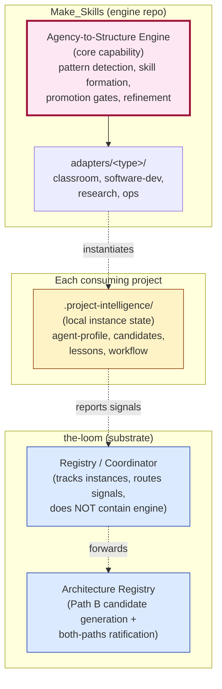
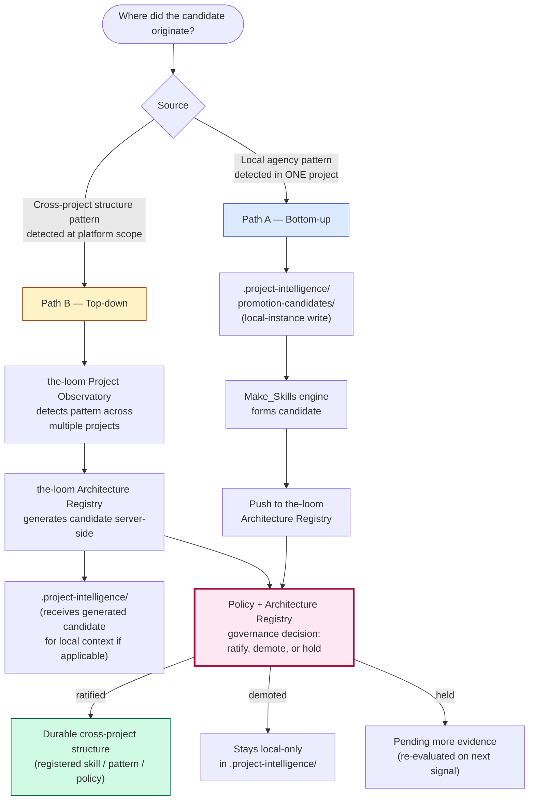

# Agency Optimizer pattern — operational + governance spec

**Status:** Peer proposal to v3 ([`2026-05-25-platform-data-model.md`](2026-05-25-platform-data-model.md) + [`2026-05-25-mvp-repo-layout.md`](2026-05-25-mvp-repo-layout.md)). Date: 2026-05-25. Author: Loom-agent, after MS-agent's in-place edits to v3 landed the high-level concept.

> ## ⚠️ Partially superseded 2026-05-31 — engine placement revised
>
> This doc originally placed the Agency Optimizer's **engine** inside
> the-loom as a sub-service of Agent Context Service. **That framing was
> wrong** per the third-agent critique ratified by Liz on 2026-05-31
> (memory `architecture_third_agent_critique_six_corrections_2026_05_31`,
> item 5; see also [[project_recursive_skill_engine_three_layer_model]]).
>
> **Corrected three-layer placement:**
>
> | Layer | Lives in | What it is |
> |---|---|---|
> | **Engine (core capability)** | **Make_Skills** (narrowed core: "Agency-to-Structure Engine") | Pattern detection, skill formation, promotion gates, recursive workflow refinement |
> | **Project-type adapters** | **Make_Skills** (`adapters/<type>/`) | Classroom vs software-dev vs research vs ops behavior on top of the engine |
> | **Registry/Coordinator** | **the-loom** | Tracks which projects have instances attached + routes signals; does NOT contain the engine |
> | **Project-local instance** | **Each consuming project's `.project-intelligence/`** | Local evidence: agent-profile, candidates, lessons |
>
> **What stays valid in this doc:** the candidate lifecycle, promotion
> threshold signals, promote/codify flow, install flow, and MVP scoping
> questions. These describe operations + governance that apply regardless
> of which repo hosts the engine code.
>
> **What's wrong below (kept for traceability):** the
> `services/agency-optimizer/` directory layout (lines ~25-51 below)
> assumes the engine lives in the-loom. When the actual engine code
> gets built, it goes in Make_Skills, NOT the-loom. The-loom hosts only
> the Registry/Coordinator. A future doc revision will replace the
> directory layout section with the correct split.
>
> Read this doc for the lifecycle + governance concepts; cross-reference
> [[project_recursive_skill_engine_three_layer_model]] for the engine
> placement.

## Three-layer placement (corrected 2026-05-31)



The engine is in Make_Skills. The-loom hosts the *registry* of instances and the *governance* of cross-project promotion candidates. Each consuming project gets a local instance in `.project-intelligence/`.

## Promotion paths — decision gate (added 2026-05-31)

There are TWO paths a structure candidate can travel before becoming durable. Both converge at Policy + Architecture Registry's promotion-governance logic; they differ in where the candidate originated.



**Path A example:** Liz writes similar study sheets across courses → local skill candidate forms in `.project-intelligence/promotion-candidates/` → Make_Skills engine forms the candidate → pushed to the-loom → if seen across multiple courses → ratified → "make-study-sheet" becomes a registered platform skill.

**Path B example:** the-loom's Project Observatory notices that 4 of Liz's projects independently created similar OTel keep-warm crons → generates a candidate server-side → governance ratifies → the pattern becomes a registered platform recipe.

Same governance gate, different origin. The path label is preserved on the resulting Decision artifact for auditability.

## Where this doc sits

The v3 reference docs (data model + MVP repo layout) now contain the **what** of the Project-Level Agency Optimizer — its two-level existence (capability vs instance), the `.project-intelligence/` folder convention, the four connection types, and the three load-bearing boundary sentences. They are the canonical reference for the concept.

This peer doc contains the **how**: the operational structure of `services/agency-optimizer/` inside the-loom, the install/spawn flow performed by `packages/sdk/`, the candidate → promotion data flow, the integration with Pattern Detection (Architecture Registry) and Promotion Governance (Policy + Architecture + Audit), and the bidirectional bridge to Make_Skills' `services/skill-making/`.

If you want the concept summary, read v3. If you're about to build or extend the Agency Optimizer subsystem, read this.

## Integration with v3's seven bounded contexts (Option B)

The third agent's framing introduced three names not enumerated in v3: Agency Optimizer, Pattern Detection, Promotion Governance. These do not become new bounded contexts. They map inside the existing seven:

| New name | Lives inside | What that means |
| --- | --- | --- |
| **Agency Optimizer** | ~~Agent Context Service~~ **CORRECTED 2026-05-31:** Engine in Make_Skills; Registry/Coordinator in the-loom (distinct from Agent Context Service — not a sub-service of it). The consuming project's `.project-intelligence/` is the local instance state. Cross-project agent memory remains owned by Agent Context Service (separate concern). See preamble for full three-layer placement. |
| **Pattern Detection** | Architecture Registry | Pattern Detection is the recognition engine that turns TelemetryEvents + Artifacts into ArchitectureNodes / Edges / Observations. It also consumes promotion candidates pushed up by Agency Optimizer instances and classifies them by promotion-threshold signals. |
| **Promotion Governance** | Policy Service + Architecture Registry + Audit Log (jointly) | Policy Service owns the rules — who can promote, what gates apply, which roles approve. Architecture Registry executes the structural change (a promoted candidate becomes a Decision + ArchitectureNode update). Audit Log records every promotion event with the candidate's provenance. |

This keeps v3 at 7 contexts. If Pattern Detection or Promotion Governance grows enough to warrant its own context later, splitting is easy because the boundaries are already named at this sub-service level.

## Capability structure inside `services/agency-optimizer/`

```text
services/agency-optimizer/
├── api/                            — internal API exposed to the rest of the platform
│   ├── spawn.py                    — POST /projects/:id/agency-optimizer/instance
│   ├── ingest.py                   — receives observations + workflow traces from instance
│   ├── suggestions.py              — outbound suggestion API for the consuming project's agent
│   └── promote.py                  — receives promotion candidates from instance, forwards to Architecture Registry
├── core/                           — domain logic
│   ├── observation_normalizer.py   — accepts heterogeneous instance shapes, normalizes to canonical events
│   ├── candidate_lifecycle.py      — local-candidate state machine (see §"Local candidate lifecycle")
│   ├── promotion_signals.py        — computes the seven promotion-threshold signals (see §"Promotion thresholds")
│   └── instance_registry.py        — tracks attached project instances + their last-seen heartbeat
├── schemas/                        — data shapes
│   ├── observation.py              — what an instance sends to ingest
│   ├── candidate.py                — local skill/workflow candidate shape
│   ├── promotion_request.py        — shape sent to Architecture Registry
│   └── suggestion.py               — shape sent back to the consuming agent
├── policy_hooks.py                 — calls Policy Service before any promotion attempt
├── audit_hooks.py                  — writes audit events for spawn, suggest, promote, demote
└── storage/                        — persistence (Postgres tables owned by this sub-service)
    ├── migrations/
    └── models.py                   — InstanceRow, CandidateRow, SuggestionRow, PromotionRequestRow
```

This sits under Agent Context Service, but has its own Postgres schema namespace so its tables don't bleed into the cross-project memory tables. Cross-context references happen by stable ids per the v3 ownership rule.

## The install flow — what `packages/sdk/`'s `init` does

When a developer installs the-loom into a consuming project:

```bash
loom init
```

The SDK performs these steps in order:

1. **Authenticate.** Prompt for or use existing JWT against the-loom's Platform Access Layer. Resolve which Project (per v3 Project Registry) this repo belongs to, or create one.
2. **Create `.project-intelligence/`** in the project root with the baseline files described in v3:
   - `agent-profile.json` — which agent kinds are configured (Claude Code, Cursor, etc.)
   - `project-context.json` — repo url, default branch, machine id, last-seen-at
   - `observatory-config.json` — telemetry destinations + sampling rules
   - `local-skills/` (empty)
   - `workflow-candidates/` (empty)
   - `lessons-learned/` (empty)
   - `promotion-candidates/` (empty)
3. **POST to spawn endpoint** — `services/agency-optimizer/api/spawn.py` registers the instance. The Project's `project_id` + the folder's content hash form a stable instance identity.
4. **Register adapters** — for each agent kind named in `agent-profile.json`, ensure the matching `adapters/<kind>/` is installed/configured.
5. **Audit log** — every step emits an audit event recording who initialized, when, against which project.
6. **Print next steps** — show the developer where to confirm in the platform's dashboard that their project is attached.

Uninstall is the inverse: `loom uninstall` archives the instance in the platform (does not delete — auditability), and offers to keep or remove the `.project-intelligence/` folder locally.

**Folder existence is registration.** Per v3, no separate registration step is required to recognize an attached project — the platform scans for valid `.project-intelligence/` folders. The SDK's `init` command is convenience + audit, not a gating step.

## Local candidate lifecycle

A workflow candidate inside `.project-intelligence/workflow-candidates/<candidate-id>/` evolves through these states:

```text
draft → observed → recurring → stable → promotion-requested → promoted | rejected
```

| State | Who advances it | Condition |
| --- | --- | --- |
| `draft` | Optimizer instance | First observation matches a candidate pattern (heuristic + LLM judgment) |
| `observed` | Optimizer instance | Second observation of the same shape — candidate stops being a coincidence |
| `recurring` | Optimizer instance | Three or more observations across at least two distinct sessions |
| `stable` | Optimizer instance | Promotion-threshold signals (see next section) cross threshold |
| `promotion-requested` | Optimizer instance | Submits to platform via promotion endpoint; awaits governance verdict |
| `promoted` | Promotion Governance | Policy + Architecture + Audit decide yes; candidate becomes a Decision + an ArchitectureNode update + (optionally) a CompiledSkill via the Make_Skills bridge |
| `rejected` | Promotion Governance | Policy or Architecture say no; reason recorded; candidate returns to `stable` (retry later) or is archived |

The state machine lives at `services/agency-optimizer/core/candidate_lifecycle.py`. The instance side stores per-candidate state in its local folder; the platform side stores the canonical state in `CandidateRow` once promotion is requested.

## Promotion thresholds (the signals)

Per the third agent's framing, a candidate becomes structurally promotable when these signals fire:

| Signal | Meaning | Computed where |
| --- | --- | --- |
| Repeated across sessions | Not a one-off | Optimizer instance |
| Repeated across tasks | Not task-specific | Optimizer instance |
| Repeated across agents or projects | May be reusable | Pattern Detection (cross-project view) |
| Has clear triggers | Can be operationalized | Optimizer instance + LLM judgment |
| Has stable steps | Can become a workflow | Optimizer instance + LLM judgment |
| Has stable outputs | Can be tested | Optimizer instance |
| Reduces need for live judgment | Can be codified | Optimizer instance |

The Optimizer instance computes the first signal cluster from local evidence. The "cross projects" signal can only fire after the candidate is pushed to Pattern Detection inside Architecture Registry — where the platform can see whether OTHER projects have submitted similar candidates. This is the moment of cross-project recognition.

## The promote/codify flow

```text
Optimizer instance (project)
  │
  │ POST /promote with promotion_request payload
  │ (includes: candidate spec, evidence bundle, signal computations,
  │  project_id, suggesting_agent_kind)
  ▼
services/agency-optimizer/api/promote.py
  │
  │ forwards to Architecture Registry
  ▼
services/architecture-registry/promotion_governance.py
  │
  │ 1. Calls Policy Service: is this promotion allowed?
  │ 2. Pattern Detection check: does this match a known cross-project pattern?
  │ 3. If yes to both: creates a Decision row + updates ArchitectureNode(s)
  │ 4. Writes audit event with full provenance chain
  │ 5. (If skill-shaped) pushes to Make_Skills' services/skill-making/ via webhook
  ▼
Promotion outcome returned to Optimizer instance
  │
  │ Instance updates the local candidate state in
  │ .project-intelligence/promotion-candidates/<candidate-id>/
  ▼
Developer sees outcome in the consuming project's CLI + the platform dashboard
```

## Make_Skills skill-making bridge

If the promoted candidate is *skill-shaped* (a reusable agent capability vs. a structural decision about the project), the platform forwards it to Make_Skills' `services/skill-making/` via webhook. Make_Skills compiles it into a CompiledSkill. The CompiledSkill metadata + runtime usage telemetry flows back to the-loom via Telemetry Ingestion, where it becomes evidence for future promotion threshold computations (the loop closes).

| Direction | Shape | Endpoint |
| --- | --- | --- |
| the-loom → Make_Skills | `promotion_request` payload (candidate spec + evidence) | Webhook to Make_Skills `services/skill-making/inbound/` |
| Make_Skills → the-loom | `compiled_skill_registered` event + ongoing `skill_usage_telemetry` | the-loom Telemetry Ingestion `events/` endpoint |

Schemas for both directions are owned by the receiving side. The-loom's `promotion_request` schema is canonical at `services/agency-optimizer/schemas/promotion_request.py`. Make_Skills' inbound contract is canonical in Make_Skills' engine spec; we cite, don't duplicate.

## What the consuming project's agent sees

From the developer-facing agent's POV inside a consuming project, the Agency Optimizer surfaces as:

- **Inline suggestions** — "I notice you've corrected this same diff style three times. Want me to remember this preference?"
- **Promotion prompts** — "This workflow pattern looks stable across 4 sessions. Submit as a candidate?"
- **Local skill library** — `local-skills/` contains project-specific skills the user has accepted; agent loads them at session start.
- **Promotion outcomes** — "Your candidate `feedback_diff_style_correction` was promoted to a platform-wide CompiledSkill — now available in all your projects."

The agent does NOT see the full platform internals. It interacts via the SDK's `read_memory()`, `write_memory()`, `read_project_context()`, `subscribe_observations()` calls (per v3's adapter contract).

## MVP scope — what ships first

Two options for the v2 roadmap (Liz / future-me to pick during roadmap drafting):

| Option | Ships in MVP | Defers to V2.x |
| --- | --- | --- |
| **Tight MVP** | `mcp/memory-server/` + minimal `services/agent-context/` (cross-project memory only) + `services/project-registry/` + `services/telemetry-ingestion/` + `services/observability/` + `apps/web-dashboard/`. **Agency Optimizer NOT in MVP.** | `services/agency-optimizer/`, `services/architecture-registry/`, `services/policy/`, `services/audit-log/`, the rest of the contexts. |
| **Stretch MVP** | Everything in Tight MVP + `services/agency-optimizer/` (capability) + `packages/sdk/` install flow + one consuming project end-to-end demonstration. | The rest. |

MS-agent's recommendation (paraphrased from their dialogue entry): tight MVP first. Cross-machine memory is the urgent unlock; Optimizer ships once the platform has live projects to attach to.

## Open questions

1. **Where do the seven promotion-threshold signals get weighted?** Equal weighting + threshold = N seems naive. A learned/tuned weighting probably wants telemetry on past promotion outcomes (which were good, which got demoted). Tracking the weighting as policy data inside Policy Service feels right; the weights themselves are TBD.

2. **Demotion path.** Voyager's known failure mode is skill-library bloat with no retirement. Promoted candidates need a way to be demoted when usage drops or quality degrades. Probably: usage telemetry from Make_Skills' bridge feeds into Pattern Detection, which can flag a candidate for demotion review.

3. **Cross-user / cross-tenant promotion.** Out of scope for Liz's personal use, but if the-loom ever serves multiple developers, the policy question of "does Liz's promoted skill become visible to other developers' projects?" gets sharp. Pillar 0 tenant scoping from Make_Skills' history is the relevant prior art.

4. **What happens to `.project-intelligence/` in git.** Should it be committed (so colleagues see the same context) or gitignored (developer-specific state)? Default proposal: `local-skills/` + `workflow-candidates/` committed (shared with team), `lessons-learned/` + `promotion-candidates/` gitignored (developer-local until promoted). Open for refinement.

5. **Conflict resolution when multiple `.project-intelligence/` folders disagree.** A monorepo with multiple sub-projects? A developer working on two machines with diverged local state? Out of scope for tight MVP; relevant for V2.

## References

- v3 data model: [`2026-05-25-platform-data-model.md`](2026-05-25-platform-data-model.md) — concept summary, two-level existence, boundary sentences
- v3 MVP repo layout: [`2026-05-25-mvp-repo-layout.md`](2026-05-25-mvp-repo-layout.md) — `services/agency-optimizer/` location, `.project-intelligence/` pattern, adapter contract
- Make_Skills engine spec: `Lizo-RoadTown/Make_Skills/docs/proposals/2026-05-25-make-skills-engine-data-model.md` — the bridge consumer side
- Make_Skills MVP layout: `Lizo-RoadTown/Make_Skills/docs/proposals/2026-05-25-make-skills-engine-mvp-repo-layout.md` — `services/skill-making/` shape
