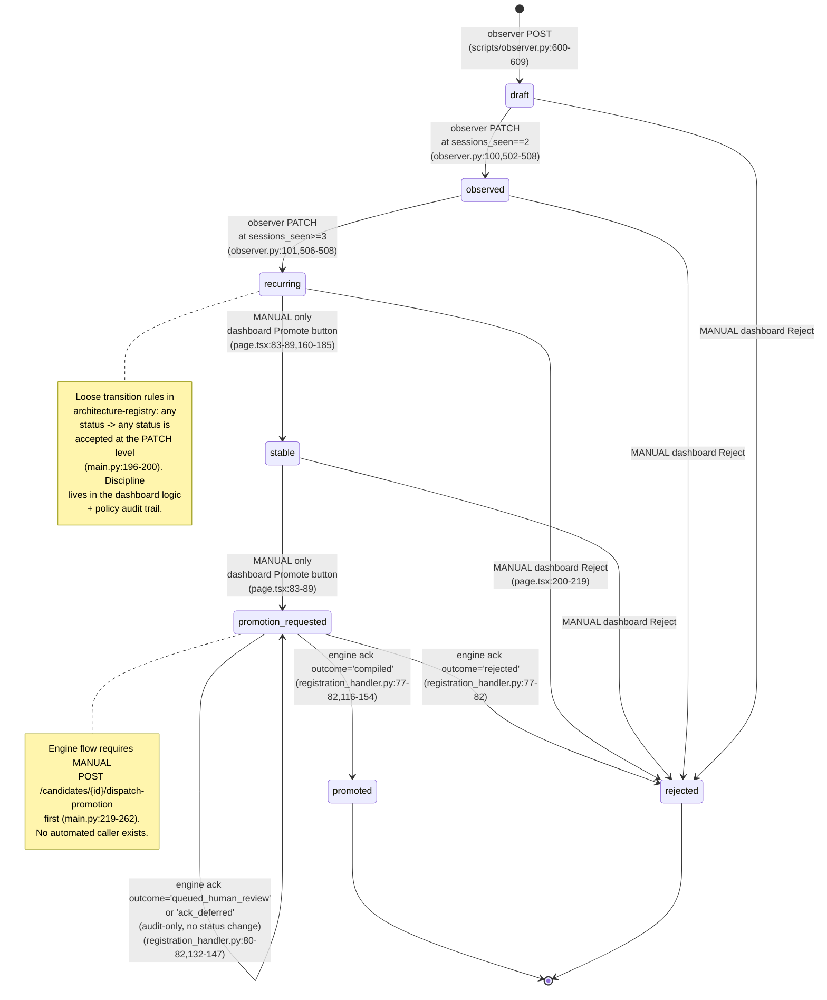

# Candidate lifecycle in the-loom — verified

**Date:** 2026-06-16
**Repo state at audit:** `main` branch, the-loom @ commit `705c4ba`
**Author:** independent verification pass
**Scope:** confirm/refine/refute prior claims about the promotion-candidate state machine and identify automation gaps.

---

## TL;DR

- **The prior claim listed 5 states; the actual enum has 7.** Missing from the brief: `stable` (a real state between `recurring` and `promotion_requested`) and `rejected` (terminal). `services/architecture-registry/models.py:43-46`.
- **Observer auto-transition stops at `recurring`** at `sessions_seen >= 3`. It never writes `stable`, `promotion_requested`, `promoted`, or `rejected`. `adapters/claude-code/loom-discipline/scripts/observer.py:100-101,502-508`.
- **Policy service is inert by design.** It records `approve|hold|reject|demote` decisions to an audit-immutable table and exposes `GET /candidates/{id}/policy-state`, but does **not** call architecture-registry to apply them. `services/policy/main.py:1-18`.
- **The dashboard — not policy — is what actually applies status transitions.** When the operator clicks "Promote", the dashboard's server action does two sequential calls: `POST loom-policy/decisions` then `PATCH loom-architecture-registry/candidates/{id}/status`. `apps/web-dashboard/app/candidates/page.tsx:160-185`.
- **There is no automated caller of `/dispatch-promotion`.** Grep across the repo finds the endpoint defined in architecture-registry/main.py and exercised only from tests. No cron, no background task, no hook, no UI button posts to it. The dashboard's promote button advances status to `promotion_requested` and stops there.
- **The gap the brief describes is real but mislocated.** It is not "policy records promote but doesn't fire dispatch." It is "no part of the system fires dispatch automatically — at any transition." End-to-end has been verified manually once (`loom-memory: bridge_closed_end_to_end_2026_06_13`), confirming the wire works; nothing has been automated since.

---

## The actual lifecycle

### Trigger inventory

| Transition | Trigger surface | Automated? | Evidence file:line |
|---|---|---|---|
| `null → draft` | observer POSTs first sighting | yes (Stop hook) | `adapters/claude-code/loom-discipline/scripts/observer.py:600-609` |
| `draft → observed` | observer PATCH at `sessions_seen==2` | yes (Stop hook) | `adapters/claude-code/loom-discipline/scripts/observer.py:100,746-751` |
| `observed → recurring` | observer PATCH at `sessions_seen>=3` | yes (Stop hook) | `adapters/claude-code/loom-discipline/scripts/observer.py:101,506-508` |
| `recurring → stable` | dashboard Promote button | no, operator click | `apps/web-dashboard/app/candidates/page.tsx:86,160-185` |
| `stable → promotion_requested` | dashboard Promote button | no, operator click | `apps/web-dashboard/app/candidates/page.tsx:87,160-185` |
| `promotion_requested → engine` | `POST /candidates/{id}/dispatch-promotion` | **NO — manual only, no caller exists** | `services/architecture-registry/main.py:219-262` |
| `promotion_requested → promoted` | engine ack `outcome=compiled` | yes (engine-driven) | `services/architecture-registry/registration_handler.py:77-82,149` |
| `promotion_requested → rejected` | engine ack `outcome=rejected` | yes (engine-driven) | `services/architecture-registry/registration_handler.py:77-82,149` |
| `any → rejected` | dashboard Reject button | no, operator click | `apps/web-dashboard/app/candidates/page.tsx:200-219` |
| `any → hold` (no status change) | dashboard Hold button — audit-only | no, operator click | `apps/web-dashboard/app/candidates/page.tsx:187-198` |

---

## Component roles

| Component | Actual role | File:line evidence |
|---|---|---|
| **Observer** (`loom-discipline` plugin script) | Parses transcripts in Stop hook. POSTs new candidates as `draft`. PATCHes `draft → observed → recurring` based on `sessions_seen` thresholds (2, 3). **Never writes `stable` or above.** Best-effort, never blocks Stop hook. | `adapters/claude-code/loom-discipline/scripts/observer.py:79-101, 502-508, 612-619, 700-833` |
| **Architecture Registry** (`loom-architecture-registry`) | Owns the `candidates` table. `PATCH /candidates/{id}/status` is the universal write surface; **transition rules are loose** — any status → any status is accepted at this phase. Also hosts `POST /candidates/{id}/dispatch-promotion` (manual trigger) and `POST /skill-registered` (engine HMAC callback). | `services/architecture-registry/main.py:191-211 (PATCH), 196-204 (loose rules comment), 219-262 (dispatch), 270-340 (ack)` |
| **Policy Service** (`loom-policy`) | Audit-immutable record of `approve|hold|reject|demote` decisions. Exposes `GET /candidates/{id}/policy-state` as a read-side aggregate. **Does not call architecture-registry to apply decisions.** This is explicit in the docstring. | `services/policy/main.py:1-18, 89-118, 157-181` |
| **Dashboard** (`apps/web-dashboard`) | The actual orchestrator of the late lifecycle. Promote button: POST `loom-policy/decisions` (kind=approve, target=next status), then PATCH `loom-architecture-registry/candidates/{id}/status` to the next status. Promotion advances by **one step** per click; the table maps `recurring→stable→promotion_requested→promoted`. | `apps/web-dashboard/app/candidates/page.tsx:83-89 (NEXT_STATUS table), 160-185 (promoteAction), 187-198 (holdAction), 200-219 (rejectAction)` |
| **Promote dispatcher** (`promote_dispatcher.py`) | When invoked, fetches the candidate, builds `PromotionCandidate` payload, HMAC-signs, POSTs to engine `/bridge/promotion-candidate`, returns the engine's ack. Has no automated invoker. v1.0 uses `candidate_id` as `promotion_id` for idempotency. | `services/architecture-registry/promote_dispatcher.py:300-379` |
| **Registration handler** (`registration_handler.py`) | Receives engine's `RegistrationAck` callback on `/skill-registered`. Maps `outcome=compiled→promoted`, `outcome=rejected→rejected`, `queued_human_review`/`ack_deferred` → audit-only (status unchanged). | `services/architecture-registry/registration_handler.py:77-82, 116-154` |
| **Self-observer cron** (`services/self-observer/`) | Every 6h, scans platform-owned GitHub repos for category-drift candidates (`source_path=path_b`). Emits new candidates. **Does not interact with the late lifecycle or with `/dispatch-promotion`.** | `services/self-observer/main.py:1-12, 66-91`; `render.yaml:299-333` |

---

## The actual gap

### What is automated end-to-end

- **draft → observed → recurring** — observer hook, fully automatic. Verified by tests in `adapters/claude-code/loom-discipline/tests/test_observer.py`.
- **promotion_requested → promoted (or rejected)** — engine callback, fully automatic once the engine is sent the candidate. Verified end-to-end on 2026-06-13 for `kind=skill` (see loom-memory `bridge_closed_end_to_end_2026_06_13`).

### What is manual

1. **recurring → stable → promotion_requested.** Two operator clicks on the dashboard. There is no LLM judge or signal-threshold rule that auto-advances past `recurring`.
2. **Calling `/dispatch-promotion`.** Nothing calls this endpoint automatically. The endpoint docstring says so explicitly: *"v1.0: explicit/manual trigger — caller decides when. Auto-trigger on `status='promotion_requested'` lands later."* (`services/architecture-registry/main.py:228`). After the dashboard sets `status=promotion_requested`, the candidate sits there until somebody (operator, ad-hoc curl, or a future automation) POSTs to the dispatch endpoint.

### What the prior brief got wrong

- "**Policy records promote but doesn't fire dispatch**" — true that policy doesn't fire dispatch, but it is also true that policy doesn't apply the *status change* either. The dashboard does both: it posts the policy decision **and** PATCHes the status. So the right way to state the gap is: "Status reaches `promotion_requested`, then nothing happens until a human manually invokes dispatch."
- "**Observer handles draft → recurring, not the late lifecycle**" — confirmed.
- "**4-stage lifecycle (draft → observed → recurring → stable/promotion_requested → promoted)**" — refined: there are 7 states, and `stable` is a distinct state between `recurring` and `promotion_requested`, not an alias for `promotion_requested`. Also `rejected` is terminal and missing from the brief's list. See `services/architecture-registry/models.py:43-46`.
- "**Dispatch endpoint at `main.py:215-244`**" — close; the actual endpoint is `main.py:219-262`.

---

## Path-forward options

### Option A — Auto-dispatch cron (separate service)

Tiny cron job (or worker on an existing service) polling
`GET /candidates?status=promotion_requested` every N minutes; for each result not already dispatched, POST to `/candidates/{id}/dispatch-promotion`. Needs an idempotency guard so re-runs don't re-fire.

- **Effort:** ~80–120 lines of Python + render.yaml entry. Reuse the self-observer scaffolding pattern at `services/self-observer/`. ~2 hours.
- **Pros:** zero coupling change inside architecture-registry; failure-isolated from request path; easy to disable.
- **Cons:** new deploy unit; latency (minutes); needs "already dispatched" tracking (probably an evidence_ref kind `dispatch_attempted`).
- **Idempotency:** engine already de-dupes by `promotion_id == candidate_id` (returns 409 with existing skill_id), so re-firing is *safe* — the cron only needs to avoid spamming. A simple "skip if any `evidence_refs[].kind == 'dispatch_attempted'` newer than 1h" filter works.

### Option B — In-service auto-trigger at PATCH time

In `architecture-registry/main.py:update_candidate_status` (line 191), after a successful PATCH that sets `status='promotion_requested'`, fire-and-forget a background task that calls `promote_dispatcher.dispatch_promotion`.

- **Effort:** ~20 lines + tests. Wrap the dispatch in `BackgroundTasks` (FastAPI native). ~1 hour.
- **Pros:** zero latency; no new deploy unit; trivial to reason about.
- **Cons:** couples the write path to the engine call; transport failure semantics need care (do not fail the PATCH if dispatch fails — it must be best-effort, logged for retry); loses observability if the background task dies. Needs durable retry if you care about not losing dispatches.

### Option C — Status-change side-effect via outbox + worker

Add a tiny `pending_dispatches` table populated by the same transaction as the status PATCH. A worker (cron or always-on) drains it. This is the transactional-outbox pattern.

- **Effort:** ~150–200 lines + migration. ~4 hours.
- **Pros:** durable; retriable; clean separation of write path and side effect; survives service restarts.
- **Cons:** more moving parts than the use case probably warrants today. Probably the right shape eventually, but heavyweight for "one candidate every few days."

### Sketched recommendation prioritization

If the volume is "one promotion every few days" and engine round-trip is fast (the 2026-06-13 verification showed 8 seconds from dispatch to `status=promoted`), **Option B** is the smallest viable change. If you want stronger reliability guarantees, **Option A** keeps the write path clean. **Option C** waits until there's evidence the lighter options are insufficient.

---

## Open questions for the outside agent

1. **In-service trigger vs out-of-band cron** — the choice between Option A and Option B is a coupling/latency tradeoff. Is there a project-architecture reason (bounded-context purity, deployability, blast radius) to prefer one over the other?
2. **Retry policy on transport failure to the engine.** Today: a `DispatchError` raises 502 to whoever called the endpoint. If we automate, what should re-fire look like? Naive retry-with-backoff? Dead-letter table after N failures? Manual-only after first failure?
3. **The `stable` state — is it earning its keep?** Today nothing distinguishes `recurring` from `stable` except an operator click. If we add auto-dispatch on `promotion_requested`, do we also want a rule that auto-promotes `recurring → stable` based on signals (e.g., `sessions_seen >= N` over multiple projects)? Or should `stable` be deleted from the enum?
4. **Should `/dispatch-promotion` be removed from the public API once auto-trigger lands?** Keeping both creates two ways to do the same thing, which historically drifts. Or keep it as an admin/recovery hatch?
5. **What's the right boundary for the dashboard's role?** Today the dashboard is the only thing that calls `PATCH /candidates/{id}/status` for the late lifecycle. If we add auto-dispatch, should the dashboard's promote button stop at `stable` (let the system advance from there), or keep going to `promotion_requested` (let auto-dispatch take it from there)?
6. **The 8 candidate kinds other than `skill`** — engine `ack_deferred`s these today. They will land in `promotion_requested` and stay there. Auto-dispatch fires them at the engine; the engine ack-defers; nothing more happens. Does the dispatch automation need a kind-aware filter ("only auto-dispatch `kind=skill` until other handlers exist")?

---

## Citations summary

All claims above are grounded in code as of `main` @ `705c4ba`. Key files:

- `services/architecture-registry/models.py:43-46` — STATUS enum
- `services/architecture-registry/main.py:191-211` — PATCH status (loose rules)
- `services/architecture-registry/main.py:219-262` — `/dispatch-promotion` endpoint
- `services/architecture-registry/main.py:270-340` — `/skill-registered` callback
- `services/architecture-registry/registration_handler.py:77-82` — outcome → status map
- `services/architecture-registry/promote_dispatcher.py:300-379` — engine POST
- `services/architecture-registry/storage.py:273-340` — `update_candidate_status` (no side effects beyond DB write)
- `services/policy/main.py:1-18, 89-118` — policy is intentionally SOFT
- `services/policy/models.py:25-29` — DECISION_KIND + TARGET_STATUS enums
- `adapters/claude-code/loom-discipline/scripts/observer.py:88-101, 502-508, 612-619, 700-833` — observer transition logic
- `apps/web-dashboard/app/candidates/page.tsx:83-89, 160-185, 187-198, 200-219` — dashboard orchestration
- `render.yaml:299-333` — self-observer cron schedule (`0 */6 * * *`)
- `render.yaml` — no other cron defined for dispatch
- loom-memory `bridge_closed_end_to_end_2026_06_13` — end-to-end verified manually for `kind=skill` on 2026-06-13

---

## Update 2026-06-18

The "no automated caller of `/dispatch-promotion`" gap described above is **CLOSED** as of 2026-06-18. The auto-trigger is in-service `BackgroundTasks` at PATCH time, filtered to kind=skill until other handlers exist:

- `services/architecture-registry/main.py:188-221` — the new `update_candidate_status` body schedules `_dispatch_with_logging` via `fastapi.BackgroundTasks` when `payload.status == "promotion_requested" AND row["candidate_type"] == "skill"`
- `services/architecture-registry/main.py:223-243` — `_dispatch_with_logging` helper calls `promote_dispatcher.dispatch_promotion` and absorbs `DispatchError`/`CandidateNotFoundError` so the PATCH always returns 200
- Tests: `services/architecture-registry/tests/test_status_patch_auto_dispatch.py` — 4 cases (skill+promotion fires; skill+other-status doesn't; non-skill+promotion doesn't; dispatch failure doesn't fail PATCH)

The TL;DR claim at the top of this file remains accurate as of the original audit date (2026-06-16); it is no longer accurate as of 2026-06-18.

Cross-references:
- `tapestry/docs/research/2026-06-18-outside-review-runtime-observation-followup.md` A3
- `docs/research/2026-06-17-platform-state-audit.md:405` (the A3 recommendation)
- `docs/superpowers/plans/2026-06-18-runtime-observation-followup-execution.md` (the plan that implemented it)
