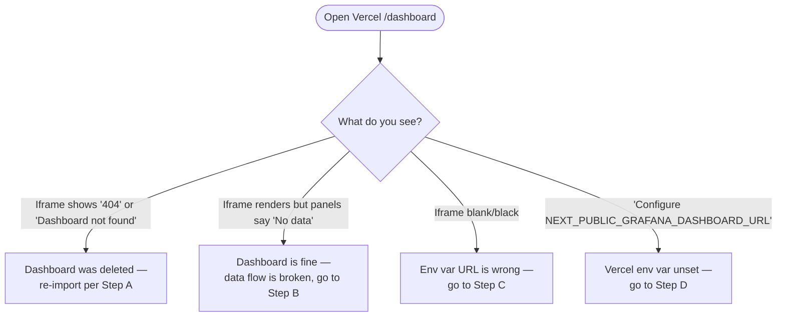

# Grafana dashboard rebuild playbook

**When to use this:** the Grafana dashboard at the-loom is empty, missing, or the Vercel iframe shows "Dashboard not found."
**Time required:** ~10 minutes.

## Quick triage — is the dashboard gone or is data missing?



## Step A — re-import the dashboard JSON

The dashboard config is checked into the repo as `infra/grafana/dashboards/loom-phase1-observability.json`.

1. Open Grafana Cloud → **Dashboards** → **New** → **Import**
2. Click **Upload JSON file**
3. Pick `infra/grafana/dashboards/loom-phase1-observability.json` from your local clone of the-loom
4. When prompted for the `DS_LOKI` datasource, select `grafanacloud-<stack>-logs` (the auto-created Loki datasource)
5. Click **Import**
6. Verify it lands at `Dashboards → loom — Phase 1 observability`

Then move on to Step C (the share URL probably changed).

## Step B — data isn't reaching Grafana

The dashboard exists but panels are empty. The hook emit path is broken somewhere.

### Verify hook events are firing locally

In any session in the-loom or a project-starter-scaffolded repo, run a command that triggers a tool use (e.g. read a file). Then check whether the PreToolUse hook ran:

```powershell
# Latest hook activity (Loki-side)
& "C:/Users/Liz/anaconda3/python.exe" -c "import urllib.request, json, os, base64; \
url=os.environ['GRAFANA_LOKI_QUERY_URL']; user=os.environ['GRAFANA_LOKI_USER']; \
token=os.environ['GRAFANA_LOKI_TOKEN']; \
auth=base64.b64encode(f'{user}:{token}'.encode()).decode(); \
req=urllib.request.Request(url+'?query={service_name=\"loom-discipline\"}&limit=5', \
headers={'Authorization': 'Basic '+auth}); \
print(urllib.request.urlopen(req).read().decode()[:500])"
```

(Or simpler: open Grafana → **Explore** → Loki → query `{service_name="loom-discipline"}`. Latest entries timestamped within seconds = working.)

### If hooks aren't firing at all

Check `~/.claude/logs/hook-import-errors.log` for Python import errors. The discipline plugin's `_observability.py` should be loading on every hook fire.

### If hooks fire but nothing reaches Loki

Check `.env` (repo root) has these set:
- `OTEL_EXPORTER_OTLP_ENDPOINT`
- `OTEL_EXPORTER_OTLP_HEADERS` (containing the base64-encoded auth)
- `OTEL_SERVICE_NAME=loom-discipline`
- `OTEL_RESOURCE_ATTRIBUTES=service.namespace=loom,deployment.environment=dev`

If those are present but data isn't arriving, the Grafana Cloud token may have rotated. Generate a new one (Grafana Cloud → **Connections** → **Add new connection** → **OpenTelemetry (OTLP)**) and update the OTLP_HEADERS line.

## Step C — get the dashboard share URL

Once the dashboard exists and has data:

1. Open the dashboard in Grafana Cloud
2. Click the **Share** icon (top-right)
3. **Public Dashboard** tab (if locked, try **Snapshot** instead) — copy the share URL
4. Open Vercel → the-loom project → **Settings** → **Environment Variables**
5. Set or update `NEXT_PUBLIC_GRAFANA_DASHBOARD_URL` to the share URL
6. Trigger redeploy (Vercel will redeploy automatically on the env-var save, but you can force it from the Deployments tab)
7. Reload the dashboard page in the browser — iframe should populate

## Step D — Vercel env var is unset

Exactly Step C from #4 onwards. Set the env var, redeploy, verify.

## Step E — the iframe is blank

The defensive normalizer in `apps/web-dashboard/app/dashboard/page.tsx` self-heals one common URL-paste mistake (`&kiosk=` → `?kiosk=`), but other URL corruptions need manual fixing:

- URL has spaces or smart quotes from a copy-paste → re-copy from Grafana
- URL points at a private dashboard → switch to public share or generate a snapshot URL
- URL points at the wrong Grafana stack → verify the subdomain matches your account

## Verify it all works

1. Open Vercel `/dashboard` page in browser
2. Iframe loads
3. Panels show recent data (last hook fire timestamp within the last few minutes)
4. Open a new Claude Code session in the-loom → close it → verify a new `SessionStart` event appears in the live-tail panel within 30 seconds

If all four pass, the dashboard is healthy.

## What to capture for future dashboard work

When you fix it, write a memory:

```
memory_write(
  name="lesson_grafana_dashboard_rebuild_<date>",
  record_type="lesson",
  content="What was broken, what fixed it, how long it took.",
  why="Future-you will hit this again; the failure mode is recurring.",
  project_tags=["the-loom", "observability"]
)
```
