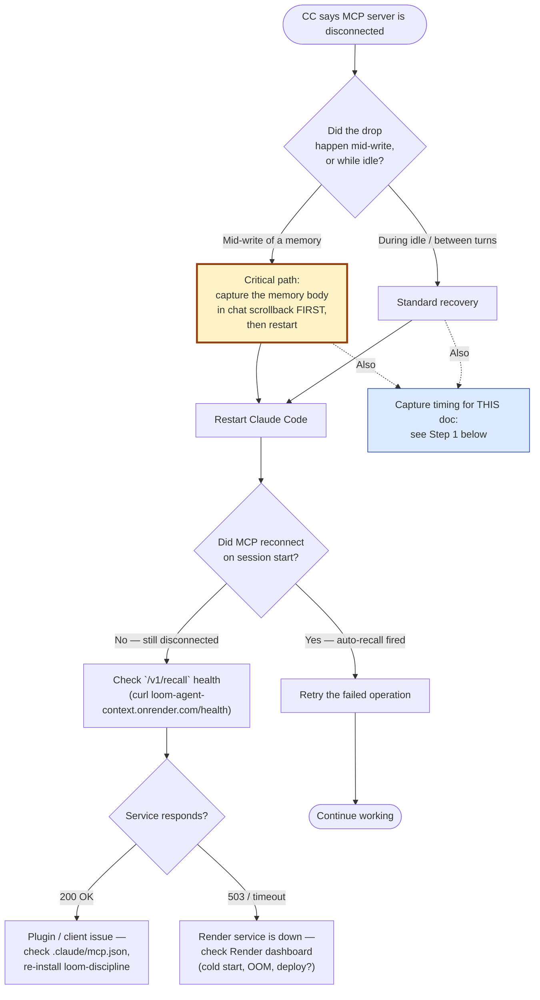

# MCP client drop — investigation runbook

**Status:** Open. The drop pattern is observed but not root-caused.
**Last updated:** 2026-06-01.

## The pattern

MS-agent and I both observed the same thing: a Claude Code session connected to the `loom-memory` MCP server (`https://loom-agent-context.onrender.com/mcp/memory/`) periodically loses the connection. The drop happens mid-conversation, sometimes mid-write. The recovery is always:

1. CC reports the MCP server as disconnected
2. Restart Claude Code
3. The MCP client reconnects on session start
4. Retry the failed call → succeeds
5. Continue

Each drop wastes one CC session and a few seconds of operator attention. The frequency is roughly "twice per long session."

## Triage decision tree — what to do RIGHT NOW



## What we don't know yet

- **Whose timeout is firing.** Render's proxy, the FastAPI lifespan, the MCP session manager, or the CC client.
- **Whether idle is the trigger.** All observed drops happened during long pauses (Liz typing slowly, me thinking, etc.) — never mid-tool-call. But "happens during idle" could also just mean "happens, and we only notice after we try to call again."
- **Whether the session_id changes.** If CC reconnects with a new MCP session_id, the server has to spin up a new session manager → re-entering the same StreamableHTTPSessionManager singleton, which is exactly the failure mode `test_memory_mcp_hosted.py` documents.

## What to check when it next happens

### Step 1 — capture the timing

The single most valuable data point: when did the drop happen, and how long since the last successful MCP call?

In CC's chat panel, when the disconnect notification appears, note:

- **Wall-clock time** of the drop (UTC)
- **Time of the most recent successful MCP tool call** (also UTC)
- The **tool name** of the failed call (was it `memory_recall`, `memory_write`, etc.?)

Write these to a short feedback memory before restarting. Without timing we can't correlate to server logs.

### Step 2 — check Render service logs

Open the Render dashboard → `loom-agent-context` → Logs. Filter to the time window of the drop.

Look for:

- `mcp.server.streamable_http_manager` errors (singleton re-entry, see lesson_agent_context_test_gotchas_2026_06_01)
- 502/503/504 from Render's proxy (Render kills requests after 100s by default; an idle MCP connection could trip this)
- `Connection reset by peer` from psycopg (DB connection died → service crashed → MCP died with it)
- Service restart events (auto-deploy, OOM, anything that recycled the container)

### Step 3 — check Grafana telemetry

If the loom-discipline hook fires didn't make it to Loki around the drop time, the issue might be more general (network blip on Liz's side). If they DID make it but MCP requests didn't, the issue is specific to the MCP transport path.

Query in Grafana Loki:
```
{service="loom-agent-context"} |~ "mcp" | json
```

Around the drop window.

### Step 4 — check the CC-side reconnect behavior

After restart, does the MCP client reconnect cleanly? If it tries to RESUME the previous session_id, the server probably 404s (session manager doesn't persist sessions across restarts). If it OPENS a fresh session_id, the singleton-reentry bug we documented in tests could fire on the server.

## Likely root causes (ranked by suspicion)

### 1. Render's free-tier idle timeout / proxy idle timeout

Render documents 100s default proxy timeout for inbound requests. A long-lived MCP HTTP/2 connection might be getting cut by the proxy at the boundary even though both client and server think it's healthy.

**Test:** does the drop ALWAYS happen ≥100s into idle, or does it happen sooner sometimes?

**Mitigation if confirmed:** add a heartbeat from the MCP server (server-sent ping every 60s) OR move to a different tier with longer timeouts OR have the CC client reconnect aggressively.

### 2. FastAPI lifespan terminating

If something at the Render container layer triggers a soft restart, `lifespan` exits → `mcp_http.session_lifespan` releases the StreamableHTTPSessionManager → all open sessions die. CC's open connection breaks.

**Test:** Render service "Events" tab in the time window of the drop. Was there a restart event?

**Mitigation:** the keep-warm cron (`render.yaml` already has these per recent commit) should reduce involuntary restarts, but it doesn't prevent intentional ones.

### 3. CC's MCP client side-state corruption

The CC client maintains state about the open session. If that state diverges from the server (e.g., server lost the session_id but client thinks it's still valid), every subsequent call 404s and CC labels the server as disconnected.

**Test:** when reconnecting after a drop, watch for CC initiating with a fresh session_id vs trying to resume.

**Mitigation:** force-restart of CC reliably clears client state. Hence the "restart CC" recovery step working consistently.

## Workaround until root-caused

The recovery pattern works reliably:

1. On drop: don't try to fix it from within the running session
2. Restart Claude Code
3. The next session_start hook's auto-recall is a free indicator that MCP is back — if `/v1/recall` works, MCP probably will too
4. Retry the failed operation

For long sessions where data loss matters: **prefer REST `/v1/recall` over MCP `memory_recall`** for read paths — REST is stateless, no session to drop. MCP is still the primary write path because the discipline expects `memory_write` tool calls.

## Closing this runbook

When we have:

- Three observed drops with timing
- Server-side log correlation for each
- A confirmed root cause

… update this runbook with the findings and the fix, and close the open status at the top.
